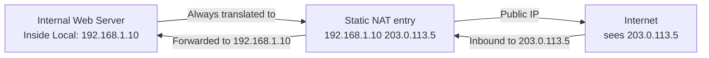

# 09.02 — Static NAT

> [!abstract] 1:1 Permanent Mapping
> **Static NAT** creates a permanent, one-to-one mapping between an internal private IP and an external public IP. Every connection from the internal host is translated to the same public IP, and inbound connections to that public IP are forwarded to the internal host. Used for public-facing servers in a DMZ.

---

##  How It Works



The translation table is **static** — it doesn't change based on traffic. The mapping is configured manually and persists across reboots.

---

##  Cisco Configuration

```cisco
! Define inside and outside interfaces
R1(config)# interface fastethernet 0/0
R1(config-if)# ip nat inside
R1(config-if)# exit
R1(config)# interface serial 0/0/0
R1(config-if)# ip nat outside
R1(config-if)# exit

! Create static mapping: 192.168.1.10  203.0.113.5
R1(config)# ip nat inside source static 192.168.1.10 203.0.113.5
```

After this:
- Outbound packets from `192.168.1.10` get source IP rewritten to `203.0.113.5`.
- Inbound packets to `203.0.113.5` get destination IP rewritten to `192.168.1.10`.

---

##  Use Cases

1. **Public-facing web servers** — your web server lives inside the DMZ with a private IP (`192.168.1.10`), but is reachable from the internet at `203.0.113.5`.
2. **Mail servers** — same pattern; SMTP traffic to `203.0.113.5:25` reaches `192.168.1.10:25`.
3. **DNS servers** — for stable, predictable addresses.
4. **VPN gateways** — the gateway needs a stable public IP for clients to connect to.
5. **Static tunnels** — site-to-site VPNs need predictable endpoints.

---

##  Pros and Cons

### Pros
- **Stable, predictable** — the public IP doesn't change.
- **Bidirectional** — inbound connections work without port forwarding.
- **Simple to reason about** — one IP in = one IP out.

### Cons
- **Inefficient use of public IPs** — one public IP per internal host. If you have 50 servers, you need 50 public IPs. Public IPv4 addresses cost money.
- **No concealment** — the internal host's existence is visible to the outside (though its private IP is hidden).
- **Doesn't scale to thousands of hosts** — PAT does.

---

##  See Also

- [[09 - NAT & Perimeter Security/09.01 NAT Principles|09.01 NAT Principles]]
- [[09 - NAT & Perimeter Security/09.03 Dynamic NAT|09.03 Dynamic NAT]]
- [[09 - NAT & Perimeter Security/09.04 PAT NAT Overload|09.04 PAT]]
- [[09 - NAT & Perimeter Security/09.06 DMZ Architecture|09.06 DMZ]] — where static NAT typically lives.
