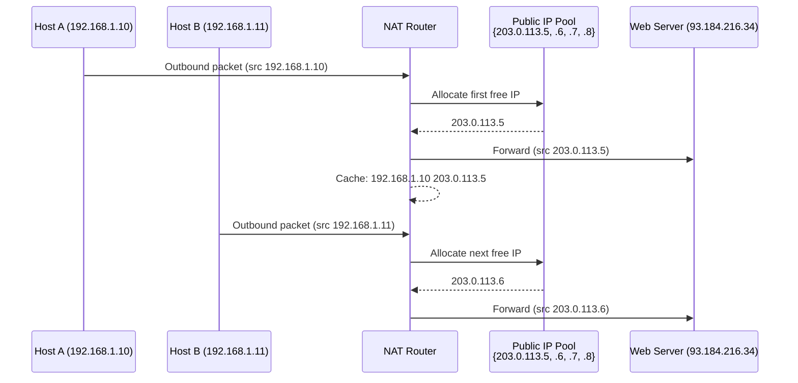

# 09.03 — Dynamic NAT

> [!abstract] m:n Pool-Based Mapping
> **Dynamic NAT** maps internal private IPs to a **pool** of public IPs. When an internal host initiates an outbound connection, the NAT device picks an available public IP from the pool and creates a temporary mapping. The mapping expires when the session ends. Used for outbound bursts from workgroups.

---

##  How It Works



The pool has $N$ public IPs. At most $N$ internal hosts can have active translations simultaneously. The $(N+1)$th host must wait until a translation expires.

---

##  Cisco Configuration

```cisco
! Define the pool of public IPs
R1(config)# ip nat pool MYPOOL 203.0.113.5 203.0.113.10 netmask 255.255.255.0

! Define an access list matching the internal hosts allowed to be NAT'd
R1(config)# access-list 1 permit 192.168.1.0 0.0.0.255

! Bind the pool and the ACL together
R1(config)# ip nat inside source list 1 pool MYPOOL

! Mark inside and outside interfaces
R1(config)# interface fa0/0
R1(config-if)# ip nat inside
R1(config-if)# exit
R1(config)# interface serial0/0/0
R1(config-if)# ip nat outside
```

---

##  Use Cases

1. **Outbound bursts from workgroups** — 50 internal hosts need occasional internet access, but never more than 10 simultaneously. A pool of 10 public IPs suffices.
2. **Temporary outbound sessions** — pool IPs are recycled after sessions end.
3. **Corporate internet egress** — for organizations that have multiple public IPs but not enough for every employee.

---

##  Pros and Cons

### Pros
- **Efficient reuse of public IPs** — pool is shared, not dedicated per host.
- **More scalable than static NAT** — 10 public IPs can serve 100 hosts (if only 10 are active at once).
- **Hides internal hosts when idle** — no permanent mapping exists for inactive hosts.

### Cons
- **Pool exhaustion** — if all pool IPs are in use, new outbound connections fail. Users see "connection timeout" with no clear cause.
- **Unidirectional** — only works for outbound-initiated sessions. Inbound connections can't reach internal hosts (no static mapping).
- **Less efficient than PAT** — for the same number of public IPs, PAT can serve thousands more hosts.

---

##  Comparison with Static and PAT

| Type | Mapping | IPs Needed (for N hosts) | Bidirectional? |
| :--- | :--- | :--- | :-: |
| Static NAT | 1:1 permanent | N public IPs | Yes |
| Dynamic NAT | m:n from pool | min(N, max concurrent) | No (outbound only) |
| PAT | n:1 with ports | 1 public IP | No (outbound only, unless port-forwarded) |

---

##  See Also

- [[09 - NAT & Perimeter Security/09.01 NAT Principles|09.01 NAT Principles]]
- [[09 - NAT & Perimeter Security/09.02 Static NAT|09.02 Static NAT]]
- [[09 - NAT & Perimeter Security/09.04 PAT NAT Overload|09.04 PAT]]
