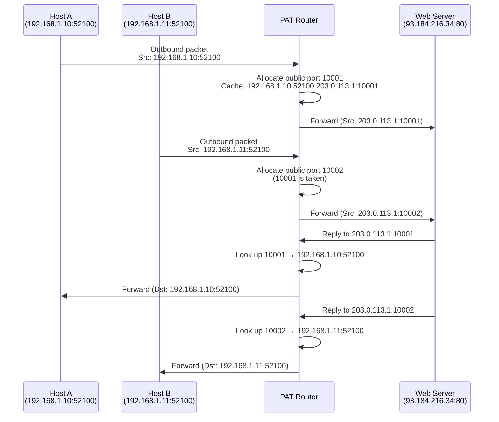

# 09.04 — PAT (Port Address Translation / NAT Overload)

> [!abstract> Many to One, Distinguished by Port
> **PAT (Port Address Translation)**, also called **NAT Overload**, maps many private IPs to a single public IP by translating the source port as well as the source IP. Each internal session gets a unique `(public IP, public port)` pair, allowing thousands of hosts to share one public IP. This is what your home router does.



---

##  How PAT Works

The PAT device maintains a translation table keyed by `(public IP, public port)`. Each entry maps to a `(private IP, private port)` tuple.

| Inside Local (private) | Inside Global (public) | Protocol |
| :--- | :--- | :--- |
| 192.168.1.10:52100 | 203.0.113.1:10001 | TCP |
| 192.168.1.11:52100 | 203.0.113.1:10002 | TCP |
| 192.168.1.12:43210 | 203.0.113.1:10003 | UDP |

When two internal hosts use the same source port (e.g., both picked `52100` randomly), PAT gives them different public ports (`10001` and `10002`) so return traffic can be demultiplexed.

### Maximum Theoretical Sessions

With one public IP, PAT has 65,536 port numbers. Subtracting reserved ports (typically below 1024), you get ~64,500 usable source ports. So one public IP can support ~64,500 concurrent outbound sessions.

In practice, RAM and CPU limits of the NAT device cap it lower — home routers typically handle 2,000–10,000 sessions, enterprise devices 100,000+.

---

##  Cisco Configuration

```cisco
! Define the access list matching internal hosts
R1(config)# access-list 1 permit 192.168.1.0 0.0.0.255

! Configure PAT (overload) using the router's outside interface IP
R1(config)# ip nat inside source list 1 interface serial 0/0/0 overload

! Or, using a dedicated public IP from a pool:
R1(config)# ip nat pool MYPOOL 203.0.113.1 203.0.113.1 netmask 255.255.255.0
R1(config)# ip nat inside source list 1 pool MYPOOL overload

! Mark interfaces
R1(config)# interface fa0/0
R1(config-if)# ip nat inside
R1(config-if)# exit
R1(config)# interface serial 0/0/0
R1(config-if)# ip nat outside
```

The magic word is **`overload`** — it tells IOS to translate ports as well as IPs, enabling many-to-one.

---

##  Use Cases

1. **Home routers** — every consumer Wi-Fi router does PAT. 30 devices on the home network share one ISP-assigned public IP.
2. **Small businesses** — same pattern at slightly larger scale.
3. **Mobile networks** — carriers often PAT thousands of phones behind a smaller pool of public IPs (CGN — Carrier-Grade NAT).
4. **Coffee shops, hotels, airports** — guest Wi-Fi with hundreds of users behind one public IP.

---

##  Pros and Cons

### Pros
- **Maximum IP efficiency** — thousands of hosts behind one public IP.
- **Cost-effective** — only one public IP needed.
- **Simplifies address planning** — no need to size a pool.
- **Implicit security** — unsolicited inbound packets are dropped (no matching translation entry).

### Cons
- **High router resource overhead** — must maintain state for thousands of port mappings.
- **Complex troubleshooting** — `show ip nat translations` can have thousands of entries.
- **Breaks some protocols** — protocols that embed IP addresses in the payload (FTP active mode, SIP, H.323) need ALGs to fix.
- **Limits concurrent sessions** — one public IP caps at ~64K concurrent outbound sessions. May matter for large NAT deployments.

---

##  PAT vs Static vs Dynamic — Full Comparison

| Criterion | Static NAT (1:1) | Dynamic NAT (m:n) | PAT (n:1 + ports) |
| :--- | :--- | :--- | :--- |
| Mapping | Permanent | Session-based | Session + port-based |
| Pool demand | High (1 per host) | Medium (max concurrent) | Low (1 IP) |
| Bidirectional? | Yes | No | No (without port forwarding) |
| Use case | Public servers | Outbound bursts | General internet access |
| Cost | High | Medium-High | Low |
| Security | Moderate (exposed) | High (invisible when idle) | Highest (no inbound mapping) |

---

##  Why PAT Is So Successful

PAT is the reason the internet didn't collapse in the late 1990s. By allowing thousands of hosts to share one public IP, PAT reduced the demand for public IPv4 addresses by 1000×. Every home router, every phone hotspot, every coffee shop Wi-Fi — they all do PAT.

The downside is that PAT broke the end-to-end principle of the internet. Hosts can no longer assume they have a unique globally-routable IP. This is why IPv6 — which restores end-to-end addressing — is so important, and why its slow adoption is so frustrating.

---

##  See Also

- [[09 - NAT & Perimeter Security/09.01 NAT Principles|09.01 NAT Principles]]
- [[09 - NAT & Perimeter Security/09.02 Static NAT|09.02 Static NAT]]
- [[09 - NAT & Perimeter Security/09.03 Dynamic NAT|09.03 Dynamic NAT]]
- [[09 - NAT & Perimeter Security/09.05 Port Forwarding & Triggering|09.05 Port Forwarding]] — making inbound services work through PAT.
- [[10 - Transport Layer/10.02 Ports & Sockets|10.02 Ports & Sockets]] — the ports that PAT translates.
