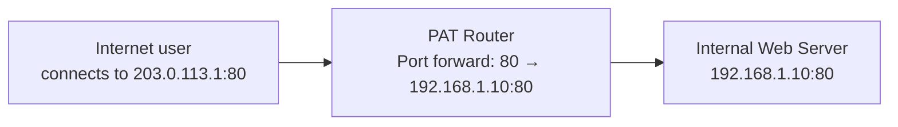
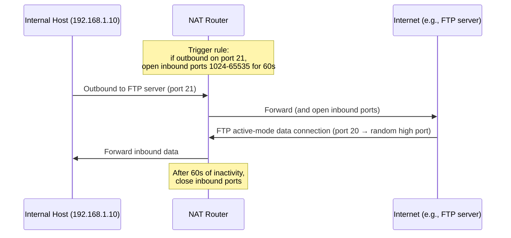

# 09.05 — Port Forwarding & Triggering

> [!abstract> Making Inbound Work Through NAT
> PAT and Dynamic NAT are unidirectional — they only create translation entries when an internal host initiates outbound traffic. To make an internal server reachable from the outside, you need explicit inbound rules. The three common patterns are **port forwarding** (static 1:1 mapping of a public port to an internal IP:port), **port mapping** (public port → different internal port), and **port triggering** (dynamic rule activated by outbound traffic).

---

##  Port Forwarding (Destination NAT)

A static rule on the NAT device: "incoming traffic on public port X → forward to internal IP Y port Z."



### Cisco Configuration

```cisco
! Forward inbound TCP port 80 to internal 192.168.1.10:80
R1(config)# ip nat inside source static tcp 192.168.1.10 80 interface serial 0/0/0 80
```

Or with a specific public IP:
```cisco
R1(config)# ip nat inside source static tcp 192.168.1.10 80 203.0.113.1 80
```

### Use Cases
- Hosting a web server behind a home router.
- Running a game server (e.g., Minecraft on port 25565).
- Remote desktop / SSH to a home machine.
- Self-hosted services (Nextcloud, Pi-hole, Home Assistant).

---

##  Port Mapping (Different Public and Internal Ports)

A variant of port forwarding where the public port differs from the internal port. Useful when:
- The internal service runs on a non-standard port.
- You want to expose multiple internal services on the same external port (across different IPs).
- You're working around an ISP that blocks well-known ports.

```cisco
! Forward public port 8080 to internal 192.168.1.10:80
R1(config)# ip nat inside source static tcp 192.168.1.10 80 203.0.113.1 8080
```

Now users hit `http://203.0.113.1:8080` and traffic is forwarded to `192.168.1.10:80`.

---

##  Port Triggering (Dynamic Port Forwarding)

Port triggering creates a *dynamic* port forward that activates only when an internal host sends outbound traffic on a specific "trigger" port. The inbound ports stay open for a configurable timeout after the trigger fires.



### Why Port Triggering Exists

Some protocols open **secondary inbound connections** as part of their operation:
- **FTP active mode** — the client connects to the server on port 21 (control), then the server connects *back* to the client on a random high port (data).
- **Older online games** — out on one port, in on a range of ports.
- **SIP / VoIP** — signaling on one port, RTP media on dynamic ports.
- **BitTorrent** — outbound tracker on port X, inbound peer connections on a range.

Static port forwarding would require opening a huge range of inbound ports permanently — insecure. Port triggering opens them only when needed, then closes them.

### Limitations
- Only one internal host can use the trigger at a time (the NAT doesn't know which host to forward inbound to until the trigger fires).
- The trigger and the inbound ports must be on the same internal host.

---

##  Other Inbound Access Patterns

### DMZ Host (Consumer "DMZ")
Some home routers offer a "DMZ" feature that forwards ALL inbound ports to a single internal IP. This is **not a real DMZ** — it's "expose one host completely." Use only for game consoles or other devices that need many inbound ports and have no sensitive data.

### UPnP (Universal Plug and Play)
Many routers support UPnP IGD, which lets internal applications automatically open port forwards. Steam, BitTorrent clients, and game consoles use this. Convenient, but a security risk — malware on an internal host can open arbitrary inbound ports via UPnP. Disable if you don't need it.

### Hairpin NAT / NAT Loopback
When an internal host wants to reach another internal host using the public IP (e.g., `203.0.113.1:80` from `192.168.1.5`), the NAT device must "hairpin" the traffic — translate it back to the internal IP. Some home routers don't support this and the connection fails. Workaround: use split-horizon DNS (internal clients resolve the hostname to the internal IP).

---

##  See Also

- [[09 - NAT & Perimeter Security/09.04 PAT NAT Overload|09.04 PAT]] — the foundation that port forwarding builds on.
- [[09 - NAT & Perimeter Security/09.06 DMZ Architecture|09.06 DMZ]] — proper isolation for public-facing servers.
- [[10 - Transport Layer/10.02 Ports & Sockets|10.02 Ports & Sockets]] — what's actually being forwarded.
