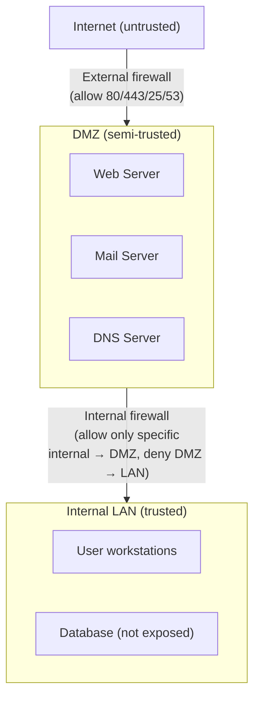
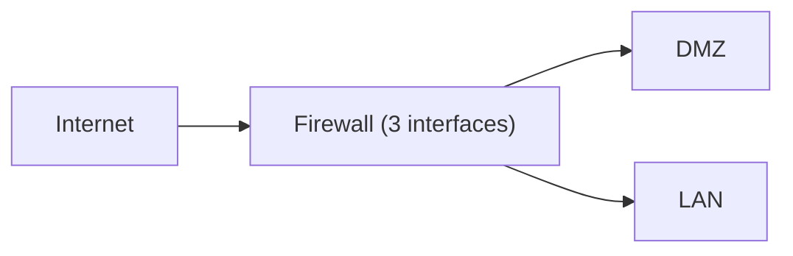
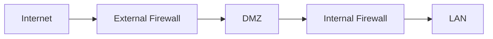
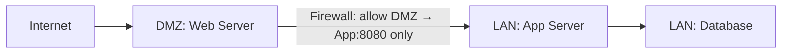

# 09.06 — DMZ Architecture

> [!abstract> The Buffer Zone
> A **DMZ (Demilitarized Zone)** is a physical or logical subnetwork that contains an organization's external-facing services (web, mail, DNS) so they're reachable from the internet but isolated from the internal LAN. Compromise of a DMZ host should not give an attacker a path to internal resources.

---

##  DMZ Placement Patterns

### Pattern 1: Three-Legged Firewall
A single firewall with three interfaces: external (internet), DMZ, and internal.

- **Pros:** simple, one device to manage.
- **Cons:** single point of failure; firewall must handle all traffic.

### Pattern 2: Two Firewalls (Back-to-Back)
Two firewalls in series with the DMZ between them.

- **Pros:** defense in depth — attacker must breach two firewalls.
- **Cons:** more expensive, more complex policy management.

### Pattern 3: Bastion Host
A single hardened host exposed to the internet, with strict firewall rules. Often used for SSH jump boxes or VPN gateways.

---

##  DMZ Design Principles

1. **DMZ hosts are assumed compromised.** They should have no sensitive data and no privileged access to internal resources.
2. **Traffic flow is one-way.** Internal users can initiate connections to DMZ hosts; DMZ hosts cannot initiate connections to internal hosts (with rare exceptions like a web server querying a backend database).
3. **Strict firewall rules.** Allow only the specific ports needed (e.g., 80/443 inbound to web server). Deny everything else by default.
4. **DMZ hosts are hardened.** Minimal OS install, only necessary services, host-based firewall, IDS/IPS, log forwarding.
5. **No credentials shared with internal.** DMZ hosts should have their own local accounts; no domain credentials that could be used to pivot.
6. **Patch aggressively.** DMZ hosts face the internet — they get attacked constantly. Patch within hours, not weeks.

---

##  Common DMZ Services

| Service | Port | Notes |
| :--- | :-: | :--- |
| Web server (HTTP/HTTPS) | 80, 443 | The most common DMZ service |
| Mail server (SMTP) | 25 | Often a relay that forwards to internal mail server |
| DNS server | 53 | Public-facing authoritative DNS for the org's domains |
| VPN gateway | 443 (SSL), 500/4500 (IPsec) | For remote access |
| Reverse proxy / load balancer | 80, 443 | Terminates TLS, forwards to internal app servers |
| FTP server | 21 (+ passive ports) | Legacy; prefer SFTP on port 22 |
| Bastion / jump host | 22 | SSH gateway to internal network |

---

##  The "Web Server → Internal Database" Pattern

A common DMZ design: web server in DMZ, application server + database in internal LAN.

- Web server terminates TLS and serves static content.
- For dynamic content, web server forwards to app server on a specific port.
- App server queries database.
- Firewall rule: allow DMZ web server → LAN app server on port 8080. **Deny everything else.**

If the web server is compromised, the attacker can reach only the app server on port 8080 — not the database directly, not user workstations, not other internal services.

---

##  "Consumer DMZ" vs Real DMZ

Home routers often have a "DMZ" feature that's actually just **DMZ host** — it forwards all inbound ports to a single internal IP. This is **not a real DMZ**:

| Real DMZ (enterprise) | Consumer "DMZ Host" |
| :--- | :--- |
| Separate physical/logical network segment | Single host on the existing LAN |
| Firewalls on both sides | All inbound ports forwarded to one host |
| Compromise contained | Compromise = full LAN access |
| Hardened, monitored | Usually unhardened |

Don't confuse the two. The consumer feature is dangerous — it exposes one host completely while providing no isolation.

---

##  See Also

- [[09 - NAT & Perimeter Security/09.02 Static NAT|09.02 Static NAT]] — how DMZ hosts are exposed.
- [[09 - NAT & Perimeter Security/09.05 Port Forwarding & Triggering|09.05 Port Forwarding]] — alternative inbound patterns.
- [[09 - NAT & Perimeter Security/09.07 Proxy Servers|09.07 Proxies]] — reverse proxies often live in the DMZ.
- [[09 - NAT & Perimeter Security/09.08 VPN Fundamentals|09.08 VPN]] — VPN gateways are typically DMZ hosts.
