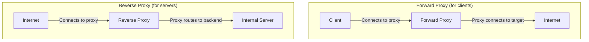

# 09.07 — Proxy Servers

> [!abstract> Intermediary by Design
> A **proxy server** is an intermediary that terminates and re-initiates network connections on behalf of clients or servers. **Forward proxies** act on behalf of clients (anonymizing, filtering, caching outbound traffic). **Reverse proxies** act on behalf of servers (load balancing, TLS termination, WAF, caching inbound traffic).



---

##  Forward Proxy

A forward proxy sits between internal clients and the internet. Clients are configured (via PAC file, browser settings, or transparent interception) to send all outbound requests to the proxy instead of directly to the destination.

### What Forward Proxies Do

1. **Anonymization** — the destination sees only the proxy's IP, not the client's.
2. **Caching** — store frequently-accessed content; serve from cache for subsequent requests. Saves bandwidth and speeds up responses.
3. **Filtering** — block requests to forbidden sites (corporate policy, parental controls, school filters).
4. **Authentication** — require users to authenticate before accessing the internet (e.g., corporate web proxy with LDAP auth).
5. **Logging** — record all outbound requests for compliance, auditing, or troubleshooting.
6. **Antivirus / DLP** — scan downloads and uploads for malware or sensitive data leakage.

### Forward Proxy Configuration Examples

Browser PAC file:
```javascript
function FindProxyForURL(url, host) {
  return "PROXY proxy.corp.example.com:8080; DIRECT";
}
```

Squid config:
```
http_port 3128
acl corp_network src 10.0.0.0/8
http_access allow corp_network
http_access deny all
```

### Types of Forward Proxies

| Type | How traffic is intercepted |
| :--- | :--- |
| **Explicit** | Clients know about the proxy and are configured to use it |
| **Transparent** | Firewall redirects port 80/443 traffic to the proxy; clients don't know |
| **Forward (SSL)** | Proxy terminates SSL (requires client trust); can inspect content |
| **SOCKS** | Generic TCP proxy; works for any protocol, not just HTTP |

---

##  Reverse Proxy

A reverse proxy sits in front of one or more servers, accepting inbound requests from the internet and routing them to internal backends. From the client's perspective, the reverse proxy *is* the server.

### What Reverse Proxies Do

1. **Load balancing** — distribute requests across multiple backend servers (round-robin, least-connections, hash).
2. **TLS termination** — decrypt HTTPS at the proxy, forward HTTP to backends. Saves CPU on backends; centralizes cert management.
3. **Caching** — cache static assets (images, CSS, JS) at the proxy, reducing backend load.
4. **Compression** — gzip responses at the proxy, saving bandwidth to clients.
5. **WAF (Web Application Firewall)** — inspect HTTP traffic for SQL injection, XSS, etc.
6. **Rate limiting** — protect backends from abuse (DDoS, scrapers).
7. **Routing** — route based on URL path (e.g., `/api/*` to one backend, `/*` to another).
8. **Authentication** — verify user identity at the proxy before forwarding to backends.

### Popular Reverse Proxy Software

| Software | Notes |
| :--- | :--- |
| **NGINX** | The de facto standard; extremely efficient |
| **HAProxy** | Battle-tested load balancer with detailed stats |
| **Apache + mod_proxy** | The classic; less efficient than NGINX |
| **Traefik** | Modern, container-native, auto-configures from Docker/K8s labels |
| **Envoy** | Modern, designed for microservices; used by Istio service mesh |
| **Caddy** | Easy automatic HTTPS via Let's Encrypt |
| **AWS ALB / NLB** | Managed load balancers on AWS |
| **Cloudflare** | Reverse proxy as a service (CDN + WAF + DDoS protection) |

---

##  Forward vs Reverse Proxy

| Aspect | Forward Proxy | Reverse Proxy |
| :--- | :--- | :--- |
| Acts on behalf of | Clients | Servers |
| Client awareness | Clients know (or traffic is intercepted) | Clients don't know (proxy looks like the server) |
| Typical location | Internal network, between users and internet | DMZ, between internet and internal servers |
| Main purpose | Anonymize, filter, cache, log outbound | Load balance, secure, cache, accelerate inbound |
| Example software | Squid, Dante, SOCKS5 | NGINX, HAProxy, Cloudflare |

---

##  Security Implications

### Forward Proxy Risks
- **Misconfiguration can create an open relay** — anyone on the internet can use your proxy to reach anywhere. Often abused for spam and DDoS amplification.
- **SSL inspection breaks privacy** — employees' HTTPS traffic can be decrypted and inspected. Some jurisdictions require employee notification.

### Reverse Proxy Risks
- **Single point of failure** — if the proxy is down, all backends are unreachable. Mitigate with HA pairs.
- **SSL termination concentrates keys** — the proxy holds all TLS certs and private keys. Compromise of the proxy = compromise of all certs.

---

##  See Also

- [[09 - NAT & Perimeter Security/09.06 DMZ Architecture|09.06 DMZ]] — where reverse proxies typically live.
- [[11 - Application Layer/11.02 HTTP & HTTPS|11.02 HTTP/HTTPS]] — the protocol most proxies handle.
- [[11 - Application Layer/11.03 SSL & TLS|11.03 TLS]] — what reverse proxies terminate.
