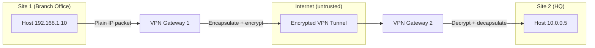

# 09.08 — VPN Fundamentals

> [!abstract> Encrypted Tunnels Across Untrusted Networks
> A **VPN (Virtual Private Network)** creates an encrypted tunnel across an untrusted network (typically the internet), allowing remote hosts to communicate as if they were on a private network. VPNs provide confidentiality (encryption), integrity (HMAC), and authentication (certs or PSKs).



---

##  Two Deployment Modes

### Site-to-Site VPN
Connects two networks (e.g., branch office to HQ). The VPN gateways at each site establish a tunnel; hosts on either side communicate transparently as if they were on the same LAN.

- **Use case:** branch office connectivity, datacenter interconnect, hybrid cloud.
- **Common protocol:** IPsec.
- **Host awareness:** none. Hosts just send packets; the gateway handles encryption.

### Remote-Access VPN
Connects an individual host (a remote worker's laptop) to a private network. The host runs a VPN client that encrypts all (or selected) traffic to the VPN concentrator.

- **Use case:** work-from-home, traveling employees, secure access to internal resources.
- **Common protocols:** SSL/TLS (OpenVPN, Cisco AnyConnect, GlobalProtect), WireGuard, IPsec (IKEv2).
- **Host awareness:** full. The host knows it's on a VPN and may route all traffic through it ("full tunnel") or only traffic for the corporate network ("split tunnel").

---

##  Common VPN Protocols

| Protocol | Encryption | Transport | Notes |
| :--- | :--- | :--- | :--- |
| **IPsec** | AES, ChaCha20 | IP (protocol 50/51 + UDP 500/4500 for IKE) | The enterprise standard for site-to-site |
| **OpenVPN** | AES, ChaCha20 | TCP or UDP (custom port, often 1194) | TLS-based; very flexible; widely deployed |
| **WireGuard** | ChaCha20-Poly1305 | UDP (custom port) | Modern, fast, minimal code; now the hot choice |
| **L2TP/IPsec** | AES | UDP 1701 + IPsec | Legacy; combines L2TP tunneling with IPsec encryption |
| **PPTP** | MPPE (weak) | TCP 1723 + GRE | **Insecure** — don't use |
| **SSL VPN (vendor-specific)** | TLS | TCP 443 | Cisco AnyConnect, Palo Alto GlobalProtect, etc. |

---

##  IPsec — The Enterprise Standard

IPsec operates in two modes:
- **Transport mode** — encrypts only the payload of IP packets; original IP header is preserved. Used for host-to-host VPNs (rare).
- **Tunnel mode** — encapsulates the entire original IP packet in a new IP packet with new headers. Used for site-to-site VPNs (most common).

IPsec has two main protocols:
- **AH (Authentication Header, protocol 51)** — provides integrity and authentication, no encryption. Rarely used today.
- **ESP (Encapsulating Security Payload, protocol 50)** — provides confidentiality (encryption) + integrity + authentication. The standard.

Key exchange is handled by **IKE (Internet Key Exchange)** over UDP 500 (or 4500 for NAT traversal). IKE negotiates encryption algorithms, authenticates peers (via PSK or certificates), and establishes Security Associations (SAs).

---

##  Common Issues

### MTU Problems
VPNs add overhead (ESP header, encryption padding, new IP header). A 1500-byte packet on the inside becomes ~1540 bytes on the outside — exceeding the 1500-byte MTU and forcing fragmentation or PMTUD failure.

**Fix:** enable **MSS clamping** on the VPN interface:
```cisco
interface Tunnel0
  ip tcp adjust-mss 1360
```
This rewrites the MSS option in TCP SYNs to a value that fits the reduced MTU.

### NAT Traversal (NAT-T)
IPsec's ESP protocol (number 50) doesn't have port numbers — PAT can't translate it. NAT-T wraps ESP in UDP port 4500 to make it PAT-friendly. Enabled by default in modern IPsec implementations.

### Split Tunnel vs Full Tunnel
- **Full tunnel:** all client traffic goes through the VPN. More secure (corporate DLP applies), but slower (all traffic goes through corporate internet egress).
- **Split tunnel:** only corporate-network traffic goes through the VPN; internet traffic goes direct. Faster, but corporate security policy doesn't apply to internet traffic.

Modern best practice: **full tunnel with DNS-based split** — all traffic routes through VPN, but DNS-based policies decide what's "internal" vs "internet." Combines security with simplicity.

---

##  VPN vs Direct Connection

| Aspect | VPN | Direct private circuit (leased line, MPLS) |
| :--- | :--- | :--- |
| Cost | Low (uses internet) | High (dedicated bandwidth) |
| Setup time | Minutes | Weeks (carrier provisioning) |
| Bandwidth | Limited by internet path | Guaranteed |
| Latency | Variable | Guaranteed |
| Security | Encrypted, but traverses untrusted network | Private (no encryption needed) |
| Reliability | Depends on internet path | Carrier SLA |

VPNs are cheaper and faster to deploy. Private circuits are more reliable and have guaranteed performance. Modern trend: VPNs (or SD-WAN over internet) replacing private circuits for most use cases.

---

##  WireGuard — The Modern Choice

WireGuard (2018+) is a new VPN protocol that's dramatically simpler than IPsec or OpenVPN:
- ~4,000 lines of code (vs ~600,000 for OpenVPN).
- Modern crypto only: ChaCha20-Poly1305, Curve25519, BLAKE2s.
- No algorithm negotiation — eliminates a whole class of downgrade attacks.
- UDP-only; very fast.
- Built into the Linux kernel since 5.6.

For new VPN deployments, WireGuard is usually the right choice unless you need IPsec compatibility or vendor-supported SSL VPN clients.

---

##  See Also

- [[09 - NAT & Perimeter Security/09.06 DMZ Architecture|09.06 DMZ]] — where VPN gateways typically live.
- [[11 - Application Layer/11.03 SSL & TLS|11.03 TLS]] — the foundation of SSL VPNs.
- [[12 - Tunnels & Remote Access/12.00 Chapter Overview|Chapter 12 — Tunnels]] — developer-focused tunneling tools (Ngrok, Cloudflare).
- [[05 - IP Datagram & Fragmentation/05.04 Path MTU Discovery|05.04 PMTUD]] — the cause of most VPN performance issues.
