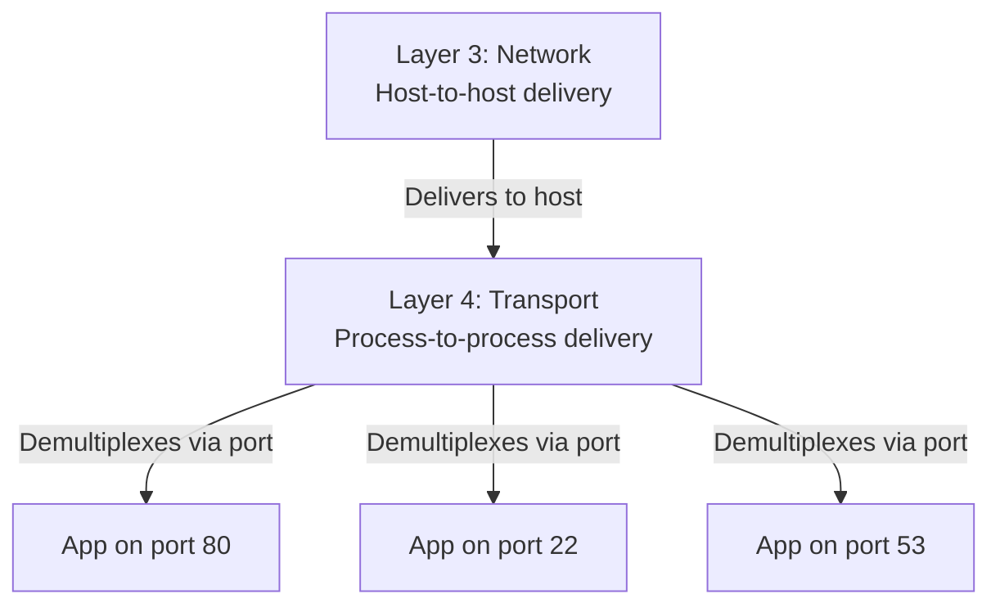

# 10.01 — Transport Layer Functions

> [!abstract] What L4 Adds
> The Network layer (L3) delivers packets **host-to-host**. The Transport layer (L4) delivers data **process-to-process** — using port numbers to demultiplex incoming traffic to the correct application. L4 also adds reliability, ordering, flow control, and congestion control (TCP only).

---

##  Core Functions

1. **Process-to-process delivery via multiplexing/demultiplexing** — using 16-bit port numbers to direct each incoming segment to the correct application. This is the universal L4 function (both TCP and UDP do it).
2. **Segmentation and reassembly** — splitting large application data into segments that fit IP packets, and reassembling them in order at the destination (TCP only).
3. **Connection management** — establishing, maintaining, and tearing down sessions (TCP only).
4. **Reliability** — detecting lost/corrupted segments and retransmitting (TCP only).
5. **Flow control** — preventing a fast sender from overwhelming a slow receiver (TCP only).
6. **Congestion control** — preventing a fast sender from overwhelming the network (TCP only).

UDP does only #1. The other functions are the application's responsibility (or are skipped entirely for latency-sensitive traffic like VoIP).

---

##  Host-to-Host vs Process-to-Process

| Aspect | Layer 3 (IP) | Layer 4 (TCP/UDP) |
| :--- | :--- | :--- |
| Addressing | IP address (host) | Port number (process) |
| Delivery granularity | To a host | To a process within a host |
| Reliability | Best-effort | TCP: reliable / UDP: best-effort |
| Ordering | None | TCP: ordered / UDP: none |
| Connection | Connectionless | TCP: connection-oriented / UDP: connectionless |

A single host might be running 50 different network applications simultaneously. IP delivers all traffic to the host, but the host needs to know which app gets which packet. That's L4's job — using port numbers.

---

##  The Socket Abstraction

The OS exposes L4 through the **socket** abstraction — an API endpoint that applications use to send/receive data. A socket is identified by:

- **IP address** (which network interface)
- **Port number** (which application)
- **Protocol** (TCP or UDP)

A connected TCP socket is identified by the **5-tuple**: `(protocol, src IP, src port, dst IP, dst port)`. This is how a single server (e.g., port 80) tracks hundreds of concurrent client connections — each connection has a unique 5-tuple.

See [[10 - Transport Layer/10.02 Ports & Sockets|10.02 Ports & Sockets]] for the deep dive.

---

##  See Also

- [[10 - Transport Layer/10.02 Ports & Sockets|10.02 Ports & Sockets]]
- [[10 - Transport Layer/10.05 UDP|10.05 UDP]]
- [[10 - Transport Layer/10.06 TCP|10.06 TCP]]
- [[02 - Reference Models OSI & TCP-IP/02.02 The OSI 7-Layer Model|02.02 OSI Model]] — where L4 sits.
