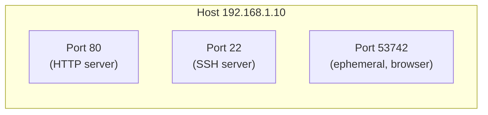

# 10.02 — Ports & Sockets

> [!abstract> The L4 Addressing Scheme
> A **port** is a 16-bit number (0–65535) that identifies an application process. A **socket** is the combination of an IP address and a port number. A **connected socket** is uniquely identified by the **5-tuple**: protocol, source IP, source port, destination IP, destination port — which is how a server tracks many concurrent client connections on the same port.



---

##  Port Number Ranges (IANA)

| Range | Name | Use |
| :--- | :-: | :--- |
| 0 – 1023 | **Well-Known Ports** | Assigned to system processes and standard protocols (HTTP, DNS, SSH, etc.). Binding to these requires root/admin privileges on Unix. |
| 1024 – 49151 | **Registered Ports** | Assigned by IANA for vendor-specific applications (e.g., 3306 MySQL, 5432 PostgreSQL, 6379 Redis, 8080 HTTP alternate). |
| 49152 – 65535 | **Dynamic / Ephemeral Ports** | Assigned automatically by the OS as source ports for client connections. |

> [!info] Why 49152?
> IANA's boundary at 49152 is $2^{15.5}$ — chosen to give a generous range of ephemeral ports (16K) while keeping registered ports large enough for vendor needs. Older systems used 1024 as the ephemeral start, which conflicted with registered ports.

---

##  Socket Definition

A **socket** is the endpoint of a communication channel. It's defined as the pair `(IP, port)`:

- **Local socket:** `(local_IP, local_port)` — what the OS binds to.
- **Connection socket:** the full **5-tuple** `(protocol, src_IP, src_port, dst_IP, dst_port)` — uniquely identifies an active connection.

A server listening on port 80 has one **listening socket** (`*:80` or `192.168.1.10:80`). When a client connects, the server creates a **dedicated connection socket** with a unique 5-tuple — but the server-side port is still 80. This is how thousands of clients can simultaneously connect to the same server port.

---

##  The 5-Tuple in Action

Consider three clients all connecting to a web server on port 80:

| Client | Source IP | Source Port | Destination IP | Destination Port | Protocol |
| :--- | :--- | :-: | :--- | :-: | :-: |
| Client A | 192.168.1.10 | 53742 | 93.184.216.34 | 80 | TCP |
| Client B | 192.168.1.11 | 53742 | 93.184.216.34 | 80 | TCP |
| Client C | 192.168.1.10 | 53743 | 93.184.216.34 | 80 | TCP |

The server distinguishes these three connections by their unique 5-tuples:
- Client A and B both use port 53742, but from different IPs → different connections.
- Client A and C both come from the same IP, but use different source ports → different connections.

Even though all three connections share `dst_IP:dst_port = 93.184.216.34:80`, they're demultiplexed correctly by the OS.

---

##  Socket Programming Lifecycle

The POSIX socket API defines the standard sequence of calls:

### Server Side
```
socket()    → create a socket FD
bind()      → bind to (local_IP, local_port)
listen()    → mark socket as passive (accept connections)
accept()    → block until a client connects; returns new socket FD for that connection
read()/write() → communicate with the client
close()     → close the connection socket
```

### Client Side
```
socket()    → create a socket FD
connect()   → initiate connection to (dst_IP, dst_port)
read()/write() → communicate with the server
close()     → close the connection
```

See [[10 - Transport Layer/10.04 Socket Programming Lifecycle|10.04 Socket Programming]] for the full walkthrough with code.

---

##  Listening Socket vs Connection Socket

| Property | Listening Socket | Connection Socket |
| :--- | :--- | :--- |
| Created by | `listen()` | `accept()` |
| Purpose | Receive new connections | Exchange data with one client |
| Bound to port | Server's well-known port (80, 443, etc.) | Same port as listening socket |
| Number per server | Usually 1 | One per active client |
| Lifecycle | Persists for server's lifetime | Created on connect, closed on disconnect |

The server's port number doesn't change between listening and connection sockets. The 5-tuple (including the client's source IP + source port) is what distinguishes connections.

---

##  Privilege Requirements

On Unix-like systems, binding to a port < 1024 requires **root** privileges (or the `CAP_NET_BIND_SERVICE` capability). This is why web servers like Apache and NGINX typically start as root, bind to ports 80 and 443, then drop privileges to a non-root user (e.g., `www-data`).

Workarounds for non-root services:
- Use a high port (8080) and a reverse proxy / port forward from 80.
- Use systemd's `AmbientCapabilities=CAP_NET_BIND_SERVICE` to grant the capability without root.
- Use `setcap` on the binary: `setcap 'cap_net_bind_service=+ep' /path/to/binary`.

---

##  See Also

- [[10 - Transport Layer/10.03 Well-Known Ports Reference|10.03 Ports Reference]] — full table of common ports.
- [[10 - Transport Layer/10.04 Socket Programming Lifecycle|10.04 Socket Programming]] — code examples.
- [[10 - Transport Layer/10.06 TCP|10.06 TCP]] — the protocol that uses connected sockets.
