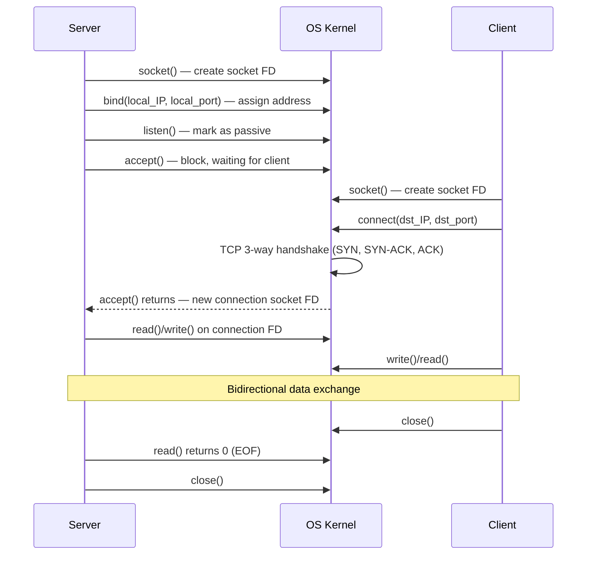

# 10.04 — Socket Programming Lifecycle

> [!abstract> The POSIX Socket API
> Every networked application — from a 10-line Python script to NGINX — uses the same handful of system calls to establish TCP connections: `socket()`, `bind()`, `listen()`, `accept()` on the server side; `socket()`, `connect()` on the client side. Mastering this lifecycle is the foundation of network programming.



---

##  Server Side

### 1. `socket()` — Create the Socket
```c
int sockfd = socket(AF_INET, SOCK_STREAM, 0);
```
- `AF_INET` — IPv4 (use `AF_INET6` for IPv6).
- `SOCK_STREAM` — TCP (use `SOCK_DGRAM` for UDP).
- Returns a file descriptor (small integer) that the rest of the API uses.

### 2. `bind()` — Assign Local Address
```c
struct sockaddr_in addr;
addr.sin_family = AF_INET;
addr.sin_addr.s_addr = INADDR_ANY;  // 0.0.0.0 — all interfaces
addr.sin_port = htons(80);          // host to network byte order

bind(sockfd, (struct sockaddr*)&addr, sizeof(addr));
```
Binds the socket to a specific `(IP, port)`. Use `INADDR_ANY` to listen on all interfaces, or a specific IP to restrict.

On Unix, binding to a port < 1024 requires root privileges.

### 3. `listen()` — Mark as Passive
```c
listen(sockfd, 128);  // backlog = 128
```
Tells the kernel this socket will accept incoming connections. The `backlog` parameter sets the queue length for pending connections (clients that have completed the 3-way handshake but not yet been `accept()`ed).

### 4. `accept()` — Block Until Client Connects
```c
int clientfd = accept(sockfd, (struct sockaddr*)&client_addr, &client_len);
```
Blocks until a client connects. When a client does, returns a **new** socket FD specifically for that connection. The original `sockfd` continues listening for more clients.

### 5. `read()` / `write()` — Communicate
```c
char buf[1024];
ssize_t n = read(clientfd, buf, sizeof(buf));
write(clientfd, "HTTP/1.1 200 OK\r\n", 17);
```
Sockets are file descriptors, so standard I/O works. The same `read()`, `write()`, `close()` calls used for files work here.

### 6. `close()` — Close the Connection
```c
close(clientfd);  // close this specific client connection
close(sockfd);    // close the listening socket (shut down server)
```

---

##  Client Side

### 1. `socket()` — Create the Socket
```c
int sockfd = socket(AF_INET, SOCK_STREAM, 0);
```
Same as server side.

### 2. `connect()` — Initiate Connection
```c
struct sockaddr_in server_addr;
server_addr.sin_family = AF_INET;
server_addr.sin_port = htons(80);
inet_pton(AF_INET, "93.184.216.34", &server_addr.sin_addr);

connect(sockfd, (struct sockaddr*)&server_addr, sizeof(server_addr));
```
Triggers the TCP 3-way handshake. Blocks until the handshake completes (or fails).

### 3. `read()` / `write()` — Communicate
Same as server side.

### 4. `close()` — Close the Connection
```c
close(sockfd);
```
Triggers the TCP 4-step close (FIN → ACK → FIN → ACK).

---

##  Python Example — Minimal HTTP Server

```python
import socket

server = socket.socket(socket.AF_INET, socket.SOCK_STREAM)
server.setsockopt(socket.SOL_SOCKET, socket.SO_REUSEADDR, 1)
server.bind(('0.0.0.0', 8080))
server.listen(5)
print("Listening on :8080")

while True:
    client, addr = server.accept()
    print(f"Connection from {addr}")
    request = client.recv(4096).decode('utf-8', errors='replace')
    print(f"Request:\n{request}")
    response = "HTTP/1.1 200 OK\r\nContent-Length: 13\r\n\r\nHello, world!"
    client.sendall(response.encode('utf-8'))
    client.close()
```

Try it: save as `server.py`, run `python server.py`, then `curl http://localhost:8080`.

---

##  Python Example — Minimal HTTP Client

```python
import socket

sock = socket.socket(socket.AF_INET, socket.SOCK_STREAM)
sock.connect(('example.com', 80))
sock.sendall(b"GET / HTTP/1.1\r\nHost: example.com\r\nConnection: close\r\n\r\n")

response = b""
while True:
    chunk = sock.recv(4096)
    if not chunk:
        break
    response += chunk

print(response.decode('utf-8', errors='replace'))
sock.close()
```

---

##  Key Concepts to Internalize

1. **The listening socket is not the connection socket.** `accept()` returns a *new* FD for each client. The original listening socket stays open and continues accepting new clients.
2. **A single port can serve many concurrent connections.** The 5-tuple disambiguates them — see [[10 - Transport Layer/10.02 Ports & Sockets|10.02]].
3. **`read()` returns 0 on EOF** — this is how you detect that the client closed the connection. A return of `-1` means error.
4. **`accept()` and `read()` are blocking by default.** For high-concurrency servers, use non-blocking I/O (with `select`/`poll`/`epoll`/`kqueue`) or threads/async frameworks.
5. **Sockets are file descriptors.** Everything you know about FDs (`dup`, `close`, `select`) applies.

---

##  See Also

- [[10 - Transport Layer/10.02 Ports & Sockets|10.02 Ports & Sockets]]
- [[10 - Transport Layer/10.06 TCP|10.06 TCP]] — what `connect()` actually triggers.
- [[10 - Transport Layer/10.08 TCP Connection Lifecycle|10.08 TCP Lifecycle]] — the 3-way handshake.
