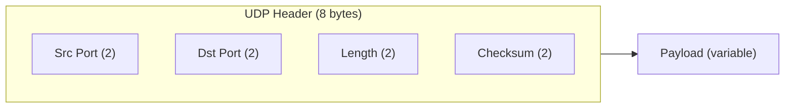

# 10.05 — UDP (User Datagram Protocol)

> [!abstract> Fire and Forget
> UDP is the **connectionless, best-effort** transport protocol. It adds almost nothing to IP — just port numbers, a length field, and an optional checksum. No handshake, no ACKs, no retransmission, no ordering. Use it when speed matters more than reliability: DNS, VoIP, gaming, DHCP.

---

##  UDP Header (8 bytes, fixed)

| Field | Size | Purpose |
| :--- | :-: | :--- |
| Source Port | 2 bytes | Sender's port (or 0 if not needed) |
| Destination Port | 2 bytes | Receiver's port |
| Length | 2 bytes | Total UDP length (header + payload), min 8 |
| Checksum | 2 bytes | Optional in IPv4 (mandatory in IPv6) — covers pseudo-header + UDP header + payload |



The 8-byte header is the smallest of any standard transport protocol. Compare to TCP's 20-byte minimum.

---

##  Characteristics

| Property | UDP |
| :--- | :--- |
| Connection | Connectionless (no handshake) |
| Reliability | Best-effort (no ACKs, no retransmit) |
| Ordering | None (segments may arrive out of order) |
| Flow control | None |
| Congestion control | None |
| Header overhead | 8 bytes |
| Multicast support | Yes (only transport that natively supports multicast) |
| Use cases | DNS, DHCP, VoIP, video streaming, gaming, SNMP |

---

##  When to Use UDP

1. **Low-latency real-time data** — VoIP, video conferencing, online gaming. A retransmitted packet that arrives 200ms late is worse than a dropped packet.
2. **Small query/response** — DNS, NTP, SNMP. The overhead of TCP handshake (3 packets) is more than the actual data.
3. **Broadcast/multicast** — UDP is the only transport that supports broadcast (one-to-all) and multicast (one-to-many). TCP is strictly point-to-point.
4. **Streaming media** — video/audio streams where occasional packet loss is tolerable.
5. **Discovery protocols** — DHCP, mDNS, SSDP. Need to broadcast to find services.

---

##  The Pseudo-Header Checksum

UDP's checksum covers more than just the UDP header — it also covers a **pseudo-header** that includes source and destination IP addresses. This catches packets that were misrouted (delivered to the wrong IP).

```
┌──────────────────────────────────────┐
│ Pseudo-header (not actually sent):    │
│   Source IP (4 bytes)                 │
│   Destination IP (4 bytes)            │
│   Zero (1 byte)                       │
│   Protocol (1 byte) = 17 (UDP)        │
│   UDP Length (2 bytes)                │
├──────────────────────────────────────┤
│ UDP header (8 bytes)                  │
├──────────────────────────────────────┤
│ UDP payload                           │
└──────────────────────────────────────┘
```

In IPv4, the UDP checksum is **optional** (a value of 0 means "not computed"). In IPv6, it's **mandatory** because IPv6 dropped the IP header checksum.

---

##  UDP Pitfalls

1. **No congestion control** — a UDP sender can flood the network, causing packet loss for everyone. This is why QUIC (which runs on UDP) implements its own congestion control.
2. **Application must handle loss** — if your UDP app needs reliability, you must implement it yourself (ACKs, retransmits, ordering). At which point you've reinvented TCP badly — just use TCP.
3. **NAT and firewalls** — UDP has no connection state, so stateful firewalls (and NAT) need to track UDP "connections" heuristically. Most modern firewalls do, but with shorter timeouts than TCP (typically 30s of inactivity).
4. **Easy to spoof** — because there's no handshake, a UDP packet's source IP can be trivially forged. Used in DNS amplification DDoS attacks.

---

##  UDP vs TCP — Quick Glance

| Property | UDP | TCP |
| :--- | :--- | :--- |
| Connection | None | 3-way handshake |
| Reliability | Best-effort | Reliable (ACKs + retransmit) |
| Ordering | None | Ordered |
| Header | 8 bytes | 20+ bytes |
| Congestion control | None | Slow start, AIMD |
| Multicast/broadcast | Yes | No |
| Use case | Speed, real-time | Reliability, files |

See [[10 - Transport Layer/10.11 TCP vs UDP Comparison|10.11 TCP vs UDP]] for the full comparison.

---

##  See Also

- [[10 - Transport Layer/10.06 TCP|10.06 TCP]]
- [[10 - Transport Layer/10.11 TCP vs UDP Comparison|10.11 TCP vs UDP]]
- [[11 - Application Layer/11.01 DNS & Domain Resolution|11.01 DNS]] — the canonical UDP-based protocol.
