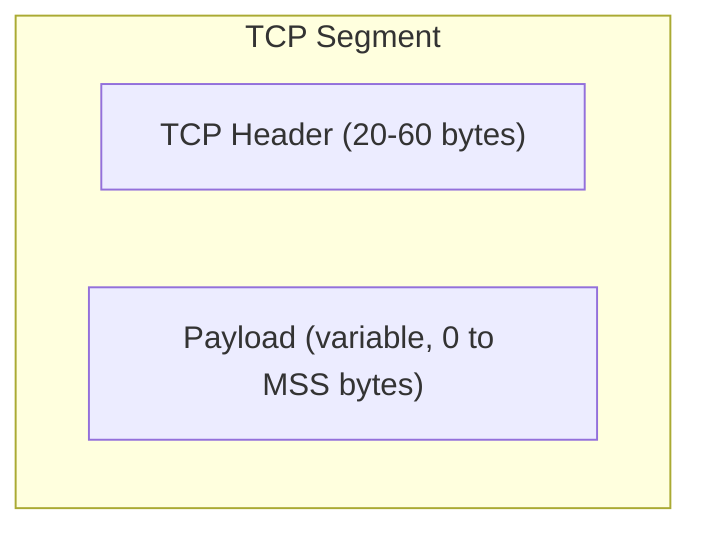
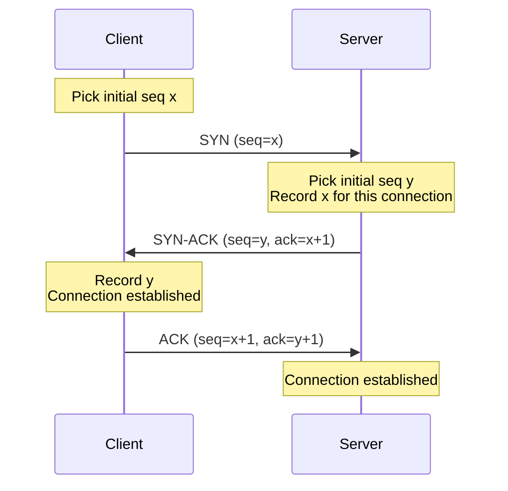
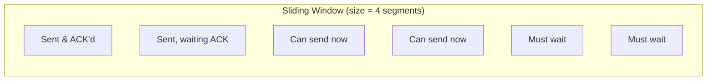
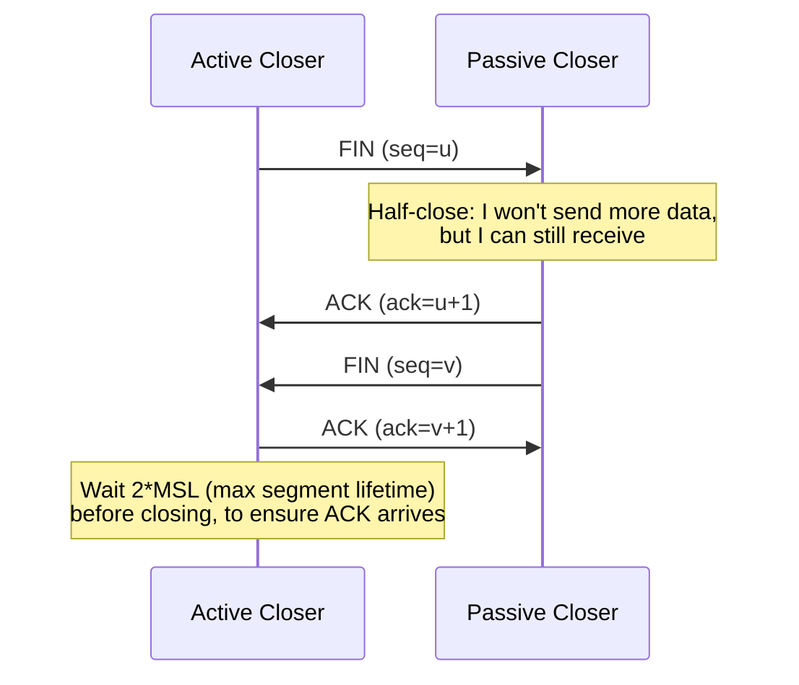

# 10.06 — TCP (Transmission Control Protocol)

> [!abstract> Reliable, Ordered, Connection-Oriented
> TCP is the workhorse transport of the internet. It provides a **reliable byte stream** between two applications: data sent on one end arrives intact, in order, at the other end. TCP handles segmentation, retransmission, flow control, and congestion control automatically. The cost is overhead — a 20-byte header (vs UDP's 8), a 3-packet handshake, ACK traffic, and retransmission latency.

---

##  Core Characteristics

| Property | TCP |
| :--- | :--- |
| Connection | Connection-oriented (3-way handshake before data) |
| Reliability | Reliable (every byte ACK'd; lost segments retransmitted) |
| Ordering | Ordered (sequence numbers; receiver reassembles in order) |
| Stream type | Byte stream (no message boundaries — apps must frame) |
| Flow control | Yes (sliding window) |
| Congestion control | Yes (slow start, congestion avoidance, fast retransmit) |
| Header | 20–60 bytes |
| Use cases | HTTP/1, HTTP/2, SSH, SMTP, FTP, IMAP, POP3 |

---

##  What TCP Adds Over IP

IP is **best-effort** — packets can be lost, duplicated, reordered, or corrupted. TCP adds:

1. **Reliability** — every byte sent gets an ACK. Lost bytes are retransmitted.
2. **Ordering** — sequence numbers let the receiver reassemble bytes in the right order even if packets arrived out of order.
3. **Flow control** — the receiver advertises how much buffer space it has; the sender doesn't overrun it.
4. **Congestion control** — the sender probes the network's capacity and backs off on packet loss.
5. **Connection management** — explicit handshake and teardown establish state on both ends.
6. **Multiplexing** — port numbers (shared with UDP) demultiplex incoming segments to the right app.

---

##  TCP Segment Structure

A TCP segment is the PDU at L4 (when using TCP). Structure:

The header fields are detailed in [[10 - Transport Layer/10.07 TCP Header Fields|10.07]]. The payload can be 0 bytes (e.g., pure ACK segments) up to the MSS (typically 1460 bytes for Ethernet).

---

##  The 3-Way Handshake (Connection Establishment)

After the handshake, both ends can send data. The sequence numbers increment by the number of bytes sent. See [[10 - Transport Layer/10.08 TCP Connection Lifecycle|10.08]] for full state machine.

---

##  Maximum Segment Size (MSS)

The MSS is the maximum payload (data, excluding headers) per TCP segment. It's negotiated during the handshake via a TCP option.

$$\text{MSS} = \text{MTU} - \text{IP header} - \text{TCP header} = \text{MTU} - 40$$

For Ethernet (MTU 1500): MSS = **1460 bytes**.

If the path MTU is smaller (e.g., PPPoE at 1492), MSS should be 1452. TCP peers negotiate MSS based on their own MTU, but PMTUD handles cases where the path MTU is smaller than either end's MTU. See [[05 - IP Datagram & Fragmentation/05.04 Path MTU Discovery|05.04 PMTUD]].

---

##  Reliability & Retransmission

TCP guarantees every byte reaches the destination. Mechanisms:

1. **Sequence numbers** — every byte has a position in the stream. The receiver ACKs the next byte it expects.
2. **Cumulative ACKs** — an ACK of byte N confirms receipt of all bytes up to N-1. Efficient and resilient to ACK loss.
3. **Retransmission timeout (RTO)** — if no ACK arrives within RTO, retransmit the unacked segment. RTO is dynamically estimated from RTT measurements.
4. **Fast Retransmit** — if 3 duplicate ACKs arrive (indicating the next expected byte was received 3 more times but the missing one wasn't), retransmit immediately without waiting for RTO.

See [[10 - Transport Layer/10.10 TCP Reliability & Congestion Control|10.10 Reliability]].

---

##  Flow Control (Sliding Window)

The receiver advertises a **window size** — how many bytes it can accept without an ACK. The sender can transmit up to that many bytes before pausing.

As ACKs arrive, the window slides right, allowing more segments to be sent. The window size adjusts dynamically based on the receiver's buffer state — this is **flow control** (preventing sender from overwhelming receiver).

See [[10 - Transport Layer/10.09 TCP Flow Control & Windowing|10.09 Flow Control]].

---

##  Congestion Control

TCP also controls how fast it sends to avoid overwhelming the **network** (routers, links) — distinct from flow control (which protects the receiver).

Four phases:
1. **Slow Start** — start with `cwnd = 1 MSS`, double per RTT. Exponential growth.
2. **Congestion Avoidance** — after `ssthresh`, grow linearly (1 MSS per RTT). 
3. **Fast Retransmit** — on 3 duplicate ACKs, retransmit the missing segment immediately.
4. **Fast Recovery** — after fast retransmit, halve `cwnd` and continue (instead of going back to slow start).

The effective send rate is $\min(\text{cwnd}, \text{rwnd})$ where `rwnd` is the receiver's advertised window.

See [[10 - Transport Layer/10.10 TCP Reliability & Congestion Control|10.10 Congestion Control]].

---

##  Connection Teardown (4-Step Close)

Either side can initiate close. The side that sends the first FIN goes into TIME_WAIT for 2×MSL (typically 60-120s) to ensure the final ACK reaches the peer. See [[10 - Transport Layer/10.08 TCP Connection Lifecycle|10.08]].

---

##  See Also

- [[10 - Transport Layer/10.07 TCP Header Fields|10.07 TCP Header]] — every field in detail.
- [[10 - Transport Layer/10.08 TCP Connection Lifecycle|10.08 Connection Lifecycle]] — handshake & close states.
- [[10 - Transport Layer/10.09 TCP Flow Control & Windowing|10.09 Flow Control]]
- [[10 - Transport Layer/10.10 TCP Reliability & Congestion Control|10.10 Reliability & Congestion]]
- [[10 - Transport Layer/10.11 TCP vs UDP Comparison|10.11 TCP vs UDP]]
