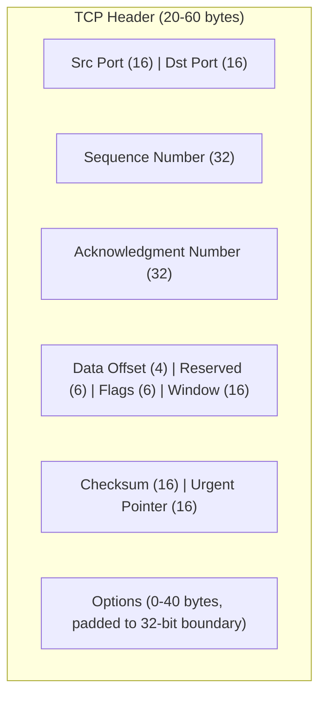

# 10.07 — TCP Header Fields

> [!abstract> The 20-60 Byte Header
> The TCP header is **20 bytes minimum** (no options) and up to **60 bytes** with options. It carries port numbers, sequence and acknowledgment numbers, control flags, a sliding window size, a checksum, and optional fields like MSS and timestamps.



---

##  Field-by-Field

| Field | Size | Purpose |
| :--- | :-: | :--- |
| **Source Port** | 16 bits | Sender's port |
| **Destination Port** | 16 bits | Receiver's port |
| **Sequence Number** | 32 bits | Position of the first byte of this segment's payload in the overall byte stream |
| **Acknowledgment Number** | 32 bits | Next byte the sender of this segment expects to receive (implicitly ACKs all bytes before it) |
| **Data Offset (Header Length)** | 4 bits | Header length in 32-bit words. Min 5 (20 bytes), max 15 (60 bytes). |
| **Reserved** | 6 bits | Unused; must be 0 |
| **Control Flags** | 6 bits | URG, ACK, PSH, RST, SYN, FIN |
| **Window Size** | 16 bits | Number of bytes the receiver will accept without an ACK (flow control) |
| **Checksum** | 16 bits | Error detection over pseudo-header + TCP header + payload |
| **Urgent Pointer** | 16 bits | If URG flag set, points to the last byte of urgent data |
| **Options** | 0–40 bytes | MSS, timestamps, SACK, window scale, etc. |

---

##  The 6 Control Flags

| Flag | Name | Meaning |
| :-: | :--- | :--- |
| **URG** | Urgent | Urgent pointer field is significant; data is "out of band" |
| **ACK** | Acknowledgment | Acknowledgment field is significant (set in all segments after the initial SYN) |
| **PSH** | Push | Receiver should pass this data to the app immediately (don't buffer) |
| **RST** | Reset | Reset the connection (abort; usually indicates an error) |
| **SYN** | Synchronize | Synchronize sequence numbers (used in handshake) |
| **FIN** | Finish | Sender is done sending data (used in close) |

### Common Flag Combinations

| Flags | Meaning |
| :--- | :--- |
| SYN | Connection request (handshake step 1) |
| SYN-ACK | Connection acceptance (handshake step 2) |
| ACK | Connection confirmed (handshake step 3) + all subsequent data segments |
| FIN-ACK | Connection close request |
| RST-ACK | Connection reset (often seen when connecting to a closed port) |
| PSH-ACK | Data segment that should be pushed to the app immediately |

> [!info] Wireshark displays flags as letters
> Wireshark shows the flags as a sequence of letters, e.g., `[PSH, ACK]` or `[SYN]`. The order is always UAPRSF.

---

##  Sequence and Acknowledgment Numbers

These are the heart of TCP's reliability. Both are 32-bit unsigned integers that wrap around at $2^{32}$.

### Sequence Number
The sequence number of a segment is the position (in bytes) of the **first byte of this segment's payload** in the sender's byte stream.

- Initial sequence number (ISN) is random (for security — prevents sequence prediction attacks).
- A pure SYN segment (no payload) consumes one sequence number: the first data byte is ISN+1.
- Subsequent segments have sequence numbers that increment by the payload size.

### Acknowledgment Number
The acknowledgment number is the **next byte the sender of this segment expects to receive**. It implicitly ACKs all bytes before it.

- If ACK = 1001, the sender has received all bytes 1–1000 and is now waiting for byte 1001.
- ACKs are **cumulative** — you don't ACK individual segments, you ACK a position in the stream.

### Worked Example

```
Client sends 1000 bytes:
  Segment 1: seq=1, payload=500 bytes (bytes 1-500)
  Segment 2: seq=501, payload=500 bytes (bytes 501-1000)

Server ACKs:
  ACK segment: ack=1001 (I have 1-1000, send me 1001 next)

If segment 2 is lost, server gets only segment 1:
  ACK segment: ack=501 (I have 1-500, send me 501 next)
  
Client notices ACK=501 after sending segment 2 with seq=501 → retransmit segment 2.
```

---

##  Window Size (Flow Control)

The 16-bit Window Size field advertises how many bytes the receiver can accept without an ACK. The sender must not have more than this many bytes "in flight" (sent but unacknowledged).

- A window of 0 means "stop sending; I'm full." The sender pauses until a non-zero window is advertised.
- With the **Window Scale option** (RFC 7323), the 16-bit field can represent up to 1 GB by multiplying by a scale factor negotiated during the handshake.

See [[10 - Transport Layer/10.09 TCP Flow Control & Windowing|10.09 Flow Control]].

---

##  Checksum and Pseudo-Header

Like UDP, TCP's checksum covers:
- A **pseudo-header** with source/dest IPs and protocol (catches misrouted packets).
- The TCP header.
- The TCP payload.

Mandatory in both IPv4 and IPv6.

---

##  Common TCP Options

| Option | Purpose |
| :--- | :--- |
| **MSS (Maximum Segment Size, kind 2)** | Advertises the maximum payload size the sender can receive. Default 536 for non-Ethernet; 1460 for Ethernet. |
| **Window Scale (kind 3)** | Multiplies the Window Size field by $2^S$ where S is the scale factor (0-14). Allows windows up to 1 GB. |
| **SACK Permitted (kind 4)** / **SACK (kind 5)** | Selective ACK — lets the receiver tell the sender exactly which segments arrived, so only the missing ones are retransmitted. |
| **Timestamps (kind 8)** | Used for RTT measurement and PAWS (Protection Against Wrapped Sequence numbers). |

Options are padded to a 32-bit boundary with zero bytes.

---

##  Memory Aid

> "TCP header fields in order:"
> "**P**orts, **S**equence, **A**ck, **O**ffset, **F**lags, **W**indow, **C**hecksum, **U**rgent, **O**ptions"
>
> Or: "**P**lease **S**end **A**nother **O**rder **F**or **W**arm **C**offee, **U**rgent **O**rder"

More mnemonics in [[14 - Memory Aids & Mnemonics/14.00 Chapter Overview|Chapter 14]].

---

##  See Also

- [[10 - Transport Layer/10.06 TCP|10.06 TCP]] — overview.
- [[10 - Transport Layer/10.08 TCP Connection Lifecycle|10.08 Connection Lifecycle]] — how flags are used.
- [[10 - Transport Layer/10.09 TCP Flow Control & Windowing|10.09 Flow Control]] — window field.
- [[05 - IP Datagram & Fragmentation/05.01 IP Header Fields|05.01 IP Header]] — what wraps TCP segments.
