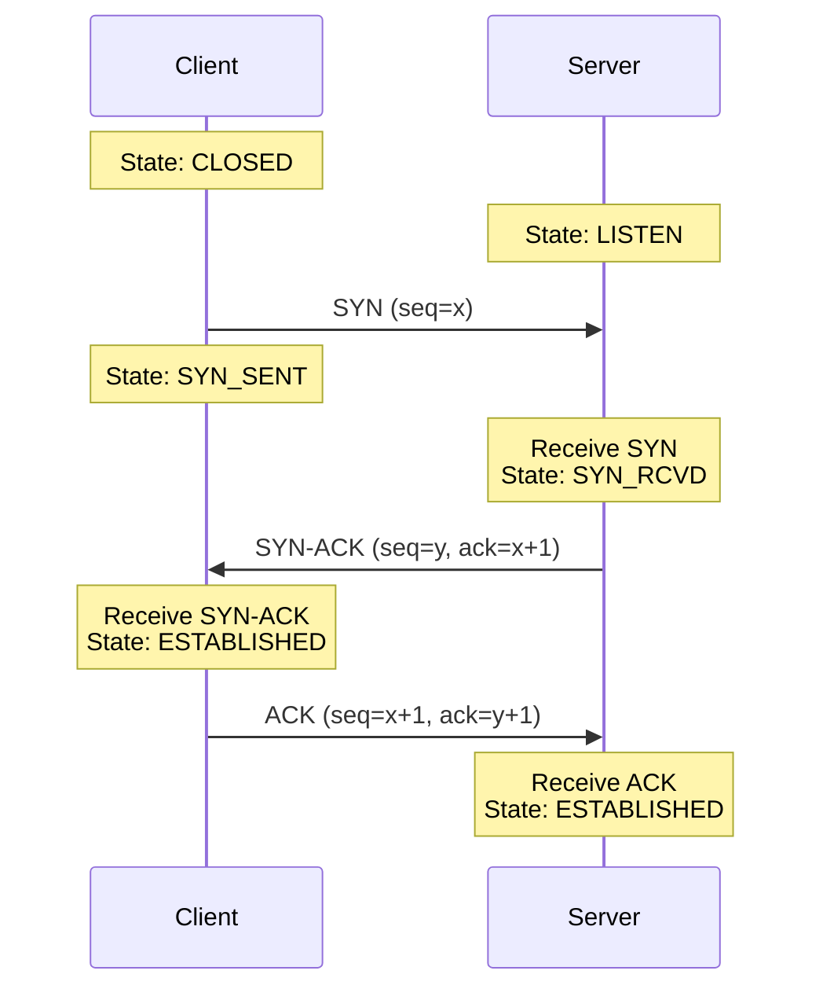
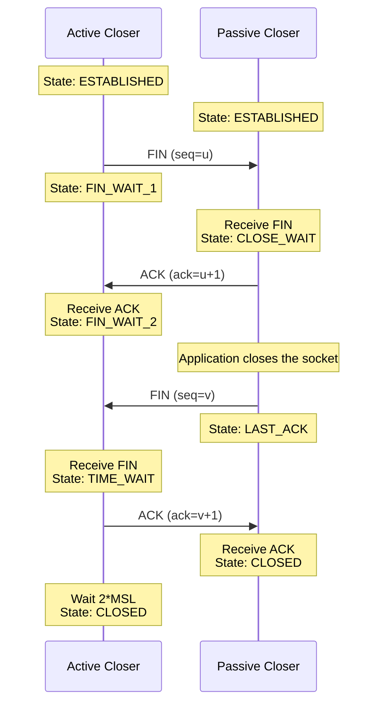
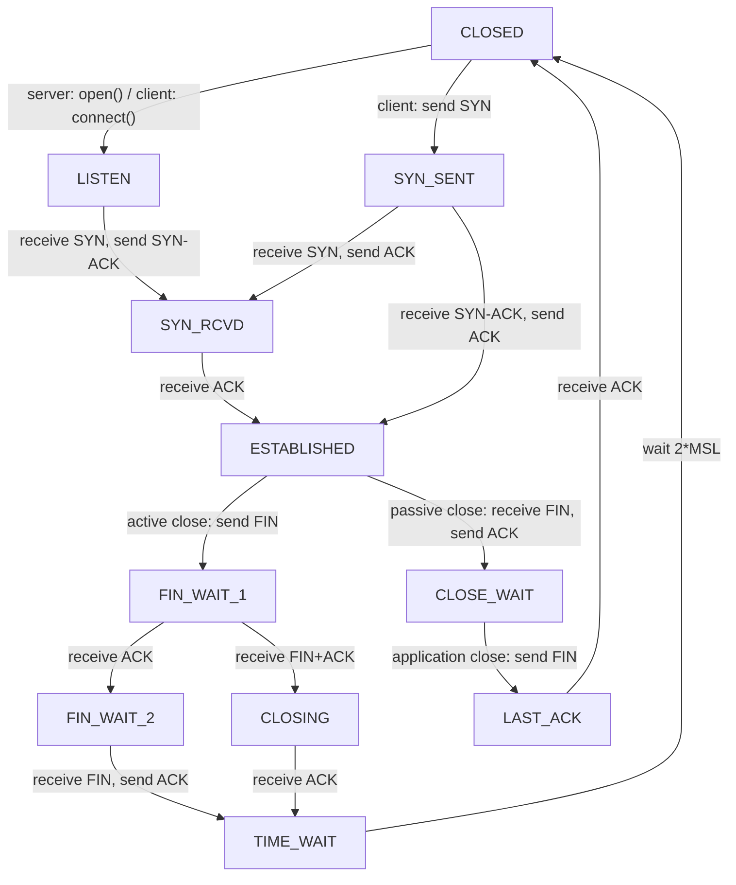

# 10.08 — TCP Connection Lifecycle

> [!abstract> Three to Open, Four to Close
> A TCP connection is established with a **3-way handshake** (SYN → SYN-ACK → ACK) and torn down with a **4-step close** (FIN → ACK → FIN → ACK). Between these, both ends traverse a defined set of states. Knowing this state machine is essential for diagnosing connection issues.

---

##  Connection Establishment — The 3-Way Handshake



### Step 1: SYN
The client picks a random initial sequence number (ISN) `x` and sends a segment with:
- SYN flag set
- Sequence number = x
- No payload (consumes 1 sequence number)

The client transitions CLOSED → SYN_SENT.

### Step 2: SYN-ACK
The server receives the SYN, allocates resources for the connection, picks its own ISN `y`, and sends:
- SYN and ACK flags set
- Sequence number = y
- Acknowledgment number = x+1

The server transitions LISTEN → SYN_RCVD.

### Step 3: ACK
The client receives the SYN-ACK and sends:
- ACK flag set
- Sequence number = x+1
- Acknowledgment number = y+1

The client transitions SYN_SENT → ESTABLISHED. Upon receiving the ACK, the server transitions SYN_RCVD → ESTABLISHED. Data can now flow.

> [!info] Why random ISNs?
> If ISNs were predictable, an attacker could spoof a connection (predict the next ISN, send spoofed SYN-ACK, etc.). Modern TCP stacks use random ISNs (with cryptographic randomization) to prevent these attacks.

---

##  Connection Teardown — The 4-Step Close



### Step 1: FIN (Active Close)
Either side can initiate. The active closer sends:
- FIN flag set
- Sequence number = u

It transitions ESTABLISHED → FIN_WAIT_1. FIN consumes 1 sequence number.

### Step 2: ACK
The passive closer ACKs the FIN:
- ACK flag set
- Acknowledgment number = u+1

It transitions ESTABLISHED → CLOSE_WAIT. At this point the connection is **half-closed**: the active closer can't send more data, but the passive closer still can.

### Step 3: FIN (Passive Close)
When the passive closer's application closes its socket, it sends its own FIN:
- FIN flag set
- Sequence number = v

It transitions CLOSE_WAIT → LAST_ACK.

### Step 4: ACK
The active closer ACKs the second FIN:
- ACK flag set
- Acknowledgment number = v+1

The passive closer receives the ACK and transitions LAST_ACK → CLOSED. The active closer transitions FIN_WAIT_2 → TIME_WAIT, waits 2×MSL (typically 60-120s), then transitions to CLOSED.

> [!info] Why TIME_WAIT?
> The active closer waits 2×MSL (Maximum Segment Lifetime, typically 30-60s each) to ensure:
> 1. Its final ACK reaches the passive closer. If the ACK is lost, the passive closer will retransmit its FIN, and the active closer can re-ACK.
> 2. Any old segments from this connection (delayed duplicates) have time to dissipate before a new connection reuses the same 5-tuple.
>
> TIME_WAIT is a common cause of "address already in use" errors when restarting servers. Set `SO_REUSEADDR` to allow rebinding.

---

##  The Full TCP State Machine



---

##  Diagnosing TCP States

```bash
# Linux: see TCP states
ss -tan | awk '{print $1}' | sort | uniq -c
# Output (sample):
#   1 State
#  12 ESTAB
#   3 TIME-WAIT
#   2 LISTEN

# Or per-connection with full details
ss -tanp

# Windows
netstat -an | findstr :80
```

Common patterns:
- Many `TIME_WAIT` → server is closing many short connections. Mitigate by enabling `SO_REUSEADDR`, increasing ephemeral port range, or using long-lived connections.
- Many `SYN_SENT` → clients can't reach a server. Check firewall, routing, server status.
- Many `CLOSE_WAIT` → application isn't closing sockets properly (forgot to call `close()`). This is an application bug.
- Many `SYN_RCVD` → possible SYN flood attack. Enable SYN cookies.

---

##  Common Errors

| Symptom | Likely Cause |
| :--- | :--- |
| "Connection refused" | Server not listening on the port (RST returned) |
| "Connection timed out" | Firewall dropping SYNs, or server unreachable |
| "Connection reset" | RST received mid-connection (server crashed, app died) |
| "Address already in use" | Previous socket still in TIME_WAIT — use `SO_REUSEADDR` |
| Half-open connection | One side thinks it's connected, other side doesn't (after a network partition). Keepalives detect this. |

---

##  See Also

- [[10 - Transport Layer/10.06 TCP|10.06 TCP]]
- [[10 - Transport Layer/10.07 TCP Header Fields|10.07 TCP Header]]
- [[10 - Transport Layer/10.09 TCP Flow Control & Windowing|10.09 Flow Control]]
- [[10 - Transport Layer/10.10 TCP Reliability & Congestion Control|10.10 Reliability]]
