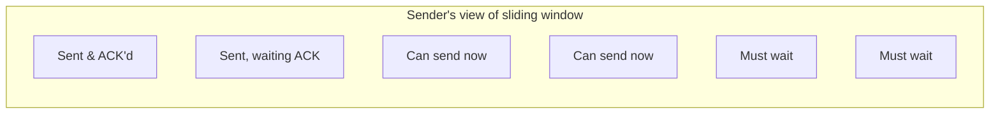
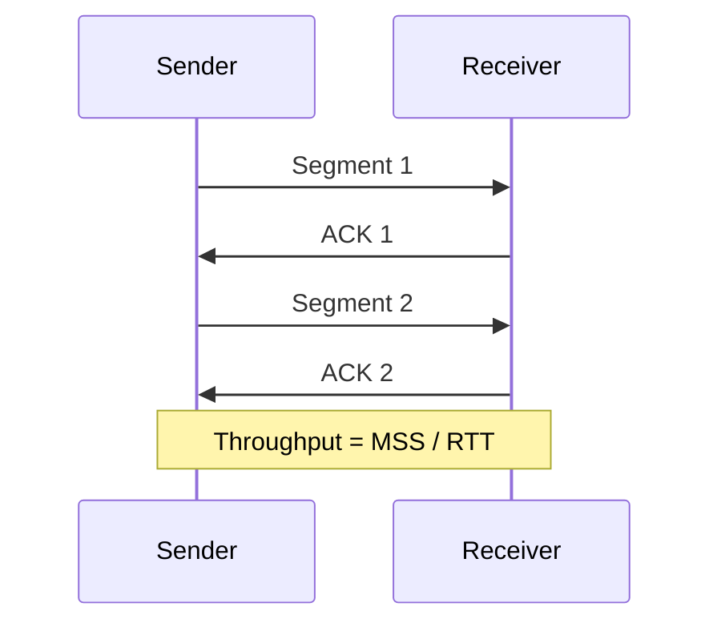
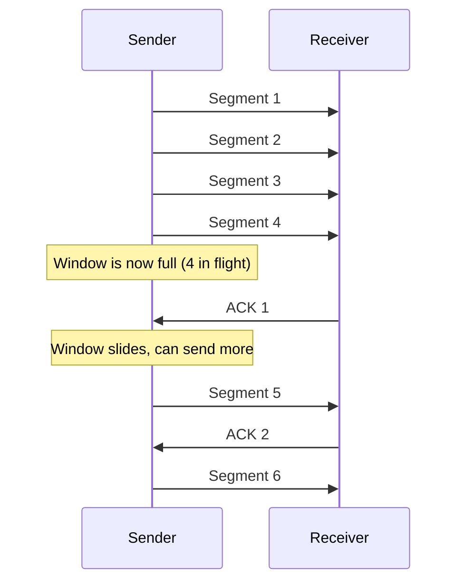

# 10.09 — TCP Flow Control & Windowing

> [!abstract> Sliding Window
> TCP uses a **sliding window** mechanism for flow control. The receiver advertises how much buffer space it has (the Window Size field in every ACK); the sender transmits up to that many bytes before pausing for the next ACK. This prevents a fast sender from overwhelming a slow receiver.

---

##  The Window Mechanism

Each ACK segment includes a **Window Size** field — the number of bytes the receiver can accept without further ACKs. The sender keeps track of:
- Bytes sent and ACK'd (left of the window)
- Bytes sent but not yet ACK'd (in flight)
- Bytes that can be sent now (in the window, not yet sent)
- Bytes that must wait (right of the window)

As ACKs arrive, the window "slides" right, freeing up more bytes for transmission.

---

##  Stop-and-Wait vs Sliding Window

### Stop-and-Wait (Naive)
The sender transmits one segment, then waits for an ACK before sending the next.

On a 100 ms RTT link with 1460-byte segments, throughput = 1460 / 0.1 = **14.6 KB/s**. Terrible.

### Sliding Window
The sender can have multiple segments in flight, up to the window size.

Throughput = `window_size / RTT`. With a 64 KB window and 100 ms RTT: 65536 / 0.1 = **655 KB/s**. Much better.

---

##  Bandwidth-Delay Product (BDP)

The BDP is the maximum number of bytes that can be "in flight" on a path:

$$\text{BDP} = \text{Bandwidth} \times \text{RTT}$$

For TCP to fill the pipe, the window must be at least the BDP.

### Example: Transatlantic 1 Gbps link, 100 ms RTT
$$\text{BDP} = 10^9 \text{ bps} \times 0.1 \text{ s} = 10^8 \text{ bits} = 12.5 \text{ MB}$$

A TCP connection needs a 12.5 MB window to saturate this link. The standard 16-bit Window Size field maxes out at 65,535 bytes — way too small. The **Window Scale option** (RFC 7323) solves this by multiplying the field by $2^S$ (up to $2^{14}$ = 16384), allowing windows up to 1 GB.

---

##  Window Adjustments

The receiver dynamically adjusts the window based on its buffer state:

- Buffer empty → advertise large window (sender can transmit fast).
- Buffer filling up → advertise smaller window (sender slows down).
- Buffer full → advertise window = 0 (sender pauses entirely).

When the receiver opens up again, it sends a "window update" ACK with the new (larger) window size to unpause the sender.

> [!warning] Silly Window Syndrome
> If both sides reactively shrink/grow the window in tiny increments, throughput collapses. Clark's solution: the receiver doesn't advertise a non-zero window until it can advertise at least MSS bytes; the sender doesn't send small segments just because the window is open. This is enforced by Nagle's algorithm (sender side) and the Clark algorithm (receiver side).

---

##  Flow Control vs Congestion Control

These are **different mechanisms** with different purposes:

| Aspect | Flow Control | Congestion Control |
| :--- | :--- | :--- |
| Protects | The receiver (its buffer) | The network (routers, links) |
| Mechanism | Receiver advertises window (rwnd) | Sender computes congestion window (cwnd) |
| Where decided | Receiver | Sender |
| Effective window | $\min(\text{rwnd}, \text{cwnd})$ | $\min(\text{rwnd}, \text{cwnd})$ |

Both run simultaneously; the smaller of the two windows controls the actual send rate.

See [[10 - Transport Layer/10.10 TCP Reliability & Congestion Control|10.10 Congestion Control]] for the cwnd side.

---

##  See Also

- [[10 - Transport Layer/10.06 TCP|10.06 TCP]]
- [[10 - Transport Layer/10.07 TCP Header Fields|10.07 TCP Header]] — where the window field lives.
- [[10 - Transport Layer/10.10 TCP Reliability & Congestion Control|10.10 Congestion Control]]
