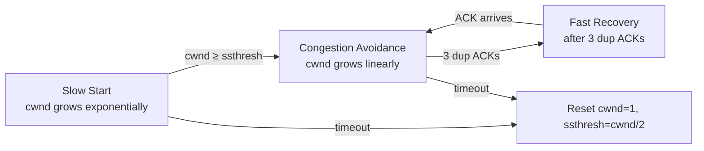

# 10.10 — TCP Reliability & Congestion Control

> [!abstract> Two Different Problems
> TCP solves two distinct problems: (1) **reliability** — ensuring every byte reaches the destination, via ACKs and retransmission; and (2) **congestion control** — avoiding overwhelming the network, via the congestion window (cwnd). These are separate mechanisms with separate algorithms.

---

##  Reliability Mechanisms

### 1. Sequence Numbers + Cumulative ACKs
Every byte has a sequence number. ACKs are **cumulative** — an ACK of byte N confirms receipt of all bytes 1 through N-1.

Advantage of cumulative ACKs: a lost ACK doesn't matter, as long as a later ACK arrives before the retransmission timer fires.

### 2. Retransmission Timeout (RTO)
For each unacknowledged segment, the sender starts a timer. If the timer expires (no ACK received), the segment is retransmitted.

The RTO is dynamically calculated from measured Round-Trip Times (RTTs):
$$\text{SRTT}_{\text{new}} = \frac{7}{8} \times \text{SRTT}_{\text{old}} + \frac{1}{8} \times \text{RTT}_{\text{sample}}$$
$$\text{RTTVAR}_{\text{new}} = \frac{3}{4} \times \text{RTTVAR}_{\text{old}} + \frac{1}{4} \times |\text{SRTT}_{\text{old}} - \text{RTT}_{\text{sample}}|$$
$$\text{RTO} = \text{SRTT} + \max(G, 4 \times \text{RTTVAR})$$

Where $G$ is a clock granularity (typically 0–500 ms). Modern TCP also uses the timestamp option for finer-grained RTT measurement.

### 3. Fast Retransmit
Waiting for RTO is slow (often 200ms–1s). Fast Retransmit uses **duplicate ACKs** as an early signal of loss:

> When a receiver gets an out-of-order segment, it sends a duplicate ACK (re-ACKing the last in-order byte it received).
>
> If the sender receives **3 duplicate ACKs** for the same sequence number, it concludes the next segment was lost and retransmits immediately — without waiting for RTO.

After Fast Retransmit, TCP enters Fast Recovery (described below under congestion control).

### 4. Selective ACK (SACK)
Without SACK, TCP can only ACK cumulatively — it can't tell the sender "I got segments 1, 2, 4, 5 but missed 3." SACK (RFC 2018) adds this capability via a TCP option, so the sender retransmits only the missing segments, not everything after the gap.

Modern TCP stacks support SACK by default.

### 5. Checksum
Every TCP segment includes a 16-bit checksum over the pseudo-header + TCP header + payload. The receiver verifies and silently drops segments with bad checksums (relying on retransmission).

---

##  Congestion Control

TCP's congestion control manages how fast the sender transmits to avoid overwhelming the network. The mechanism is the **congestion window (cwnd)** — a sender-side limit on bytes in flight.

$$\text{Effective window} = \min(\text{rwnd}, \text{cwnd})$$

Where `rwnd` is the receiver's advertised window (flow control) and `cwnd` is the sender's congestion window.

### The Four Phases

#### 1. Slow Start
- Start with `cwnd = 1 MSS` (or 10 MSS in modern implementations using RFC 6928).
- For each ACK received, increase `cwnd` by 1 MSS.
- Result: `cwnd` **doubles every RTT** (exponential growth).
- Continues until `cwnd` reaches `ssthresh` (slow-start threshold) or loss occurs.

Despite the name, slow start is actually fast — exponential growth.

#### 2. Congestion Avoidance
- After `cwnd ≥ ssthresh`, switch to linear growth.
- For each RTT, increase `cwnd` by 1 MSS.
- This cautiously probes for additional capacity.

#### 3. Fast Retransmit
- On 3 duplicate ACKs, retransmit the missing segment immediately (don't wait for RTO).
- Set `ssthresh = cwnd / 2`.
- Set `cwnd = ssthresh + 3` (the 3 dup ACKs indicate 3 segments left the network).

#### 4. Fast Recovery
- Continue sending new segments (if window allows) while waiting for the retransmitted segment's ACK.
- On each new dup ACK, increase `cwnd` by 1 MSS.
- When the ACK for the retransmitted segment arrives, set `cwnd = ssthresh` and enter Congestion Avoidance.

If a **timeout** occurs (RTO fires), TCP is more aggressive:
- `ssthresh = cwnd / 2`
- `cwnd = 1 MSS`
- Go back to Slow Start.

Timeouts indicate severe congestion; 3 dup ACKs indicate mild congestion (some segments are getting through).

---

##  Modern Congestion Control Algorithms

The classic algorithm above is **Reno** (1988). Modern variants improve performance:

| Algorithm | Improvement |
| :--- | :--- |
| **Reno** | The original; described above. |
| **NewReno** | Better handling of multiple losses in one window. |
| **Cubic** | Default in Linux since 2.6.19; cubic function for cwnd growth, optimized for high-BDP links. |
| **BBR** | Google's algorithm; uses bandwidth and RTT estimates instead of loss. Default in Google Cloud. |
| **Vegas** | Uses RTT variation (not loss) as the congestion signal. |
| **Westwood** | Optimized for wireless / lossy links (doesn't treat all loss as congestion). |

Different algorithms suit different network conditions — high-BDP transcontinental links (BBR, Cubic), datacenter LANs (DCTCP), mobile/wireless (Westwood).

---

##  Why Congestion Control Matters

Without congestion control, the internet would collapse. In the early 1980s, before TCP implemented congestion control, the internet suffered "congestion collapse" — throughput dropped to a tiny fraction of capacity as routers dropped packets, senders retransmitted, and the network became saturated with retransmissions.

Van Jacobson's 1988 paper "Congestion Avoidance and Control" introduced the slow-start and congestion-avoidance algorithms and saved the internet. Every modern TCP implementation descends from this work.

---

##  See Also

- [[10 - Transport Layer/10.06 TCP|10.06 TCP]]
- [[10 - Transport Layer/10.08 TCP Connection Lifecycle|10.08 Connection Lifecycle]]
- [[10 - Transport Layer/10.09 TCP Flow Control & Windowing|10.09 Flow Control]]
- [[10 - Transport Layer/10.11 TCP vs UDP Comparison|10.11 TCP vs UDP]]
