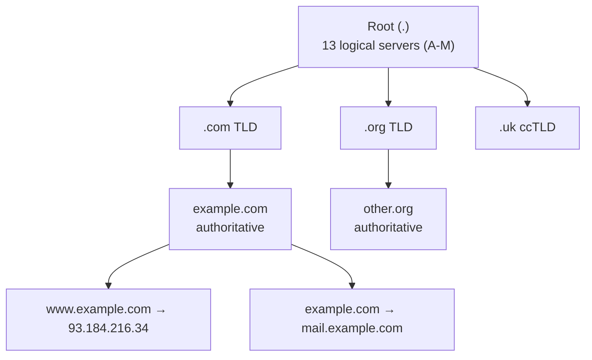
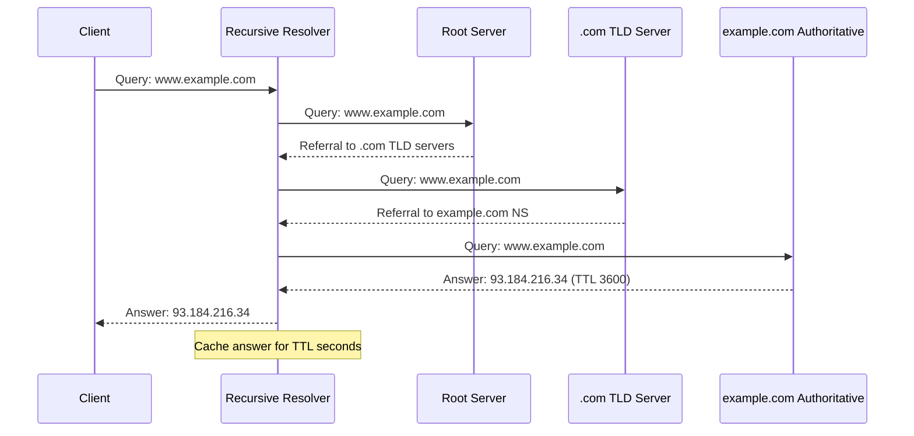

# 11.01 — DNS & Domain Resolution

> [!abstract> The Phonebook of the Internet
> **DNS (Domain Name System)** is a hierarchical, decentralized naming system that translates human-readable domain names (`www.example.com`) into machine-readable IP addresses (`93.184.216.34`). Virtually every network operation begins with a DNS lookup. Without DNS, users would need to memorize numerical IPs for every website, email server, and online service.

---

##  Brief History

DNS was designed in the early 1980s by Paul Mockapetris (RFC 882/883, later superseded by RFC 1034/1035) as a replacement for the manual `HOSTS.TXT` file. The fundamental design — hierarchical zones, caching, TTLs — has proven remarkably resilient and now handles billions of queries per day. Modern extensions add security (DNSSEC), privacy (DoH, DoT), and performance (EDNS0).

---

##  The DNS Hierarchy



### Root Servers
13 logical addresses (A through M), each served by a global anycast cluster. They don't know individual domain IPs — they know which TLD servers are authoritative for each top-level domain.

### TLD Servers
Authoritative for a specific top-level domain (`.com`, `.org`, `.uk`, etc.). They know which name servers are authoritative for each second-level domain (`example.com`, `other.org`).

### Authoritative Servers
The final authority on records for a specific domain. Hold the zone file containing A, AAAA, MX, CNAME, TXT, and other records.

### Recursive Resolvers
The workhorses between clients and the rest of the hierarchy. Accept queries from clients, perform iterative lookups, cache results. Examples: Google DNS (`8.8.8.8`), Cloudflare (`1.1.1.1`), Quad9 (`9.9.9.9`), and ISP-provided resolvers.

---

##  Resolution Process

### Recursive Query (client → resolver)
The client asks its configured recursive resolver: "What's the IP for `www.example.com`?" The resolver is responsible for returning the final answer or an error. The client doesn't care about the hierarchy — it just wants the answer.

### Iterative Queries (resolver → root → TLD → authoritative)
If the resolver doesn't have the answer cached:



Total queries: 3 (root, TLD, authoritative). With caching, subsequent lookups for the same domain return instantly.

---

##  DNS Record Types

| Type | Name | Purpose | Example |
| :-: | :--- | :--- | :--- |
| **A** | Address | Domain → IPv4 | `www.example.com. A 93.184.216.34` |
| **AAAA** | IPv6 Address | Domain → IPv6 | `www.example.com. AAAA 2606:2800:220:1:248:1893:25c8:1946` |
| **CNAME** | Canonical Name | Alias from one name to another | `blog.example.com. CNAME example.wordpress.com.` |
| **MX** | Mail Exchange | Mail server for the domain (with priority) | `example.com. MX 10 mail.example.com.` |
| **NS** | Name Server | Authoritative NS for the zone | `example.com. NS ns1.example.com.` |
| **TXT** | Text | Arbitrary text (SPF, DKIM, verification) | `example.com. TXT "v=spf1 -all"` |
| **SOA** | Start of Authority | Zone metadata (serial, refresh, retry, expire, TTL) | (one per zone) |
| **PTR** | Pointer | Reverse lookup: IP → domain (in `in-addr.arpa`) | `34.216.184.93.in-addr.arpa. PTR example.com.` |
| **SRV** | Service | Generic service discovery | `_sip._tcp.example.com. SRV 10 60 5060 sip.example.com.` |
| **CAA** | Certification Authority Authorization | Which CAs may issue certs for this domain | `example.com. CAA 0 issue "letsencrypt.org"` |

> [!warning] CNAME restrictions
> A name with a CNAME record **cannot** have any other record type. So the apex (root) of a domain (`example.com` itself) usually can't be a CNAME — it needs an A record. (Some DNS providers offer "ALIAS" or "ANAME" pseudo-records to work around this for CDN pointing.)

---

##  Caching Layers

DNS caching happens at multiple layers, each with its own TTL behavior:

1. **Browser cache** — typically caps TTL at a few minutes to allow fast failover.
2. **OS resolver cache** — `systemd-resolved` (Linux), DNS Client service (Windows), `mDNSResponder` (macOS).
3. **Recursive resolver cache** — large shared cache; popular records are nearly always cached.
4. **Authoritative server** — has no cache for upstream (it's the source of truth), but may cache internal zone transfers.

### TTL Strategy for Migrations
When migrating a domain to a new IP:
1. **48 hours before:** lower TTL to 300s (5 minutes).
2. **At migration time:** change the record. Old TTL expires within 5 minutes everywhere.
3. **After migration stable:** raise TTL back to 3600s (1 hour) or higher.

---

##  Common DNS Tools

### dig (Domain Information Groper)
The most powerful DNS tool on Linux/macOS:
```bash
dig example.com                    # A record
dig example.com MX                 # MX record
dig @8.8.8.8 example.com           # use specific resolver
dig example.com +trace             # trace from root to authoritative
dig -x 93.184.216.34               # reverse lookup
```

### nslookup
Simpler, available everywhere:
```bash
nslookup example.com
nslookup example.com 8.8.8.8
nslookup -type=mx example.com
```

### host
Concise Linux/macOS tool:
```bash
host example.com
host -t MX example.com
host -t NS example.com
```

### Modern encrypted DNS
- **DoH (DNS over HTTPS)** — DNS queries over HTTPS to port 443. Bypasses DNS-level blocking, encrypts queries.
- **DoT (DNS over TLS)** — DNS queries over TLS to port 853.
- **DNSCrypt** — older protocol, similar goal.

---

##  DNS Security

- **DNSSEC** — cryptographically signs DNS records, preventing spoofing. Adds RRSIG and DNSKEY records. Adoption is growing but still incomplete.
- **DNS over HTTPS/TLS** — encrypts queries between client and resolver, preventing ISP eavesdropping and tampering.
- **SPF / DKIM / DMARC** — email authentication built on TXT records.
- **CAA** — restricts which CAs can issue certificates for a domain.

---

##  See Also

- [[11 - Application Layer/11.02 HTTP & HTTPS|11.02 HTTP/HTTPS]] — depends on DNS to find the server IP.
- [[04 - IPv4 Network Layer/04.01 IPv4 Address Architecture|04.01 IPv4 Addressing]] — the numeric counterpart to DNS names.
- [[10 - Transport Layer/10.05 UDP|10.05 UDP]] — DNS rides on UDP port 53.
