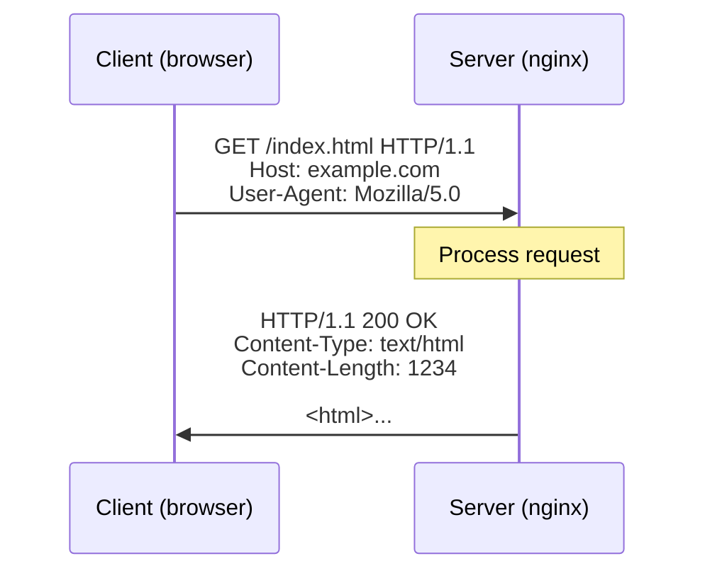

# 11.02 — HTTP & HTTPS

> [!abstract> The Web's Protocol
> **HTTP (HyperText Transfer Protocol)** is the foundational protocol of the World Wide Web. It defines how clients (browsers, mobile apps, CLI tools) and servers exchange messages using a strict **request-response** model. **HTTPS** is HTTP wrapped in TLS for confidentiality, integrity, and authentication.

---

##  HTTP Basics

### Request-Response Model


Every interaction is a single request from the client followed by a single response from the server. The server cannot initiate traffic to the client (without WebSockets — see [[11 - Application Layer/11.05 WebSockets|11.05]]).

### Stateless
HTTP is **stateless** by design — each request is independent, and the server doesn't remember previous requests from the same client. State is simulated via:
- **Cookies** — server sets a `Set-Cookie` header; client echoes it back on subsequent requests.
- **Session IDs** — stored in cookies, looked up in server-side session storage.
- **Tokens (JWT)** — self-contained, signed token in the `Authorization` header.
- **Hidden form fields** — embedded in HTML forms.

### Methods (Verbs)

| Method | Purpose | Idempotent? | Safe? | Has body? |
| :-: | :--- | :-: | :-: | :-: |
| **GET** | Retrieve a resource | Yes | Yes | No |
| **POST** | Submit data, create a resource | No | No | Yes |
| **PUT** | Replace a resource (full update) | Yes | No | Yes |
| **PATCH** | Partial update of a resource | No | No | Yes |
| **DELETE** | Remove a resource | Yes | No | Optional |
| **HEAD** | Like GET but headers only | Yes | Yes | No |
| **OPTIONS** | Describe supported methods | Yes | Yes | No |
| **TRACE** | Echo request for debugging | Yes | Yes | No |
| **CONNECT** | Establish a tunnel (for HTTPS proxying) | No | No | Optional |

- **Idempotent** = calling multiple times has the same effect as calling once.
- **Safe** = doesn't modify server state (suitable for prefetching).

### Status Codes

| Range | Meaning | Examples |
| :-: | :--- | :--- |
| **1xx** | Informational | 100 Continue, 101 Switching Protocols |
| **2xx** | Success | **200 OK**, 201 Created, 204 No Content, 206 Partial Content |
| **3xx** | Redirection | 301 Moved Permanently, 302 Found, 304 Not Modified |
| **4xx** | Client error | **400 Bad Request**, **401 Unauthorized**, 403 Forbidden, **404 Not Found**, 429 Too Many Requests |
| **5xx** | Server error | **500 Internal Server Error**, 502 Bad Gateway, 503 Service Unavailable, 504 Gateway Timeout |

### Common Headers

| Header | Direction | Purpose |
| :--- | :--- | :--- |
| `Host` | Request | The hostname (required in HTTP/1.1 for virtual hosting) |
| `User-Agent` | Request | Client identification |
| `Accept` | Request | Acceptable response content types |
| `Authorization` | Request | Credentials (Basic, Bearer, etc.) |
| `Cookie` | Request | Echoed cookies from previous `Set-Cookie` |
| `Content-Type` | Both | Media type of the body (`application/json`, `text/html`, etc.) |
| `Content-Length` | Both | Body size in bytes |
| `Location` | Response | Used with 3xx redirects and 201 Created |
| `Set-Cookie` | Response | Server-set cookies |
| `Cache-Control` | Both | Caching directives (`max-age`, `no-cache`, `public`, `private`) |
| `ETag` | Response | Version identifier for conditional requests |
| `If-None-Match` | Request | Conditional GET (returns 304 if ETag matches) |

---

##  HTTP Versions

| Version | Year | Transport | Key Feature |
| :-: | :-: | :--- | :--- |
| HTTP/0.9 | 1991 | TCP | Single GET, no headers |
| HTTP/1.0 | 1996 | TCP | Headers, status codes, multiple methods |
| HTTP/1.1 | 1997 | TCP | Keep-alive (persistent connections), Host header, pipelining (rarely used) |
| HTTP/2 | 2015 | TCP (TLS) | Multiplexed streams, header compression (HPACK), server push |
| HTTP/3 | 2022 | UDP (QUIC) | No head-of-line blocking, 0-RTT resumption, faster connection setup |

### HTTP/1.1 — The Workhorse
- Persistent connections (keep-alive) — multiple requests over one TCP connection.
- Pipelining allowed but rarely deployed due to head-of-line blocking.
- Text-based protocol; human-readable.

### HTTP/2 — Multiplexed
- Binary framing — multiple parallel streams over one TCP connection.
- Solves HTTP/1.1's "six connections per domain" limit.
- Still suffers from TCP-level head-of-line blocking (one lost packet stalls all streams).
- Header compression with HPACK.

### HTTP/3 — Over QUIC
- Runs over QUIC, which runs over UDP.
- No TCP-level head-of-line blocking — each stream is independent.
- 0-RTT connection resumption for returning clients.
- Faster connection setup (1-RTT instead of TCP's 3-way handshake + TLS handshake).

---

##  HTTPS — HTTP over TLS

HTTPS is just HTTP wrapped in a TLS tunnel. The TLS handshake (see [[11 - Application Layer/11.03 SSL & TLS|11.03]]) establishes an encrypted channel; HTTP traffic flows inside it.

```
HTTP request →  encrypted by TLS  →  TCP port 443  →  decrypted by server's TLS  →  HTTP server
```

### Why HTTPS Everywhere?
1. **Confidentiality** — encrypts the request URL, headers, and body from eavesdroppers.
2. **Integrity** — prevents tampering in transit (no ISP injecting ads).
3. **Authentication** — the server proves its identity via a certificate.
4. **Required for modern features** — HTTP/2, geolocation, service workers, etc. require HTTPS.
5. **SEO** — Google prefers HTTPS sites.
6. **Compliance** — GDPR, PCI-DSS, etc. require encryption in transit.

### Certificate Authorities (CAs)
TLS certificates are issued by CAs — organizations trusted by browsers to verify domain ownership. The chain of trust:
- **Root CAs** (e.g., DigiCert, Let's Encrypt's ISRG Root X1) — pre-installed in browsers/OSes.
- **Intermediate CAs** — issued by root CAs, used to sign end-entity certs.
- **End-entity certs** — issued to specific domains.

Browsers verify the chain: end-entity → intermediate → root (which is in their trust store).

Let's Encrypt (founded 2014) provides free certificates and automated issuance via ACME, driving mass HTTPS adoption.

---

##  Practical HTTP

### Simple GET with curl
```bash
curl -v https://example.com/
# -v shows the full request and response headers
```

### POST with JSON
```bash
curl -X POST https://api.example.com/users \
  -H "Content-Type: application/json" \
  -H "Authorization: Bearer TOKEN" \
  -d '{"name": "Alice", "email": "alice@example.com"}'
```

### Inspecting in Browser DevTools
- **Network tab** — see every request, its timing, headers, body, response.
- **Throttling** — simulate slow networks.
- **Replay** — modify and resend a request.

---

##  See Also

- [[11 - Application Layer/11.01 DNS & Domain Resolution|11.01 DNS]] — resolves the hostname before HTTP connects.
- [[11 - Application Layer/11.03 SSL & TLS|11.03 TLS]] — what HTTPS adds.
- [[11 - Application Layer/11.04 SNI & SNI Injector|11.04 SNI]] — how one IP serves many HTTPS domains.
- [[11 - Application Layer/11.05 WebSockets|11.05 WebSockets]] — bidirectional upgrade from HTTP.
- [[11 - Application Layer/11.06 XHR|11.06 XHR]] — making HTTP requests from JavaScript.
