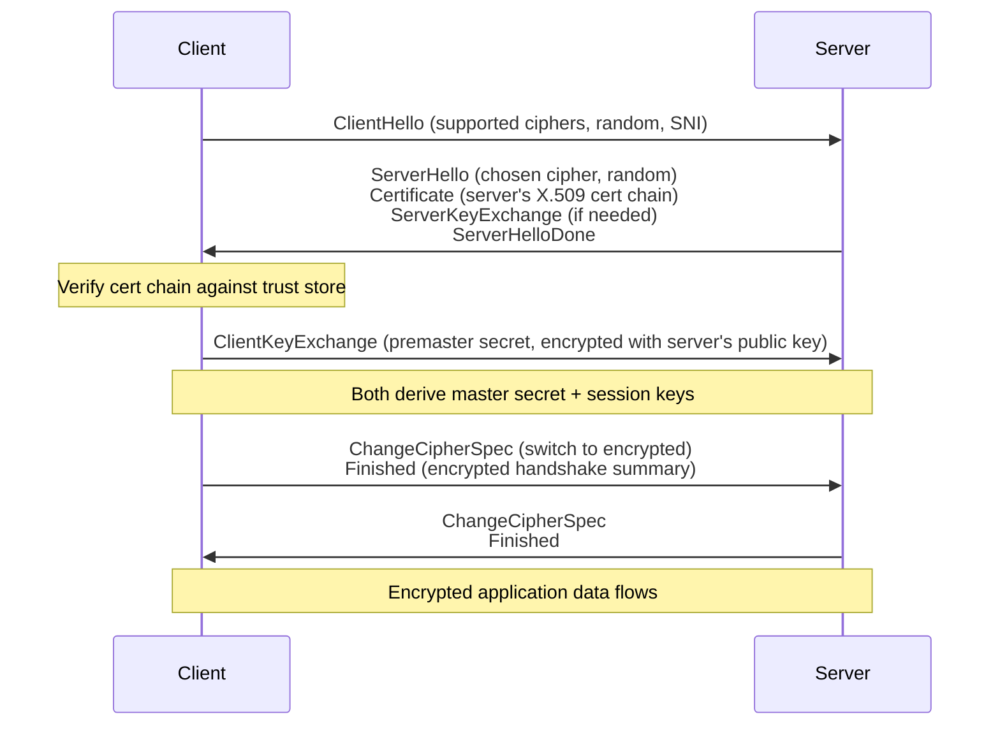
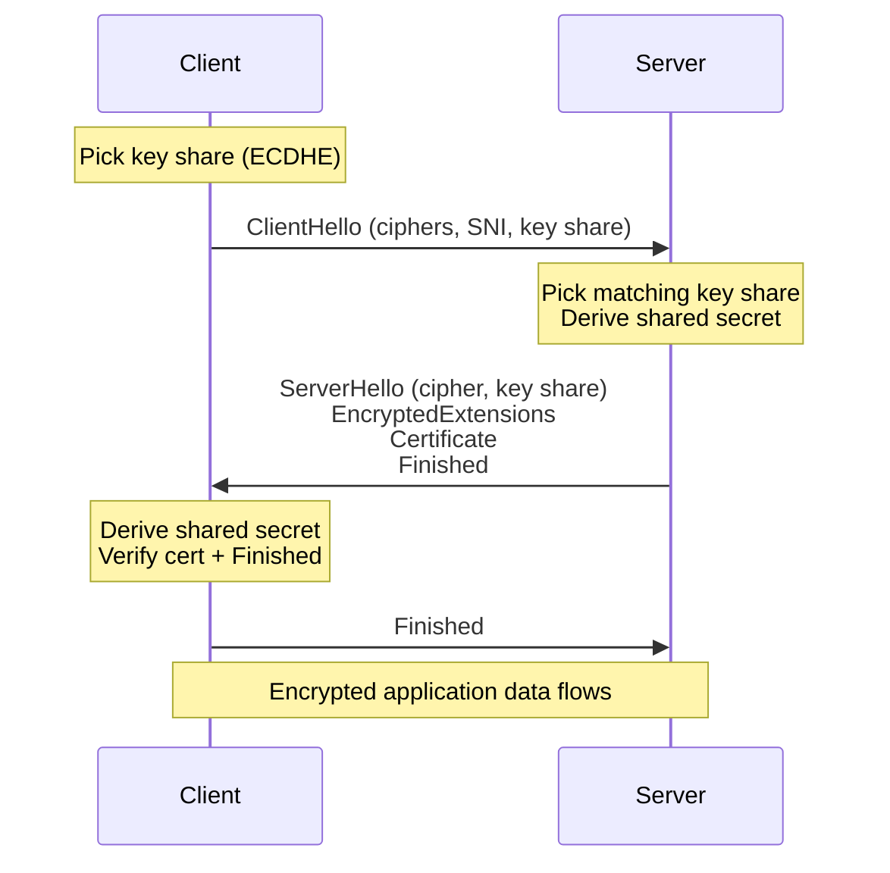

# 11.03 — SSL & TLS

> [!abstract> Securing the Transport
> **TLS (Transport Layer Security)** is the cryptographic protocol that secures HTTPS, SMTPS, IMAPS, and many other application protocols. It provides **confidentiality** (encryption), **integrity** (tamper detection), and **authentication** (server identity via certificates). SSL is the deprecated predecessor; TLS 1.3 (2018) is the modern standard.

---

##  SSL vs TLS — Naming

| Protocol | Year | Status |
| :-: | :-: | :--- |
| SSL 1.0 | 1994 | Never released (severe flaws) |
| SSL 2.0 | 1995 | **Deprecated** (2011) |
| SSL 3.0 | 1996 | **Deprecated** (2015, POODLE) |
| TLS 1.0 | 1999 | **Deprecated** (2020) |
| TLS 1.1 | 2006 | **Deprecated** (2020) |
| TLS 1.2 | 2008 | Still widely used; supported everywhere |
| TLS 1.3 | 2018 | Modern standard; mandatory for HTTP/3 |

Despite the naming, everyone still says "SSL certificates" — they mean TLS certificates. The terms are interchangeable in practice.

---

##  The TLS 1.2 Handshake (2-RTT)



Total: 2 round trips before application data can flow. Slow on high-latency links.

---

##  The TLS 1.3 Handshake (1-RTT)

TLS 1.3 collapses the handshake to 1 RTT by combining key exchange into the ClientHello:



### 0-RTT Resumption
For returning clients (with a previous session ticket), TLS 1.3 can send application data in the **first flight** — 0 round trips before data flows. Trade-off: replay risk, so only safe for idempotent requests.

---

##  Cryptographic Building Blocks

TLS combines three primitives:

| Purpose | Mechanism | Examples |
| :--- | :--- | :--- |
| **Key exchange** | Diffie-Hellman (ECDHE, DHE) | ECDHE-X25519, ECDHE-P256 |
| **Authentication** | Asymmetric signatures (RSA, ECDSA, Ed25519) | RSA-PSS, ECDSA-P256 |
| **Bulk encryption** | Symmetric ciphers (AEAD) | AES-128-GCM, AES-256-GCM, ChaCha20-Poly1305 |
| **Integrity** | AEAD (built into the cipher) | GCM, Poly1305 — replaces old MAC-then-encrypt |

The handshake uses asymmetric crypto (slow but secure for establishing a shared secret). After the handshake, both sides use the shared secret with symmetric crypto (fast).

### Perfect Forward Secrecy (PFS)
Achieved when the handshake uses ephemeral Diffie-Hellman (DHE or ECDHE). Each session generates a new key pair; previous sessions can't be decrypted even if the server's long-term private key is later compromised. TLS 1.3 mandates PFS — RSA key exchange (no PFS) was removed.

---

##  Certificates (X.509)

A TLS certificate contains:
- The domain name(s) it's valid for (Subject Alternative Name, SAN).
- The server's public key.
- The issuer (CA) name.
- The validity period (Not Before / Not After).
- The CA's signature over the above.

The browser verifies:
1. The cert is signed by a CA in its trust store (directly or via a chain).
2. The current date is within the validity period.
3. The domain being accessed matches a SAN in the cert.
4. The server proves possession of the corresponding private key (during the handshake).

If any check fails, the browser shows a certificate warning.

### Certificate Types

| Type | Validation Level | Use |
| :--- | :--- | :--- |
| **DV (Domain Validation)** | CA verifies domain control only | Most websites; cheap/free (Let's Encrypt) |
| **OV (Organization Validation)** | CA verifies the org's identity | Corporate sites |
| **EV (Extended Validation)** | Strictest vetting; browser shows org name (historically) | Banks, financial; less common now |

EV certificates no longer get special browser UI treatment (the green bar was removed in 2019), so the value is debated.

---

##  Common TLS Attacks and Mitigations

| Attack | Description | Mitigation |
| :--- | :--- | :--- |
| **POODLE** | Downgrade to SSL 3.0, exploit padding oracle | Disable SSL 3.0 |
| **BEAST** | Exploit CBC mode in TLS 1.0 | Use TLS 1.2+ with GCM |
| **CRIME / BREACH** | Exploit compression of secrets | Disable TLS compression (CRIME); be careful with HTTP compression (BREACH) |
| **Heartbleed** | Buffer over-read in OpenSSL (2014) | Patch OpenSSL; rotate keys |
| **Downgrade attacks** | Force weaker cipher/version | Use TLS_FALLBACK_SCSV; disable old versions |
| **Certificate mis-issuance** | CA issues cert for domain they don't own | Certificate Transparency (CT) logs; CAA records |
| **Replay (0-RTT)** | TLS 1.3 0-RTT data can be replayed | Only allow 0-RTT for idempotent requests |

---

##  Practical TLS

### Inspect a site's certificate
```bash
openssl s_client -connect example.com:443 -servername example.com
# Or with more detail:
openssl s_client -connect example.com:443 -showcerts < /dev/null
```

### Test TLS configuration
- **SSL Labs** — https://www.ssllabs.com/ssltest/ — comprehensive public scanner.
- **testssl.sh** — command-line scanner.
- **nmap** — `nmap --script ssl-enum-ciphers -p 443 example.com`

### Generate a self-signed cert (for testing)
```bash
openssl req -x509 -newkey rsa:4096 -keyout key.pem -out cert.pem \
  -days 365 -nodes -subj "/CN=localhost"
```

### Get a free Let's Encrypt cert
```bash
sudo certbot certonly --nginx -d example.com
# Or with standalone mode:
sudo certbot certonly --standalone -d example.com
```

---

##  See Also

- [[11 - Application Layer/11.02 HTTP & HTTPS|11.02 HTTP/HTTPS]] — the protocol TLS most often protects.
- [[11 - Application Layer/11.04 SNI & SNI Injector|11.04 SNI]] — how one IP serves many HTTPS domains.
- [[09 - NAT & Perimeter Security/09.07 Proxy Servers|09.07 Proxies]] — reverse proxies do TLS termination.
