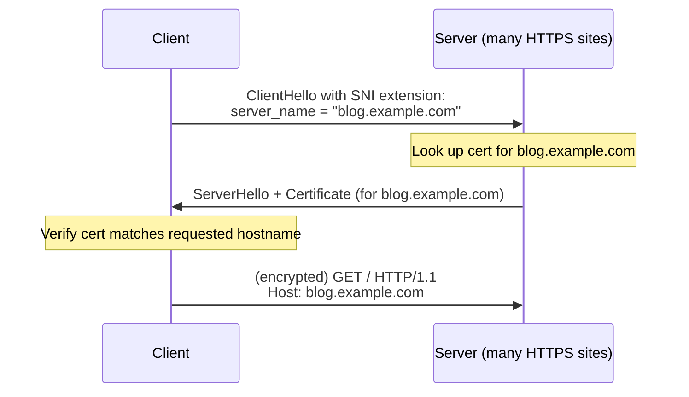

# 11.04 — SNI & SNI Injector

> [!abstract> One IP, Many Domains
> **Server Name Indication (SNI)** is a TLS extension that lets a client tell the server which hostname it's connecting to *during* the TLS handshake — before the certificate is selected. Without SNI, a server with one IP could only serve one TLS certificate, making virtual hosting of HTTPS sites impossible. SNI solved this.

---

##  The Problem SNI Solves

In the early days of HTTPS, the TLS handshake worked like this:
1. Client connects to server IP on port 443.
2. Server immediately presents its certificate.
3. Client verifies and the encrypted channel is established.
4. **Then** the HTTP request (with the `Host:` header) is sent.

The problem: at step 2, the server doesn't know which hostname the client wants. It can only present one certificate — the default for that IP. So one IP = one HTTPS site.

With HTTP (no TLS), this wasn't an issue — the `Host:` header in the HTTP request told the server which virtual host to serve. But TLS加密 happened before HTTP, so the server had to commit to a cert before knowing the hostname.

---

##  How SNI Fixes It

SNI (RFC 6066, 2006) adds a `server_name` extension to the TLS ClientHello. The client sends the desired hostname in plain text as part of the ClientHello. The server reads it, picks the matching certificate, and continues the handshake.



Now one IP can serve thousands of HTTPS sites. Let's Encrypt + SNI made free HTTPS for everyone possible.

---

##  SNI Is Visible — Privacy and Filtering Implications

The `server_name` in the ClientHello is **sent in plain text** (in TLS 1.2 and below). This means:
- **ISPs and firewalls can see which sites you're visiting** — even though the actual content is encrypted.
- **Censors can block specific HTTPS sites** by inspecting SNI.
- **Network operators can profile users** by logging SNIs.

This is the basis of **SNI-based filtering** — many corporate firewalls and country-level censors (Great Firewall of China) use it.

### SNI Injector Tools
An "SNI injector" or "SNI proxy" is a tool that:
1. Accepts incoming connections from clients.
2. Reads the SNI from the ClientHello.
3. Forwards the connection to the real upstream server (or a CDN) using the same SNI.
4. Transparently relays the TLS connection without decrypting it.

Used for:
- **CDN edge nodes** — terminate connections at the nearest PoP.
- **Bypassing censorship** — connect to a friendly SNI proxy that forwards to the real destination.
- **TLS passthrough load balancing** — route based on SNI without decrypting.

Popular tools: **HAProxy** (with `ssl_fc_sni`), **NGINX stream** (`ssl_preread`), **Squid** with peek/bump.

---

##  Encrypted SNI (ECH) — The Privacy Fix

**Encrypted Client Hello (ECH)** (formerly ESNI, then ECH) is a TLS extension that encrypts the entire ClientHello — including the SNI. It works by:
1. The server publishes a public key in DNS (via HTTPS RR record, secured by DNSSEC).
2. The client encrypts the inner ClientHello (with the real SNI) using that key.
3. The outer ClientHello has a dummy SNI (e.g., `cloudflare-ech.com`).
4. The server decrypts the inner ClientHello and proceeds with the real hostname.

ECH is still being deployed (2024) — currently available in Firefox and Chrome behind feature flags, served by Cloudflare and a few other CDNs. Once widely deployed, ECH will make SNI-based filtering obsolete.

---

##  Inspecting SNI

### With tcpdump
```bash
sudo tcpdump -i any -A 'tcp port 443' | grep -A 1 'ClientHello'
# Or use tshark:
tshark -i any -Y "tls.handshake.type == 1" -T fields -e tls.handshake.extensions_server_name
```

### With Wireshark
Filter: `tls.handshake.type == 1` (ClientHello). Look at the `server_name` extension in the decoded packet.

### In Python (with scapy)
```python
from scapy.all import sniff, TCP, TLS
def callback(pkt):
    if pkt.haslayer(TLS) and pkt[TLS].type == 22:  # handshake
        # extract SNI from extensions
        pass
sniff(filter="tcp port 443", prn=callback)
```

---

##  Operational Notes

1. **Older clients don't send SNI** (e.g., Windows XP, Java 6). The server falls back to a default cert for these. Increasingly irrelevant — these clients are rare now.
2. **Wildcard certs reduce the need for SNI** in some cases — `*.example.com` covers all subdomains with one cert. But SNI is still more flexible (different domains on one IP).
3. **SNI is essential for CDNs** — Cloudflare's edge serves millions of customer domains on a small pool of anycast IPs. Without SNI, this would be impossible.
4. **HTTP/3 mandates SNI** — there's no fallback.

---

##  See Also

- [[11 - Application Layer/11.03 SSL & TLS|11.03 TLS]] — the protocol SNI extends.
- [[11 - Application Layer/11.02 HTTP & HTTPS|11.02 HTTP/HTTPS]] — what virtual hosting enables.
- [[12 - Tunnels & Remote Access/12.00 Chapter Overview|Chapter 12 — Tunnels]] — SNI-based tools for bypassing filtering.
