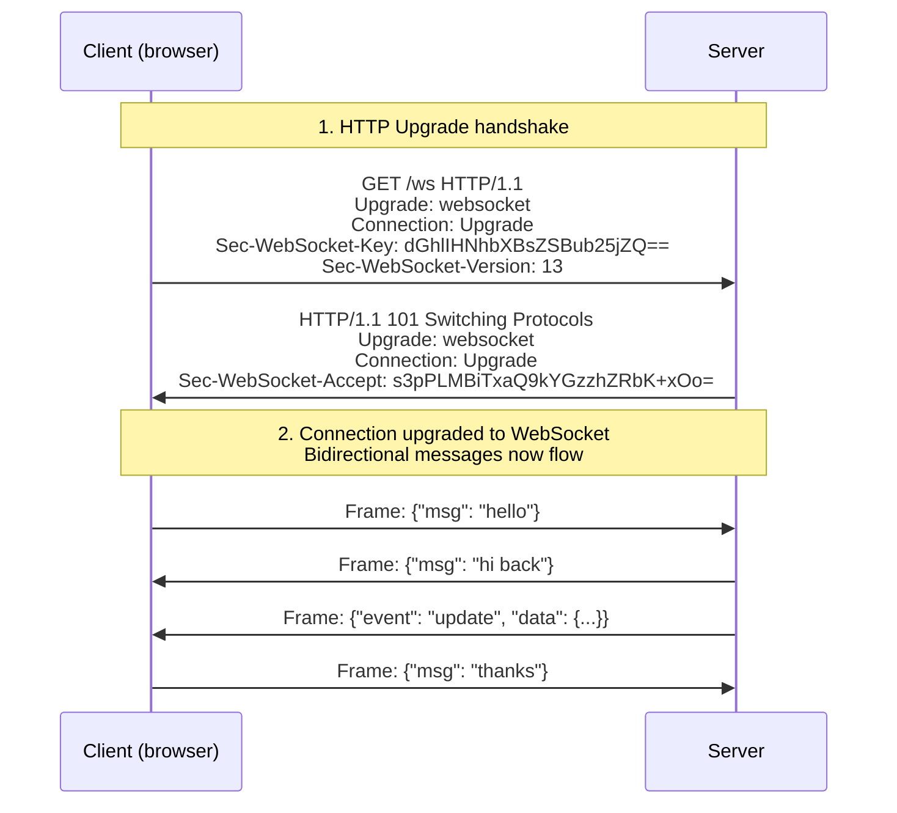

# 11.05 — WebSockets

> [!abstract> Bidirectional Over TCP
> **WebSocket** is a communication protocol (RFC 6455) that provides **full-duplex, bidirectional** communication over a single TCP connection. It starts as an HTTP request (the "upgrade handshake") and, once established, the connection stays open and either side can send messages at any time — no more request/response cycle.



---

##  Why WebSockets?

HTTP is fundamentally **request-response**: the client asks, the server answers, and the connection (logically) closes. The server cannot push data to the client without the client first asking. This is fine for document retrieval but bad for:

- **Real-time chat** — you want messages to arrive instantly, not after polling.
- **Live updates** — stock prices, sports scores, dashboards.
- **Multiplayer games** — both sides send data constantly.
- **Collaborative editing** — Google Docs-style live editing.

### Workarounds before WebSockets
- **Short polling** — client sends an HTTP request every N seconds asking "any updates?". Wasteful — most polls return nothing.
- **Long polling** — client sends a request, server holds it open until an update is available, then responds. Client immediately re-polls. Better, but each "response" requires a new HTTP request.
- **SSE (Server-Sent Events)** — server pushes events over a long-lived HTTP connection. Server-to-client only.
- **Hidden Flash/Java sockets** — historical hacks; obsolete.

WebSockets solve all of these with one clean protocol.

---

##  The Upgrade Handshake

A WebSocket connection starts as an HTTP request:

```http
GET /ws HTTP/1.1
Host: example.com
Upgrade: websocket
Connection: Upgrade
Sec-WebSocket-Key: dGhlIHNhbXBsZSBub25jZQ==
Sec-WebSocket-Version: 13
Origin: https://example.com
```

The server responds with `101 Switching Protocols`:

```http
HTTP/1.1 101 Switching Protocols
Upgrade: websocket
Connection: Upgrade
Sec-WebSocket-Accept: s3pPLMBiTxaQ9kYGzzhZRbK+xOo=
```

The `Sec-WebSocket-Accept` value is derived from the `Sec-WebSocket-Key` by appending a fixed GUID (`258EAFA5-E914-47DA-95CA-C5AB0DC85B11`), SHA-1 hashing, and base64 encoding. This proves the server understood the WebSocket protocol (defends against accidental HTTP caching of the handshake).

After the handshake, the TCP connection is "upgraded" — both sides send WebSocket frames (with their own framing protocol) instead of HTTP requests.

---

##  WebSocket Frames

After the handshake, the connection carries WebSocket frames:

| Frame type | Opcode | Use |
| :-: | :-: | :--- |
| Text | 0x1 | UTF-8 text (JSON, plain text) |
| Binary | 0x2 | Binary data (images, custom formats) |
| Close | 0x8 | Close the connection |
| Ping | 0x9 | Heartbeat check |
| Pong | 0xA | Heartbeat reply |

The frame format is binary, with a header containing the opcode, masking flag, payload length (variable encoding for short/medium/long frames), masking key (if client-to-server), and payload.

> [!info] Client-to-server frames are masked
> Every frame from client to server is XOR-masked with a 4-byte random key. This prevents middleware (caches, proxies) from misinterpreting WebSocket traffic as cacheable HTTP. Server-to-client frames are not masked.

---

##  WebSocket APIs

### Browser (JavaScript)
```javascript
const ws = new WebSocket('wss://example.com/ws');

ws.onopen = () => {
  console.log('Connected');
  ws.send(JSON.stringify({msg: 'hello'}));
};

ws.onmessage = (event) => {
  console.log('Received:', event.data);
};

ws.onclose = () => {
  console.log('Disconnected');
};
```

### Server (Node.js with `ws`)
```javascript
const { WebSocketServer } = require('ws');
const wss = new WebSocketServer({ port: 8080 });

wss.on('connection', (ws) => {
  ws.on('message', (data) => {
    console.log('Received:', data.toString());
    ws.send(JSON.stringify({reply: 'thanks'}));
  });

  ws.on('close', () => {
    console.log('Client disconnected');
  });
});
```

### Server (Python with `websockets`)
```python
import asyncio
import websockets

async def handler(websocket):
    async for message in websocket:
        print(f"Received: {message}")
        await websocket.send(f"Echo: {message}")

async def main():
    async with websockets.serve(handler, "localhost", 8765):
        await asyncio.Future()  # run forever

asyncio.run(main())
```

---

##  WebSockets and Security

- **Same-Origin Policy doesn't apply by default** — WebSockets can connect cross-origin. The server should validate the `Origin` header during the handshake.
- **Authentication** — send cookies or tokens via query string (`wss://example.com/ws?token=...`) or via a header (using `Sec-WebSocket-Protocol` hack or browser-specific APIs).
- **WSS (WebSocket Secure)** — WebSocket over TLS. Always use WSS in production; WS is unencrypted.
- **Reverse proxy support** — NGINX, HAProxy, and others can proxy WebSockets; you need to set `proxy_http_version 1.1` and `Upgrade` / `Connection` headers.

---

##  WebSockets vs Alternatives

| Protocol | Direction | Transport | Use |
| :--- | :--- | :--- | :--- |
| **HTTP polling** | Req-resp | TCP | Simple, low-frequency updates |
| **SSE (Server-Sent Events)** | Server → Client | HTTP | One-way push (notifications, live feeds) |
| **WebSockets** | Bidirectional | TCP | Real-time chat, games, collaboration |
| **WebRTC data channels** | Bidirectional | UDP (SCTP over DTLS) | P2P, low-latency, browser-to-browser |
| **HTTP/2 server push** | Server → Client | TCP | Preemptive resource pushing (deprecated in HTTP/3) |
| **HTTP streaming (chunked)** | Server → Client | TCP | Long-lived response streams |

WebSockets remain the standard choice for general-purpose bidirectional real-time communication in the browser.

---

##  See Also

- [[11 - Application Layer/11.02 HTTP & HTTPS|11.02 HTTP/HTTPS]] — the protocol WebSockets upgrade from.
- [[11 - Application Layer/11.06 XHR|11.06 XHR]] — the legacy request-response alternative.
- [[10 - Transport Layer/10.06 TCP|10.06 TCP]] — the transport WebSockets ride on.
