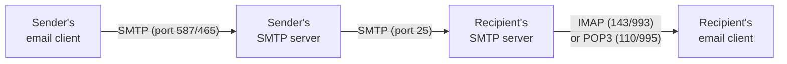
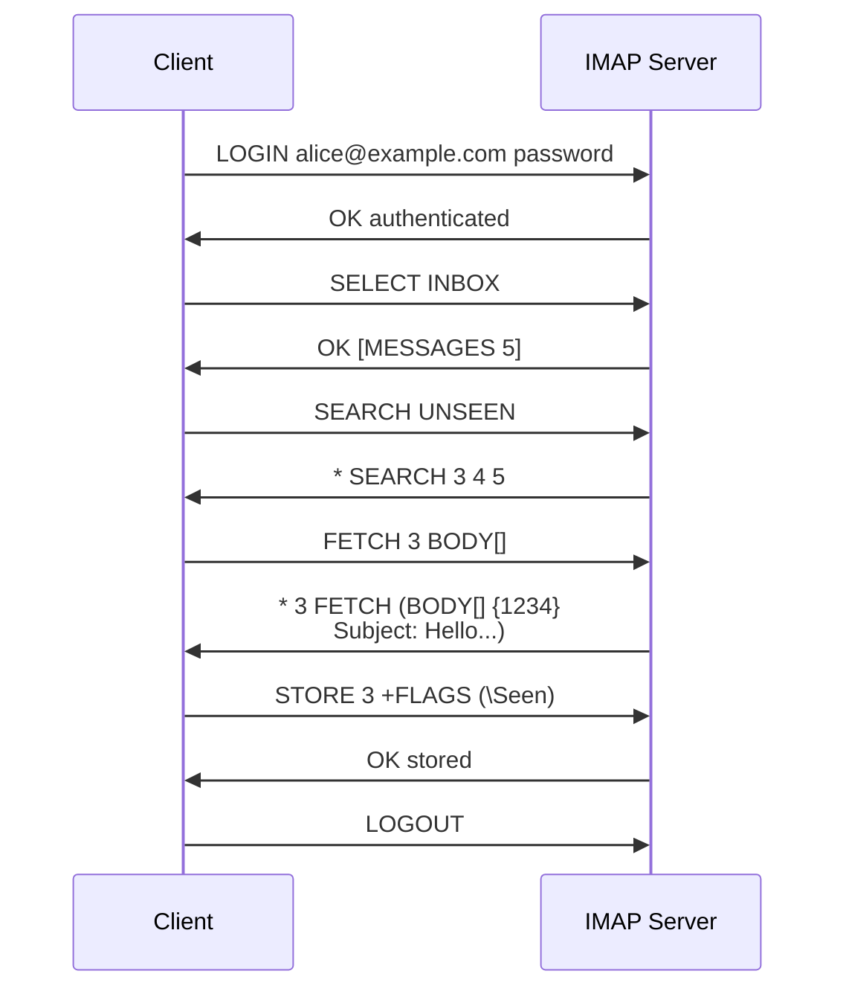

# 11.07 — Email Protocols

> [!abstract> Three Protocols, One Mail System
> Email uses three distinct protocols: **SMTP** for sending (and server-to-server relay), **POP3** for downloading mail to a client, and **IMAP** for accessing mail stored on the server. Modern email also uses **MAPI** (Exchange) and **JMAP** (newer, JSON-based), but SMTP/POP3/IMAP remain the universal baseline.



---

##  SMTP (Simple Mail Transfer Protocol)

| Property | Value |
| :--- | :--- |
| Port | 25 (server-to-server), 587 (submission, encrypted), 465 (SMTPS, deprecated implicit TLS) |
| Transport | TCP |
| Style | Command-response (HELO/EHLO, MAIL FROM, RCPT TO, DATA) |

SMTP is used for **sending** mail — from client to server (submission) and from server to server (relay). It's a push protocol: the sender initiates.

### Submission vs Relay
- **Submission (port 587):** mail client → user's SMTP server. Requires authentication (username/password or OAuth). Often uses STARTTLS to upgrade to TLS.
- **Relay (port 25):** SMTP server → recipient's SMTP server. No authentication (the servers trust each other by IP), but modern servers require TLS and verify the sender isn't a spammer via SPF/DKIM/DMARC.

### SMTP Conversation Example
```
S: 220 mail.example.com ESMTP
C: EHLO client.example.com
S: 250-mail.example.com
S: 250-STARTTLS
S: 250-AUTH PLAIN LOGIN
S: 250 SIZE 10485760
C: STARTTLS
S: 220 Ready to start TLS
(TLS handshake)
C: AUTH PLAIN <base64>
S: 235 Authentication succeeded
C: MAIL FROM:<alice@example.com>
S: 250 OK
C: RCPT TO:<bob@example.org>
S: 250 OK
C: DATA
S: 354 Start mail input
C: Subject: Hello
C: 
C: This is the message body.
C: .
S: 250 OK queued as ABC123
C: QUIT
S: 221 Bye
```

### Email Authentication
- **SPF (Sender Policy Framework):** DNS TXT record listing which IPs are allowed to send mail for the domain.
- **DKIM (DomainKeys Identified Mail):** cryptographic signature on the message body, verified via DNS TXT public key.
- **DMARC:** policy for what to do if SPF/DKIM fail (none, quarantine, reject).

Without these, your mail will likely be marked as spam.

---

##  POP3 (Post Office Protocol v3)

| Property | Value |
| :--- | :--- |
| Port | 110 (plaintext), 995 (POP3S over TLS) |
| Transport | TCP |
| Model | Download-and-delete (by default) |

POP3 is the simpler of the two retrieval protocols. The classic workflow:
1. Client connects and authenticates.
2. Client downloads all new messages.
3. Client deletes them from the server (by default).
4. Client disconnects.

POP3 is for users who access mail from a single device and want a local copy. It doesn't support multiple folders or server-side search — just an inbox.

Modern POP3 clients usually have a "leave mail on server" option, but the protocol itself is still primitive.

---

##  IMAP (Internet Message Access Protocol)

| Property | Value |
| :--- | :--- |
| Port | 143 (plaintext), 993 (IMAPS over TLS) |
| Transport | TCP |
| Model | Server-side mailbox access |

IMAP is the modern standard. Mail stays on the server; the client views/manipulates it remotely:
- Multiple folders (Inbox, Sent, Drafts, custom).
- Server-side search (no need to download to search).
- Multiple devices see the same state (read a mail on phone → it's marked read on laptop).
- Partial fetch (download headers first, body on demand).
- Flags (read, replied, flagged, deleted).



---

##  POP3 vs IMAP

| Feature | POP3 | IMAP |
| :--- | :-: | :-: |
| Mail storage | Client (download) | Server |
| Multi-device | Poor (each device downloads separately) | Excellent (synced state) |
| Folders | Inbox only | Multiple |
| Server-side search | No | Yes |
| Offline access | Yes (mail is local) | Limited (with cache) |
| Use case | Single-device, slow connection | Modern multi-device |

Use IMAP unless you have a specific reason not to.

---

##  Email Security

- **TLS** — STARTTLS on ports 25/587/143, or implicit TLS on 465/993/995. Protects the connection but not the metadata (sender, recipient, subject are visible at each hop).
- **PGP / S/MIME** — end-to-end encryption of the message body. Rarely used due to key management complexity.
- **Anti-spam** — SPF, DKIM, DMARC, plus heuristics (Bayesian filters, RBLs).
- **Confidentiality at rest** — server-side encryption of stored mail.

---

##  See Also

- [[11 - Application Layer/11.01 DNS & Domain Resolution|11.01 DNS]] — MX records point to mail servers.
- [[10 - Transport Layer/10.06 TCP|10.06 TCP]] — what all email protocols ride on.
