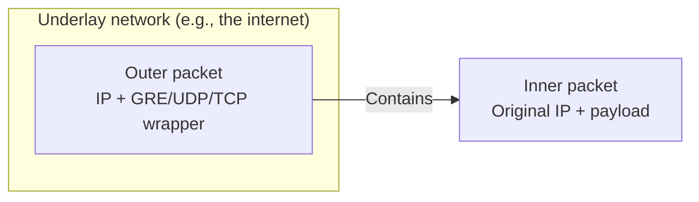
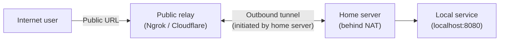

# 12.01 — Tunneling Fundamentals

> [!abstract> Wrapping Packets in Packets
> A **tunnel** encapsulates one protocol's packets inside another protocol's packets, allowing the inner protocol to traverse a network that wouldn't normally carry it. Tunnels power VPNs, IPv6-over-IPv4 transition, mobile IP, and developer tools like Ngrok.

---

##  Encapsulation — The Core Mechanism

A tunnel takes an inner packet (the payload) and wraps it in an outer packet (the carrier). The outer packet travels across the underlay network; at the tunnel endpoint, the outer wrapper is stripped and the inner packet is delivered.

Common encapsulations:
| Tunnel Type | Outer wrapper | Typical use |
| :--- | :--- | :--- |
| **GRE** | IP protocol 47 | Site-to-site VPNs, IPv6-over-IPv4 |
| **IPsec ESP** | IP protocol 50 | Encrypted VPNs |
| **WireGuard** | UDP (custom port) | Modern encrypted VPNs |
| **OpenVPN** | UDP or TCP (custom port) | TLS-based VPNs |
| **VXLAN** | UDP 4789 | Datacenter overlay networks |
| **GTP** | UDP 2152 | Mobile carrier tunnels |
| **6in4** | IP protocol 41 | IPv6 over IPv4 |
| **TLS/SSH** | TCP 443/22 | Application-layer tunnels (Ngrok, Cloudflare, SSH port forwarding) |

---

##  Overlay vs Underlay

- **Underlay** — the physical network that carries the outer packets. Usually IP (the internet, your WAN).
- **Overlay** — the virtual network created by the tunnel. The inner packets think they're on a direct link, even though they're physically traversing the underlay.

Examples:
- **VXLAN** — overlay network for datacenter multi-tenancy. Underlay is the physical L2/L3 fabric.
- **Tailscale** — overlay mesh VPN built on WireGuard. Underlay is the internet.
- **Tor** — overlay anonymity network. Underlay is the internet.

Overlays are powerful because they decouple the virtual topology from the physical one. You can build a flat /16 overlay across a globally distributed underlay.

---

##  Why Tunnels Exist

1. **Bypass NAT** — most home networks sit behind NAT and can't accept inbound connections. An outbound tunnel to a public relay solves this (Ngrok, Cloudflare Tunnels).
2. **Encrypt unencrypted protocols** — wrap Telnet or HTTP in SSH/TLS to encrypt it across untrusted networks.
3. **Cross protocol boundaries** — IPv6-in-IPv4 tunnels let IPv6 traffic cross IPv4-only networks (and vice versa).
4. **Multi-tenancy** — VXLAN lets you have 16 million virtual LANs on a shared physical fabric (vs 4094 for 802.1Q).
5. **Anonymity** — Tor wraps traffic in multiple layers of encryption across multiple relays.
6. **Policy routing** — VPN tunnels let you choose which exit point your traffic uses (e.g., bypass geo-restrictions).

---

##  Common Tunnel Patterns

### Reverse Tunnel (Outbound-Initiated)
Used by Ngrok, Cloudflare Tunnels, SSH reverse port forwarding. The machine behind NAT initiates an outbound connection to a public relay. The relay accepts inbound connections from the internet and forwards them back through the established outbound tunnel.

This is the magic that lets you expose a local dev server without configuring port forwarding on your router.

### Forward Tunnel (Inbound-Initiated)
Used by traditional IPsec VPNs. The VPN gateway accepts inbound connections from authenticated clients. Requires the gateway to be publicly reachable (port forwarding, public IP, etc.).

### Site-to-Site Tunnel
Two gateways establish a persistent tunnel between two networks. Hosts on either side communicate transparently — they don't know their traffic is being tunneled. Used for branch-to-HQ connectivity.

---

##  Security Considerations

1. **Tunnels bypass perimeter security.** A tunnel from an internal host to an external relay effectively punches a hole through your firewall. Corporate networks often block known tunneling tools for this reason.
2. **The relay can see traffic.** Unless you do end-to-end encryption (TLS to the actual backend), the relay sees everything. Choose relays you trust.
3. **Authentication matters.** Anyone who can connect to the relay's public endpoint can reach your local service. Use authentication (Ngrok's HTTP basic auth, Cloudflare Access).
4. **Audit logs are essential.** Tunneling tools should log every connection. Review them.

---

##  See Also

- [[09 - NAT & Perimeter Security/09.08 VPN Fundamentals|09.08 VPN Fundamentals]] — encrypted tunnels.
- [[12 - Tunnels & Remote Access/12.02 Ngrok|12.02 Ngrok]] — developer-focused reverse tunnels.
- [[12 - Tunnels & Remote Access/12.03 Cloudflare Tunnels|12.03 Cloudflare Tunnels]] — enterprise-grade tunnels.
