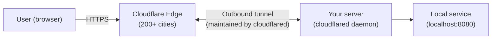
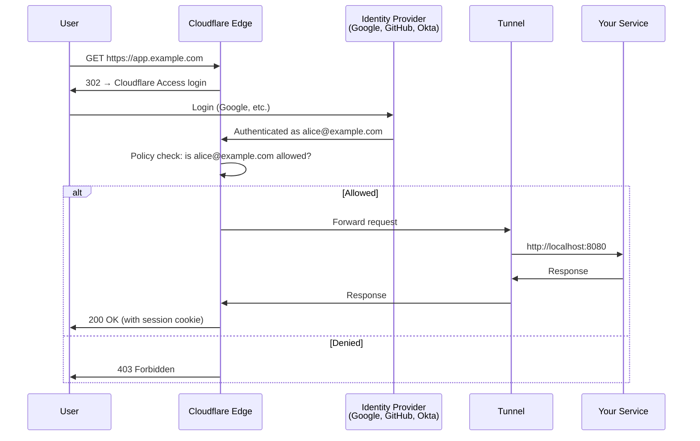

# 12.03 — Cloudflare Tunnels

> [!abstract> Production-Grade Tunnels with Zero-Trust Access
> **Cloudflare Tunnels** (formerly Argo Tunnels) are Cloudflare's reverse-tunnel product. A lightweight daemon (`cloudflared`) on your server establishes an outbound connection to Cloudflare's edge; Cloudflare routes incoming requests for your domain through that tunnel. Combined with Cloudflare Access, you get a zero-trust access layer for free — no VPN needed.



---

##  Installation and Setup

### Install cloudflared

```bash
# macOS
brew install cloudflared

# Linux (Debian/Ubuntu)
curl -L https://github.com/cloudflare/cloudflared/releases/latest/download/cloudflared-linux-amd64.deb -o cloudflared.deb
sudo dpkg -i cloudflared.deb

# Or use Docker
docker run -it --rm cloudflare/cloudflared:latest --version
```

### Authenticate with your Cloudflare account
```bash
cloudflared tunnel login
```
This opens a browser to authorize `cloudflared` to manage tunnels for one of your Cloudflare zones.

### Create a tunnel
```bash
cloudflared tunnel create my-tunnel
```
This generates a tunnel UUID and a credentials JSON file in `~/.cloudflared/`.

### Configure the tunnel
Create `~/.cloudflared/config.yml`:
```yaml
tunnel: <UUID-from-create>
credentials-file: /home/user/.cloudflared/<UUID>.json

ingress:
  - hostname: app.example.com
    service: http://localhost:8080
  - hostname: api.example.com
    service: http://localhost:3000
  - service: http_status:404
```

### Add DNS records automatically
```bash
cloudflared tunnel route dns my-tunnel app.example.com
cloudflared tunnel route dns my-tunnel api.example.com
```
This creates CNAME records in your Cloudflare DNS pointing `app.example.com` and `api.example.com` to the tunnel.

### Run the tunnel
```bash
cloudflared tunnel run my-tunnel
```

Now `https://app.example.com` reaches your local service on port 8080.

### Install as a service (for persistence)
```bash
sudo cloudflared service install
```
This installs `cloudflared` as a systemd service that starts on boot.

---

##  Cloudflare Tunnels vs Ngrok

| Feature | Ngrok | Cloudflare Tunnels |
| :--- | :--- | :--- |
| Free tier | Yes (random subdomain) | Yes (your own domain) |
| Custom domain | Paid ($25/mo) | Free (with a Cloudflare-managed domain) |
| TLS termination | Ngrok's relay | Cloudflare's edge (200+ cities, anycast) |
| DDoS protection | Limited | Industry-leading (Cloudflare's core feature) |
| WAF | Add-on | Included |
| Zero-trust access | OAuth (paid) | Cloudflare Access (free for up to 50 users) |
| Geographic distribution | Single region (configurable) | Global anycast automatically |
| Setup complexity | One command | Multiple steps; config file |
| Use case | Dev demos, webhooks | Production services, home lab, zero-trust |

For **quick developer demos**: Ngrok is faster to set up.
For **production or stable home lab access**: Cloudflare Tunnels are more powerful and free for personal use.

---

##  Cloudflare Access — Zero-Trust Layer

Cloudflare Access (part of Cloudflare Zero Trust, free for up to 50 users) adds an authentication layer in front of your tunnel. Instead of exposing your service publicly, every visitor must authenticate first.



Configure policies:
- "Allow anyone with `@example.com` email"
- "Allow specific GitHub team members"
- "Allow only from specific IPs"
- "Require hardware MFA"

Access works with: Google, GitHub, GitLab, Azure AD, Okta, OneLogin, SAML, OTP via email, and mTLS.

---

##  Use Cases

1. **Home lab exposure** — expose Home Assistant, Pi-hole, Nextcloud, Plex without opening router ports. Free with your own domain.
2. **Production webhooks** — Stripe, GitHub, Slack webhooks reaching a dev/staging environment behind NAT.
3. **Zero-trust access to internal apps** — SSH, RDP, internal admin panels behind Cloudflare Access instead of a VPN.
4. **Replacing a VPN** — for web-based apps, Cloudflare Tunnels + Access is simpler and safer than a traditional VPN.
5. **Graceful migration** — run your service on a new host, point the tunnel there; DNS updates are instant.

---

##  Considerations

1. **All traffic goes through Cloudflare.** They terminate TLS, see the (decrypted) traffic, and apply policies. This is the trade-off for the free tier.
2. **Cloudflare's ToS restrict certain use cases.** Streaming media, large file hosting, and some other use cases may violate their terms on the free tier.
3. **Latency depends on Cloudflare's nearest PoP.** Usually excellent, but if your nearest PoP is far, latency suffers.
4. **Tunnel daemon must stay running.** If `cloudflared` crashes, your service is offline. Use systemd / Docker restart policies.
5. **WebSocket and HTTP/2 work** but check the docs for current limitations.

---

##  See Also

- [[12 - Tunnels & Remote Access/12.01 Tunneling Fundamentals|12.01 Tunneling Fundamentals]]
- [[12 - Tunnels & Remote Access/12.02 Ngrok|12.02 Ngrok]] — the developer alternative.
- [[12 - Tunnels & Remote Access/12.04 Comparison Matrix|12.04 Comparison Matrix]] — full comparison.
- [[09 - NAT & Perimeter Security/09.07 Proxy Servers|09.07 Proxies]] — Cloudflare is essentially a global reverse proxy.
