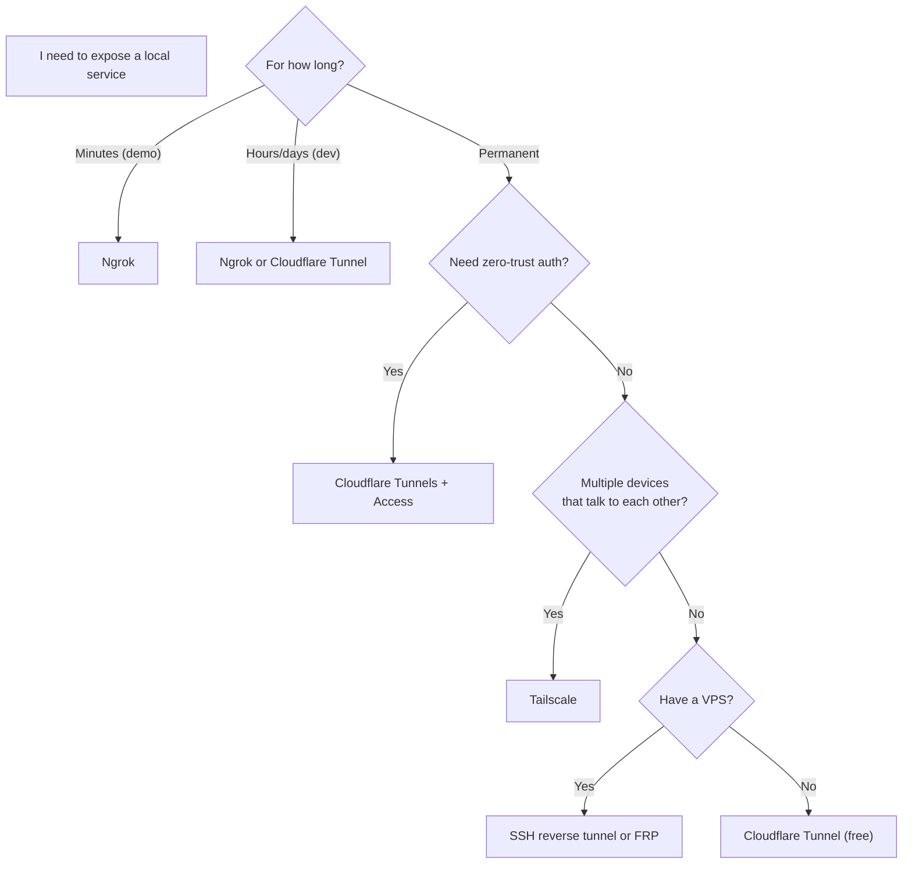

# 12.04 — Comparison Matrix

> [!abstract> Pick the Right Tool
> Five tunneling tools, five different sweet spots. This matrix helps you pick the right one for your scenario.

---

##  Tool Comparison

| Tool | Setup | Cost | Best For | TLS Termination | Zero-Trust Layer |
| :--- | :--- | :--- | :--- | :--- | :--- |
| **Ngrok** | 1 command | Free → $25/mo | Quick dev demos, webhook testing | Ngrok relay | OAuth (paid) |
| **Cloudflare Tunnels** | 5-10 min | Free for personal | Production home lab, zero-trust | Cloudflare edge | Cloudflare Access (free ≤50 users) |
| **SSH reverse tunnel** | 1 command | Free (if you have a VPS) | Ad-hoc TCP tunnel to a known host | None (use SSH's TLS) | SSH keys + bastion |
| **Tailscale** | 2 min | Free ≤100 devices | Permanent mesh VPN between your devices | End-to-end | ACLs per node |
| **FRP (Fast Reverse Proxy)** | Self-hosted | Free | Self-hosted alternative to Ngrok/Cloudflare | Self-managed | Self-managed |

---

##  Decision Tree



---

##  Each Tool in 30 Seconds

### Ngrok
- **Sweet spot:** "I need a public HTTPS URL for my local dev server *right now*."
- **Pros:** Zero config, instant URL, great for sharing with colleagues.
- **Cons:** Random URL changes on restart (free tier); relay sees all traffic; limited free tier.

### Cloudflare Tunnels
- **Sweet spot:** "I want a permanent URL pointing to my home lab service, with optional auth."
- **Pros:** Free with your own domain, global anycast, DDoS protection, zero-trust auth option.
- **Cons:** More setup than Ngrok; all traffic goes through Cloudflare.

### SSH Reverse Tunnel
- **Sweet spot:** "I have a VPS and want to expose a port from my laptop to it."
- **Pros:** Free, no third-party service, works with any SSH-accessible host.
- **Cons:** Manual setup, no nice URL, can be flaky on connection drops.
- **Example:** `ssh -R 8080:localhost:8080 user@vps.example.com` exposes your local 8080 on the VPS's port 8080.

### Tailscale
- **Sweet spot:** "I want all my devices (laptop, phone, home server, VPS) to be on one private network."
- **Pros:** Mesh VPN, zero config, ACLs, MagicDNS, free for personal use.
- **Cons:** Not for public exposure (it's a private network); relay servers see connection metadata.
- **Based on:** WireGuard.

### FRP (Fast Reverse Proxy)
- **Sweet spot:** "I want a self-hosted Ngrok."
- **Pros:** Free, open-source, full control.
- **Cons:** You run the relay yourself; no built-in DDoS protection or global anycast.

---

##  Security Checklist

Whichever tool you use, before exposing a local service:

1. **Authenticate the public endpoint.** Add HTTP basic auth, OAuth, or Cloudflare Access.
2. **Use HTTPS.** Always. All the listed tools do this by default.
3. **Don't expose sensitive services without auth.** A database (MySQL, Postgres, Redis) exposed publicly even briefly can be found and abused within minutes.
4. **Audit logs.** Know who's connecting.
5. **Rate-limit.** Cloudflare and Ngrok both offer this; use it.
6. **Update the tunnel client.** Ngrok and `cloudflared` regularly ship security patches.
7. **Separate dev vs prod.** Don't reuse the same tunnel for a public demo and your dev environment.

---

##  Quick Reference Commands

### Ngrok — expose local HTTP
```bash
ngrok http 8080
```

### Cloudflare Tunnel — quick temporary tunnel (no config)
```bash
cloudflared tunnel --url http://localhost:8080
```

### SSH reverse tunnel
```bash
# On your local machine:
ssh -R 8080:localhost:8080 user@your-vps.example.com
# Now VPS:8080 forwards to your localhost:8080
```

### Tailscale — install and connect
```bash
curl -fsSL https://tailscale.com/install.sh | sh
sudo tailscale up
```

### FRP — quick start
```bash
# On your public VPS (frps):
./frps -c frps.ini
# On your local machine (frpc):
./frpc -c frpc.ini
```

---

##  See Also

- [[12 - Tunnels & Remote Access/12.01 Tunneling Fundamentals|12.01 Tunneling Fundamentals]]
- [[12 - Tunnels & Remote Access/12.02 Ngrok|12.02 Ngrok]]
- [[12 - Tunnels & Remote Access/12.03 Cloudflare Tunnels|12.03 Cloudflare Tunnels]]
- [[09 - NAT & Perimeter Security/09.08 VPN Fundamentals|09.08 VPN Fundamentals]]
