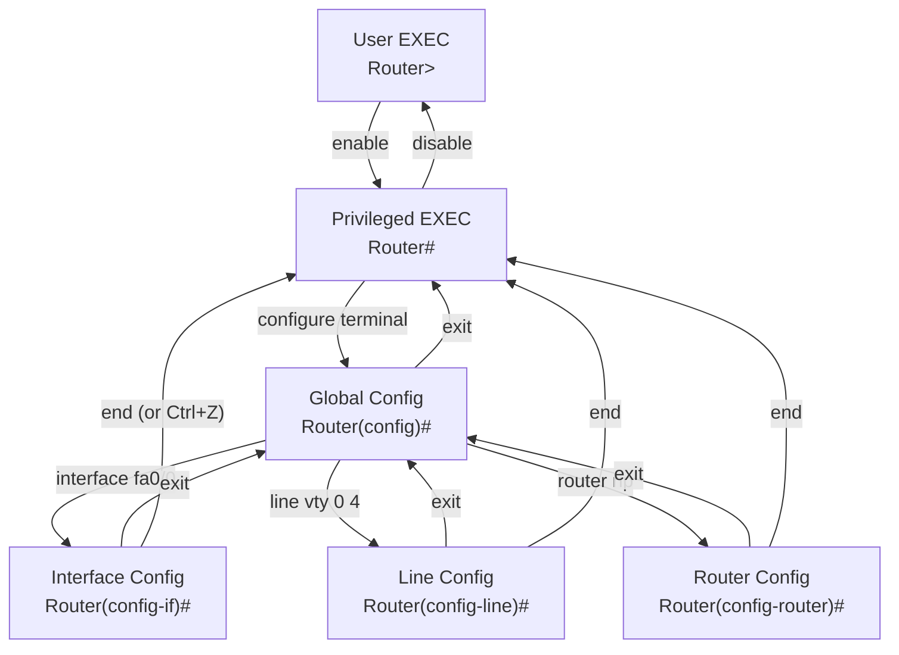

# 13.01 — CLI Modes & Prompts

> [!abstract> Hierarchical Access
> Cisco IOS uses a hierarchical command-line structure. Each mode provides access to a specific set of commands. You move up the hierarchy with commands like `enable` and `configure terminal`, and down with `exit` or `end`. The prompt tells you which mode you're in.



---

##  Modes at a Glance

| Mode | Prompt | Enter via | Exit via | Purpose |
| :--- | :--- | :--- | :--- | :--- |
| **User EXEC** | `Router>` | (default on login) | `exit` / `logout` | Limited view commands |
| **Privileged EXEC** | `Router#` | `enable` | `disable` | All show/debug/test commands |
| **Global Config** | `Router(config)#` | `configure terminal` | `exit` / `end` | Modify device-wide config |
| **Interface Config** | `Router(config-if)#` | `interface fa0/0` | `exit` / `end` | Modify one interface |
| **Subinterface** | `Router(config-subif)#` | `interface fa0/0.10` | `exit` / `end` | VLAN subinterface config |
| **Line Config** | `Router(config-line)#` | `line vty 0 4` / `line con 0` | `exit` / `end` | Console/VTY/AUX config |
| **Router Config** | `Router(config-router)#` | `router rip` / `router ospf 1` | `exit` / `end` | Routing protocol config |
| **DHCP Pool** | `Router(dhcp-config)#` | `ip dhcp pool NAME` | `exit` / `end` | DHCP server pool config |
| **Access List** | `Router(config-std-nacl)#` | `ip access-list standard NAME` | `exit` / `end` | Named ACL config |

---

##  Mode Behaviors

### User EXEC (`Router>`)
- Limited set of commands: `ping`, `traceroute`, `show` (subset), `enable`, `exit`.
- Cannot modify configuration.
- Default mode after login (console, SSH, Telnet).

### Privileged EXEC (`Router#`)
- All `show` and `debug` commands.
- Can save config, reload the device, view running configs.
- **Equivalent to root on Unix.** Protect with a password.

### Global Config (`Router(config)#`)
- Changes apply device-wide: hostname, passwords, static routes, routing protocol enablement.
- From here, you enter submodes for specific resources (interfaces, lines, routing protocols).

### Interface Config (`Router(config-if)#`)
- Configures one interface: IP address, mask, enable/disable, description, speed/duplex, switchport settings.
- Changes apply only to that interface.

### Line Config (`Router(config-line)#`)
- Configures one console/VTY/AUX line: login method, password, timeout, access class.

### Router Config (`Router(config-router)#`)
- Configures one routing protocol instance: networks, version, passive interfaces, redistribution.

---

##  Useful Mode Navigation Shortcuts

| Shortcut | Effect |
| :--- | :--- |
| `exit` | Go back one level |
| `end` (or `Ctrl+Z`) | Go all the way back to Privileged EXEC |
| `Ctrl+C` | Cancel current input (don't execute) |
| `Ctrl+P` / `↑` | Previous command in history |
| `Ctrl+N` / `↓` | Next command in history |
| `Tab` | Auto-complete the current word |
| `?` | Show available commands (or arguments to current command) |
| `do <cmd>` | Run an EXEC command from config mode (e.g., `do show run`) |

### Examples
```cisco
Router> enable
Router# configure terminal
Router(config)# hostname R1
R1(config)# interface fa0/0
R1(config-if)# ip address 192.168.1.1 255.255.255.0
R1(config-if)# do show ip interface brief
R1(config-if)# end
R1#
```

---

##  Privilege Levels

Cisco IOS has 16 privilege levels (0-15):
- **Level 0** — almost no commands (just `disable`, `enable`, `exit`, `help`, `logout`).
- **Level 1** — User EXEC (default for non-privileged users).
- **Level 15** — Privileged EXEC (full access).

Levels 2-14 are user-defined — you can place specific commands at specific levels for fine-grained access control. Rarely used in practice; most shops just use 1 and 15.

```cisco
! Give a user access to reload without full enable
R1(config)# privilege exec level 5 reload
R1(config)# enable secret level 5 Level5Password
```

---

##  See Also

- [[13 - Cisco IOS CLI/13.02 Essential Configuration|13.02 Essential Configuration]]
- [[13 - Cisco IOS CLI/13.03 Diagnostics & Verification|13.03 Diagnostics]]
- [[13 - Cisco IOS CLI/13.04 RIP & OSPF Configuration|13.04 RIP & OSPF]]
