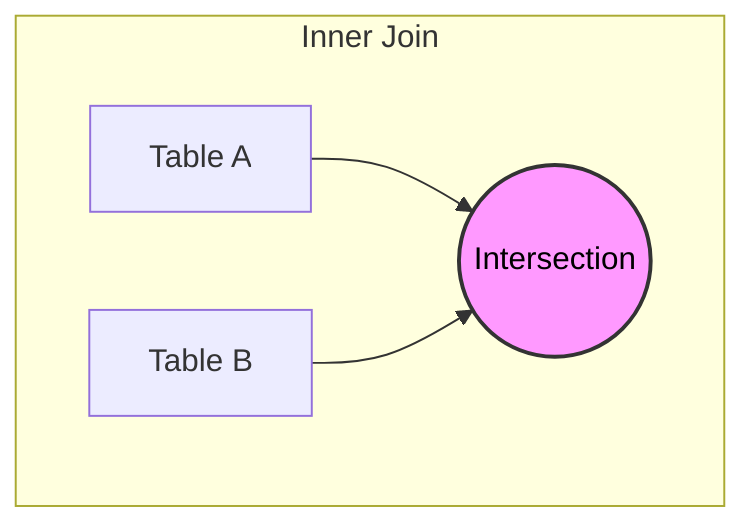

# Inner Join

An `INNER JOIN` is the most fundamental join operation in SQL. It returns **only the rows for which there is a match in both tables** based on the specified join condition. Any row in either table that does not have a corresponding match in the other table is excluded from the result set. This behavior makes the inner join the most restrictive of all join types, producing a result that contains only the intersection of the two tables.

> [!TIP] The "Match or Die" Rule
> If a row in Table A does not have a corresponding match in Table B based on the `ON` condition, that row is **removed** from the result set.

Understanding inner joins is essential because they are the default join type in SQL and the most commonly used. When you write `JOIN` without specifying a type, the database treats it as an `INNER JOIN`. The concept is straightforward, but the implications for which data is included or excluded require careful consideration, especially when foreign key columns can contain `NULL` values.

## Inner Join Syntax

The basic syntax for an inner join follows a consistent pattern. The `SELECT` clause lists the columns to include in the result. The `FROM` clause specifies the first (left) table. The `INNER JOIN` keyword introduces the second (right) table. The `ON` clause defines the condition that determines how rows from the two tables are matched.

```sql
SELECT left_table.column_name, right_table.column_name
FROM left_table
INNER JOIN right_table
    ON left_table.foreign_key = right_table.primary_key;
```

The `ON` clause typically uses an equality comparison between a foreign key column in one table and the primary key column it references in the other table. When both tables have columns with the same name (such as `customer_id`), you must qualify the column name with the table name using dot notation to avoid ambiguity.

> [!NOTE] The `INNER` keyword is optional
> Writing just `JOIN` implies an `INNER JOIN`. Both forms are equivalent; `INNER` is included for explicitness.

## Order of Tables

A common misconception is that the order of tables matters in an inner join. **Logically, the order does NOT matter.** The following two queries produce the exact same result:

1. `FROM Student INNER JOIN Department`
2. `FROM Department INNER JOIN Student`

The database optimizer may change the execution order internally for performance, but the data returned to you is identical. This freedom is useful when you want to lead with the table that is most natural for the reader to follow.

## How Inner Join Matches Rows

When the database engine processes an inner join, it evaluates the join condition for every combination of rows from the two tables (though modern optimizers use indexes to avoid full cross-products). For each pair of rows where the condition evaluates to true, the engine combines the columns from both rows into a single result row. Rows from either table that never satisfy the condition with any row from the other table are discarded entirely.

### Example 1: The "Filtering" Effect (Student / Department)

Imagine a scenario with Students and Departments.

**Table: Student**

| SID | Name | DeptID |
| :--- | :--- | :--- |
| 1 | Sara | 10 |
| 2 | Amin | 20 |
| 3 | **Leila** | **99** |

**Table: Department**

| DeptID | DName |
| :--- | :--- |
| 10 | CS |
| 20 | Math |

**Query:**

```sql
SELECT S.Name, D.DName
FROM Student S
INNER JOIN Department D
    ON S.DeptID = D.DeptID;
```

**Result:**

| Name | DName |
| :--- | :--- |
| Sara | CS |
| Amin | Math |

**Analysis:**

- **Sara** matches Dept 10. (Kept)
- **Amin** matches Dept 20. (Kept)
- **Leila** has DeptID 99. Dept 99 does **not exist** in the Department table. Therefore, **Leila disappears**.

### Example 2: Customer / Card

Consider a bank database with a `customer` table and a `card` table. The `card` table has a `customer_id` foreign key that references the `customer` table. An inner join between these tables will produce results only for customers who have at least one card and cards that are assigned to an existing customer.

```
Customer Table                    Card Table
+-------------+-----------+       +--------+-------------+-----------+
| customer_id | name      |       | card_id| customer_id | max_amount|
+-------------+-----------+       +--------+-------------+-----------+
| 1           | Caleb     |       | 101    | 1           | 5000      |
| 2           | Jimmy     |       | 102    | 1           | 3000      |
| 3           | Sarah     |       | 103    | 2           | 10000     |
+-------------+-----------+       +--------+-------------+-----------+

Inner Join Result:
+-----------+-----------+
| name      | max_amount|
+-----------+-----------+
| Caleb     | 5000      |
| Caleb     | 3000      |
| Jimmy     | 10000     |
+-----------+-----------+
```

Sarah is excluded from the result because she has no card. If there were a card with a `customer_id` that does not exist in the customer table, that card would also be excluded.

## What Happens When No Match Exists

The defining characteristic of an inner join is that unmatched rows vanish from the result. This is both its strength and its limitation. When you need only the data where a relationship exists, the inner join is the correct tool. When you need to preserve all rows from one table regardless of whether a match exists, you must use an outer join instead (see [[05 - Outer Joins Explained]]).

The exclusion of unmatched rows can have surprising consequences if you are not aware of your data. If a significant portion of rows in one table have `NULL` values in the foreign key column, those rows will all be dropped from the inner join result. Always consider the cardinality and nullability of your join columns before choosing a join type.

## Inner Join with WHERE Clause

You can add a `WHERE` clause after the `ON` condition to further filter the joined result. The `ON` clause determines which rows match between the tables, while the `WHERE` clause filters the combined result set. This distinction is important for understanding query logic and performance.

```sql
SELECT customer.first_name, customer.last_name, card.max_amount
FROM customer
INNER JOIN card
    ON customer.customer_id = card.customer_id
WHERE card.max_amount > 5000;
```

This query first joins the customer and card tables on matching customer IDs, then filters the result to include only cards with a maximum amount greater than 5,000. The `WHERE` clause operates on the joined result, not on the individual tables before the join.

## Inner Join with ORDER BY

The `ORDER BY` clause can be applied to the result of an inner join to sort the output by one or more columns from either table. This is useful for presenting the joined data in a meaningful sequence.

```sql
SELECT customer.first_name, customer.last_name, card.max_amount
FROM customer
INNER JOIN card
    ON customer.customer_id = card.customer_id
ORDER BY customer.last_name ASC, card.max_amount DESC;
```

This query returns all customer-card pairs sorted alphabetically by the customer's last name, with cards for the same customer ordered by maximum amount from highest to lowest.

## Multiple Column Selection from Joined Tables

When writing joins, you will typically select columns from both tables. The column names must be qualified with the table name whenever the same column name appears in both tables. Even when column names are unique, qualifying them is considered a best practice for readability and maintainability.

```sql
SELECT
    customer.first_name,
    customer.last_name,
    card.card_id,
    card.max_amount,
    card.amount_paid
FROM customer
INNER JOIN card
    ON customer.customer_id = card.customer_id;
```

This query selects the customer's name from the customer table and the card details from the card table. The `customer_id` column, which is used for the join, does not need to appear in the `SELECT` list unless you want it in the output.

## Visual Representation (Set Theory)

A useful mental model for understanding the inner join is the Venn diagram. Imagine two overlapping circles, where the left circle represents all rows from the left table and the right circle represents all rows from the right table. The inner join returns only the overlapping region where rows from both tables match on the join condition. Rows in the non-overlapping portions of either circle are excluded from the result.

```
+-------------------+     +-------------------+
|                   |     |                   |
|   Left Table      |     |   Right Table     |
|   (Customer)      |     |   (Card)          |
|         +---------+-----+---------+         |
|         |  MATCH  |     |  MATCH  |         |
|         | REGION  |     |  REGION  |         |
|         +---------+-----+---------+         |
|   Excluded         |     |   Excluded       |
|   (no card)        |     |   (no customer)  |
+-------------------+     +-------------------+
```



This visual model reinforces the key principle: the inner join result is strictly the **intersection** of the two tables based on the join condition.

## Multi-Table Chain

Inner Joins can be chained to connect multiple tables. A row must exist in **all** tables to survive the chain. See [[04 - Inner Join on 3 Tables]] for a detailed walkthrough.

**Scenario:** Student $\to$ Exam $\to$ Classroom

```sql
SELECT S.Name, E.Score, C.RoomNumber
FROM Student S
INNER JOIN Exam E
    ON S.SID = E.SID
INNER JOIN Classroom C
    ON E.ClassroomID = C.CID;
```

**Reasoning:**

1.  First, we match the Student to their Exam. If a student didn't take an exam, they are dropped.
2.  Next, we match that Exam to a Classroom. If the exam record has a NULL classroom or invalid ID, the row is dropped.
3.  **Result:** Only students who took an exam _and_ that exam was in a valid room appear.

## See Also

- [[02 - Introduction to Joins]] — Overview of all join types
- [[04 - Inner Join on 3 Tables]] — Extending inner joins to multiple tables
- [[05 - Outer Joins Explained]] — Preserving unmatched rows
- [[09 - Alias]] — Aliasing tables for readability in joins
