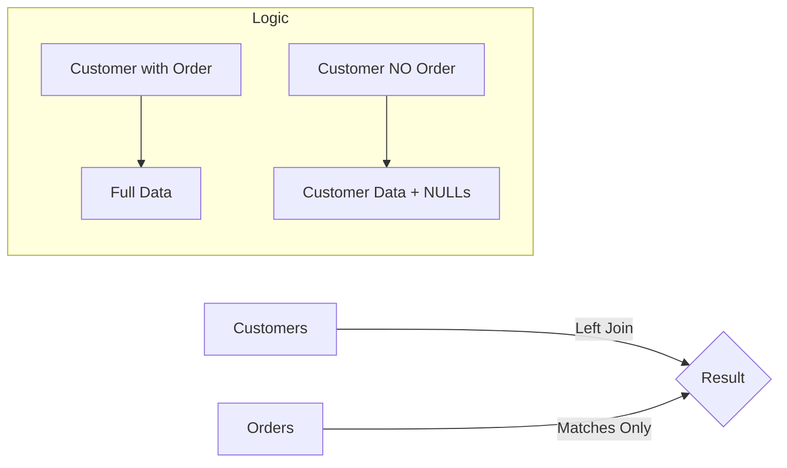

# Outer Joins Explained

Outer joins extend the behavior of inner joins by preserving rows from one or both tables even when no matching row exists in the other table. While an inner join returns only the intersection of two tables (rows that match on the join condition), an outer join guarantees that at least one side of the relationship is fully represented in the result. When a row has no match on the other side, the columns from the unmatched table are filled with `NULL` values.

Understanding outer joins is essential for queries where excluding unmatched rows would produce an incomplete or misleading result. For example, if you want a list of all customers and their credit cards, including customers who have not yet been issued a card, an inner join would silently drop those customers from the result. A left outer join preserves them.

## The Problem with Inner Joins

As seen in [[03 - Inner Join]], if data is missing on one side (e.g., a Student with no Department, or a Customer with no Orders), the data disappears completely. **Outer Joins** solve this by ensuring we keep the data from one (or both) sides, even if no match exists.

## How Outer Joins Differ from Inner Joins

The key difference between inner and outer joins is how they handle unmatched rows. In an inner join, if a row in the left table has no corresponding row in the right table (based on the join condition), that row is simply absent from the result. In an outer join, the row is included, and the columns from the table where no match was found are populated with `NULL`.

```
INNER JOIN:          LEFT OUTER JOIN:     RIGHT OUTER JOIN:    FULL OUTER JOIN:
+-------------+      +-------------+      +-------------+      +-------------+
| Matched Only|      | All Left +  |      | All Right + |      | All Left +  |
|             |      | Matched R   |      | Matched L   |      | All Right   |
|  A AND B    |      | NULL for    |      | NULL for    |      | NULL where  |
|  present    |      | missing R   |      | missing L   |      | no match    |
+-------------+      +-------------+      +-------------+      +-------------+
```

This distinction has significant practical implications. If you use an inner join when you should have used an outer join, you may lose data without realizing it. If you use an outer join when an inner join would suffice, you may introduce `NULL` values that complicate downstream processing.

## Left Outer Join (LEFT JOIN)

A `LEFT OUTER JOIN` returns **ALL** rows from the left table (the table listed in the `FROM` clause). For each left row that has a match in the right table, the columns from the right table are included. For each left row that has no match, the right table columns are `NULL`. This is the most commonly used outer join type.

- **If match found:** Data is combined normally.
- **If NO match:** The columns from the Right table are filled with `NULL`.

### Syntax

```sql
SELECT C.Name, O.OrderID
FROM Customers C        -- LEFT TABLE (Keep all of these)
LEFT JOIN Orders O      -- RIGHT TABLE (Optional details)
    ON C.ID = O.CustomerID;
```

The `OUTER` keyword is optional. Writing `LEFT JOIN` is equivalent to `LEFT OUTER JOIN`.

### Visual Logic



### Use Case Example

"Show me a list of all employees and their projects. Include employees who are currently 'on the bench' (not assigned to a project)."

**Result:**

| Employee | Project |
| :--- | :--- |
| Alice | App Dev |
| Bob | Website |
| **Charlie** | **NULL** |

_Charlie is kept in the list thanks to the LEFT JOIN._

### Customer / Card Example

```sql
SELECT customer.first_name, customer.last_name, card.card_id, card.max_amount
FROM customer
LEFT OUTER JOIN card
    ON customer.customer_id = card.customer_id;
```

In this query, every customer appears in the result. Customers with cards show the card details. Customers without cards show `NULL` in the card columns.

## Right Outer Join (RIGHT JOIN)

A `RIGHT OUTER JOIN` returns **ALL** rows from the right table (the table listed after the `JOIN` keyword). Unmatched rows from the left table are filled with `NULL`. This is functionally equivalent to a left outer join with the table order reversed.

### Syntax

```sql
SELECT left_table.column_name, right_table.column_name
FROM left_table
RIGHT OUTER JOIN right_table
    ON left_table.foreign_key = right_table.primary_key;
```

The `OUTER` keyword is optional. Writing `RIGHT JOIN` is equivalent to `RIGHT OUTER JOIN`.

### How the Right Outer Join Works

Consider a bank database with a `customer` table and a `card` table. The card table has a `customer_id` foreign key that references the customer table, but this column is not necessarily `NOT NULL` -- a card could exist without being assigned to a customer (for example, an unactivated card or a placeholder card in the system).

```
Customer Table                    Card Table
+-------------+-----------+       +--------+-------------+-----------+
| customer_id | name      |       | card_id| customer_id | max_amount|
+-------------+-----------+       +--------+-------------+-----------+
| 1           | Caleb     |       | 101    | 1           | 5000      |
| 2           | Jimmy     |       | 102    | 1           | 3000      |
| 3           | Sarah     |       | 103    | 2           | 10000     |
+-------------+-----------+       | 104    | NULL        | 8000      |
                                  +--------+-------------+-----------+
```

A right outer join with `customer` on the left and `card` on the right:

```sql
SELECT customer.name, card.card_id, card.max_amount
FROM customer
RIGHT OUTER JOIN card
    ON customer.customer_id = card.customer_id;
```

**Result:**

```
+-----------+--------+-----------+
| name      | card_id| max_amount|
+-----------+--------+-----------+
| Caleb     | 101    | 5000      |
| Caleb     | 102    | 3000      |
| Jimmy     | 103    | 10000     |
| NULL      | 104    | 8000      |
+-----------+--------+-----------+
```

Card 104 has no associated customer, so the `name` column from the customer table is `NULL`. All four cards appear in the result because the right table (card) is fully preserved. Sarah does not appear because she has no cards and the left table (customer) is not fully preserved in a right join.

### Right Join vs. Flipped Left Join

In practice, a right outer join can always be rewritten as a left outer join by swapping the order of the tables. The two queries below produce identical results:

```sql
-- Right outer join
SELECT customer.name, card.card_id, card.max_amount
FROM customer
RIGHT OUTER JOIN card
    ON customer.customer_id = card.customer_id;

-- Equivalent left outer join (tables swapped)
SELECT customer.name, card.card_id, card.max_amount
FROM card
LEFT OUTER JOIN customer
    ON card.customer_id = customer.customer_id;
```

Both queries return all cards with their associated customer information. The only difference is the order in which the tables appear in the `FROM` and `JOIN` clauses. Because of this equivalence, many developers and teams adopt a convention of using only left outer joins for consistency. When every join in a codebase uses the same direction, it is easier to read and reason about the queries.

### When to Use a Right Outer Join

Despite the common convention of preferring left joins, there are situations where a right outer join is the natural choice:

- **Building on an existing query**: If you have a complex query that already references several tables and you need to add a new table on the "left" side while preserving all rows from an existing table, using a right join avoids restructuring the entire query.
- **Reading direction**: Some developers find it more intuitive to list the preserved table after the `JOIN` keyword, especially when the query logic reads more naturally from right to left in the business context.
- **Legacy code**: Existing codebases may use right joins extensively, and understanding them is necessary for maintenance even if you would not write them that way yourself.

### The NOT NULL Effect

If the foreign key column in the right table is defined as `NOT NULL`, then every row in the right table is guaranteed to have a match in the left table. In this case, the right outer join produces the same result as an inner join because there are no unmatched rows in the right table to preserve. This is an important observation: when foreign key columns are `NOT NULL`, the distinction between inner and outer joins may be functionally irrelevant for that side of the relationship.

For example, if `card.customer_id` is `NOT NULL`, then every card has a customer, and a right outer join between customer and card returns exactly the same rows as an inner join. The `NULL` placeholders never appear because every right-table row finds a match. See [[07 - JOIN with NOT NULL Columns]] for a deeper exploration of this interaction.

### Practical Example: Find Orphaned Cards

```sql
-- Find all cards that have no associated customer
SELECT card.card_id, card.max_amount
FROM customer
RIGHT OUTER JOIN card
    ON customer.customer_id = card.customer_id
WHERE customer.customer_id IS NULL;
```

This query uses the right outer join combined with an `IS NULL` filter to identify orphaned cards. The right join ensures that all cards are included, and the `WHERE` clause filters for the rows where no customer was found.

## Full Outer Join (FULL JOIN)

A `FULL OUTER JOIN` returns **ALL** rows from both tables. Where matches exist, the columns from both tables are combined. Where a row in either table has no match, the missing side is filled with `NULL`.

1.  If $A$ and $B$ match: Show combined data.
2.  If $A$ exists but not $B$: Show $A$ + NULLs.
3.  If $B$ exists but not $A$: Show $B$ + NULLs.

```sql
SELECT customer.first_name, card.card_id
FROM customer
FULL OUTER JOIN card
    ON customer.customer_id = card.customer_id;
```

This query returns every customer and every card. Matched pairs are combined. Unmatched customers have `NULL` card columns, and unmatched cards have `NULL` customer columns.

> [!ERROR] MySQL Limitation
> MySQL **does not** support the `FULL OUTER JOIN` keyword. It is available in PostgreSQL and SQL Server. To achieve this in MySQL, you must combine a Left Join and a Right Join using `UNION`.

**MySQL Workaround:**

```sql
SELECT * FROM A LEFT JOIN B ON A.id = B.id
UNION
SELECT * FROM A RIGHT JOIN B ON A.id = B.id;
```

The `UNION` (without `ALL`) automatically deduplicates the overlapping matched rows, so the result is equivalent to a true `FULL OUTER JOIN`.

## NULL Values in Outer Join Results

The presence of `NULL` values in outer join results is the primary difference from inner join results. These `NULL` values represent missing relationships and can be used intentionally in queries. For example, to find all customers who do not have a card, you can use a left outer join and filter for `NULL` in the right table's key column:

```sql
SELECT customer.first_name, customer.last_name
FROM customer
LEFT OUTER JOIN card
    ON customer.customer_id = card.customer_id
WHERE card.card_id IS NULL;
```

This pattern of using an outer join combined with an `IS NULL` filter is a common technique for finding orphaned or missing records. It works because `NULL` in the right table's key column indicates that no matching row was found in the join.

## When to Use Each Join Type

Choosing the correct join type depends on the question you are asking of the data. The following table summarizes the decision criteria:

| Question | Join Type | Rationale |
|----------|-----------|-----------|
| Show only matched pairs | INNER JOIN | Unmatched rows are irrelevant |
| Show all from left, plus matches | LEFT OUTER JOIN | Preserve every row in the left table |
| Show all from right, plus matches | RIGHT OUTER JOIN | Preserve every row in the right table |
| Show everything from both sides | FULL OUTER JOIN | Preserve all rows from both tables |
| Find rows with no match | LEFT/RIGHT JOIN + IS NULL | Identify orphaned or missing records |

## Comparison Table of All Join Types

| Join Type | Left Table Rows | Right Table Rows | NULLs Produced |
|-----------|----------------|-----------------|----------------|
| INNER JOIN | Only matched | Only matched | None |
| LEFT OUTER JOIN | All | Only matched | In right columns for unmatched left rows |
| RIGHT OUTER JOIN | Only matched | All | In left columns for unmatched right rows |
| FULL OUTER JOIN | All | All | In either side for unmatched rows |

| Join Type | Left Table Rows | Right Table Rows | Unmatched Become |
| :-------- | :-------------- | :--------------- | :--------------- |
| **INNER** | Matched Only    | Matched Only     | Removed          |
| **LEFT**  | **All**         | Matched Only     | NULL (on right)  |
| **RIGHT** | Matched Only    | **All**          | NULL (on left)   |
| **FULL**  | **All**         | **All**          | NULL (on either) |

## Outer Joins Across Multiple Tables

Just as inner joins can be chained across three or more tables (see [[04 - Inner Join on 3 Tables]]), outer joins can also be extended. The interaction between outer join types and the order of joins in a multi-table query produces different results, which is covered in detail in [[06 - Outer Join Across 3 Tables]]. The key principle remains: each join condition determines how rows are matched, and the outer join type determines what happens to unmatched rows at that stage.

The concepts introduced here build on the join fundamentals from [[02 - Introduction to Joins]] and the inner join specifics from [[03 - Inner Join]].

## See Also

- [[02 - Introduction to Joins]] — Overview of all join types
- [[03 - Inner Join]] — The foundational inner join
- [[04 - Inner Join on 3 Tables]] — Multi-table inner joins
- [[06 - Outer Join Across 3 Tables]] — Multi-table outer joins
- [[07 - JOIN with NOT NULL Columns]] — How NOT NULL FKs affect outer joins
