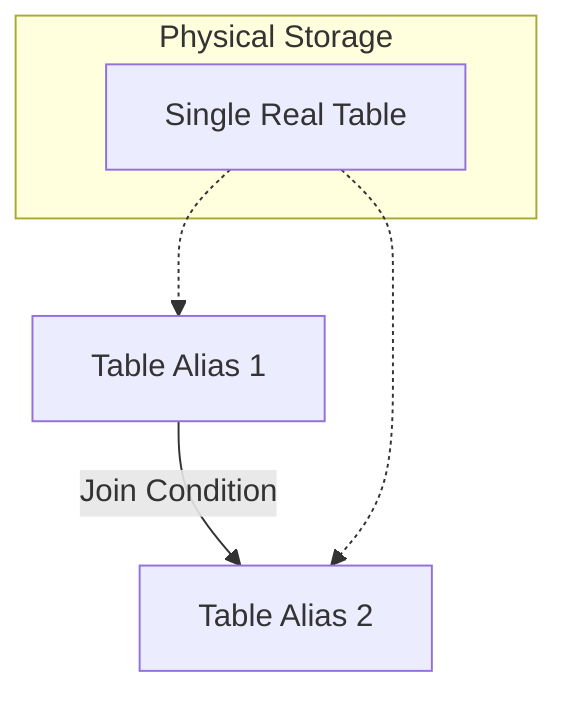

# Auto-Join, Self-Reference, and Self Join

A **self join** (also called an **auto-join**) is a technique in which a table is joined with itself. Rather than combining two different tables, a self join treats a single table as if it were two separate tables by assigning each instance a different alias. The database uses the aliases to distinguish between the two "copies" of the same table, allowing you to compare rows within the same table or follow relationships that exist between rows of a single table.

Self joins are not a distinct join type in SQL syntax — there is no `SELF JOIN` keyword. You use the standard `INNER JOIN`, `LEFT JOIN`, or other join keywords, but both sides of the join refer to the same underlying table. The key requirement is that you **must** use [[09 - Alias|aliases]] to give each instance of the table a unique name.

## When to Use a Self Join

Self joins are used when rows within a single table have relationships to other rows in the same table. The most common scenarios include:

- **Hierarchical data**: An employee table where each employee has a `manager_id` that references another employee's `employee_id`. A self join can pair each employee with their manager's details.
- **Referral systems**: A user table where each user has a `referred_by` column that references another user's `user_id`. A self join can show each user alongside the person who referred them.
- **Adjacency lists**: Any tree or graph structure stored in a single table where rows reference other rows in the same table.
- **Comparing rows**: Finding pairs of rows in the same table that share a characteristic, such as employees in the same department, employees with the same job title, or products with the same price.
- **Sequential data**: Finding rows that match a value derived from another specific row in the same table (e.g., flights departing from the same city as flight 'F09').

## The Golden Rule: Aliasing

Since you are using the same table twice, SQL cannot distinguish between the first instance and the second instance. **You MUST use Aliases** (e.g., `T1` and `T2`, or `Worker` and `Boss`) to give the table two temporary identities. The aliases are arbitrary but should be chosen to reflect the logical role of each instance.

## Visual Diagram



Both aliases point to the same physical table, but the database treats them as two independent row sources for the duration of the query.

## Scenario 1: Finding "Same As" Relations

**Goal:** Find pairs of employees who share the same Job Title.

**Table: Employee**

| ID | Name | Job |
| :--- | :--- | :--- |
| 1 | Sara | Engineer |
| 2 | Malik | Manager |
| 3 | Amina | Engineer |

**Concept:**

Imagine we create two copies of the Employee table: `E1` and `E2`.

1.  `E1` picks an employee (e.g., Sara).
2.  `E2` scans for others with `E2.Job = E1.Job`.

**Query:**

```sql
SELECT E1.Name AS Person_A, E2.Name AS Person_B
FROM Employee E1, Employee E2
WHERE E1.Job = E2.Job      -- Same Job
  AND E1.ID <> E2.ID;      -- Prevent matching Sara with herself
```

The `E1.ID <> E2.ID` rule is essential: without it, every employee would be matched with themselves. With it, the query returns only pairs of *different* employees who happen to share the same job title. Note that this query uses the SQL-89 comma syntax (`FROM E1, E2 WHERE ...`); the ANSI-92 equivalent uses `INNER JOIN ... ON ...`.

## Scenario 2: Hierarchies (Manager / Employee)

This is the most common interview use case. Structure: the `Employee` table has a column `ManagerID`, which refers to the `EmployeeID` of another person in the _same_ table.

### Simple Table

| EmpID | Name | ManagerID |
| :--- | :--- | :--- |
| 10 | The Boss | NULL |
| 20 | Subordinate | 10 |

**Goal:** List employees alongside the name of their manager.

```sql
SELECT Worker.Name AS Employee_Name,
       Boss.Name AS Manager_Name
FROM Employee Worker
INNER JOIN Employee Boss
    ON Worker.ManagerID = Boss.EmpID;
```

**Breakdown:**

- `Worker` represents the row of the employee we are listing.
- `Boss` represents the row of the person managing them.
- The link is: `Worker`'s ManagerID $\to$ `Boss`'s EmpID.

An `INNER JOIN` here would exclude "The Boss" (EmpID 10) because their `ManagerID` is `NULL` and finds no match in the `Boss` alias. To include top-level nodes, use a `LEFT OUTER JOIN` instead.

### Complete Example: Employee-Manager Hierarchy

Consider an `employee` table where each employee has a `manager_id` that references the `employee_id` of their manager. The CEO has a `manager_id` of `NULL` because they report to nobody.

#### Table Structure

```sql
CREATE TABLE employee (
    employee_id INT UNSIGNED NOT NULL AUTO_INCREMENT,
    first_name VARCHAR(50) NOT NULL,
    last_name VARCHAR(50) NOT NULL,
    email VARCHAR(255) NOT NULL,
    manager_id INT UNSIGNED,
    PRIMARY KEY (employee_id),
    FOREIGN KEY (manager_id) REFERENCES employee(employee_id)
);
```

Notice that `manager_id` is a foreign key that references the same `employee` table. This is a perfectly valid and common pattern. The `manager_id` column is nullable because the top-level employee (the CEO or founder) has no manager.

#### Sample Data

```
+-------------+------------+-----------+----------------------+------------+
| employee_id | first_name | last_name | email                | manager_id |
+-------------+------------+-----------+----------------------+------------+
| 1           | Diana      | Prince    | diana@company.com    | NULL       |
| 2           | Bruce      | Wayne     | bruce@company.com    | 1          |
| 3           | Clark      | Kent      | clark@company.com    | 1          |
| 4           | Barry      | Allen     | barry@company.com    | 2          |
| 5           | Hal        | Jordan    | hal@company.com      | 2          |
| 6           | Arthur     | Curry     | arthur@company.com   | 3          |
+-------------+------------+-----------+----------------------+------------+
```

The hierarchy is:

- Diana (CEO) manages Bruce and Clark
- Bruce manages Barry and Hal
- Clark manages Arthur

#### Self Join Query

To list each employee alongside their manager's name, you join the `employee` table to itself. The first instance (alias `e`) represents the employee, and the second instance (alias `m`) represents the manager.

```sql
SELECT
    e.first_name AS "Employee First Name",
    e.last_name AS "Employee Last Name",
    e.email AS "Employee Email",
    m.first_name AS "Manager First Name",
    m.last_name AS "Manager Last Name",
    m.email AS "Manager Email"
FROM employee AS e
LEFT OUTER JOIN employee AS m
    ON e.manager_id = m.employee_id;
```

#### Expected Output

```
+---------------------+--------------------+----------------------+-------------------+------------------+-------------------+
| Employee First Name | Employee Last Name | Employee Email       | Manager First Name| Manager Last Name| Manager Email     |
+---------------------+--------------------+----------------------+-------------------+------------------+-------------------+
| Diana               | Prince             | diana@company.com    | NULL              | NULL             | NULL              |
| Bruce               | Wayne              | bruce@company.com    | Diana             | Prince           | diana@company.com |
| Clark               | Kent               | clark@company.com    | Diana             | Prince           | diana@company.com |
| Barry               | Allen              | barry@company.com    | Bruce             | Wayne            | bruce@company.com |
| Hal                 | Jordan             | hal@company.com      | Bruce             | Wayne            | bruce@company.com |
| Arthur              | Curry              | arthur@company.com   | Clark             | Kent             | clark@company.com |
+---------------------+--------------------+----------------------+-------------------+------------------+-------------------+
```

Diana has `NULL` values for the manager columns because her `manager_id` is `NULL`. The `LEFT OUTER JOIN` ensures that Diana is still included in the result. If you used an `INNER JOIN` instead, Diana would be excluded because there is no row in the `m` instance that matches `e.manager_id = m.employee_id` when `e.manager_id` is `NULL`.

## Why a Left Outer Join Is Usually Appropriate

In a self join on a hierarchical structure, the top-level node (the one with a `NULL` reference) will be excluded by an inner join. If you want to include all rows in the result, including those at the top of the hierarchy, use a `LEFT OUTER JOIN`. If you only want rows where the relationship exists (for example, only employees who have a manager), an `INNER JOIN` suffices.

```sql
-- Inner join: excludes employees with no manager (the CEO disappears)
SELECT
    e.first_name,
    e.last_name,
    m.first_name AS manager_first_name
FROM employee AS e
INNER JOIN employee AS m
    ON e.manager_id = m.employee_id;

-- Left outer join: includes all employees (the CEO appears with NULL manager)
SELECT
    e.first_name,
    e.last_name,
    m.first_name AS manager_first_name
FROM employee AS e
LEFT OUTER JOIN employee AS m
    ON e.manager_id = m.employee_id;
```

## Scenario 3: Referral Systems

Another common use case is a referral system where each user has a `referred_by` column referencing another user's `user_id`:

```sql
CREATE TABLE user (
    user_id INT UNSIGNED NOT NULL AUTO_INCREMENT,
    first_name VARCHAR(50) NOT NULL,
    last_name VARCHAR(50) NOT NULL,
    email VARCHAR(255) NOT NULL,
    referred_by INT UNSIGNED,
    PRIMARY KEY (user_id),
    FOREIGN KEY (referred_by) REFERENCES user(user_id)
);

-- Self join to show each user and who referred them
SELECT
    u1.first_name AS "User First Name",
    u1.last_name AS "User Last Name",
    u1.email AS "User Email",
    u2.email AS "Referred By Email"
FROM user AS u1
LEFT OUTER JOIN user AS u2
    ON u1.referred_by = u2.user_id;
```

In this query, `u1` represents the user being referred and `u2` represents the referrer. The `LEFT OUTER JOIN` ensures that users who were not referred by anyone (the original users who signed up without a referral) are still included in the result.

## Scenario 4: Sequential Data

**Goal:** Find flights departing from the same city as Flight 'F09'.

1.  Use Alias `F1` to find Flight 'F09' and get its city.
2.  Use Alias `F2` to find all flights matching that city.

```sql
SELECT F2.code
FROM Flight F1, Flight F2
WHERE F1.code = 'F09'           -- F1 locks onto the specific flight
AND F1.departure = F2.departure; -- F2 finds the matches
```

Here `F1` is used as a "lookup" alias that anchors the query to a specific known row, and `F2` is used to scan for matching rows based on a value derived from `F1`. This is a useful pattern whenever you need to find rows that match an attribute of a specific "seed" row in the same table.

## Self Join for Row Comparison

Self joins can also be used to compare rows within the same table. For example, to find all pairs of employees who work in the same department:

```sql
SELECT
    e1.first_name AS employee_1,
    e2.first_name AS employee_2,
    e1.department_id
FROM employee AS e1
INNER JOIN employee AS e2
    ON e1.department_id = e2.department_id
    AND e1.employee_id < e2.employee_id;
```

The condition `e1.employee_id < e2.employee_id` prevents duplicate pairs (A-B and B-A) and prevents matching an employee with themselves. This pattern is useful for finding duplicates, similarities, or relationships between rows in the same dataset.

## Summary

A self join is a powerful technique for working with hierarchical data, referral chains, intra-table comparisons, and sequential lookups within a single table. It requires table aliases to distinguish between the two instances of the same table, as described in [[09 - Alias]]. The join condition in a self join typically matches a foreign key column in one instance with the primary key column in the other instance, establishing the relationship between rows. Choosing between `INNER JOIN` and `LEFT OUTER JOIN` depends on whether you want to include rows at the top of the hierarchy (those with `NULL` references).

## See Also

- [[03 - Inner Join]] — The foundational inner join mechanics
- [[05 - Outer Joins Explained]] — Why LEFT OUTER JOIN is often the right choice for self joins
- [[09 - Alias]] — Aliasing is mandatory for self joins
- [[07 - JOIN with NOT NULL Columns]] — How NOT NULL FKs affect join behavior
