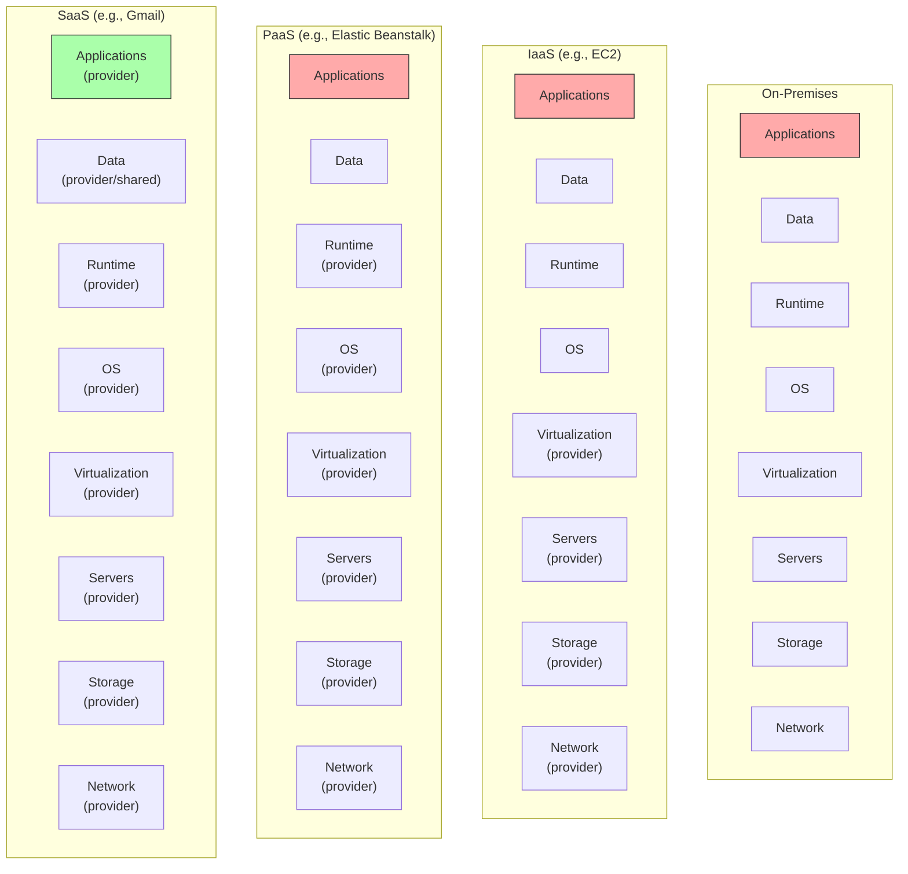
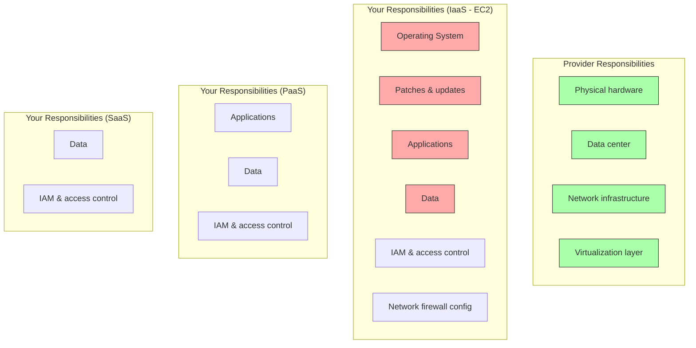

# 1. Cloud Computing Fundamentals

> [!info] Chapter Context
> Before learning AWS, you must understand **cloud computing** itself — what it is, how it differs from on-premises infrastructure, the service models (IaaS, PaaS, SaaS), the deployment models (public, private, hybrid), and the economic principles (pay-as-you-go, CapEx vs. OpEx). This chapter lays the conceptual foundation that every later chapter builds on.

Related: [[2. Distributed Systems Basics]] | [[3. HTTP and REST APIs]] | [[01 - AWS Fundamentals/1. What Is AWS]]

---

## 1. What Is Cloud Computing

The NIST (National Institute of Standards and Technology) definition, which is the canonical one, says cloud computing is "a model for enabling ubiquitous, convenient, on-demand network access to a shared pool of configurable computing resources" that can be "rapidly provisioned and released with minimal management effort."

In plain terms: cloud computing means renting someone else's computers, storage, and networking — and paying only for what you use, when you use it. Instead of buying a server and waiting weeks for it to be racked, you click a button (or run a script) and have a server in seconds.

### 1.1 The Five Essential Characteristics

NIST defines five characteristics that distinguish cloud from other forms of hosting:

1. **On-demand self-service** — You provision resources without talking to a human. No tickets, no waiting. `aws ec2 run-instances` and you have a server.
2. **Broad network access** — Resources are reachable over the internet from any device. You do not need to be on a corporate VPN.
3. **Resource pooling** — The provider runs a massive shared infrastructure; multiple customers share the same physical hardware, isolated by software (virtualization, namespaces).
4. **Rapid elasticity** — Resources scale up and down quickly. Auto-scaling can add 100 servers in minutes during a traffic spike and remove them when traffic subsides.
5. **Measured service (pay-as-you-go)** — You pay per second (or per hour, or per request). No upfront commitment required. The provider meters your usage and bills accordingly.

### 1.2 Why Cloud Exists

Cloud computing is the convergence of several trends:

- **Virtualization** (VMware, KVM) made it possible to slice a physical server into many virtual ones.
- **Commodity hardware** became cheap and reliable enough that massive data centers could be built with thousands of identical machines.
- **High-speed internet** made it feasible to access remote resources with acceptable latency.
- **APIs and automation** made it possible to provision resources programmatically rather than via tickets.

AWS launched the first modern cloud service (S3) in 2006. Google Cloud and Azure followed in 2008 and 2010. Today, cloud is the default for new applications.

---

## 2. Service Models: IaaS, PaaS, SaaS

Cloud services fall on a spectrum based on how much the provider manages vs. how much you manage.

### 2.1 IaaS — Infrastructure as a Service

The provider gives you virtual machines, storage, and networking. You install the OS (or pick a base image), configure the runtime, deploy your application. Examples: AWS EC2, Azure VMs, Google Compute Engine.

**You manage:** the OS, the runtime, the application, the data.
**Provider manages:** the hardware, virtualization, data center, networking.

IaaS gives you maximum control but maximum responsibility. You patch the OS, configure the firewall, manage backups, and so on.

### 2.2 PaaS — Platform as a Service

The provider gives you a runtime environment (a "platform") and you deploy your code. Examples: AWS Elastic Beanstalk, Google App Engine, Heroku.

**You manage:** the application and the data.
**Provider manages:** the OS, the runtime, the servers, the scaling.

PaaS is faster to deploy and requires less operational expertise, but you give up control over the underlying OS and runtime configuration.

### 2.3 SaaS — Software as a Service

The provider gives you a finished application. You just use it. Examples: Gmail, Salesforce, Slack, Notion.

**You manage:** (almost nothing — your account, your data).
**Provider manages:** everything else.

### 2.4 Serverless — A Special Case

Serverless is the extreme end of PaaS. You write functions (small pieces of code), the provider runs them in response to events, and you pay per invocation. Examples: AWS Lambda, Google Cloud Functions, Azure Functions.

Serverless is covered in detail in [[11 - Serverless Computing/1. Serverless Concepts]].

---

## 3. Deployment Models

### 3.1 Public Cloud

Resources are owned by a cloud provider (AWS, Azure, GCP) and shared among many customers (multi-tenant). This is the default when people say "the cloud."

- **Pros:** Massive scale, low cost (economics of scale), no hardware to manage.
- **Cons:** Less control over physical location, potential compliance concerns for some industries.

### 3.2 Private Cloud

Cloud infrastructure operated for a single organization. Can be on-premises (in your own data center) or hosted by a provider (e.g., AWS Outposts, Azure Stack). Private clouds use cloud-like APIs and self-service but the hardware is dedicated to you.

- **Pros:** Maximum control, can meet strict compliance requirements.
- **Cons:** Higher cost, you still manage hardware (or pay a premium for managed).

### 3.3 Hybrid Cloud

A combination of public and private cloud, with workload portability between them. Example: run a database on-premises (private) for compliance reasons, but run the web frontend on AWS (public) for elasticity.

### 3.4 Multi-Cloud

Using multiple public cloud providers simultaneously (e.g., AWS for compute, GCP for big data). Reasons: avoid vendor lock-in, leverage each provider's strengths, geographic redundancy.

- **Pros:** No vendor lock-in, best-of-breed services.
- **Cons:** High complexity (different APIs, billing, security models), harder to manage.

---

## 4. The Economics: CapEx vs. OpEx

### 4.1 Capital Expenditure (CapEx)

In the on-premises world, you buy servers upfront. This is CapEx — large, one-time purchases that are capitalized (depreciated over years).

- You buy a $50,000 server today.
- It depreciates over 3 years.
- You pay the full $50,000 now, even if you only use 10% of its capacity.

### 4.2 Operating Expenditure (OpEx)

In the cloud, you rent. This is OpEx — ongoing operational expenses, pay-as-you-go.

- You run a server for 100 hours.
- At $0.10/hour, you pay $10.
- Stop the server, you stop paying.

### 4.3 Why OpEx Matters

CapEx has several downsides:

- **High upfront cost** — Ties up capital that could be deployed elsewhere.
- **Capacity planning** — You must guess how much hardware you will need in 3 years. Guess low, you cannot handle growth. Guess high, you waste money.
- **Slow to scale** — Buying and racking a new server takes weeks.
- **Sunk cost** — Once bought, you own the hardware whether you use it or not.

OpEx solves these:

- **No upfront cost** — Start small, scale as needed.
- **Pay-per-use** — Pay only for what you use.
- **Instant scaling** — Add servers in seconds, remove them in seconds.
- **No sunk cost** — Stop using it, stop paying.

The trade-off: OpEx is more expensive per unit if you run 24/7/365 at peak capacity. A server you fully utilize for 3 years is cheaper to buy than to rent. Cloud wins when your usage is variable, unpredictable, or growing fast.

---

## 5. The Shared Responsibility Model

Cloud security is **shared** between you and the provider. The exact split depends on the service model.

### 5.1 What AWS Always Manages

- Physical security of the data center.
- The hardware (servers, storage, network gear).
- The virtualization layer (Xen, Nitro on EC2).
- The host OS for managed services (RDS, DynamoDB, Lambda).

### 5.2 What You Always Manage

- Your data (and its encryption).
- Your IAM users, roles, and policies.
- Your application code.
- Access to your resources (security groups, bucket policies).

### 5.3 What Depends on the Service

For IaaS (EC2), you manage everything above the virtualization layer — including the guest OS, patches, and runtime. For PaaS (RDS), AWS manages the OS, the database engine, backups, and patching; you manage the data and the schema. For SaaS (DynamoDB), AWS manages everything; you manage the data and IAM access.

> [!warning] "The Cloud Is Secure" Is a Myth
> AWS secures the infrastructure; you secure your usage of it. Misconfigured S3 buckets, overly permissive IAM policies, and unpatched EC2 instances are YOUR responsibility. Most cloud security incidents are caused by customer misconfiguration, not provider breaches.

---

## 6. Why Cloud Engineering Matters

Cloud engineering is the discipline of designing, deploying, and operating applications on cloud infrastructure. It combines:

- **Software engineering** — Writing application code.
- **Systems engineering** — Understanding networks, storage, compute.
- **DevOps** — Automating deployment and operations.
- **Security** — Identity, encryption, compliance.
- **Cost optimization** — Choosing the right services and sizes.
- **Architecture** — Designing for scalability, reliability, and maintainability.

The skills you learn in this vault — Linux, Docker, AWS — are the foundation. The deeper skills (IAM, networking, serverless, IaC) are what differentiate a cloud engineer from a developer.

---

## 7. Common Student Mistakes

> [!warning] Mistake 1 — Treating Cloud as "Someone Else's Computer"
> The cloud is a shared responsibility. AWS secures the data center; you secure your data, your IAM, your network. Many incidents come from customers assuming the provider handles everything.

> [!warning] Mistake 2 — Cost Surprises
> Cloud is pay-as-you-go, which is great for variable workloads but terrible for forgotten resources. A misconfigured EC2 instance left running for a month can cost hundreds of dollars. Set up billing alerts on day one.

> [!warning] Mistake 3 — Picking Services Before Understanding Requirements
> "Should I use Lambda or EC2?" depends on your workload, traffic pattern, latency requirements, and budget. Understand the tradeoffs (covered in later chapters) before committing.

> [!warning] Mistake 4 — Ignoring the Free Tier Limits
> AWS has a free tier, but it has limits (750 hours of t2.micro per month, 5 GB of S3, etc.). Exceeding these limits incurs charges. Track your usage.

---

## 8. Summary Checklist

- [ ] Cloud = on-demand, pay-as-you-go access to computing resources over the internet.
- [ ] Five NIST characteristics: on-demand self-service, broad network access, resource pooling, rapid elasticity, measured service.
- [ ] Service models: IaaS (you manage OS+app), PaaS (you manage app), SaaS (you use app), Serverless (you manage function).
- [ ] Deployment models: public, private, hybrid, multi-cloud.
- [ ] Cloud is OpEx (pay-as-you-go); on-premises is CapEx (upfront purchase).
- [ ] Shared responsibility: provider secures infrastructure; you secure your usage.
- [ ] Most cloud incidents are caused by customer misconfiguration, not provider breaches.

---

Previous: (this is the first note in the Foundations chapter) | Next: [[2. Distributed Systems Basics]]
