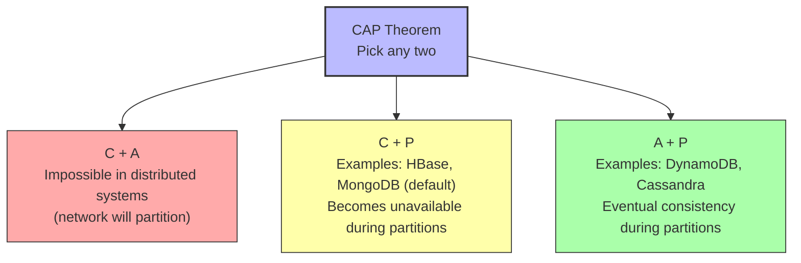

# 2. Distributed Systems Basics

> [!info] Chapter Context
> Modern cloud applications are distributed — they run on multiple machines, communicate over networks, and must handle partial failures. This note covers the core concepts: why distributed systems are hard, the CAP theorem, consistency models, latency, and the fallacies of distributed computing.

Related: [[1. Cloud Computing Fundamentals]] | [[3. HTTP and REST APIs]] | [[15 - Architecture Patterns/1. Microservices]]

---

## 1. What Is a Distributed System

A distributed system is a collection of independent computers that appears to its users as a single coherent system. Examples:

- The web (your browser talks to servers worldwide).
- A Google search (queries hit thousands of machines).
- DynamoDB (data is replicated across multiple availability zones).
- Your microservices architecture (frontend → backend → database → cache → queue).

You already use distributed systems every day. The challenge is **building** them.

### 1.1 Why Distributed Systems Exist

- **Scale** — A single machine has limits (CPU, RAM, disk). To handle more load, you need multiple machines.
- **Reliability** — If one machine crashes, others continue serving.
- **Geography** — Users worldwide need low latency, so you deploy in multiple regions.
- **Cost** — Many cheap commodity machines can be more cost-effective than one expensive supercomputer.

### 1.2 Why Distributed Systems Are Hard

Distributed systems introduce problems that do not exist on a single machine:

- **Partial failure** — One machine crashes while others continue. The system must handle this gracefully.
- **Network partitions** — The network between two machines fails. Are they both still "up"?
- **Concurrency** — Multiple machines accessing shared state simultaneously.
- **Latency** — Network calls take milliseconds; memory calls take nanoseconds. A 10,000x difference.
- **No global clock** — There is no single source of truth for "what time is it."
- **State synchronization** — Keeping data consistent across multiple replicas.

---

## 2. The Eight Fallacies of Distributed Computing

In 1994, Bill Joy and Tom Lyon at Sun Microsystems listed assumptions that programmers new to distributed systems make — all of which are false:

1. **The network is reliable.** (Networks fail. Cables get cut, switches die, DNS goes down.)
2. **Latency is zero.** (Every network call takes time. Treat it as such.)
3. **Bandwidth is infinite.** (Networks have capacity limits. Sending huge payloads is slow.)
4. **The network is secure.** (Networks are eavesdropped, attacked, misconfigured.)
5. **Topology doesn't change.** (Machines come and go. IPs change. Routers reconfigure.)
6. **There is one administrator.** (Your service depends on services administered by others.)
7. **Transport cost is zero.** (Serialization, encryption, and bandwidth all cost CPU and money.)
8. **The network is homogeneous.** (Different machines, different OSes, different protocols.)

Every distributed system bug can be traced to one of these fallacies. Internalize them.

---

## 3. The CAP Theorem

The CAP theorem (Brewer's conjecture, proved by Gilbert and Lynch in 2002) states that a distributed data store can provide at most **two of three** guarantees:

- **Consistency** — Every read returns the most recent write or an error.
- **Availability** — Every request receives a non-error response (without guarantee it is the most recent write).
- **Partition tolerance** — The system continues to operate despite an arbitrary number of messages being dropped or delayed by the network.

### 3.1 The Reality: CP vs. AP

In practice, partition tolerance is non-negotiable in distributed systems (networks will partition). So the real choice is:

- **CP** — When a partition occurs, the system refuses requests to avoid returning stale data. Better for banking, inventory.
- **AP** — When a partition occurs, the system continues serving (possibly stale) data. Better for social media feeds, shopping carts.

### 3.2 Examples

- **DynamoDB** — AP. Tunable consistency per request (eventual by default, strong for an extra cost).
- **Cassandra** — AP. Tunable consistency per query.
- **MongoDB** (default) — CP. The primary handles writes; if it is unreachable, writes fail until a new primary is elected.
- **Spanner** — Effectively CA, achieved via TrueTime (Google's atomic clocks) and Paxos.

---

## 4. Consistency Models

### 4.1 Strong Consistency

After a write completes, any subsequent read (from any replica) returns the updated value. Most expensive to achieve.

### 4.2 Eventual Consistency

After a write completes, reads may return stale data for some period. Eventually (when replication catches up), all reads return the updated value. Cheaper and more available.

### 4.3 Read-Your-Writes Consistency

A user's own writes are immediately visible to their own subsequent reads. (Other users may still see stale data.) Important for user experience — if you post a comment and refresh, you should see your comment.

### 4.4 Causal Consistency

Operations that are causally related (B was caused by A) are seen in the correct order by all nodes. Concurrent operations may be seen in different orders.

### 4.5 Tunable Consistency

Some databases (DynamoDB, Cassandra) let you choose per request:

- How many replicas must acknowledge a write before it is considered successful.
- How many replicas must respond to a read before it is returned.

Stronger consistency = more reliable but slower. Weaker consistency = faster but may return stale data.

---

## 5. Latency and the Speed of Light

Nothing travels faster than light. In a vacuum, light travels about 300,000 km/s. In fiber optic cables, about 200,000 km/s. This means:

- New York to London (5,500 km): ~28 ms one-way.
- New York to Tokyo (10,800 km): ~54 ms one-way.
- Round-trip times (RTT) are double these.

This is a **physics limit** — no amount of engineering can beat it. If your user is in Tokyo and your server is in New York, every request takes at least 108 ms round-trip.

### 5.1 The Latency Hierarchy

You should memorize these approximate latencies:

| Operation | Latency |
| :--- | :--- |
| L1 cache reference | 0.5 ns |
| Main memory reference | 100 ns |
| SSD random read | 100 μs |
| Datacenter network round-trip | 500 μs |
| Cross-region network (US East to US West) | 50 ms |
| Intercontinental network (US to Europe) | 100 ms |

A network call to another datacenter is 1000x slower than a memory access. This is why **locality matters** — keeping data and compute close together is a major optimization.

### 5.2 Implications for Design

- **Cache aggressively** — Reading from a local cache is 1000x faster than reading from a remote database.
- **Batch requests** — One request fetching 100 items is faster than 100 requests fetching one item each.
- **Co-locate compute and data** — Don't put your database in US-East and your web servers in EU-West.
- **Use CDNs** — Move static content close to users worldwide.

---

## 6. Replication and Partitioning

To scale a database beyond a single machine, you use two techniques:

### 6.1 Replication

Copying data to multiple machines. Reasons:

- **Availability** — If one replica dies, others continue serving.
- **Read scaling** — Distribute reads across replicas.
- **Locality** — Place replicas near users (geographic replication).

Tradeoffs:

- **Writes are slower** — Every write must propagate to all replicas.
- **Consistency challenges** — Replicas may diverge during network partitions.

### 6.2 Partitioning (Sharding)

Splitting data across multiple machines by some key. Reasons:

- **Write scaling** — Each partition handles its own writes.
- **Storage scaling** — Each partition holds only part of the data.

Tradeoffs:

- **Cross-partition queries are hard** — If you need to query by a non-partition key, you may need to query all partitions.
- **Hot partitions** — If one key is much more popular than others, that partition becomes a bottleneck.
- **Rebalancing** — Adding or removing partitions requires redistributing data.

### 6.3 Combining Both

Most large databases (DynamoDB, Cassandra, Spanner) use both: data is partitioned by key, and each partition is replicated across multiple machines/AZs.

---

## 7. The Two-Phase Commit and Saga Patterns

### 7.1 Distributed Transactions (2PC)

In a single database, transactions are easy — the database ensures atomicity. Across multiple databases, you need a distributed transaction protocol like **two-phase commit (2PC)**:

1. **Prepare phase** — A coordinator asks all participants "can you commit?"
2. **Commit phase** — If all say yes, the coordinator tells them to commit. If any say no, all abort.

2PC is slow (multiple network round-trips), blocking (participants hold locks during the protocol), and fragile (if the coordinator dies, participants may be stuck). It is rarely used in modern microservice architectures.

### 7.2 Sagas

A **saga** is a sequence of local transactions, each with a compensating transaction that undoes it. If any step fails, the compensating transactions run in reverse to undo the previous steps.

Example: an e-commerce order saga:
1. Reserve inventory (compensating: release inventory).
2. Charge credit card (compensating: refund).
3. Create shipment (compensating: cancel shipment).

If step 3 fails, run the compensations for steps 1 and 2 (refund the card, release the inventory).

Sagas are eventual consistency applied to business processes. They are the standard pattern for cross-service transactions in microservices. See [[15 - Architecture Patterns/3. Saga Pattern]].

---

## 8. Why This Matters for Cloud Engineers

AWS is fundamentally a distributed system. Understanding the tradeoffs helps you:

- **Choose the right database** — DynamoDB (AP, eventual) vs. RDS (CP, strong) vs. Aurora (tunable).
- **Design for failure** — Assume any component can fail. Use multi-AZ deployments.
- **Optimize for latency** — Co-locate compute and data. Use CDNs.
- **Reason about consistency** — When is eventual consistency acceptable? When must you pay for strong consistency?
- **Handle network partitions** — Even AWS has outages. Design for retry, fallback, graceful degradation.

---

## 9. Common Student Mistakes

> [!warning] Mistake 1 — Assuming Network Calls Are Free
> A network call to another service is 1000x slower than a function call. Don't make N+1 queries in a loop.

> [!warning] Mistake 2 — Trying to Use 2PC Across Microservices
> 2PC is slow and fragile. Use sagas (eventual consistency with compensation) instead.

> [!warning] Mistake 3 — Ignoring the CAP Theorem
> You cannot have strong consistency, high availability, and partition tolerance. Pick the right tradeoff for your use case.

> [!warning] Mistake 4 — Forgetting the Speed of Light
> A user in Tokyo cannot have <100 ms latency to a server in New York. Period. Use multi-region deployment or a CDN.

> [!warning] Mistake 5 — Designing for the Happy Path
> Distributed systems fail in surprising ways. Test for network partitions, slow responses, partial failures.

---

## 10. Summary Checklist

- [ ] A distributed system is multiple computers that appear as one to users.
- [ ] Distributed systems exist for scale, reliability, geography, and cost — but introduce partial failure, network partitions, and consistency challenges.
- [ ] The 8 fallacies: network is reliable, latency is zero, bandwidth is infinite, network is secure, topology doesn't change, one admin, transport cost is zero, homogeneous network. ALL FALSE.
- [ ] CAP theorem: pick two of Consistency, Availability, Partition tolerance. P is mandatory, so the real choice is CP vs. AP.
- [ ] Consistency models: strong, eventual, read-your-writes, causal, tunable.
- [ ] Latency hierarchy: memory 100 ns, SSD 100 μs, datacenter 500 μs, cross-region 50 ms, intercontinental 100 ms.
- [ ] Replication copies data (for availability, read scaling, locality); partitioning splits data (for write scaling, storage scaling).
- [ ] 2PC is slow and fragile; sagas are the modern pattern for cross-service transactions.

---

Previous: [[1. Cloud Computing Fundamentals]] | Next: [[3. HTTP and REST APIs]]
