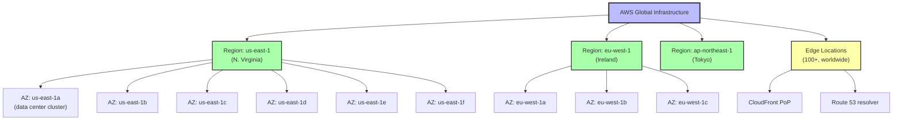

# 2. AWS Global Infrastructure

> [!info] Chapter Context
> AWS is divided into **regions**, **availability zones (AZs)**, and **edge locations**. Understanding this hierarchy is essential for designing reliable, low-latency applications.

Related: [[1. What Is AWS]] | [[3. Regions and Availability Zones]] | [[12 - AWS Networking/1. VPC Fundamentals]]

---

## 1. The Three Layers of AWS Infrastructure

---

## 2. Regions

A **region** is a geographical area (e.g., "N. Virginia", "Ireland", "Tokyo") that contains at least two (usually 3-6) availability zones.

### 2.1 Region Naming

Regions have identifiers like:

- `us-east-1` — N. Virginia (the first AWS region, where most new services launch).
- `us-west-2` — Oregon.
- `eu-west-1` — Ireland.
- `ap-northeast-1` — Tokyo.
- `ap-south-1` — Mumbai.

### 2.2 Region Characteristics

- **Geographically separated** — Hundreds of miles apart, for disaster recovery.
- **Independent** — A failure in one region does not affect others.
- **Pricing varies** — The same service may cost different amounts in different regions.
- **Service availability varies** — Not all services are available in all regions. New services launch in `us-east-1` first.
- **Data sovereignty** — Some regions are isolated for compliance (e.g., `us-gov-west-1` for US government, `cn-north-1` for China).

### 2.3 Choosing a Region

Consider:

1. **Latency to users** — Pick the closest region. Use multiple regions for global apps.
2. **Compliance** — Some data must stay in a specific country (GDPR requires EU data in EU).
3. **Service availability** — Check that the services you need are available.
4. **Cost** — Varies by region. `us-east-1` is usually cheapest.
5. **Disaster recovery** — Use a second region as a failover.

### 2.4 Special Regions

- **GovCloud (us-gov-west-1, us-gov-east-1)** — For US government workloads, restricted access.
- **China (cn-north-1)** — Operated by a Chinese partner; isolated from the global AWS.
- **Local Zones** — Extensions of a region into smaller metro areas (e.g., `us-east-1-bos-1` for Boston) for lower latency.

---

## 3. Availability Zones (AZs)

An **Availability Zone** is one or more discrete data centers within a region, with independent power, cooling, networking, and security.

### 3.1 AZ Characteristics

- **Independent failure domains** — A fire in AZ-a does not affect AZ-b.
- **Connected with high-bandwidth, low-latency links** — AZs in a region are interconnected with dedicated fiber, usually <2 ms latency.
- **3-6 AZs per region** — Most regions have 3; some have up to 6.
- **AZ names are account-specific** — Your `us-east-1a` may be a different physical data center than another account's `us-east-1a`. This is by design, to distribute load.

### 3.2 Why AZs Matter

If you deploy your app to a single AZ, you are vulnerable to that AZ failing. AWS occasionally has AZ-level outages (power loss, networking issues). For production:

- **Run across at least 2 AZs** (ideally 3+) — EC2 instances in an Auto Scaling Group across multiple AZs; RDS Multi-AZ; ALB across multiple AZs.
- **Use Multi-AZ databases** — RDS Multi-AZ maintains a synchronous standby in another AZ; fails over automatically.
- **Distribute state** — DynamoDB replicates across 3 AZs automatically. S3 replicates across 3+ AZs.

### 3.3 Single-AZ vs. Multi-AZ

| Aspect | Single-AZ | Multi-AZ |
| :--- | :--- | :--- |
| Cost | Lower | Higher (more resources) |
| Availability | Lower (one AZ can fail) | Higher (survives AZ failure) |
| Latency | Same | Same (AZs in same region) |
| Complexity | Simpler | More complex (cross-AZ sync) |

For production, **always use Multi-AZ** unless you have a specific reason not to (e.g., a dev environment).

---

## 4. Edge Locations

**Edge locations** are AWS points-of-presence (PoPs) in major cities worldwide. They are smaller than regions and used for:

- **CloudFront** — CDN caches content at edge locations.
- **Route 53** — DNS resolution from edge locations.
- **AWS WAF and Shield** — Filter malicious traffic at the edge.
- **Lambda@Edge and CloudFront Functions** — Run code at edge locations.

Edge locations are how AWS delivers low-latency content globally. When a user in Tokyo requests a video, CloudFront serves it from the Tokyo edge location (if cached), avoiding a round-trip to the origin in `us-east-1`.

AWS has 100+ edge locations in 50+ cities, more than any other cloud provider.

---

## 5. Regional vs. Global Services

| Service | Scope | Notes |
| :--- | :--- | :--- |
| EC2 | Regional | Instances live in one AZ in one region. |
| S3 | Regional (with global namespace) | Bucket names are globally unique; data lives in one region (unless replicated). |
| RDS | Regional | Database lives in one region; can be Multi-AZ within that region. |
| DynamoDB | Regional | Tables live in one region; global tables replicate across regions. |
| Lambda | Regional | Functions live in one region. |
| IAM | Global | Users, groups, roles, policies are global. |
| CloudFront | Global | A distribution is global; it uses edge locations. |
| Route 53 | Global | DNS records are global. |
| WAF | Regional or Global (CloudFront) | Can be attached to a regional resource (ALB) or to CloudFront (global). |

> [!tip] Always Know Your Region
> Most AWS operations are regional. The CLI uses the region in your config (`~/.aws/config`) or the `AWS_DEFAULT_REGION` env var. If you cannot find a resource you just created, check the region selector in the console.

---

## 6. Common Student Mistakes

> [!warning] Mistake 1 — Deploying to a Single AZ
> A single-AZ deployment will fail when that AZ fails. Use Multi-AZ for production.

> [!warning] Mistake 2 — Confusing Regions and AZs
> Regions are geographical areas (us-east-1). AZs are data center clusters within a region (us-east-1a, us-east-1b). Pick the region first, then spread across AZs within it.

> [!warning] Mistake 3 — Forgetting That AZ Names Are Account-Specific
> Your `us-east-1a` may be a different physical data center than another account's `us-east-1a`. If you peer VPCs across accounts and try to match AZs, you may end up in different physical AZs. Use AZ IDs (e.g., `use1-az1`) for cross-account consistency.

> [!warning] Mistake 4 — Picking the Wrong Region
> If your users are in Europe and you deploy in `us-east-1`, latency will be ~100 ms. Deploy in `eu-west-1` for ~10 ms latency. Use CloudFront for static content to reduce latency globally.

> [!warning] Mistake 5 — Forgetting That IAM Is Global
> IAM users, roles, and policies are global — they apply across all regions. Do not recreate IAM in each region.

---

## 7. Summary Checklist

- [ ] AWS has 30+ regions worldwide; each region has 3-6 AZs.
- [ ] A region is a geographical area; an AZ is a data center cluster within a region.
- [ ] AZs are independent failure domains — a single AZ can fail without affecting others.
- [ ] Edge locations (100+) are for CloudFront, Route 53, WAF, Lambda@Edge.
- [ ] Most services are regional; IAM, CloudFront, Route 53 are global.
- [ ] For production, deploy across at least 2-3 AZs.
- [ ] AZ names are account-specific; use AZ IDs for cross-account consistency.
- [ ] Choose a region based on user latency, compliance, service availability, and cost.

---

Previous: [[1. What Is AWS]] | Next: [[3. Regions and Availability Zones]]
