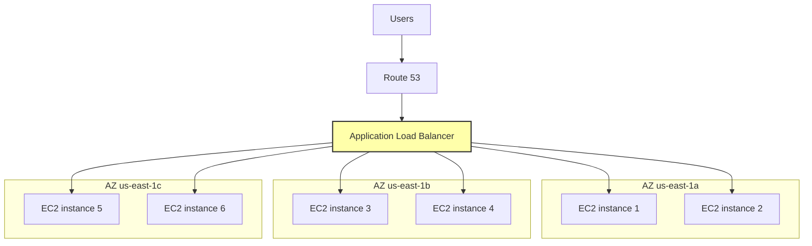
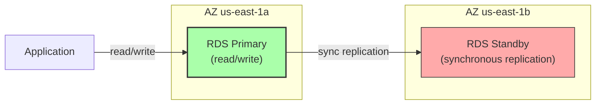

# 3. Regions and Availability Zones

> [!info] Chapter Context
> Building on [[2. AWS Global Infrastructure]], this note goes deeper into how to choose regions, how AZs work under the hood, and how to design multi-AZ architectures for high availability.

Related: [[2. AWS Global Infrastructure]] | [[4. The Shared Responsibility Model]] | [[12 - AWS Networking/1. VPC Fundamentals]]

---

## 1. How to Choose a Region

The decision matrix has four main factors:

### 1.1 Latency to Your Users

If your users are in a specific geographic area, pick the closest region. Use CloudFront for static content (serves from edge locations worldwide) and consider multi-region deployment for global low-latency dynamic content.

```bash
# Measure latency from your machine to AWS regions
for region in us-east-1 eu-west-1 ap-northeast-1 ap-south-1; do
  echo -n "$region: "
  curl -o /dev/null -s -w "Connect: %{time_connect}s  Total: %{time_total}s\n" \
    https://ec2.${region}.amazonaws.com
done
```

### 1.2 Compliance and Data Sovereignty

- **GDPR** — EU user data must be processed and stored in the EU.
- **HIPAA** — US healthcare data has specific requirements.
- **Government** — US government workloads must use GovCloud.
- **China** — Chinese data must stay in China (cn-north-1).

If you have users in multiple jurisdictions, you may need multiple regions with data partitioned by user location.

### 1.3 Service Availability

Not all AWS services are available in all regions. New services launch in `us-east-1` first, then roll out to other regions. Check the [AWS Regional Services List](https://aws.amazon.com/about-aws/global-infrastructure/regional-product-services/) before committing.

### 1.4 Cost

Pricing varies by region. The same EC2 instance may cost 10-20% more in one region vs. another. Generally:

- `us-east-1` (N. Virginia) — Cheapest, broadest service availability.
- `us-west-2` (Oregon) — Slightly cheaper than us-east-1 for some services.
- `eu-west-1` (Ireland) — Most expensive EU region.
- Remote regions (Cape Town, Bahrain) — Often more expensive due to lower scale.

### 1.5 Other Considerations

- **Disaster recovery** — Use a second region for failover. Pick one in a different geography.
- **Skills and documentation** — Most tutorials assume `us-east-1`. Easier for beginners.
- **Latency between regions** — Cross-region replication adds latency; consider for global apps.

---

## 2. AZ Internals

### 2.1 What an AZ Actually Is

An AZ is one or more data centers with:

- **Independent power** — Separate substations, backup generators.
- **Independent cooling** — Separate HVAC.
- **Independent networking** — Separate connections to the internet and to other AZs.

They are connected to each other with high-bandwidth, low-latency fiber (typically <2 ms round-trip).

### 2.2 AZ IDs vs. AZ Names

AWS maps AZ names (`us-east-1a`, `us-east-1b`) to physical AZs **per account**. Your `us-east-1a` may be a different physical data center than another account's `us-east-1a`. This is intentional — it spreads load evenly.

For cross-account architectures, use **AZ IDs** (`use1-az1`, `use1-az2`), which are consistent across accounts in the same region.

```bash
aws ec2 describe-availability-zones --region us-east-1 \
  --query 'AvailabilityZones[*].[ZoneName,ZoneId]' --output table
```

```
---------------------------------------
|         describe-availability-zones        |
+--------------+---------------------+
|  us-east-1a  |  use1-az1           |
|  us-east-1b  |  use1-az2           |
|  us-east-1c  |  use1-az3           |
|  us-east-1d  |  use1-az4           |
|  us-east-1e  |  use1-az5           |
|  us-east-1f  |  use1-az6           |
+--------------+---------------------+
```

### 2.3 AZ-Level Failures

AZ-level outages happen. Examples:

- A power failure in one AZ takes down all instances in that AZ.
- A network issue isolates an AZ from the rest of the region.
- A fiber cut between AZs (rare, but possible).

For high availability, design your application to survive the loss of any single AZ. Run in at least 2 AZs (ideally 3+).

---

## 3. Multi-AZ Design Patterns

### 3.1 Stateless Web Tier



- An Application Load Balancer distributes traffic across instances in multiple AZs.
- If AZ-a fails, the ALB stops routing to instances in AZ-a; traffic continues to AZ-b and AZ-c.
- Use an Auto Scaling Group to maintain capacity.

### 3.2 Database Multi-AZ

RDS Multi-AZ creates a synchronous standby in another AZ:



- The primary handles all reads and writes.
- The standby is a hot standby (not readable in basic Multi-AZ; readable in Multi-AZ with read replicas).
- If the primary fails, RDS automatically promotes the standby (typically 60-120 seconds of downtime).

### 3.3 Multi-AZ Storage

- **S3** — Automatically stores data across 3+ AZs. You do nothing; it is built-in.
- **EBS** — Volumes are stored in a single AZ. To replicate, use EBS snapshots (cross-AZ) or EBS-modified volumes.
- **EFS** — Multi-AZ by design; accessible from EC2 instances in any AZ in the region.
- **DynamoDB** — Automatically replicates across 3 AZs. Built-in.

---

## 4. Multi-Region Architectures

### 4.1 When to Go Multi-Region

- **Global user base** — Users in multiple continents need low latency.
- **Disaster recovery** — If a region fails entirely, fail over to another.
- **Compliance** — Data must stay in specific jurisdictions.

### 4.2 Multi-Region Patterns

- **Active-Passive** — Primary region serves all traffic; secondary region is a standby. Failover manually or via Route 53 health checks.
- **Active-Active** — Both regions serve traffic. More complex (data synchronization, conflict resolution).

### 4.3 Cross-Region Replication

- **S3 Cross-Region Replication** — Automatically replicate new objects to a bucket in another region.
- **DynamoDB Global Tables** — Replicate tables across regions; any region can read and write.
- **RDS Cross-Region Read Replicas** — Asynchronous replication to a read replica in another region; can be promoted to primary on failover.
- **Aurora Global Database** — Synchronous within a region, asynchronous across regions. Typically <1 second replication lag.

---

## 5. Common Student Mistakes

> [!warning] Mistake 1 — Single-AZ "Production" Deployments
> A single AZ is a single point of failure. Always use at least 2 AZs for production.

> [!warning] Mistake 2 — Forgetting AZ IDs for Cross-Account Architectures
> If you peer VPCs across accounts and use AZ names, you may end up in different physical AZs. Use AZ IDs.

> [!warning] Mistake 3 — Multi-Region for No Reason
> Multi-region adds cost and complexity. Use it only when latency, DR, or compliance requires it.

> [!warning] Mistake 4 — Forgetting Cross-Region Data Transfer Costs
> Data transfer between regions is not free (~$0.02/GB). For high-traffic multi-region apps, this adds up.

---

## 6. Summary Checklist

- [ ] Choose a region based on latency, compliance, service availability, cost.
- [ ] AZs are independent failure domains within a region.
- [ ] AZ names are account-specific; use AZ IDs for cross-account consistency.
- [ ] For production, deploy across at least 2-3 AZs.
- [ ] Stateless web tier: ALB + EC2 Auto Scaling Group across AZs.
- [ ] Database: RDS Multi-AZ for synchronous standby; DynamoDB replicates automatically.
- [ ] S3 and EFS are multi-AZ by default; EBS is single-AZ.
- [ ] Multi-region: only when latency, DR, or compliance requires it.

---

Previous: [[2. AWS Global Infrastructure]] | Next: [[4. The Shared Responsibility Model]]
