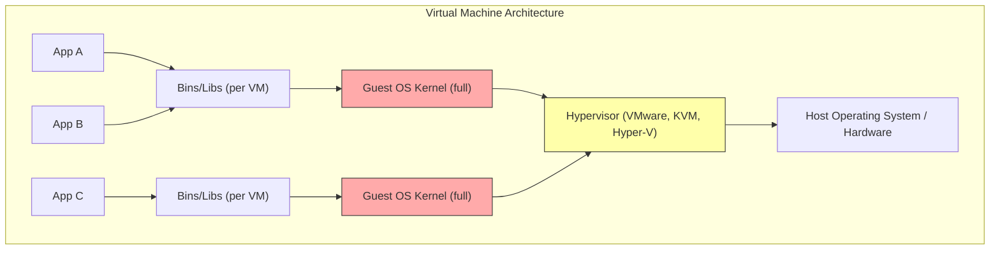
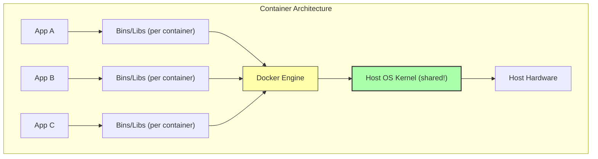

# 1. What is Docker

> [!info] Chapter Context
> This is the **first note** in the Docker chapter. Before reading this, you should be comfortable with basic Linux commands and the idea of a "process" on an operating system. After this note, you will understand *why* Docker exists, *what* a container actually is at a conceptual level, and *how* containers differ from virtual machines.

Related: [[2. Installing Docker]] | [[3. Images and Containers]] | [[Quizzes/Quiz 1 - Containers and Virtualization]]

---

## 1. The Problem Docker Was Built to Solve

Before Docker, software engineers lived with a recurring nightmare known as the **"Works on My Machine"** problem. The scenario always looked the same: a developer would build an application on their laptop, test it thoroughly, watch every test pass, and then confidently hand it to a colleague or deploy it to a production server — only to discover that the application crashed, behaved strangely, or refused to start at all. The classic excuse was, *"But it works on my machine!"*

### 1.1 Why Environments Drift

The root cause of this problem is **environment drift**. An application does not run in a vacuum; it depends on a stack of surrounding software that includes the operating system version, the language runtime (Node.js, Python, Java, PHP), specific library versions, system-level dependencies (such as `libssl` or `glibc`), environment variables, configuration files, and even the directory structure on disk. When any one of these elements differs between two machines, the application may behave differently. The drift is usually invisible to the developer because their laptop happens to have the correct versions installed, while the production server has slightly older or newer versions.

### 1.2 The Manual Setup Nightmare

In the pre-container era, onboarding a new developer onto a project meant following a multi-page "setup guide" that instructed them to install specific versions of every dependency, set environment variables, configure databases, and hope nothing collided with other projects on the same machine. The process was:

- **Time-consuming** — often taking an entire day or more.
- **Error-prone** — a single missed step would cause cryptic errors hours later.
- **Conflict-prone** — if Project A needed Node.js 16 and Project B needed Node.js 18, the developer had to juggle version managers like `nvm`, `pyenv`, or `rvm`.
- **Repetitive** — every new team member repeated the same pain.

Docker eliminates this entire category of problems by packaging the application **together with everything it needs to run**.

---

## 2. What Is a Container, Conceptually

A **container** is a standardized, self-contained package that bundles an application's source code together with its runtime, system libraries, configuration files, and any other dependencies it needs to execute. When you start a container, the application inside it runs in an environment that is **isolated** from the host machine and from other containers, even though it shares the host's operating system kernel.

### 2.1 The Shipping Container Analogy

The name "container" is borrowed from the shipping industry. Before standardized shipping containers were invented in the 1950s, cargo was loaded onto ships in all shapes and sizes — barrels, sacks, crates — and each had to be handled individually. The invention of the standard 40-foot steel container meant that any cargo could be packed into a uniform box, and any ship, train, or truck built to handle that box could transport it without caring what was inside.

Docker applies the same idea to software. A Docker container is a uniform box: any application — whether it is a Node.js web server, a Python machine-learning pipeline, or a PostgreSQL database — can be packed inside, and any machine running Docker can run that box without caring about the contents.

### 2.2 What Goes Inside a Container

A container packages the following elements together:

- **Application source code** — the actual `.js`, `.py`, `.go`, or `.java` files.
- **Language runtime** — Node.js 18.4, Python 3.11, Go 1.21, etc.
- **System libraries** — `libssl`, `libcurl`, `libc`, and so on.
- **Application dependencies** — anything from `npm`, `pip`, `maven`, `cargo`, etc.
- **Configuration files** — `nginx.conf`, `my.cnf`, `.env` files baked into the image.
- **Environment variables and metadata** — set via the `ENV` instruction in the Dockerfile.

### 2.3 What a Container Does NOT Contain

A container does **not** contain a full operating system kernel. This is the single most important conceptual difference between a container and a virtual machine, and it is explained in detail in section 4 below. The container reuses the host's kernel; it only brings along the userspace tools and libraries it needs.

---

## 3. How Containers Provide Isolation

Isolation means that a containerized process cannot see, affect, or be affected by other processes on the host machine or in other containers. Each container has its own:

- **Process tree** — `ps aux` inside a container shows only the processes started inside that container, not the hundreds of processes running on the host.
- **Network stack** — each container gets its own internal IP address, its own loopback interface (`lo`), and its own set of listening ports.
- **Filesystem** — the container sees a filesystem built from the image layers, not the host's `/` directory.
- **Users and groups** — a container can have its own `/etc/passwd` and `/etc/group`, so user IDs inside the container do not necessarily correspond to users on the host.
- **Inter-process communication (IPC) namespace** — containers cannot accidentally read shared memory from other containers.

> [!note] Isolation Is Implemented by the Linux Kernel
> The isolation features just listed are not invented by Docker. They are Linux kernel features called **namespaces** (for visibility isolation) and **cgroups** (for resource isolation). Docker simply orchestrates these kernel primitives to create a container. The deep dive on this is in [[1.1 Container Isolation Internals]].

### 3.1 The Benefits of Isolation

The practical payoff of isolation is enormous:

1. **Consistency** — the container's environment is identical whether it runs on a developer's laptop, a CI server, or a production server in AWS.
2. **Conflict avoidance** — Project A's container can run Node.js 16 while Project B's container runs Node.js 18, on the same machine, without conflict.
3. **Simplified onboarding** — a new team member only needs to install Docker; the rest of the environment comes inside the container.
4. **Production parity** — the same container image that was tested in staging can be deployed to production, eliminating an entire class of "it worked in staging" bugs.

---

## 4. Containers vs. Virtual Machines

Beginners frequently confuse containers with virtual machines (VMs) because both provide isolated environments. They are architecturally very different, however, and understanding the difference is essential.

### 4.1 What a Virtual Machine Is

A virtual machine is a full computer simulated in software. A VM runs a complete operating system — including its own kernel — on top of a **hypervisor** (such as VMware, VirtualBox, KVM, or Hyper-V). The hypervisor translates the VM's virtual hardware calls into real hardware calls on the host.

### 4.2 What a Container Is (Architecturally)

A container is **not** a virtual machine. It is a regular Linux process (or group of processes) that has been isolated by the kernel using namespaces and cgroups. The container shares the host's kernel; it does not boot its own. The container only carries the userspace libraries and binaries it needs.

### 4.3 Side-by-Side Comparison

| Property | Virtual Machine | Container |
| :--- | :--- | :--- |
| **Kernel** | Each VM has its own full kernel. | All containers share the host's kernel. |
| **Boot time** | Minutes (a full OS must boot). | Milliseconds to seconds (just process start). |
| **Resource overhead** | Heavy — each VM reserves RAM and disk for the guest OS. | Light — containers consume only what the application needs. |
| **Isolation strength** | Strong — full hardware-level isolation via hypervisor. | Weaker — isolation is at the OS level via namespaces. |
| **Density per host** | Low (typically a few VMs per host). | High (hundreds of containers per host). |
| **Cross-OS support** | A Linux VM can run on a Windows host and vice versa. | A Linux container requires a Linux kernel (Windows containers require Windows). |
| **Image size** | Gigabytes (full OS included). | Megabytes (only userspace libraries). |

### 4.4 When to Use Each

Containers are the default choice for **application deployment** because they are lightweight, fast, and portable. They excel at running microservices, web servers, batch jobs, CI pipelines, and developer environments.

Virtual machines remain the right choice when:

- You need to run a **different operating system** than the host (e.g., Windows on a Linux host).
- You need **hardware-level isolation** for security (e.g., multi-tenant cloud environments where customers must not share a kernel).
- You need to run software that requires **direct kernel access** or kernel modules not present on the host.

In practice, most modern cloud infrastructure uses **both**: VMs provide the security boundary between customers, and containers provide the deployment unit inside each VM. This is exactly how AWS ECS, AWS Fargate, and Kubernetes on EKS work.

> [!tip] Remember This
> A VM virtualizes the **hardware**. A container virtualizes the **operating system**. That single sentence captures 90% of the architectural difference.

---

## 5. Docker the Platform vs. Docker the Company

The word "Docker" is overloaded and refers to several related things. It is worth disentangling them now to avoid confusion later.

- **Docker, the company** — The original company (now called Docker, Inc.) that created the Docker tooling and popularized containers starting around 2013.
- **Docker Engine** — The runtime daemon (`dockerd`) that actually builds, runs, and manages containers. This is the core piece. It is open source.
- **Docker CLI** — The `docker` command-line tool that you type into your terminal. It talks to the daemon.
- **Docker Desktop** — A bundled desktop application (Mac, Windows, Linux) that includes the Docker Engine, the CLI, Docker Compose, a GUI dashboard, and (on Mac/Windows) a hidden Linux VM to run Linux containers.
- **Docker Hub** — A public registry where people publish and download container images. It is to containers what GitHub is to source code.
- **Docker Compose** — A separate tool for defining multi-container applications in a YAML file.
- **Dockerfile** — A text file format used to define how to build an image.

When someone says "I installed Docker," they almost always mean they installed **Docker Desktop** (on Mac/Windows) or the **Docker Engine package** (on Linux). Both provide the `docker` CLI and the daemon.

---

## 6. Docker in the Cloud Engineering Journey

This chapter is part of a larger roadmap to learn AWS through LocalStack. Docker is foundational here because almost every modern cloud service is built on containers or container-like concepts:

- **AWS ECS and EKS** run Docker containers directly.
- **AWS Fargate** is a serverless container runtime — you give it a Docker image, AWS runs it.
- **AWS Lambda** uses a container-like execution environment internally; you can also deploy Lambda functions from container images.
- **LocalStack itself runs inside a Docker container** — to learn LocalStack, you must first be comfortable with Docker.
- **CI/CD pipelines** (GitHub Actions, GitLab CI) all run their jobs inside containers.

If you understand Docker deeply, you will understand 80% of how modern cloud platforms deploy and run code. The remaining 20% is the cloud-specific orchestration layer (ECS, EKS, Lambda, Fargate), which we cover in later chapters.

---

## 7. Common Student Mistakes

> [!warning] Misconception 1 — "A container is a tiny VM"
> A container is **not** a tiny VM. A VM boots its own kernel; a container does not. This is why a Linux container cannot run on a Windows host without a hidden Linux VM underneath (which is what Docker Desktop provides on Windows via WSL 2). Conflating containers with VMs leads to wrong mental models around networking, persistence, and security.

> [!warning] Misconception 2 — "Containers are inherently secure"
> Containers provide **isolation**, but isolation is not the same as security. Because containers share the host kernel, a kernel vulnerability can potentially allow a container to "escape" onto the host. Containers are secure *enough* for most workloads, but for true multi-tenant isolation, VMs (or AWS Nitro Enclaves) are stronger. We cover this in detail in [[8. Docker Security]].

> [!warning] Misconception 3 — "I can run any OS in any container"
> A Linux container requires a Linux kernel to run. A Windows container requires a Windows kernel. You cannot run a Windows container on a Linux host directly. This is why Docker Desktop on Windows can run Linux containers — it spins up a tiny Linux VM (via WSL 2) under the hood.

> [!warning] Misconception 4 — "Docker replaces virtualenv / nvm"
> Docker can replace version managers like `nvm` or `pyenv` for project isolation, but it does not replace the **runtime itself**. Inside the container, the runtime is still installed normally; Docker just makes sure it is the exact version you specified in the image, isolated from the host.

---

## 8. Summary Checklist

- [ ] The "Works on My Machine" problem is caused by environment drift between development, staging, and production.
- [ ] A container bundles the application code, runtime, libraries, and configuration into one portable unit.
- [ ] A container does **not** include a kernel — it shares the host's kernel.
- [ ] Containers use Linux kernel features (namespaces and cgroups) to provide isolation.
- [ ] A VM virtualizes hardware and runs a full guest OS; a container virtualizes the OS and shares the kernel.
- [ ] Containers are lightweight, fast to start, and dense; VMs are heavy, slow, but more strongly isolated.
- [ ] Docker (the platform) consists of Docker Engine, Docker CLI, Docker Desktop, Docker Hub, Docker Compose, and Dockerfiles.
- [ ] Understanding Docker is foundational for learning ECS, EKS, Fargate, Lambda, and LocalStack.

---

Previous: (this is the first note in the Docker chapter) | Next: [[1.1 Container Isolation Internals]]
