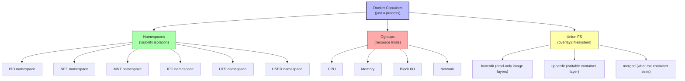
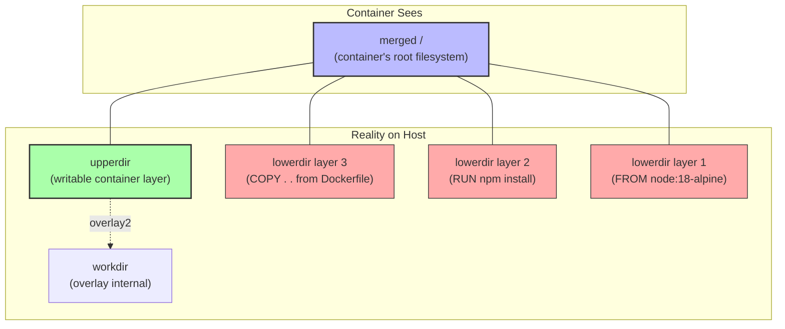

# 1.1 Container Isolation Internals

> [!info] Why This Note Exists
> The previous note ([[1. What is Docker]]) said containers "isolate" processes, but did not explain *how*. This note goes under the hood. You will learn that containers are not magic — they are ordinary Linux processes wrapped in kernel features called **namespaces**, **cgroups**, and a **union filesystem**. After reading this, the word "container" will lose its mystery.

Related: [[1. What is Docker]] | [[2. Installing Docker]] | [[3. Images and Containers]] | [[8. Docker Security]]

---

## 1. Containers Are Not Magic — They Are Just Processes

This is the single most important sentence in this entire note: **a Docker container is a regular Linux process.** Or more precisely, a container is a tree of regular Linux processes that have been placed inside a set of kernel namespaces and assigned to a cgroup.

If you start an Nginx container on a Linux host and then run `ps aux | grep nginx` on the **host**, you will see the Nginx process listed — it has a real PID, a real UID, and a real memory footprint. The container is not a separate "thing"; it is just a process that has been told it lives in a smaller world than the rest of the host.

Everything that feels magical about containers — the isolated filesystem, the isolated network, the isolated process list — is the result of three Linux kernel features working together:

1. **Namespaces** — limit what a process can *see*.
2. **Control groups (cgroups)** — limit what a process can *use*.
3. **Union filesystems (overlay2)** — compose the filesystem the process sees from stacked read-only layers plus a thin writable layer.

Docker itself does not implement any of these. Docker is a user-friendly wrapper around these kernel features. The same features are used by Podman, containerd, CRI-O, LXC, and every other container runtime.



---

## 2. Linux Namespaces — What a Container Can See

A **namespace** wraps a global system resource so that processes inside the namespace think they have their own isolated instance of that resource. The Linux kernel currently provides eight namespace types; Docker uses six of them by default for every container.

### 2.1 The Six Standard Namespaces

| Namespace | Isolates | Inside the container, you see… | Created via syscall |
| :--- | :--- | :--- | :--- |
| **PID** | Process IDs | Only the processes started inside the container; the first process is PID 1. | `CLONE_NEWPID` |
| **NET** | Network stack | A separate loopback interface, a separate eth0, separate routing table, separate iptables. | `CLONE_NEWNET` |
| **MNT** | Mount points | The container's own filesystem tree; host mounts are invisible. | `CLONE_NEWNS` |
| **IPC** | Inter-process communication | Separate POSIX message queues, shared memory segments, semaphores. | `CLONE_NEWIPC` |
| **UTS** | Hostname and domain name | The container can have its own hostname (e.g., `a1b2c3d4e5f6`). | `CLONE_NEWUTS` |
| **USER** | User and group IDs | UID 0 inside the container can map to UID 100000 outside (user namespace remapping). | `CLONE_NEWUSER` |

### 2.2 The PID Namespace in Action

On your host machine, run `ps aux | wc -l`. You will see hundreds of processes — `systemd`, `kthreadd`, `dbus`, your terminal, your browser, and so on. Now start a container and run the same command inside:

```bash
docker run --rm alpine ps aux
```

The output shows only a handful of processes — usually just `ps` itself, plus whatever the container started with. The container cannot see the host's `systemd` or your browser. From the container's point of view, it is the only thing running on the machine.

> [!note] Why PID 1 Matters Inside a Container
> The first process started inside a container becomes PID 1 in that container's PID namespace. PID 1 has special responsibilities in Linux: it receives orphaned child processes and is supposed to reap them. If your application does not handle SIGTERM correctly as PID 1, the container cannot be gracefully stopped. This is why tools like `tini` or `dumb-init` are sometimes prepended to the container's command — they act as a proper PID 1 that reaps zombies and forwards signals.

### 2.3 The NET Namespace in Action

Each container gets its own network namespace, which means:

- A separate `lo` (loopback) interface, so `127.0.0.1` inside the container refers to the container, not the host.
- A separate `eth0` interface, attached to a Docker bridge network, with its own private IP (typically `172.17.0.x` for the default bridge).
- A separate routing table and separate iptables rules.

This is why two containers can both listen on port 80 internally without conflict — they are in different network namespaces. To expose a container's port to the host, you must publish it with `-p 8080:80`, which sets up a DNAT rule on the host that forwards host port 8080 to the container's port 80.

### 2.4 The USER Namespace (and Why It Is Often Disabled)

The USER namespace allows UID mapping: UID 0 (root) inside the container can be mapped to a non-root UID (e.g., 100000) on the host. This is the foundation of **rootless Docker**, where even if an attacker escapes the container, they only have non-root privileges on the host.

The USER namespace is **disabled by default** in Docker because it breaks some compatibility assumptions (e.g., files on disk owned by root inside the container appear owned by `100000:100000` outside, which confuses bind mounts). Enabling it requires configuring `/etc/docker/daemon.json` with `"userns-remap": "default"`. Rootless Docker (run via `rootlesskit`) is a separate installation mode that uses user namespaces from the start.

> [!warning] User Namespace Caveat
> Even with user namespaces enabled, container processes still appear as their in-container UIDs when you `ps aux` on the host — but the kernel treats them as the mapped host UIDs for permission checks. This is confusing the first time you see it.

---

## 3. Control Groups (cgroups) — What a Container Can Use

Namespaces limit *visibility*; **cgroups** limit *consumption*. Without cgroups, a single container could consume all the CPU and memory on the host, starving every other container and the host itself. Cgroups are the kernel's resource accounting and enforcement mechanism.

### 3.1 cgroup v1 vs. cgroup v2

Linux has two cgroup versions:

- **cgroup v1** — One hierarchy per resource controller (`cpu`, `memory`, `blkio`, `net_cls`, etc.). A process can be in different cgroups for different controllers. This was flexible but messy and inconsistent.
- **cgroup v2** — A single unified hierarchy. All controllers share the same tree. This is cleaner and is the default on modern kernels (Linux 5.10+).

Docker auto-detects which version is available. On a modern Ubuntu 22.04+ or Debian 12+ system, you are almost certainly on cgroup v2.

### 3.2 Common Resource Limits

Docker exposes cgroup knobs via `docker run` flags. The most common ones:

```bash
# Limit the container to 1.5 CPU cores and 512 MB of RAM
docker run --cpus=1.5 --memory=512m nginx

# Limit CPU shares (relative weight, default 1024)
docker run --cpu-shares=512 nginx

# Limit to specific CPU cores 0 and 1
docker run --cpuset-cpus=0,1 nginx

# Limit read I/O to 10 MB/s on /dev/sda
docker run --device-read-bps=/dev/sda:10mb nginx

# Limit the number of PIDs the container can create (anti-fork-bomb)
docker run --pids-limit=200 nginx

# OOM-kill preference (negative = less likely to be killed)
docker run --oom-score-adj=-500 nginx
```

### 3.3 How Limits Are Enforced

When a container hits its memory limit, the kernel's OOM (Out-Of-Memory) killer will kill a process inside the container — usually the one consuming the most memory, which is often your application. This is why a container that suddenly disappears with exit code 137 was OOM-killed.

CPU limits work differently. The kernel uses the Completely Fair Scheduler (CFS) with bandwidth control. `--cpus=1.5` means the container gets 1.5 CPU-seconds of runtime every scheduler period. If it tries to use more, it is throttled (paused) until the next period. The application does not crash; it just runs slower.

> [!tip] Verify cgroup Limits Inside a Container
> You can see the cgroup limits from inside a container by reading `/sys/fs/cgroup/`. For example, `cat /sys/fs/cgroup/memory.max` (cgroup v2) shows the memory limit in bytes. On cgroup v1, look at `/sys/fs/cgroup/memory/memory.limit_in_bytes`.

---

## 4. Union Filesystems and overlay2

The third pillar of container isolation is the filesystem. A container needs a filesystem that:

1. **Looks like a complete Linux filesystem** to the application (`/bin`, `/lib`, `/usr`, `/etc`, etc.).
2. **Is read-only** for the image layers (so the image is immutable and can be shared by many containers).
3. **Allows the container to write files** without modifying the underlying image.

The kernel feature that provides this is a **union filesystem**, which stacks multiple directories on top of each other to present a single merged view. Docker's default is **overlay2** (the second version of the OverlayFS driver).

### 4.1 The Four Directories of overlay2

When Docker starts a container, the overlay filesystem is assembled from four directories on the host:

- **`lowerdir`** — A colon-separated list of the read-only image layers (the layers from `FROM`, `RUN`, `COPY`, etc.). The topmost layer is checked first when looking up a file.
- **`upperdir`** — The container's writable layer. Any file the container creates or modifies goes here.
- **`workdir`** — An internal overlay working directory used by the kernel for atomic operations.
- **`merged`** — The final merged view, which is what the container sees as its `/`.



### 4.2 Copy-on-Write (CoW) Behavior

When the container reads a file, overlay2 checks the layers top-down: first `upperdir`, then each `lowerdir` from newest to oldest. The first match wins. When the container **writes** to a file that exists in a `lowerdir`, overlay2 does **copy-up**: it copies the file from the lower layer to the `upperdir`, then modifies the copy. The original lower-layer file is untouched. This is the same copy-on-write principle used by `git` and copy-on-write filesystems like Btrfs and ZFS.

When the container **deletes** a file that exists in a lower layer, overlay2 creates a **whiteout** file in the `upperdir` — a special character device that masks the lower-layer file. The lower-layer file is still there; it is just hidden from the merged view.

> [!tip] See overlay2 in Action
> Run a container, modify a file inside, then inspect the container with `docker inspect <container>` and look at the `GraphDriver.Data` field. You will see `LowerDir`, `UpperDir`, `MergedDir`, and `WorkDir` paths. The host paths point to `/var/lib/docker/overlay2/<hash>/`.

---

## 5. Capabilities and Seccomp — Beyond Namespaces

Namespaces and cgroups are not enough for security. A container running as root still has the full power of root inside its namespace, which includes loading kernel modules (if the host kernel allows), accessing raw devices, and manipulating network configuration. To reduce this attack surface, Docker additionally applies **Linux capabilities** and **seccomp** filters.

### 5.1 Linux Capabilities

Historically, root had *all* privileges and non-root had *none*. Linux capabilities break root's power into ~40 distinct capabilities, each granting a specific privilege (`CAP_NET_BIND_SERVICE` to bind ports below 1024, `CAP_SYS_ADMIN` for general system administration, `CAP_NET_RAW` for raw sockets, etc.).

Docker **drops** many dangerous capabilities by default. A default container does **not** have `CAP_SYS_ADMIN`, `CAP_NET_ADMIN`, `CAP_SYS_MODULE`, `CAP_SYS_PTRACE`, and many others. You can add capabilities with `--cap-add` and remove them with `--cap-drop`:

```bash
# Allow the container to bind ports below 1024
docker run --cap-add=NET_BIND_SERVICE nginx

# Drop ALL capabilities, then add only the ones you need
docker run --cap-drop=ALL --cap-add=NET_BIND_SERVICE nginx
```

### 5.2 The `--privileged` Flag (Avoid It)

`docker run --privileged` disables almost all isolation: it grants all capabilities, disables seccomp filtering, gives access to all host devices, and turns off AppArmor protection. It is the equivalent of running the process directly on the host.

The only legitimate use cases for `--privileged` are:

- Running Docker-inside-Docker (the inner Docker needs full container privileges).
- Running low-level system tools that need direct hardware access (e.g., `iperf` with raw sockets in some configurations).

If you find yourself reaching for `--privileged`, ask whether you can instead add the specific capability you need with `--cap-add`.

### 5.3 Seccomp

**Seccomp** (Secure Computing Mode) filters the syscalls a process can invoke. Docker's default seccomp profile blocks about 44 of the ~330 syscalls in the Linux kernel, including obviously dangerous ones like `reboot`, `kexec_load`, `mount`, `umount`, `pivot_root`, and several obsolete or rarely-used syscalls. This means even if an attacker finds a vulnerability in your application, they cannot use that vulnerability to reboot the host or remount filesystems, because those syscalls return `EPERM`.

You can supply a custom seccomp profile with `--security-opt seccomp=/path/to/profile.json`, or disable seccomp entirely with `--security-opt seccomp=unconfined` (not recommended).

### 5.4 AppArmor and SELinux

On top of capabilities and seccomp, Linux distributions often ship with a Mandatory Access Control (MAC) system:

- **AppArmor** — Used by default on Ubuntu and Debian. Docker applies a default AppArmor profile that further restricts container actions.
- **SELinux** — Used by default on Fedora, RHEL, and CentOS. Docker applies SELinux labels to container processes and files.

These MAC systems provide defense-in-depth: even if a process has all the capabilities it wants, AppArmor/SELinux can still deny specific file accesses or socket operations.

---

## 6. Why This Matters for Cloud Engineering

You might be wondering why a cloud engineer needs to know all this low-level Linux detail. The answer is that almost every modern cloud service runs on these primitives:

- **AWS ECS and EKS** run your Docker containers on EC2 instances (or Fargate, which is essentially AWS-managed containerd).
- **AWS Lambda** runs your functions inside micro-VMs (Firecracker) that themselves use a stripped-down container-like execution environment.
- **Kubernetes** orchestrates containers across a cluster of machines; every Pod is one or more containers in shared namespaces.
- **LocalStack** runs entirely inside a single Docker container that simulates the AWS APIs.

When something goes wrong — a container is OOM-killed, a port is unreachable, a file permission error appears, a "Permission denied" message shows up in your Lambda logs — understanding namespaces, cgroups, and overlay2 lets you diagnose the root cause instead of guessing.

---

## 7. Common Student Mistakes

> [!warning] Mistake 1 — Assuming the Container Has Its Own Kernel
> It does not. The container uses the host's kernel. This is why a container built for `linux/amd64` will not run on an Apple Silicon Mac without Rosetta or QEMU emulation — the binaries must match the host's CPU architecture, even though the kernel is shared.

> [!warning] Mistake 2 — Believing `--privileged` Is Safe Because "It Is Still a Container"
> `--privileged` removes most of the isolation. A privileged container can typically escape to the host in seconds. Treat `--privileged` as equivalent to running the process directly on the host.

> [!warning] Mistake 3 — Confusing cgroups with Namespaces
> Namespaces hide things from the process (it cannot see them). Cgroups limit things the process can use (it cannot consume more than X). Both are needed; neither replaces the other.

> [!warning] Mistake 4 — Forgetting That Root Inside = Root Outside (Without UserNS)
> Without user namespace remapping, UID 0 inside a container is the same UID 0 on the host. If a process escapes the container (via a kernel exploit, for example), it has root privileges on the host. This is why running containers as non-root is so strongly recommended.

> [!warning] Mistake 5 — Thinking `docker stop` Is Polite to All Applications
> `docker stop` sends `SIGTERM` to PID 1 inside the container. If your application ignores `SIGTERM` (many Java apps do by default), Docker waits 10 seconds and then sends `SIGKILL`. The application gets no chance to clean up. Use `--stop-signal` and `--stop-timeout` to customize this.

---

## 8. Summary Checklist

- [ ] A container is an ordinary Linux process wrapped in namespaces, cgroups, and a union filesystem.
- [ ] The six standard namespaces are PID, NET, MNT, IPC, UTS, and USER.
- [ ] Cgroups limit CPU, memory, I/O, and PID consumption. cgroup v2 is the modern unified hierarchy.
- [ ] overlay2 stacks read-only image layers (lowerdir) and a writable container layer (upperdir) into a merged view.
- [ ] Copy-on-write means modifying a file in a lower layer copies it up to the upperdir; the original is untouched.
- [ ] Linux capabilities break root's power into ~40 distinct privileges; Docker drops dangerous ones by default.
- [ ] Seccomp filters syscalls; Docker's default profile blocks ~44 dangerous syscalls.
- [ ] AppArmor (Ubuntu/Debian) and SELinux (RHEL/Fedora) provide additional Mandatory Access Control.
- [ ] `--privileged` disables almost all isolation and should be avoided.
- [ ] Understanding these primitives is essential for debugging AWS ECS, EKS, Lambda, and LocalStack.

---

Previous: [[1. What is Docker]] | Next: [[2. Installing Docker]]
