# 2. Installing Docker

> [!info] Chapter Context
> This note walks through installing Docker on macOS, Windows, and Linux. The install path is genuinely different on each OS because containers need a Linux kernel. We will explain **why** the install differs, what **WSL 2** is on Windows, and how to verify your installation works.

Related: [[1. What is Docker]] | [[1.1 Container Isolation Internals]] | [[2.1 Docker Engine vs Docker Desktop]] | [[3. Images and Containers]]

---

## 1. Why Installation Differs by Operating System

Recall from [[1.1 Container Isolation Internals]] that a Linux container requires a **Linux kernel**. The kernel is what provides namespaces, cgroups, and overlay2 — the three pillars that make a container work. Without a Linux kernel, there is no way to run a Linux container.

This creates an asymmetry across operating systems:

- **Linux** — The host already has a Linux kernel. Docker runs natively, talking directly to the kernel. No virtualization needed.
- **macOS** — macOS has a kernel called XNU (a hybrid of Mach and BSD). It is *not* Linux. To run Linux containers, Docker must run a hidden Linux VM under the hood.
- **Windows** — The Windows NT kernel is also not Linux. Docker must run a hidden Linux environment via **WSL 2** (Windows Subsystem for Linux, version 2).

This is why Docker Desktop exists: it wraps the Linux VM, the Docker daemon, and a friendly GUI into one installable app for Mac and Windows. On Linux, you do not need Docker Desktop (though it is available); you can install Docker Engine directly.

```mermaid
graph TD
    subgraph "Linux (Native)"
        LinUser[User] --> LinCLI[Docker CLI]
        LinCLI --> LinDaemon["dockerd (Native Linux)"]
        LinDaemon --> LinKernel["Linux Kernel"]
        LinKernel --> LinContainers[Containers]
    end

    subgraph "macOS"
        MacUser[User] --> MacCLI[Docker CLI]
        MacCLI --> MacDaemon["dockerd inside VM"]
        MacDaemon --> MacVM["Linux VM (via HyperKit / Apple Virtualization Framework)"]
        MacVM --> MacContainers[Containers]
    end

    subgraph "Windows"
        WinUser[User] --> WinCLI[Docker CLI]
        WinCLI --> WinDaemon["dockerd inside WSL 2"]
        WinDaemon --> WSL2["WSL 2 Linux Kernel"]
        WSL2 --> WinContainers[Containers]
    end

    style LinKernel fill:#afa,stroke:#333,stroke-width:2px
    style MacVM fill:#ffa,stroke:#333
    style WSL2 fill:#ffa,stroke:#333
```



---

## 2. Docker Engine vs. Docker Desktop

There are two main ways to install Docker. The choice depends on your operating system and your role.

| Feature | Docker Engine | Docker Desktop |
| :--- | :--- | :--- |
| **Target audience** | Servers, sysadmins, Linux power users. | Developers on Mac/Windows/Linux. |
| **OS support** | Linux only (native). | macOS, Windows, Linux. |
| **Interface** | CLI only. | GUI dashboard + CLI. |
| **VM under the hood** | None (runs on the host kernel directly). | Yes — a Linux VM on Mac/Windows. |
| **Bundled tools** | `dockerd`, `docker` CLI, `docker-compose` plugin. | All of the above plus BuildKit, Kubernetes (single-node), Compose V2, extensions, image vulnerability scanning. |
| **Licensing** | Free, open source (Apache 2.0). | Free for personal use and small businesses; paid for large enterprises (250+ employees). |

> [!tip] Which One Should You Use?
> If you are a developer on a laptop, install **Docker Desktop**. It handles all the VM plumbing for you. If you are setting up a Linux server (e.g., an EC2 instance), install **Docker Engine** directly using the official Docker repository — it is lighter and starts faster.

---

## 3. Installing Docker on Linux

The exact commands vary by distribution. The steps below cover Debian/Ubuntu, which is the most common case for cloud engineers.

### 3.1 Remove Old Versions

Older versions of Docker were packaged as `docker`, `docker-engine`, `docker.io`, or `containerd`. Remove them to avoid conflicts:

```bash
sudo apt remove docker docker-engine docker.io containerd runc
```

### 3.2 Set Up the Repository

```bash
sudo apt update
sudo apt install -y ca-certificates curl gnupg lsb-release

# Add Docker's official GPG key
sudo mkdir -p /etc/apt/keyrings
curl -fsSL https://download.docker.com/linux/ubuntu/gpg | \
  sudo gpg --dearmor -o /etc/apt/keyrings/docker.gpg

# Add the repository
echo "deb [arch=$(dpkg --print-architecture) signed-by=/etc/apt/keyrings/docker.gpg] \
  https://download.docker.com/linux/ubuntu $(lsb_release -cs) stable" | \
  sudo tee /etc/apt/sources.list.d/docker.list > /dev/null
```

### 3.3 Install Docker Engine

```bash
sudo apt update
sudo apt install -y docker-ce docker-ce-cli containerd.io docker-buildx-plugin docker-compose-plugin
```

### 3.4 Run Docker Without `sudo`

By default, the Docker daemon socket (`/var/run/docker.sock`) is owned by `root:docker`. Add yourself to the `docker` group to avoid typing `sudo` before every `docker` command:

```bash
sudo usermod -aG docker $USER
newgrp docker   # apply the group change immediately in your current shell
```

> [!warning] Security Implication of the `docker` Group
> Members of the `docker` group can run any Docker command, including `docker run -v /:/host -it alpine sh`, which gives them full root access to the host filesystem. Treat membership in the `docker` group as equivalent to `sudo` access. On a shared server, do not add users to this group lightly.

### 3.5 Verify the Installation

```bash
docker run hello-world
```

If you see the message *"Hello from Docker! This message shows that your installation appears to be working correctly."*, your installation is functional.

---

## 4. Installing Docker Desktop on macOS

### 4.1 Choose the Right Architecture

Apple transitioned from Intel to Apple Silicon (M1, M2, M3, M4) starting in late 2020. The two CPU architectures require different Docker Desktop installers:

- **Intel Macs** — Download the "Mac with Intel chip" installer (`Docker.dmg` for x86_64).
- **Apple Silicon Macs** — Download the "Mac with Apple chip" installer (`Docker.dmg` for arm64).

> [!warning] Do Not Run the Wrong Architecture
> You can technically run the Intel version on Apple Silicon via Rosetta 2, but it will be much slower and many images will not work correctly. Always use the native arm64 installer on Apple Silicon. You can verify your Mac's architecture with `uname -m` in Terminal (`arm64` for Apple Silicon, `x86_64` for Intel).

### 4.2 Install Steps

1. Download the DMG from <https://www.docker.com/products/docker-desktop/>.
2. Double-click the DMG to mount it.
3. Drag the Docker whale icon into the Applications folder.
4. Open Docker from Launchpad or Spotlight.
5. The whale icon appears in the menu bar (top right). When the icon stops animating, Docker is ready.

### 4.3 Resource Allocation

Docker Desktop runs a Linux VM with a configurable amount of CPU and RAM. By default, it uses up to half your system resources. To change this:

1. Open Docker Desktop.
2. Click the gear icon (Settings).
3. Go to **Resources** → **Advanced**.
4. Adjust CPUs, Memory, Swap, and Disk image size.

For LocalStack development, allocate at least 4 GB of RAM and 2 CPUs.

---

## 5. Installing Docker Desktop on Windows (WSL 2)

### 5.1 What Is WSL 2?

**WSL 2** (Windows Subsystem for Linux, version 2) is a Microsoft technology that runs a real Linux kernel inside a lightweight VM on Windows. Unlike traditional VMs (VirtualBox, VMware), WSL 2 boots in seconds, integrates with the Windows filesystem, and has near-native performance.

Docker Desktop on Windows uses WSL 2 as the Linux environment to run containers. This is much faster and more compatible than the older Hyper-V backend Docker used previously.

### 5.2 Prerequisites

- Windows 10 version 2004+ (Build 19041+) or Windows 11.
- Hardware virtualization enabled in BIOS (VT-x / AMD-V).
- At least 4 GB of RAM.

### 5.3 Step-by-Step Installation

#### Phase 1 — Enable WSL 2

Open **PowerShell as Administrator** and run:

```powershell
wsl --install
```

On recent Windows 11 builds, this single command enables WSL 2, the Virtual Machine Platform feature, and installs Ubuntu by default. Restart your computer when prompted.

On older Windows 10 builds, you may need to enable the features manually:

```powershell
dism.exe /online /enable-feature /featurename:Microsoft-Windows-Subsystem-Linux /all /norestart
dism.exe /online /enable-feature /featurename:VirtualMachinePlatform /all /norestart
```

Then restart, download the WSL 2 Linux kernel update package from Microsoft, and set the default version:

```powershell
wsl --set-default-version 2
```

#### Phase 2 — Install a Linux Distribution

Open the **Microsoft Store**, search for **Ubuntu**, and install it. Launch it once to create a Unix username and password (these do not need to match your Windows login).

#### Phase 3 — Install Docker Desktop

1. Download Docker Desktop for Windows from <https://www.docker.com/products/docker-desktop/>.
2. Run the installer. Make sure **"Use WSL 2 instead of Hyper-V"** is checked.
3. Restart if prompted.
4. Open Docker Desktop. The whale icon appears in the system tray (bottom right).

#### Phase 4 — Configure WSL Integration

In Docker Desktop settings → **Resources** → **WSL Integration**, you can enable Docker integration for each installed WSL distribution (Ubuntu, Debian, etc.). When enabled, the `docker` CLI is available inside that WSL distribution, talking to the Docker daemon running in the hidden `docker-desktop` WSL distribution.

### 5.4 Verifying the Installation

Open either PowerShell or an Ubuntu WSL terminal and run:

```bash
docker run hello-world
```

You should see the same "Hello from Docker!" message.

---

## 6. The Docker Desktop Dashboard

Docker Desktop provides a GUI dashboard with three main tabs:

1. **Containers** — Lists all running and stopped containers. You can start, stop, restart, delete, view logs, and open a shell into a container from here.
2. **Images** — Lists all images stored locally. You can run, inspect, or remove images.
3. **Volumes** — Lists named volumes. You can inspect or delete them.

The dashboard is convenient for beginners, but everything it does can also be done from the CLI. As you become more proficient, you will likely use the CLI for everything except quick visual inspection.

---

## 7. Common Installation Pitfalls

> [!warning] "Cannot connect to the Docker daemon"
> This error usually means either the Docker daemon is not running (start Docker Desktop or run `sudo systemctl start docker` on Linux) or your user is not in the `docker` group on Linux (add yourself with `sudo usermod -aG docker $USER` and log out/in).

> [!warning] "Permission denied while trying to connect to the Docker daemon socket"
> Same root cause as above — your user is not in the `docker` group. Either add yourself to the group or prefix every `docker` command with `sudo`.

> [!warning] Slow Builds on macOS with Bind Mounts
> Bind mounts on macOS go through a file synchronization layer between the host filesystem and the Linux VM. This used to be notoriously slow (via gRPC-FUSE). Recent Docker Desktop versions use **VirtioFS** by default, which is much faster. Ensure VirtioFS is enabled in Settings → General → "Choose file sharing implementation for your containers."

> [!warning] WSL 2 Out of Disk Space
> WSL 2 stores its virtual disk in a `.vhdx` file that grows but does not automatically shrink. If your `C:` drive fills up, you can compact the disk with `wsl --shutdown` followed by `Optimize-VHD` in PowerShell (Hyper-V required). Docker Desktop also has a "Clean / Purge data" option in Settings → Resources → Advanced.

> [!warning] Apple Silicon and `linux/amd64` Images
> If you try to run an `amd64`-only image on Apple Silicon, Docker will warn you and run it via QEMU emulation, which is slow and may crash. Prefer `arm64` images or multi-arch images when possible. You can also force `amd64` with `docker run --platform linux/amd64`, but performance will suffer.

---

## 8. Verifying Your Installation Works

Run these four commands to confirm everything is healthy:

```bash
# 1. Docker CLI version
docker version

# 2. Daemon info (kernel version, storage driver, cgroup version)
docker info

# 3. Run a test container
docker run --rm hello-world

# 4. Run a real container and access it from your browser
docker run -d -p 8080:80 --name nginx-test nginx
curl http://localhost:8080
docker rm -f nginx-test
```

If all four succeed, you are ready to proceed to [[3. Images and Containers]].

---

## 9. Summary Checklist

- [ ] Containers need a Linux kernel. Linux has it natively; macOS and Windows do not.
- [ ] Docker Desktop wraps a Linux VM (HyperKit on Mac, WSL 2 on Windows) plus the Docker daemon and CLI.
- [ ] Docker Engine is the bare-bones Linux-only install, suitable for servers.
- [ ] On Linux, add yourself to the `docker` group to run `docker` without `sudo`.
- [ ] On Windows, WSL 2 is the modern, fast backend for Docker Desktop.
- [ ] On macOS, choose the installer matching your CPU (Intel vs. Apple Silicon).
- [ ] Docker Desktop allocates a fixed share of CPU/RAM to its Linux VM — adjust in Settings → Resources.
- [ ] Verify with `docker version`, `docker info`, and `docker run hello-world`.

---

Previous: [[1.1 Container Isolation Internals]] | Next: [[2.1 Docker Engine vs Docker Desktop]]
