# 2.1 Docker Engine vs Docker Desktop

> [!info] Chapter Context
> [[2. Installing Docker]] mentioned that there are two installation paths: Docker Engine and Docker Desktop. This note goes deeper into the differences, when to use each, and what is actually running under the hood in each case.

Related: [[2. Installing Docker]] | [[3. Images and Containers]] | [[9. Registries and Distribution]]

---

## 1. The Two Installation Models

When people say "Docker," they often mean different things. Two distinct installation models exist, and they are not interchangeable.

### 1.1 Docker Engine

Docker Engine is the open-source **runtime** — the daemon (`dockerd`) that actually builds and runs containers, plus the `docker` CLI client. It runs **natively on Linux only**, talking directly to the Linux kernel's namespaces, cgroups, and overlay2.

Docker Engine is what you install on a production Linux server. It is lightweight, starts in milliseconds, and consumes almost no idle resources.

### 1.2 Docker Desktop

Docker Desktop is a **bundled developer product**. On Mac and Windows, it includes:

- A Linux VM (HyperKit on Intel Macs, Apple Virtualization Framework on Apple Silicon, WSL 2 on Windows).
- The Docker Engine, running inside that VM.
- The `docker` CLI, running on the host and pointing at the VM's daemon.
- Docker Compose V2 (as a CLI plugin).
- Docker BuildKit (modern, parallel build engine).
- A single-node Kubernetes cluster (optional, for local testing).
- A GUI dashboard.
- Image vulnerability scanning (via Trivy or Snyk, depending on version).
- Extension marketplace.

On Linux, Docker Desktop also exists and runs inside a Linux VM (for consistency across developer machines), but most Linux developers just use Docker Engine directly.

---

## 2. Architectural Comparison

```mermaid
graph TD
    subgraph "Docker Engine (Linux Server)"
        DE_CLI["docker CLI"]
        DE_Daemon["dockerd"]
        DE_Containerd["containerd"]
        DE_Kernel["Linux Kernel"]
        DE_CLI --> DE_Daemon
        DE_Daemon --> DE_Containerd
        DE_Containerd --> DE_Kernel
    end

    subgraph "Docker Desktop (Mac/Windows)"
        DD_CLI["docker CLI (host)"]
        DD_Context["Docker context: desktop-linux"]
        DD_VM["Linux VM (HyperKit / WSL 2 / VZF)"]
        DD_Daemon["dockerd (inside VM)"]
        DD_Containerd["containerd (inside VM)"]
        DD_Kernel["Linux Kernel (inside VM)"]
        DD_CLI --> DD_Context
        DD_Context --> DD_VM
        DD_VM --> DD_Daemon
        DD_Daemon --> DD_Containerd
        DD_Containerd --> DD_Kernel
    end

    style DE_Kernel fill:#afa,stroke:#333
    style DD_Kernel fill:#ffa,stroke:#333
    style DD_VM fill:#bbf,stroke:#333,stroke-width:2px
```



The key observation: Docker Engine talks to the host kernel directly. Docker Desktop introduces a Linux VM between the daemon and the real hardware. The VM is invisible to you as a user, but it is there, consuming memory and CPU even when no containers are running.

---

## 3. When to Use Each

### 3.1 Use Docker Engine When

- You are setting up a **production Linux server** (EC2, ECS-optimized AMI, bare metal).
- You are running Docker in **CI/CD pipelines** (GitHub Actions runners, GitLab CI).
- You are configuring a **Kubernetes worker node** — Kubernetes uses `containerd` directly, not Docker CLI, but Docker Engine is fine for development nodes.
- You want **minimum resource overhead** — Docker Engine idles at <50 MB of RAM.
- You need to script everything and do not want a GUI.

### 3.2 Use Docker Desktop When

- You are a developer on a **Mac or Windows laptop**.
- You want a **GUI** for inspecting containers and images.
- You want to test **Kubernetes locally** without installing minikube.
- You want **image vulnerability scanning** built-in.
- You want **file sharing** between your host and containers to "just work" (Docker Desktop handles the host-to-VM sync).

---

## 4. The Docker Context Concept

When you have both Docker Engine and Docker Desktop installed (common on Linux), the `docker` CLI needs to know which daemon to talk to. This is managed by **Docker contexts**.

```bash
# List available contexts
docker context ls

# Switch to the default Linux engine
docker context use default

# Switch to Docker Desktop
docker context use desktop-linux
```

A Docker context stores the socket path (e.g., `unix:///var/run/docker.sock` for the local engine, or `unix:///Users/<you>/.docker/run/docker.sock` for Docker Desktop on Mac). The CLI uses the current context for every command.

> [!tip] Why This Matters for LocalStack
> When you start LocalStack, it listens on a socket. You typically set `DOCKER_HOST` or create a context that points to LocalStack. This is how the `docker` CLI "talks to LocalStack" instead of the real Docker daemon.

---

## 5. Resource Consumption Differences

| Resource | Docker Engine (Linux native) | Docker Desktop (Mac/Windows) |
| :--- | :--- | :--- |
| Idle RAM usage | 30–80 MB | 1.5–4 GB (the Linux VM reserves RAM) |
| Startup time | <1 second (daemon starts with systemd) | 10–30 seconds (boot the VM) |
| CPU overhead at idle | Negligible | The VM's `vcpu` threads consume ~1–3% |
| Disk footprint | ~500 MB (binaries + images) | ~3 GB (VM + base images) + your images |
| Network latency | None | Slight — container traffic crosses a VM boundary |

For a developer laptop, this overhead is acceptable. For a server running 200 containers, it would be wasteful — which is why servers use Docker Engine.

---

## 6. What About Kubernetes and Other Runtimes?

Docker is not the only container runtime. Others include:

- **containerd** — A daemon extracted from Docker; it is the runtime Kubernetes uses by default. Docker Engine uses containerd internally.
- **CRI-O** — Another Kubernetes-focused runtime, used by OpenShift.
- **Podman** — A daemonless alternative from Red Hat. Compatible with most Docker CLI commands. No central daemon.
- **runc** — The low-level OCI runtime that actually creates the namespaces and cgroups. Both Docker and Podman use runc under the hood.

You may hear that "Kubernetes dropped Docker." This is a common misconception. What actually happened in Kubernetes 1.24 (May 2022) is that Kubernetes removed the special-case code path called **Dockershim**, which let Kubernetes talk to the Docker daemon. Kubernetes now talks to any **OCI-compliant** runtime via the Container Runtime Interface (CRI). Docker Engine still works with Kubernetes because containerd (which Docker Engine uses internally) is OCI-compliant. From a developer's perspective, nothing changed.

For local Kubernetes development, Docker Desktop's built-in Kubernetes is the easiest option. Just toggle it on in Settings → Kubernetes.

---

## 7. Common Student Mistakes

> [!warning] Installing Docker Desktop on a Server
> Do not install Docker Desktop on a Linux server. It is heavier, it expects a desktop environment, and it conflicts with native Docker Engine. Use Docker Engine on servers.

> [!warning] Confusing the Docker Daemon with Docker Desktop
> Docker Desktop *includes* the Docker daemon (running inside its VM). The daemon is the same `dockerd` binary. Docker Desktop is just a wrapper that handles the VM, GUI, and tooling.

> [!warning] Forgetting to Start Docker Desktop on Mac/Windows
> On Linux, the daemon starts automatically at boot via systemd. On Mac/Windows, you must open Docker Desktop (the app) before the daemon is available. If `docker ps` errors with "Cannot connect to the Docker daemon," check that the whale icon is in your menu bar / system tray.

> [!warning] Mixing Docker Engine and Docker Desktop Contexts on Linux
> If you install both on Linux, the `docker` CLI uses whichever context is current. Verify with `docker context ls` and switch with `docker context use default` (or `desktop-linux`).

---

## 8. Summary Checklist

- [ ] Docker Engine runs natively on Linux only; it is the bare-bones daemon + CLI.
- [ ] Docker Desktop bundles a Linux VM (on Mac/Windows), the daemon, CLI, Compose, BuildKit, and a GUI.
- [ ] On production Linux servers, use Docker Engine. On developer Mac/Windows laptops, use Docker Desktop.
- [ ] Docker contexts let the `docker` CLI talk to different daemons (local Engine, Docker Desktop, remote, LocalStack).
- [ ] Docker Engine idles at <100 MB; Docker Desktop idles at 1.5–4 GB because of the VM.
- [ ] Containerd, CRI-O, and Podman are alternative runtimes; Kubernetes talks to them via CRI.

---

Previous: [[2. Installing Docker]] | Next: [[3. Images and Containers]]
