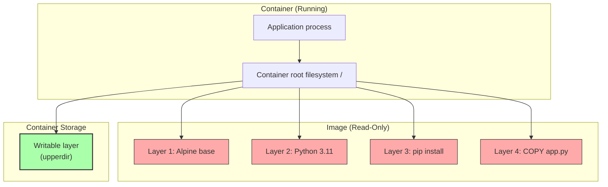
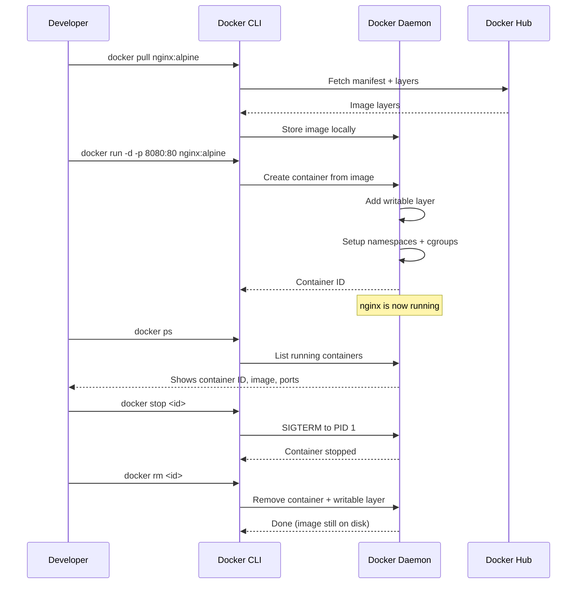

# 3. Images and Containers

> [!info] Chapter Context
> After installing Docker ([[2. Installing Docker]]), the next fundamental concepts are **images** and **containers**. These two terms are often confused. This note makes the distinction crystal clear and explains the lifecycle: how an image is built, how a container is started from an image, and how data is written inside a container.

Related: [[2. Installing Docker]] | [[3.1 Image Layers and Storage Drivers]] | [[4. The Dockerfile]] | [[5. Container Lifecycle and Management]]

---

## 1. The Two Fundamental Concepts

Docker has two nouns that you must distinguish from day one:

- **Image** — A read-only, frozen template that contains everything an application needs to run: the OS filesystem, the runtime, libraries, code, and a startup command. An image does not run; it just *is*.
- **Container** — A running instance of an image. When you "start" an image, Docker creates a container from it and executes the startup command. The container is a live process.

### 1.1 The Class-vs-Instance Analogy

If you are familiar with object-oriented programming, this analogy is exact:

| Concept | OOP Analogy | Cooking Analogy |
| :--- | :--- | :--- |
| **Image** | A class definition (`class User {}`) | A written recipe |
| **Container** | An instance (`new User()`) | The actual cake you baked |

You can bake many cakes from one recipe. You can start many containers from one image. Each container is independent — stopping one does not affect the others.

---

## 2. Deep Dive: Docker Images

### 2.1 What Is Inside an Image

An image is a stack of read-only **layers**, each representing one instruction in the Dockerfile that built it. Layer by layer, from bottom to top, you have:

1. **Base OS layer** — A minimal Linux filesystem (Alpine, Debian, Ubuntu).
2. **Runtime layer** — Node.js, Python, Go, etc., installed on top.
3. **Dependency layer** — `node_modules`, `site-packages`, etc.
4. **Application code layer** — Your source files copied in.
5. **Configuration layer** — `EXPOSE`, `ENV`, `WORKDIR`, `CMD` metadata (these do not add files; they are configuration in the image manifest).

### 2.2 Immutability

Images are **immutable**. Once built, an image cannot be modified. If you change a line of code and rebuild, Docker creates a new image (with a new SHA256 ID). The old image still exists on disk until you delete it.

This immutability is the foundation of Docker's reliability guarantee: if image `myapp:1.0` worked yesterday, it will work forever, because its bits will never change. The same image can be tested in staging, then deployed to production, and the behavior is identical.

### 2.3 Tags and IDs

Every image has:

- A **SHA256 content hash** — A unique fingerprint of the image's contents (e.g., `sha256:9e8c...`). This is the image's true identity.
- One or more **tags** — Human-readable names like `myapp:1.0`, `myapp:latest`, `nginx:alpine`. Tags are pointers to a SHA256; multiple tags can point to the same image.

```bash
# List images by ID
docker images --no-trunc

# Show full SHA256
docker inspect nginx:alpine --format '{{.Id}}'
```

> [!warning] The `latest` Tag Is Not a Version
> `latest` is just the default tag Docker uses if you do not specify one. It does **not** mean "the most recent version" — it points to whatever image was last tagged `latest` by whoever pushed it. For production, **always pin a specific tag** like `nginx:1.25.3-alpine`. The `latest` tag can change without warning and break your application.

### 2.4 Image Distribution

Images are stored in **registries**. The default public registry is Docker Hub (`docker.io`). When you run `docker pull nginx`, Docker fetches the image from Docker Hub. Other registries include AWS ECR, Google GCR, GitHub Container Registry, and private registries you can run yourself. We cover this in detail in [[9. Registries and Distribution]].

---

## 3. Deep Dive: Docker Containers

### 3.1 What a Container Actually Is

A container is a **running Linux process** (or tree of processes) that has been placed inside kernel namespaces and assigned to a cgroup. (See [[1.1 Container Isolation Internals]] for the full explanation.) From the host's perspective, the container is just a process with a high PID. From the container's perspective, it appears to be running on its own machine.

### 3.2 The Writable Layer

When Docker starts a container from an image, it adds a thin **writable layer** on top of the read-only image layers. Any file the container creates, modifies, or deletes is written to this writable layer. The image layers themselves are never modified — they are shared by all containers started from the same image.

This is implemented by the **overlay2** union filesystem, which composes the final filesystem the container sees from:

- **`lowerdir`** — The image's read-only layers.
- **`upperdir`** — The container's writable layer.
- **`merged`** — The unified view presented to the container.



### 3.3 Ephemeral Storage

The writable layer lives only as long as the container. When you delete the container, the writable layer is destroyed. Any data the application wrote inside the container (logs, database files, uploaded files) is lost.

This is the **ephemeral** nature of containers, and it is the single most important behavior to internalize. If you need data to persist across container restarts, you must use **volumes** or **bind mounts** (covered in [[3.2 Volumes and Bind Mounts]]).

> [!danger] The Database Trap
> If you run a database in a container without a volume, every time you delete and recreate the container, the database resets to its initial state. This is the #1 surprise for Docker beginners. Always mount a volume at the database's data directory.

### 3.4 One Image, Many Containers

You can start any number of containers from a single image. Each container gets its own writable layer, its own network namespace, its own PID namespace. They share only the read-only image layers on disk.

```bash
# Start three containers from the same nginx image
docker run -d -p 8081:80 --name web1 nginx
docker run -d -p 8082:80 --name web2 nginx
docker run -d -p 8083:80 --name web3 nginx
```

All three share the same `nginx:latest` image on disk (no triplication of storage), but they are independent processes with independent writable layers.

---

## 4. The Image-vs-Container Workflow

The typical developer workflow looks like this:



Key transitions:

1. **Pull** — Fetch an image from a registry to the local daemon.
2. **Build** — Create an image from a Dockerfile (instead of pulling).
3. **Run** — Start a container from an image. (Equivalent to `create` + `start`.)
4. **Stop** — Send SIGTERM to the container's PID 1. The container still exists; it is just paused at the "stopped" state.
5. **Start** — Resume a stopped container. The writable layer is preserved.
6. **Remove (`rm`)** — Delete the container and its writable layer. The image remains.

> [!warning] `docker run` vs `docker start`
> This is the most common beginner mistake. `docker run` creates a **new** container from an image. `docker start` resumes an **existing** stopped container. If you `docker run` an image you already started before, you get a fresh container with an empty writable layer — not a continuation of the previous one.

---

## 5. Why This Architecture Is Powerful

### 5.1 Solving the "Works on My Machine" Problem

The image-vs-container split eliminates an entire class of bugs:

- **Developer A** builds image `myapp:1.0` on her laptop. The image contains Node.js 18, all dependencies, the source code, and the startup command.
- **Developer B** runs `docker pull myapp:1.0` and `docker run myapp:1.0` on his laptop. He gets the *exact same* image — same Node.js, same dependencies, same code. The container behaves identically.
- **Production** runs `docker run myapp:1.0`. Same image, same behavior.

The host does not need Node.js installed. The host does not need any specific library. The host only needs Docker.

### 5.2 Enabling Immutable Infrastructure

Because images are immutable and tagged, you can roll back a deployment by simply running an older tag:

```bash
# "Roll back" by running the previous version
docker run -d -p 80:80 myapp:1.0   # was 1.1, reverting to 1.0
```

This is the foundation of blue/green deployments, canary releases, and most modern CI/CD pipelines. The image is the deployable artifact; the version is the tag.

### 5.3 Enabling Density

Because containers are just processes (not VMs), you can run dozens or hundreds of them on a single host. Each container consumes only the resources its application actually uses — there is no per-container OS overhead. This is how AWS Fargate can pack many tasks onto one EC2 instance efficiently.

---

## 6. Common Student Mistakes

> [!warning] Mistake 1 — Thinking a Container "Contains" an Image
> A container does not *contain* an image. A container is a *process* that uses the image as its filesystem. The image stays on disk, unchanged; the container references it.

> [!warning] Mistake 2 — Deleting a Container to "Save Space"
> Deleting a container does not free up the image. The image is shared by all containers from it. To free image disk space, you must `docker rmi <image>`.

> [!warning] Mistake 3 — Expecting Data to Survive `docker rm`
> If you `docker rm` a container, its writable layer is destroyed. Use a volume (see [[3.2 Volumes and Bind Mounts]]) for any data you want to keep.

> [!warning] Mistake 4 — Running `docker run` on a Stopped Container
> If a container named `web1` is stopped, `docker run web1` will fail or create a new container — it will not start the existing one. Use `docker start web1` to resume.

> [!warning] Mistake 5 — Using `latest` in Production
> The `latest` tag changes whenever someone pushes a new image. In production, pin to a specific tag like `myapp:1.2.3` so that deployments are reproducible.

> [!warning] Mistake 6 — Forgetting That `docker ps` Shows Only Running Containers
> `docker ps` lists running containers only. Stopped containers still exist on disk; use `docker ps -a` to see them.

---

## 7. Important Reminders and Gotchas

> [!tip] Inspect an Image's Layers
> `docker history <image>` shows every instruction that built the image, with the size each layer added. Add `--no-trunc` to see the full commands.

> [!tip] Inspect a Container's Filesystem
> `docker diff <container>` shows every file added (A), changed (C), or deleted (D) in the container's writable layer since the container started.

> [!tip] Save an Image to a File
> `docker save -o myapp.tar myapp:1.0` writes the image and all its layers to a tar file. Useful for air-gapped environments. Load with `docker load -i myapp.tar`.

> [!tip] Export a Container's Filesystem
> `docker export <container> > mycontainer.tar` flattens the container's entire filesystem (image + writable layer) into a single tarball. Useful for inspecting what a running container actually looks like on disk.

---

## 8. Summary Checklist

- [ ] An **image** is a read-only, immutable stack of layers.
- [ ] A **container** is a running process that uses an image as its filesystem.
- [ ] Each container gets a **writable layer** on top of the read-only image layers.
- [ ] The writable layer is **ephemeral** — destroyed when the container is removed.
- [ ] Use **volumes** for persistent data; never rely on the writable layer for important data.
- [ ] `docker run` creates a new container; `docker start` resumes a stopped one.
- [ ] Tags are pointers to image hashes; `latest` is not a version and should not be used in production.
- [ ] One image can produce many independent containers.

---

Previous: [[2.1 Docker Engine vs Docker Desktop]] | Next: [[3.1 Image Layers and Storage Drivers]]
