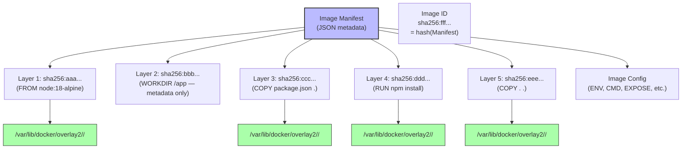
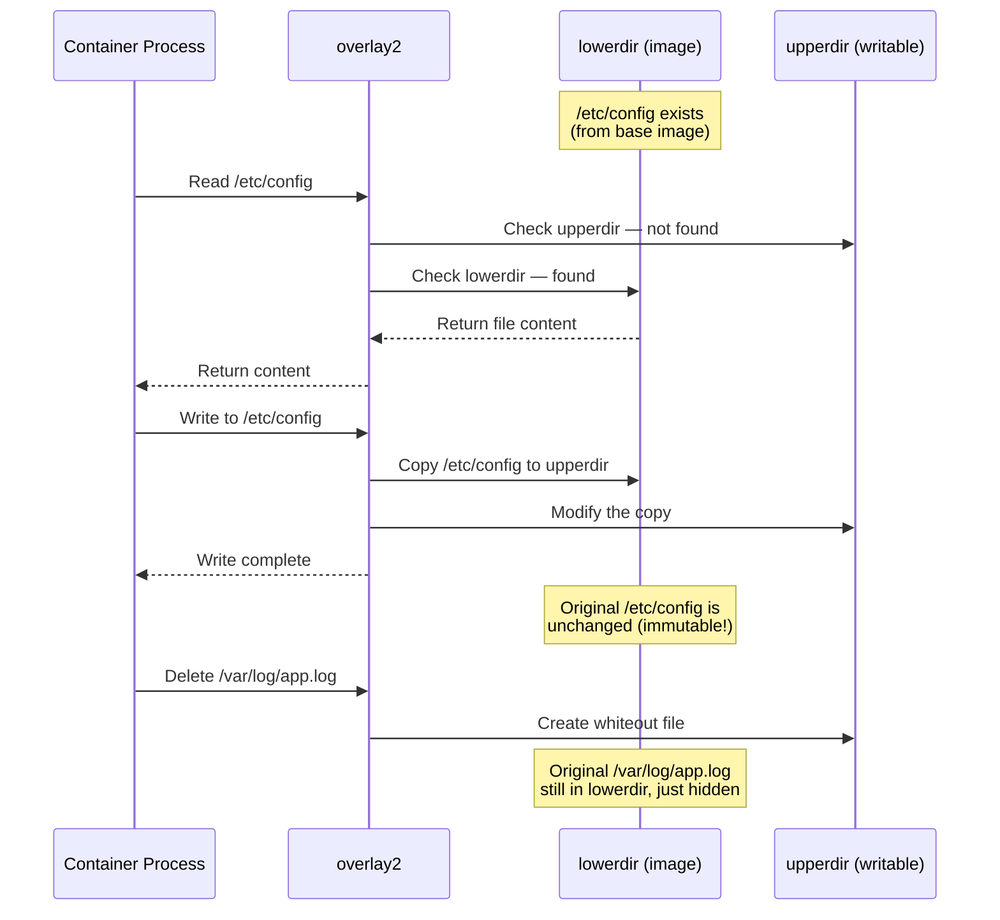
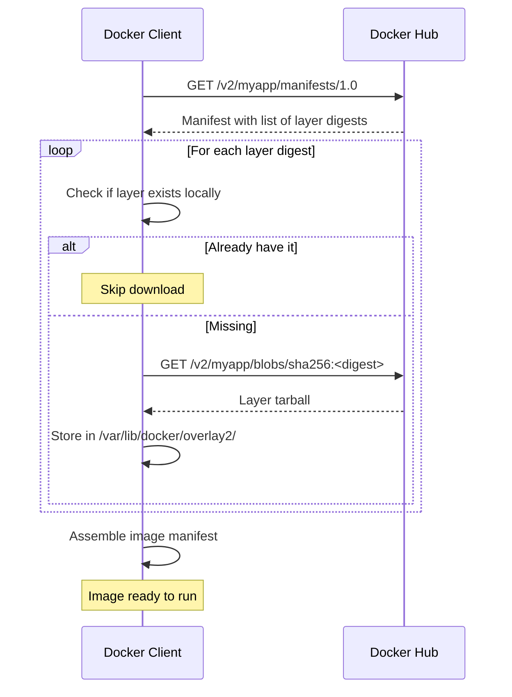

# 3.1 Image Layers and Storage Drivers

> [!info] Chapter Context
> [[3. Images and Containers]] introduced the idea that images are "stacks of layers." This note goes deeper: how layers are physically stored, how they are deduplicated, what a storage driver is, and how `overlay2` (the modern default) works internally with copy-on-write.

Related: [[3. Images and Containers]] | [[3.2 Volumes and Bind Mounts]] | [[4. The Dockerfile]] | [[1.1 Container Isolation Internals]]

---

## 1. Why Layers Exist

If an image were a single monolithic file, every change — even a one-line code change — would require redistributing the entire image. Layers solve this problem by allowing the image to be a stack of independent diffs.

### 1.1 The Benefits of Layers

- **Caching during build** — If you change `app.js` but not `package.json`, Docker reuses the cached `npm install` layer and only rebuilds the `COPY app.js` layer. This makes rebuilds fast.
- **Sharing across images** — Two images that both start with `FROM node:18-alpine` share the same base layers on disk. No duplication.
- **Partial pulls** — When you `docker pull myapp:1.0`, Docker only downloads layers you do not already have. If you already have the `node:18-alpine` base, only the layers unique to `myapp` are downloaded.
- **Atomic updates** — Updating an image means adding a new layer; the old layers remain unchanged. Rollbacks simply mean using the old layer stack.

### 1.2 What Creates a Layer

Each of these Dockerfile instructions creates one new layer:

| Instruction | Creates a layer? | Notes |
| :--- | :--- | :--- |
| `FROM` | Brings in existing layers | The parent image's layers become the base of your image. |
| `RUN` | Yes | Executes a command; the filesystem diff is the new layer. |
| `COPY` | Yes | Files copied from host become a new layer. |
| `ADD` | Yes | Like `COPY`, but can also extract archives and fetch URLs. |
| `WORKDIR` | No (metadata only) | Just sets a directory for subsequent instructions. |
| `ENV` | No (metadata only) | Sets an environment variable. |
| `EXPOSE` | No (metadata only) | Documents a port. |
| `CMD` | No (metadata only) | Sets the default startup command. |
| `ENTRYPOINT` | No (metadata only) | Sets the executable to run. |
| `LABEL` | No (metadata only) | Adds key-value metadata. |
| `USER` | No (metadata only) | Sets the user for subsequent instructions. |
| `VOLUME` | No (metadata only) | Declares a mount point. |

Note that `RUN`, `COPY`, and `ADD` are the only instructions that produce layers; everything else is configuration stored in the image manifest.

---

## 2. Anatomy of a Layer

A layer is a **tarball of filesystem deltas** plus a JSON metadata file. Specifically, each layer contains:

- The new files added by that instruction.
- The modified files (full new copies, not binary diffs).
- Whiteout files for any files that instruction deleted.
- A JSON metadata file describing the layer.

Each layer is identified by a **SHA256 hash of its contents**. The image ID is a hash of the image manifest, which references all layer hashes in order. This content-addressable scheme means two layers with identical contents have identical hashes, so Docker automatically deduplicates them on disk.



---

## 3. Storage Drivers: A Brief History

The component that manages layers and presents the merged view to containers is the **storage driver**. Docker has supported several over the years:

| Driver | Status | Notes |
| :--- | :--- | :--- |
| `aufs` | Removed in Docker 20.10 | The original driver; required out-of-tree kernel patch. |
| `devicemapper` | Deprecated | Used block devices instead of files; complex to configure. |
| `btrfs` | Niche | Used the Btrfs filesystem's native subvolume feature. |
| `zfs` | Niche | Used the ZFS filesystem's native snapshot feature. |
| `vfs` | Fallback | No copy-on-write; copies every layer. Slow but 100% compatible. Used in CI when CoW is unsupported. |
| `overlay` | Legacy | The first OverlayFS driver; required kernel 3.18. |
| `overlay2` | **Default** | The modern driver; uses multiple lower dirs (kernel 4.0+). Default since Docker 17.06. |

`overlay2` is the only one you will encounter in practice. The others are mentioned only for historical context. Check your driver with `docker info | grep "Storage Driver"`.

---

## 4. How overlay2 Works

OverlayFS is a Linux kernel feature that combines multiple directories into one merged view. `overlay2` is Docker's interface to OverlayFS. Each container has four directories:

- **`lowerdir`** — A colon-separated list of the read-only image layers (newest first).
- **`upperdir`** — The container's writable layer.
- **`workdir`** — An internal overlay working directory used for atomic operations.
- **`merged`** — The unified view the container sees as its `/`.

### 4.1 File Lookup

When the container reads a file, overlay2 searches the layers top-down: first `upperdir`, then each `lowerdir` from newest to oldest. The first match wins. If a file exists in both an upper layer and a lower layer, the upper version is read.

### 4.2 Copy-on-Write

When the container **writes** to a file that exists only in a `lowerdir`, overlay2 performs **copy-up**: it copies the entire file from the lower layer to `upperdir`, then modifies the copy. The lower-layer file is untouched.

Copy-up happens at the file level, not the byte level. If you modify one byte of a 1 GB file in a lower layer, the entire 1 GB file is copied up to the upper layer. This is why large files in lower layers can cause performance issues when modified.

### 4.3 Whiteouts (Deletions)

When the container **deletes** a file that exists in a lower layer, overlay2 creates a **whiteout** in `upperdir` — a special character device file (or an "opaque xattr" on a directory) that masks the lower-layer file. The lower-layer file is untouched; it is just hidden from the merged view.

### 4.4 A Concrete Example



---

## 5. Viewing Layers with `docker inspect` and `docker history`

### 5.1 `docker history`

`docker history <image>` shows every instruction that built the image, in order, with the size each layer added:

```bash
docker history node:18-alpine
```

```
IMAGE          CREATED       CREATED BY                                      SIZE
e3e4d5f6a7b8   2 weeks ago   /bin/sh -c #(nop)  CMD ["node"]                 0B
7c8d9e0f1a2b   2 weeks ago   /bin/sh -c #(nop)  ENTRYPOINT ["docker-entry…   0B
3b4c5d6e7f8a   2 weeks ago   /bin/sh -c #(nop) WORKDIR /usr/src/app          0B
9a0b1c2d3e4f   2 weeks ago   /bin/sh -c apk add --no-cache --virtual .bui…   7.6MB
1d2e3f4a5b6c   2 weeks ago   /bin/sh -c #(nop)  ENV NODE_VERSION=18.19.0     0B
5e6f7a8b9c0d   3 weeks ago   /bin/sh -c #(nop)  CMD ["/bin/sh"]              0B
```

Instructions marked `#(nop)` did not create a layer (they are metadata-only). Only `RUN`, `COPY`, and `ADD` show non-zero sizes.

### 5.2 `docker inspect`

`docker inspect <container>` returns a massive JSON object. The `GraphDriver.Data` section shows the overlay2 paths:

```bash
docker inspect <container> --format '{{json .GraphDriver.Data}}' | jq
```

```json
{
  "LowerDir": "/var/lib/docker/overlay2/<hash1>/diff:/var/lib/docker/overlay2/<hash2>/diff:...",
  "MergedDir": "/var/lib/docker/overlay2/<hashX>/merged",
  "UpperDir": "/var/lib/docker/overlay2/<hashX>/diff",
  "WorkDir": "/var/lib/docker/overlay2/<hashX>/work"
}
```

You can `sudo ls` into those directories on Linux to see the actual layer contents.

---

## 6. Image Distribution: Pulling Layers Efficiently

When you `docker pull myapp:1.0`, Docker does not download a single monolithic image. It downloads layers individually, and only the ones you do not already have:



This is why pulling a second image that shares a base with one you already have is much faster than the first pull — most layers are already on disk.

---

## 7. Multi-Stage Builds and Squashing

### 7.1 Why You Might Want to Flatten Layers

Each layer adds size and complexity. Sensitive data accidentally committed in an intermediate layer (e.g., `RUN echo "secret" > /etc/secrets && rm /etc/secrets`) is still in the intermediate layer's tarball, even though the final filesystem does not contain the file. Anyone with access to the image can extract it.

### 7.2 Multi-Stage Builds

The modern solution is **multi-stage builds**. You have multiple `FROM` lines in one Dockerfile; each `FROM` starts a new stage. Only the final stage's contents become the image. You can `COPY --from=stage1` to bring artifacts from earlier stages without bringing the build tools.

```dockerfile
# Stage 1: Build
FROM node:18 AS builder
WORKDIR /app
COPY package*.json ./
RUN npm install
COPY . .
RUN npm run build

# Stage 2: Runtime (small, no build tools)
FROM nginx:alpine
COPY --from=builder /app/dist /usr/share/nginx/html
CMD ["nginx", "-g", "daemon off;"]
```

The final image contains only Nginx and the built static files — no Node.js, no `node_modules`, no source code. This can shrink image sizes by 90%+.

### 7.3 Squashing (Experimental)

Docker has an experimental `--squash` flag for `docker build` that combines all layers into one. It is rarely used today because multi-stage builds solve the size problem more cleanly. We recommend multi-stage.

---

## 8. Common Pitfalls

> [!warning] Pitfall 1 — Secrets in Intermediate Layers
> `RUN echo "API_KEY=xxx" > /etc/secrets && rm /etc/secrets` does NOT remove the secret from the image. The intermediate layer created by the `RUN` still contains `/etc/secrets`. Use multi-stage builds or build-time `--secret` mounts (BuildKit) instead.

> [!warning] Pitfall 2 — Deleting Files Does Not Shrink the Image
> If a base layer installs `curl` (adding 5 MB) and a later layer does `RUN rm /usr/bin/curl`, the image size does not decrease — the `rm` only adds a whiteout file. To actually remove `curl`, you must install and remove it in the same `RUN` instruction.

> [!warning] Pitfall 3 — Large Layer from Copy-then-Modify
> If you `COPY . /app` (100 MB) and then in the next layer `RUN rm /app/tests`, the image still has 100 MB of layers — the second layer only adds a whiteout. Combine copy and cleanup into one instruction, or use `.dockerignore` to keep tests out of the build context in the first place.

> [!warning] Pitfall 4 — Order Matters for Caching
> Put rarely-changing instructions (like `COPY package.json` + `RUN npm install`) before frequently-changing instructions (like `COPY . .`). Otherwise, every code change invalidates the dependency install cache, making builds slow.

> [!warning] Pitfall 5 — Modifying Large Files in a Container
> Because copy-up copies the whole file, modifying a large database file (say, 10 GB) that exists in the image will create a 10 GB copy in the writable layer. Mount such files as volumes instead.

---

## 9. Summary Checklist

- [ ] Layers are filesystem deltas; only `RUN`, `COPY`, and `ADD` create layers.
- [ ] Layers are content-addressable (SHA256 of their contents), enabling automatic deduplication.
- [ ] `overlay2` is the modern default storage driver; it uses OverlayFS in the Linux kernel.
- [ ] overlay2 combines `lowerdir` (image layers), `upperdir` (writable container layer), and `merged` (what the container sees).
- [ ] Copy-on-write copies the entire file on first modification; not binary-level diffs.
- [ ] Whiteouts (in `upperdir`) hide files in `lowerdir` that the container has deleted.
- [ ] `docker history <image>` shows the layers and their sizes.
- [ ] `docker inspect <container>` shows the overlay2 paths on disk.
- [ ] Multi-stage builds are the modern way to produce small, clean images.
- [ ] Secrets in intermediate layers can be extracted; never bake them in.

---

Previous: [[3. Images and Containers]] | Next: [[3.2 Volumes and Bind Mounts]]
