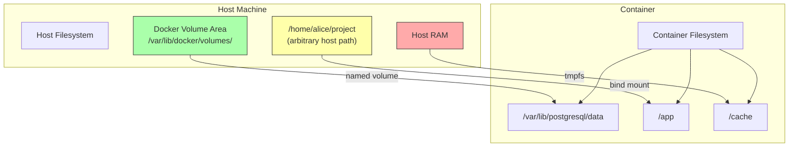
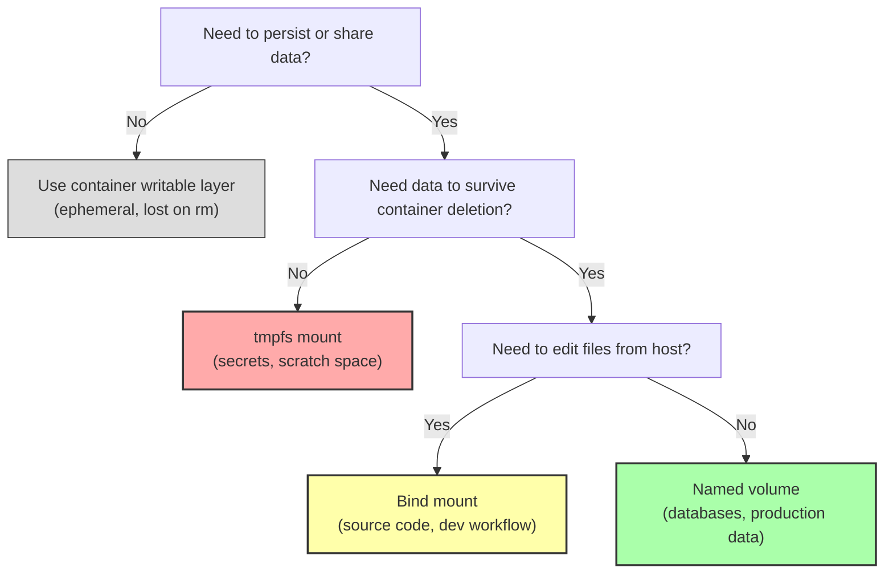

# 3.2 Volumes and Bind Mounts

> [!info] Chapter Context
> [[3. Images and Containers]] explained that a container's writable layer is **ephemeral** — destroyed when the container is removed. This note covers the proper solution: **mounts**. We will compare the three mount types (named volumes, bind mounts, `tmpfs`), explain when to use each, and walk through the permission problems that bite every Docker beginner.

Related: [[3. Images and Containers]] | [[3.1 Image Layers and Storage Drivers]] | [[4. The Dockerfile]] | [[7. Docker Compose]]

---

## 1. Why Mounts Exist

If you run a PostgreSQL container without any mount, every time you `docker rm` the container, the database resets to its initial state. The same is true for any stateful application: Redis, MySQL, Elasticsearch, your own upload directory. The container's writable layer is tied to the container's life; it does not survive `docker rm`.

Mounts solve this by storing data **outside** the container's writable layer — either on the host filesystem (bind mounts, named volumes) or in RAM (tmpfs). The container reads and writes to a path that is mapped to external storage, so the data persists even after the container is deleted.

Docker offers three mount types:

| Mount type | Storage location | Managed by | Persistent across container deletion? | Portable across hosts? |
| :--- | :--- | :--- | :--- | :--- |
| **Named volume** | `/var/lib/docker/volumes/<name>/_data` on Linux | Docker | Yes | Yes |
| **Bind mount** | An explicit host path you choose | You (the host) | Yes | No |
| **tmpfs mount** | RAM (and swap) | Linux kernel | No | N/A |

There is also a fourth concept — **image-defined volumes** created by the `VOLUME` instruction in a Dockerfile — which we cover briefly at the end.

---

## 2. Named Volumes

### 2.1 What They Are

A named volume is a directory that Docker creates and manages on the host. On Linux, it lives at `/var/lib/docker/volumes/<volume_name>/_data`. You refer to it by name (e.g., `pgdata`), not by path. Docker handles creation, lifecycle, and cleanup.

### 2.2 Creating and Using a Named Volume

```bash
# Create a volume (optional — `docker run -v pgdata:/data` creates it automatically)
docker volume create pgdata

# Use it in a container
docker run -d \
  --name db \
  -v pgdata:/var/lib/postgresql/data \
  -e POSTGRES_PASSWORD=secret \
  postgres:15

# Write some data
docker exec db psql -U postgres -c "CREATE TABLE test (id int);"

# Delete the container
docker rm -f db

# Start a new container with the same volume — the table is still there!
docker run -d \
  --name db2 \
  -v pgdata:/var/lib/postgresql/data \
  -e POSTGRES_PASSWORD=secret \
  postgres:15
docker exec db2 psql -U postgres -c "\dt"
# -> List of relations -> public | test | table | postgres
```

### 2.3 Why Named Volumes Are the Default for Production

- **Portable** — The volume name `pgdata` works on any Docker host. You never hardcode a path.
- **Managed by Docker** — `docker volume ls`, `docker volume inspect`, `docker volume prune` all work natively.
- **Driver-extensible** — You can use volume drivers to back volumes by NFS, cloud block storage, etc.
- **Backups are clean** — You back up a named volume by starting a temporary container with the volume mounted and a tarball output.

### 2.4 Volume Backup and Restore

```bash
# Back up the pgdata volume to a tarball
docker run --rm \
  -v pgdata:/data:ro \
  -v "$(pwd)":/backup \
  alpine \
  tar czf /backup/pgdata-backup.tar.gz -C /data .

# Restore to a new volume
docker volume create pgdata-restored
docker run --rm \
  -v pgdata-restored:/data \
  -v "$(pwd)":/backup \
  alpine \
  tar xzf /backup/pgdata-backup.tar.gz -C /data
```

The pattern is always: spin up a temporary Alpine container, mount both the volume and a host backup directory, run `tar` inside it.

---

## 3. Bind Mounts

### 3.1 What They Are

A bind mount maps a specific host directory (or file) into the container. The host path is **absolute** and **explicit** — you choose it.

```bash
# Map the current directory into /app inside the container
docker run -d \
  -v "$(pwd)":/app \
  -w /app \
  node:18 \
  node server.js
```

### 3.2 The Live-Reload Use Case

Bind mounts are the foundation of Docker development workflows. You edit a file in your editor on the host; the change is immediately visible inside the container because the container is reading from the host directory. Your dev server (with a file watcher like `nodemon` or `vite`) restarts automatically.

This is **impossible with named volumes**, because named volumes are managed by Docker and you cannot edit their files from the host (well, you can on Linux by `sudo`-ing into `/var/lib/docker/volumes/...`, but that is unsupported and fragile).

### 3.3 The Permission Problem

This is the **#1 pain point** for Docker beginners on Linux. Here is the scenario:

- You run a Node.js container. The container's `node` user has UID 1000.
- You bind-mount your project directory, which is owned by your host user `alice` (UID 1001).
- The container's `node` user (UID 1000) tries to read or write files owned by UID 1001.
- Linux checks file permissions at the kernel level using UID. UID 1000 cannot write to files owned by UID 1001 (unless permissions are 777, which is bad).
- Result: `EACCES: permission denied, open '/app/index.js'`.

### 3.4 Solutions to the Permission Problem

**Solution A — Run the container as your host user.**

```bash
docker run -v "$(pwd)":/app --user "$(id -u):$(id -g)" node:18
```

This works but may fail if the image's filesystem has files owned by a different UID that your user cannot read.

**Solution B — Use `chown` in the Dockerfile to match your host UID.**

```dockerfile
FROM node:18
RUN groupadd -g 1001 alice && useradd -u 1001 -g 1001 alice
USER alice
```

Tedious because it couples the Dockerfile to a specific host UID.

**Solution C — Use named volumes instead.**

If you do not need to edit files from the host, named volumes avoid the permission problem entirely.

**Solution D — On macOS and Windows, this is a non-issue.**

Docker Desktop on Mac/Windows runs a Linux VM and handles UID translation via `osxfs` (Mac) or WSL 2 file translation (Windows). The container sees files with consistent ownership regardless of host UIDs.

> [!tip] The Real Solution: Use Named Volumes for State, Bind Mounts for Source Code
> For databases, caches, and other stateful data, use **named volumes**. They avoid permission issues entirely. For source code during development, use **bind mounts** and accept the permission dance (or use a `.dockerignore` plus `--user` flag).

---

## 4. tmpfs Mounts

### 4.1 What They Are

A `tmpfs` mount stores data in the host's RAM (and swap). It is **not** written to disk. The data is lost when the container stops.

```bash
docker run -d \
  --name cache \
  --tmpfs /cache:size=100m,mode=1777 \
  redis:alpine
```

### 4.2 When to Use tmpfs

- **Secrets that should never touch disk** — e.g., a TLS private key that you want to exist only in memory.
- **Scratch space** — temporary files that the application creates and destroys frequently.
- **Performance** — accessing RAM is faster than disk.

### 4.3 Limitations

- Limited by available RAM. A `tmpfs` that grows too large can cause the host to OOM.
- Lost on container stop. Do not store anything you need later.
- Not portable between hosts (obviously).

---

## 5. The `--mount` Syntax vs `-v` Syntax

Docker offers two ways to specify mounts. They are equivalent in functionality but differ in verbosity.

### 5.1 The Legacy `-v` / `--volume` Syntax

```bash
# Named volume
docker run -v pgdata:/var/lib/postgresql/data postgres

# Bind mount (must start with / or . on Linux)
docker run -v /home/alice/project:/app node

# Bind mount, read-only
docker run -v /home/alice/project:/app:ro node

# tmpfs (NOT supported with -v; use --mount or --tmpfs)
docker run --tmpfs /cache nginx
```

### 5.2 The Modern `--mount` Syntax

```bash
# Named volume
docker run --mount type=volume,source=pgdata,target=/var/lib/postgresql/data postgres

# Bind mount
docker run --mount type=bind,source=/home/alice/project,target=/app node

# Bind mount, read-only
docker run --mount type=bind,source=/home/alice/project,target=/app,readonly node

# tmpfs
docker run --mount type=tmpfs,target=/cache,tmpfs-size=100m nginx
```

### 5.3 Which to Use

- `-v` is shorter and more common in tutorials.
- `--mount` is more explicit and self-documenting. Use it in scripts and Docker Compose files where clarity matters.

---

## 6. Image-Defined Volumes (the `VOLUME` Instruction)

A Dockerfile can declare a volume with the `VOLUME` instruction:

```dockerfile
FROM postgres:15
VOLUME /var/lib/postgresql/data
```

This has two effects:

1. If a user runs the image **without** a `-v` flag for that path, Docker automatically creates an anonymous volume and mounts it there. The data is not lost when the container is removed.
2. It documents the path as "expected to be persisted."

> [!warning] `VOLUME` Creates Anonymous Volumes, Not Named Ones
> Without an explicit `-v`, `VOLUME` creates an **anonymous** volume (a random 64-character name). These accumulate over time and waste disk space. Always pass an explicit `-v <name>:<path>` at runtime to give the volume a meaningful name.

---

## 7. Volume Lifecycle Commands

```bash
# List all volumes
docker volume ls

# Inspect a volume (see its mount path on the host, driver, options)
docker volume inspect pgdata

# Remove a specific volume (must not be in use by any container)
docker volume rm pgdata

# Remove ALL unused volumes (volumes not referenced by any container)
docker volume prune

# Remove ALL volumes including those referenced by stopped containers
docker volume prune -a --force
```

> [!danger] `docker volume prune` Is Destructive
> This command deletes volumes that are not currently attached to any container. If you have a stopped database container whose volume is "unused" from Docker's perspective, the volume — and all the data in it — will be deleted. Always check `docker volume ls` and `docker ps -a` before pruning.

---

## 8. Visual Summary



---

## 9. When to Use Which — Decision Tree



---

## 10. Common Student Mistakes

> [!warning] Using Bind Mounts for Production Databases
> Bind mounts couple the container to a specific host path. If you migrate to another server, you must copy the directory manually and ensure permissions match. Use named volumes for production databases.

> [!warning] Forgetting `:ro` on Read-Only Mounts
> If a container only needs to read files (e.g., a config file), append `:ro` to the mount. This prevents the container from accidentally modifying host files.

> [!warning] Letting Anonymous Volumes Accumulate
> Images with `VOLUME` instructions create anonymous volumes when run without `-v`. Over months, these can consume gigabytes. Run `docker volume prune` periodically — but verify nothing important is "unused" first.

> [!warning] Mixing `-v` Syntax for Bind Mounts and Named Volumes
> `-v pgdata:/data` is a named volume. `-v /home/alice/pgdata:/data` is a bind mount. The difference is whether the source starts with `/` or `.`. Getting this wrong silently creates a named volume when you meant a bind mount, or vice versa.

> [!warning] Assuming Volumes Are Encrypted
> Docker volumes are plain directories on the host. They are not encrypted. If you need encryption at rest, use full-disk encryption on the host or a volume driver that supports encryption.

---

## 11. Summary Checklist

- [ ] Named volumes are managed by Docker; best for production databases and stateful data.
- [ ] Bind mounts map a specific host path; best for source code during development.
- [ ] `tmpfs` mounts live in RAM; best for secrets and scratch space.
- [ ] The `VOLUME` instruction in a Dockerfile creates anonymous volumes when no `-v` is given.
- [ ] Use `--mount` for explicit, readable syntax; `-v` for short commands.
- [ ] Permission errors with bind mounts on Linux are caused by UID mismatch — solve with `--user`, `chown`, or named volumes.
- [ ] `docker volume prune` is destructive — verify nothing important is "unused" first.
- [ ] Backup named volumes by spinning up a temporary container with the volume and a tarball output.

---

Previous: [[3.1 Image Layers and Storage Drivers]] | Next: [[4. The Dockerfile]]
