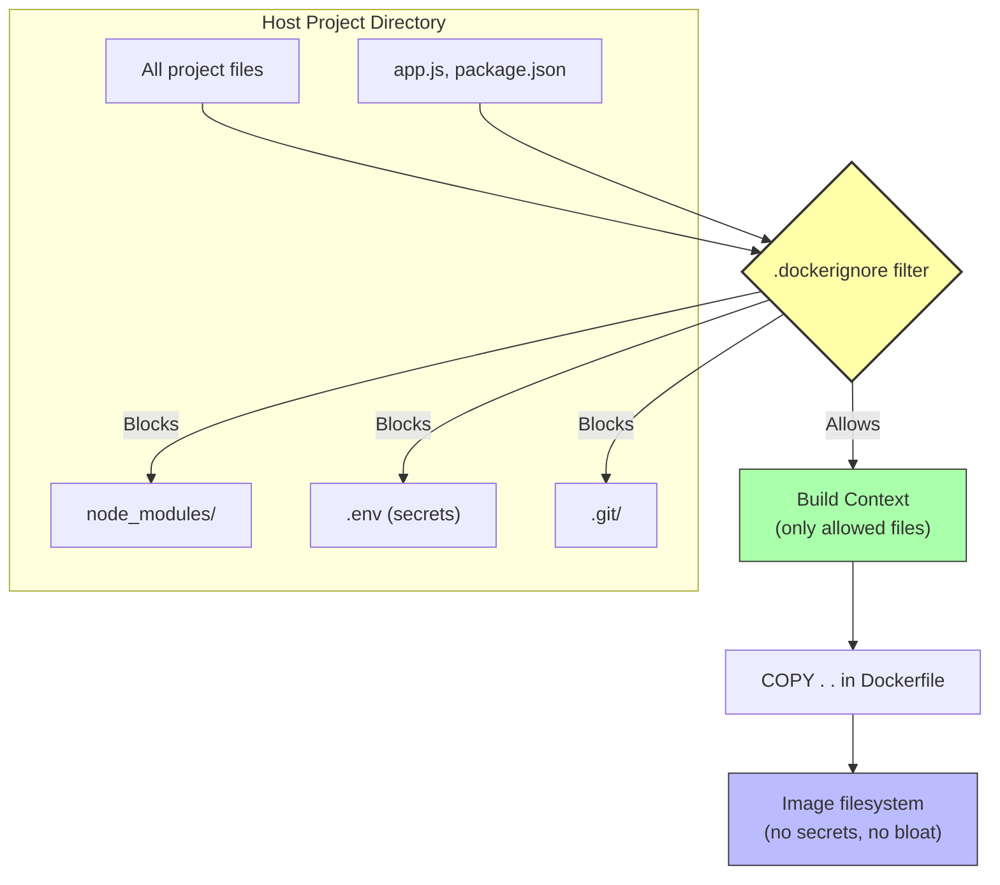

# 4.1 The .dockerignore File

> [!info] Chapter Context
> Just as `.gitignore` keeps files out of version control, `.dockerignore` keeps files out of your Docker image. This is critical for build speed, image size, and security. A surprising number of "my Docker image is huge" or "my API key leaked" problems are caused by missing `.dockerignore` entries.

Related: [[4. The Dockerfile]] | [[4.2 Multi-Stage Builds]] | [[4.3 Dockerfile Best Practices]] | [[3.1 Image Layers and Storage Drivers]]

---

## 1. The Problem `.dockerignore` Solves

When you run `docker build -t myapp .`, the `.` argument is the **build context**. Docker takes everything in that directory — every file, every subdirectory, including hidden files like `.git/` and `.env` — and sends it to the daemon. This happens *before* any `COPY` instruction runs.

This causes four problems:

### 1.1 Bloat

If your project directory contains a 5 GB `node_modules/`, a 2 GB `.git/` history, a 500 MB `dist/` build folder, and a 200 MB `data/` directory of test data, Docker sends all of that to the daemon before building. Your build context becomes multi-gigabyte, making every build slow.

### 1.2 Cache Invalidation

If any file in the build context changes, `COPY . .` is considered changed, which invalidates the cache for that layer and all layers after it. So even a one-line change to a log file in the build context forces a rebuild of every subsequent layer.

### 1.3 Security

If your project directory contains `.env` (with `AWS_SECRET_ACCESS_KEY=...`), `id_rsa` (your SSH private key), or `.npmrc` (with a Node.js auth token), `COPY . .` will copy them into the image. Anyone who pulls the image can `docker run --entrypoint sh myapp` and `cat /app/.env` to extract your secrets.

### 1.4 Wrong-Architecture Dependencies

If you `COPY . .` on a Mac and your `node_modules/` was installed natively (for `darwin-arm64`), those binaries will not work inside the Linux container. The container will crash with cryptic "exec format error" or "module not found" messages.

The fix: ignore `node_modules/` in `.dockerignore` and let the Dockerfile install dependencies fresh inside the image with `RUN npm install`.

---

## 2. The `.dockerignore` File

Create a file named `.dockerignore` in the same directory as your Dockerfile. The syntax is similar to `.gitignore`:

- Lines starting with `#` are comments.
- Blank lines are ignored.
- `*` matches any sequence of characters except `/`.
- `**` matches any sequence of characters including `/`.
- `?` matches any single character.
- Lines starting with `!` are exceptions (re-include a previously excluded file).
- Trailing `/` matches directories only.

---

## 3. A Recommended Starting Template

For a Node.js project:

```dockerignore
# Version control
.git
.gitignore

# Dependencies (install fresh inside the image)
node_modules

# Build artifacts
dist
build
*.tsbuildinfo

# Environment files (secrets!)
.env
.env.*
!.env.example

# Logs
*.log
npm-debug.log*
yarn-debug.log*
yarn-error.log*

# IDE / Editor
.vscode
.idea
*.swp
*.swo
.DS_Store

# Test / Coverage
coverage
.nyc_output

# Docker files themselves
Dockerfile
.dockerignore
docker-compose*.yml

# Documentation
*.md
docs
LICENSE

# Data files
data
*.sqlite
*.db
```

> [!tip] Why Ignore `Dockerfile` and `.dockerignore` Themselves?
> These files are not needed inside the image. Excluding them shrinks the build context slightly and prevents accidental changes to them from invalidating the build cache.

---

## 4. How `.dockerignore` Works



The filter runs **before** any `COPY` instruction. `COPY . .` then only sees the files that survived the filter. Ignored files effectively do not exist for the duration of the build.

---

## 5. Common Patterns and Gotchas

### 5.1 The `!` Exception

```dockerignore
# Ignore all .env files
.env
.env.*

# But keep the example
!.env.example
```

The `!` re-includes a file that was excluded by an earlier pattern. Order matters — exceptions must come after the exclusion.

### 5.2 Directory-Specific Patterns

```dockerignore
# Ignore all markdown files
*.md

# But keep README.md inside docs/
!docs/README.md
```

### 5.3 The `node_modules` Trap

Even if you do not care about image size, ignoring `node_modules` is critical because:

- Native modules (like `node-sass`, `bcrypt`, `sharp`) compile binaries specific to the OS and CPU architecture where they were installed.
- If you installed `node_modules` on macOS, copying it into a Linux container produces binaries that crash with "wrong ELF class" or "exec format error."
- The fix is to install dependencies fresh inside the image with `RUN npm install`, where they will be compiled for Linux.

The same applies to Python's `venv`, Ruby's `vendor`, Go's `vendor`, etc.

### 5.4 The `.dockerignore` Does Not Affect Volumes

`.dockerignore` only affects what `COPY` and `ADD` see. It does **not** affect bind mounts. If you bind-mount your source code with `-v $(pwd):/app`, the entire host directory is mounted, regardless of `.dockerignore`.

### 5.5 The `.dockerignore` Is Per-Build-Context

The file must be in the root of the build context (the directory passed to `docker build`). If you specify a different Dockerfile with `-f`, `.dockerignore` is still read from the build context root, not from the Dockerfile's directory.

---

## 6. Verifying Your `.dockerignore`

A quick way to see what files are in the build context:

```bash
# Show the build context size before building
docker build -t test .

# Or use this trick: tar the context to /dev/null and see the size
tar -czf /dev/null . 2>/dev/null | wc -c
```

For a more thorough check, build an image that just lists what was copied:

```dockerfile
FROM alpine
COPY . /ctx
RUN find /ctx -type f | sort
```

```bash
docker build -t ctxtest .
docker run --rm ctxtest
```

This shows every file that survived the `.dockerignore` filter.

---

## 7. Common Mistakes

> [!warning] Mistake 1 — Forgetting to Create `.dockerignore`
> Many beginners skip this file entirely and then wonder why their image is 5 GB. Always create one, even if minimal.

> [!warning] Mistake 2 — Putting Secrets in the Build Context
> If `.env` is in the same directory as your Dockerfile and you do not ignore it, `COPY . .` bakes it into the image. Anyone with the image can extract the secrets.

> [!warning] Mistake 3 — Not Ignoring `node_modules` (or Equivalent)
> Copying host-installed `node_modules` into a Linux container causes native module mismatches and cryptic crashes. Always ignore the dependency directory and install fresh inside the image.

> [!warning] Mistake 4 — Confusing `.dockerignore` with `.gitignore`
> They have similar syntax but different scopes. `.gitignore` keeps files out of Git. `.dockerignore` keeps files out of the Docker build context. You usually need both, and they often have similar entries.

> [!warning] Mistake 5 — Expecting `.dockerignore` to Affect Bind Mounts
> Bind mounts bypass the build context entirely. If you mount your source code with `-v`, the entire directory is visible to the container, regardless of `.dockerignore`.

---

## 8. Summary Checklist

- [ ] `.dockerignore` lives next to the Dockerfile and filters the build context.
- [ ] It uses syntax similar to `.gitignore` (with `*`, `**`, `?`, `!`).
- [ ] Always ignore: `node_modules`, `.git`, `.env`, build artifacts, IDE config, logs.
- [ ] The filter runs before `COPY`/`ADD` — ignored files do not exist for the build.
- [ ] `.dockerignore` does **not** affect bind mounts — only `COPY`/`ADD`.
- [ ] Verify with `tar -czf /dev/null .` (shows context size) or a test image.
- [ ] Re-include exceptions with `!` (e.g., `!.env.example`).

---

Previous: [[4. The Dockerfile]] | Next: [[4.2 Multi-Stage Builds]]
