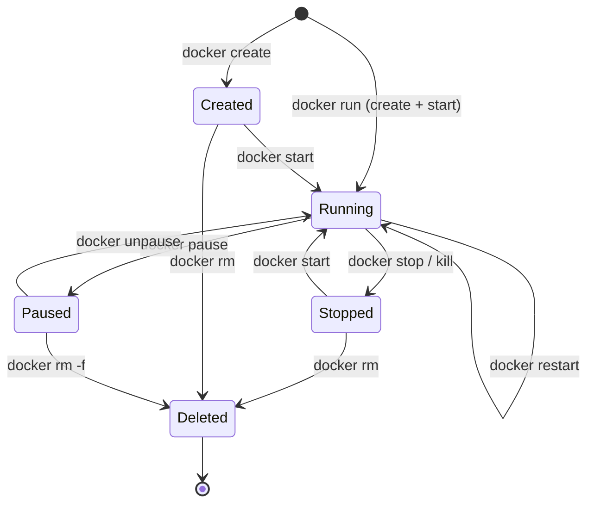

# 5. Container Lifecycle and Management

> [!info] Chapter Context
> After building images ([[4. The Dockerfile]]) you need to manage running containers: create, start, stop, restart, inspect, remove. This note covers the container lifecycle and the everyday commands you will use thousands of times.

Related: [[4. The Dockerfile]] | [[5.1 Interacting with Containers Exec]] | [[5.2 Port Mapping and Environment Variables]] | [[5.3 Resource Limits and Health Checks]] | [[6. Docker Networking]]

---

## 1. The Container Lifecycle

A container moves through several states during its life. Understanding these states is essential for debugging.



### 1.1 The Six States

| State | Meaning | Visible in `docker ps`? |
| :--- | :--- | :--- |
| **created** | Container has been created but not started. | With `-a` only. |
| **running** | Container is running, process is alive. | Yes. |
| **paused** | Container's processes are frozen (cgroups freezer). Memory is preserved. | Yes (status "Up (Paused)"). |
| **restarting** | Container is in the middle of a restart policy cycle. | Yes. |
| **exited** (a.k.a. stopped) | Container's main process has terminated. Writable layer still exists. | With `-a` only. |
| **dead** | Container cannot be started (usually due to a daemon error). | With `-a` only. |

---

## 2. Creating vs. Starting vs. Running

This is the #1 source of beginner confusion.

| Command | What it does |
| :--- | :--- |
| `docker create <image>` | Creates a container (writable layer + config) but does NOT start it. Returns a container ID. |
| `docker start <container>` | Starts an existing (created or stopped) container. |
| `docker run <image>` | Creates AND starts a container in one step. Equivalent to `create` + `start`. |

```bash
# Two-step
docker create --name web -p 8080:80 nginx
docker start web

# One-step equivalent
docker run -d --name web -p 8080:80 nginx
```

> [!warning] `docker run` Creates a NEW Container Every Time
> If you `docker run --name web nginx` and then `docker stop web`, running `docker run --name web nginx` again will fail with "name already in use." You must either `docker start web` (resume the existing one) or `docker rm web` first.

---

## 3. The `docker run` Flags You Need to Know

`docker run` is the most complex Docker command. Here are the flags you will use daily:

### 3.1 Detached Mode `-d`

```bash
docker run -d nginx          # runs in background, returns container ID
docker run nginx             # attaches to container's stdout; Ctrl+C kills it
```

For long-running services (web servers, databases), always use `-d`. For one-shot commands, omit `-d` to see the output directly.

### 3.2 Port Mapping `-p`

```bash
docker run -p 8080:80 nginx          # host:container
docker run -p 127.0.0.1:8080:80 nginx # bind to localhost only
docker run -p 80 nginx                # random host port -> 80
docker run -P nginx                   # publish all EXPOSE'd ports to random host ports
```

Format: `-p [host_ip:]host_port:container_port[/protocol]`. We cover this in detail in [[5.2 Port Mapping and Environment Variables]] and [[6. Docker Networking]].

### 3.3 Naming `--name`

```bash
docker run --name my-app nginx
```

Without `--name`, Docker generates a random adjective-noun name (`sad_einstein`, `zen_turing`). With `--name`, you can refer to the container by a friendly name in subsequent commands. Names must be unique.

### 3.4 Auto-Remove `--rm`

```bash
docker run --rm alpine echo hello
```

The container is automatically removed when it exits. Useful for one-shot commands; prevents accumulation of stopped containers.

### 3.5 Environment Variables `-e` and `--env-file`

```bash
docker run -e NODE_ENV=production -e API_KEY=xxx myapp
docker run --env-file .env myapp
```

`--env-file` reads `KEY=VALUE` lines from a file. Useful for keeping secrets out of shell history.

### 3.6 Volumes `-v` and `--mount`

```bash
docker run -v pgdata:/var/lib/postgresql/data postgres
docker run --mount type=bind,source=$(pwd),target=/app node
```

Covered in [[3.2 Volumes and Bind Mounts]].

### 3.7 User `--user`

```bash
docker run --user 1000:1000 myapp
docker run --user $(id -u):$(id -g) myapp
```

Runs the container as a specific UID:GID. Useful for fixing bind-mount permission issues.

### 3.8 Working Directory `-w` and Entrypoint `--entrypoint`

```bash
docker run -w /app myapp
docker run --entrypoint sh myapp
```

Overrides `WORKDIR` and `ENTRYPOINT` from the image, respectively.

### 3.9 Resource Limits `--cpus`, `--memory`

```bash
docker run --cpus=1.5 --memory=512m myapp
```

Covered in [[5.3 Resource Limits and Health Checks]].

### 3.10 Restart Policy `--restart`

```bash
docker run --restart unless-stopped -d postgres
```

| Policy | Behavior |
| :--- | :--- |
| `no` (default) | Never restart. |
| `on-failure[:N]` | Restart only if the container exits with non-zero. Optionally cap retries at N. |
| `always` | Always restart, regardless of exit code. |
| `unless-stopped` | Like `always`, but does not restart after a manual `docker stop`. |

---

## 4. Listing Containers

```bash
docker ps                # running containers only
docker ps -a             # all containers (running + stopped)
docker ps -q             # just container IDs (useful for scripts)
docker ps -a --filter "status=exited"     # only exited
docker ps --format "table {{.Names}}\t{{.Status}}\t{{.Ports}}"
```

The `--format` flag lets you customize output with Go templates.

---

## 5. Stopping and Restarting

### 5.1 Graceful Stop

```bash
docker stop web          # sends SIGTERM, waits 10s, then SIGKILL
docker stop -t 30 web    # wait 30s before SIGKILL
```

`docker stop` sends `SIGTERM` to PID 1 inside the container. If the process exits within the timeout (default 10 seconds), great. If not, Docker sends `SIGKILL` (instant termination, no cleanup).

### 5.2 Force Kill

```bash
docker kill web          # sends SIGKILL immediately
docker kill --signal=SIGINT web    # send a different signal
```

Use `kill` only when `stop` does not work (the process ignores `SIGTERM`).

### 5.3 Restart

```bash
docker restart web       # stop + start
docker restart -t 30 web # with 30s timeout
```

### 5.4 Pause and Unpause

```bash
docker pause web         # freeze all processes in the container (cgroups freezer)
docker unpause web       # resume
```

`pause` is rarely used but useful for snapshotting a container's state without stopping it. The container's memory is preserved; CPU usage drops to zero.

---

## 6. Inspecting Containers

### 6.1 `docker inspect`

```bash
docker inspect web                          # full JSON
docker inspect web --format '{{.State.Status}}'
docker inspect web --format '{{.NetworkSettings.IPAddress}}'
docker inspect web --format '{{json .Config.Env}}'
```

Returns a JSON object with everything Docker knows about the container: state, network settings, mounts, env vars, entrypoint, etc.

### 6.2 `docker logs`

```bash
docker logs web                  # all logs
docker logs -f web               # follow (live)
docker logs --tail 100 web       # last 100 lines
docker logs --since 2h web       # last 2 hours
docker logs -t web               # with timestamps
```

Docker captures the container's stdout and stderr. `docker logs` shows them. We cover logging drivers in [[5.4 Logging and Log Drivers]].

### 6.3 `docker top`

```bash
docker top web                  # like running ps inside the container
docker top web aux              # with ps-style flags
```

### 6.4 `docker stats`

```bash
docker stats                    # live resource usage for all containers
docker stats web                # just one
docker stats --no-stream        # one snapshot, no live updates
```

Shows CPU %, memory usage, memory %, network I/O, block I/O.

### 6.5 `docker diff`

```bash
docker diff web
```

Shows files added (A), changed (C), or deleted (D) in the container's writable layer.

---

## 7. Removing Containers

```bash
docker rm web                    # remove a stopped container
docker rm -f web                 # force-remove (stops if running, then removes)
docker rm $(docker ps -aq)       # remove ALL containers
docker container prune           # remove all stopped containers
docker system prune              # remove stopped containers + dangling images + unused networks
docker system prune -a --volumes # nuclear option: everything unused
```

> [!danger] `docker system prune -a --volumes` Deletes Everything
> This removes all stopped containers, all images not currently used by a running container, all unused networks, AND all unused volumes. The data loss can be severe. Only run this when you are sure you want a clean slate.

---

## 8. Renaming and Updating

### 8.1 Rename

```bash
docker rename old-name new-name
```

### 8.2 Update Resource Limits at Runtime

```bash
docker update --cpus=2 --memory=1g web
docker update --restart=always web
```

Updates the cgroup limits of a running container. Useful for scaling resources without recreating the container.

---

## 9. Common Student Mistakes

> [!warning] Mistake 1 — `docker run` on a Stopped Container
> `docker run --name web nginx` after `docker stop web` will fail because the name is in use. Use `docker start web` to resume.

> [!warning] Mistake 2 — Forgetting `-d` and Being Stuck
> Without `-d`, the container's stdout attaches to your terminal. Closing the terminal or pressing Ctrl+C kills the container. Always use `-d` for long-running services.

> [!warning] Mistake 3 — Port Already in Use
> If `docker run -p 80:80 nginx` fails with "port is already allocated," something else is already listening on host port 80. Find it with `sudo lsof -i :80` (Linux/Mac) or `netstat -ano | findstr :80` (Windows), or just pick a different host port like `-p 8080:80`.

> [!warning] Mistake 4 — Accumulating Stopped Containers
> Every `docker run` creates a container. Without `--rm`, stopped containers pile up and consume disk. Use `--rm` for one-shot commands and `docker container prune` periodically.

> [!warning] Mistake 5 — Losing Data with `docker rm`
> `docker rm` deletes the writable layer. If your database ran in the container without a volume, the data is gone. Always use volumes for stateful data.

> [!warning] Mistake 6 — Confusing `docker stop` and `docker kill`
> `stop` is graceful (SIGTERM, then SIGKILL after timeout). `kill` is instant (SIGKILL). Use `stop` for normal operations; `kill` only when the container is unresponsive.

---

## 10. Summary Checklist

- [ ] Containers move through states: `created` → `running` → `paused` → `exited` → `dead`.
- [ ] `docker run` = `docker create` + `docker start`. It creates a NEW container each time.
- [ ] `docker start` resumes an existing stopped container.
- [ ] Common `docker run` flags: `-d`, `-p`, `--name`, `--rm`, `-e`, `-v`, `--user`, `--restart`.
- [ ] `docker ps -a` shows stopped containers; `docker ps` shows running only.
- [ ] `docker stop` is graceful (SIGTERM); `docker kill` is instant (SIGKILL).
- [ ] `docker logs -f` follows live logs; `--tail` and `--since` filter.
- [ ] `docker inspect` returns JSON with everything about a container.
- [ ] `docker system prune` cleans up; `-a --volumes` is nuclear.
- [ ] Use `--rm` for one-shot commands to avoid container accumulation.

---

Previous: [[4.3 Dockerfile Best Practices]] | Next: [[5.1 Interacting with Containers Exec]]
