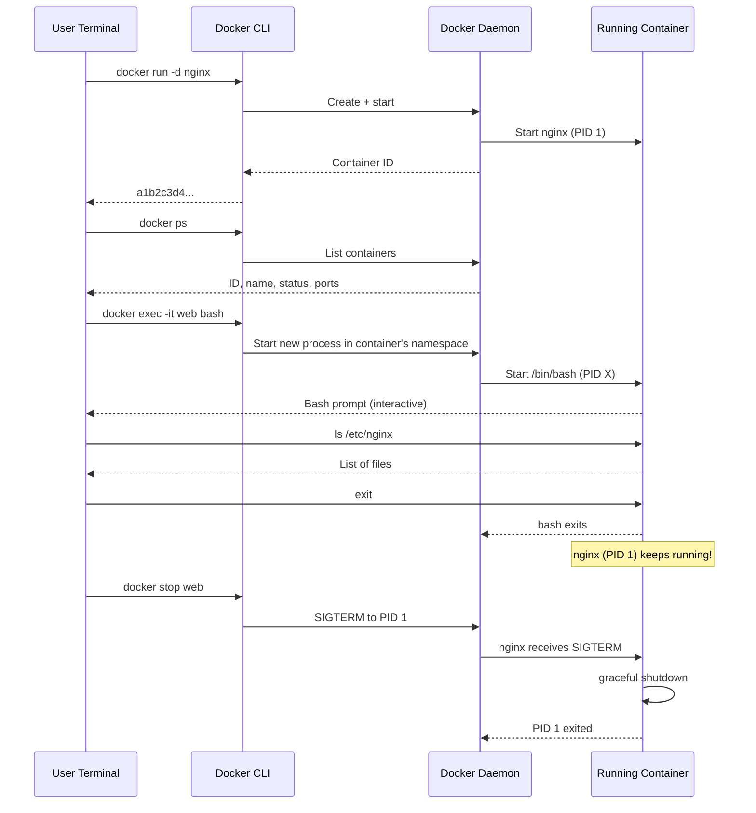

# 5.1 Interacting with Containers (Exec)

> [!info] Chapter Context
> When a container is running detached (`-d`), you cannot type into it directly. `docker exec` lets you run **additional** processes inside an already-running container — most commonly an interactive shell for debugging. This note covers `exec`, the `-it` flags, and the standard streams (STDIN/STDOUT/STDERR) that underlie all of it.

Related: [[5. Container Lifecycle and Management]] | [[5.2 Port Mapping and Environment Variables]] | [[5.4 Logging and Log Drivers]]

---

## 1. What `docker exec` Does

`docker exec` starts a **new process** inside an already-running container. The container's main process (PID 1) is unaffected; `exec` just adds another process to the container's PID namespace.

```bash
docker exec <container> <command>
```

Common use cases:

- Open an interactive shell for debugging.
- Run a database migration.
- Inspect files inside the container.
- Run a one-off script.

---

## 2. The `-it` Flags Explained

You will almost always see `docker exec -it <container> bash`. The two flags work together:

### 2.1 `-i` (Interactive)

Keeps STDIN open even when not attached to a terminal. Without `-i`, the container's new process cannot receive input from your keyboard.

### 2.2 `-t` (TTY)

Allocates a pseudo-teletype (a virtual terminal). This makes the shell behave like a real terminal:

- Color output works.
- Tab completion works.
- Arrow keys work.
- `clear` works.
- Prompt formatting is correct.

### 2.3 Combining Them

| Flags | Behavior |
| :--- | :--- |
| (no flags) | Command runs, output goes to your terminal, but you cannot type. Useful for non-interactive one-off commands. |
| `-i` only | STDIN open, no TTY. Output is plain; no colors, no tab completion. |
| `-t` only | TTY allocated but STDIN closed. Rarely useful. |
| `-it` | Full interactive terminal. Use this for shells. |

```bash
# Interactive shell
docker exec -it web bash
docker exec -it web sh          # for Alpine (no bash by default)

# One-off command, no interaction needed
docker exec web ls /var/log
docker exec web cat /etc/nginx/nginx.conf
```

### 2.4 Which Shell?

Different base images have different shells:

| Base image | Available shells |
| :--- | :--- |
| Alpine | `sh` only (no `bash`). Install with `apk add bash`. |
| Debian / Ubuntu | `bash`, `sh`. |
| CentOS / RHEL | `bash`, `sh`. |
| Distroless | None. Use `docker exec` with the binary path directly, or skip debugging. |

If `bash` is not found, fall back to `sh`:

```bash
docker exec -it web bash || docker exec -it web sh
```

---

## 3. Standard Streams

When a process runs, it has three standard streams:

| Stream | Number | Direction | Purpose |
| :--- | :--- | :--- | :--- |
| **STDIN** | 0 | Keyboard → process | Input. |
| **STDOUT** | 1 | Process → terminal | Normal output. |
| **STDERR** | 2 | Process → terminal | Error output. |

`docker exec -it` bridges these streams between your terminal and the new process inside the container. Without `-i`, STDIN is closed; without `-t`, no TTY is allocated.

> [!tip] Why This Matters
> If you pipe a command's output to `docker exec`, you usually want `-i` (so the container receives the piped input) but not `-t` (no TTY needed):
> ```bash
> cat backup.sql | docker exec -i db psql -U postgres
> ```

---

## 4. Useful `docker exec` Patterns

### 4.1 Open a Shell

```bash
docker exec -it web bash
```

You are now inside the container. `exit` or Ctrl+D returns to your host shell.

### 4.2 Run a Database Migration

```bash
docker exec -it app python manage.py migrate
```

### 4.3 Pipe a File Into the Container

```bash
cat data.csv | docker exec -i db psql -U postgres -c "COPY users FROM STDIN WITH CSV HEADER"
```

### 4.4 Pipe a File Out of the Container

```bash
docker exec db pg_dump -U postgres mydb > backup.sql
```

### 4.5 Run as a Different User

```bash
docker exec -it --user postgres db psql
docker exec -it --user 0 web bash          # as root
```

### 4.6 Set Environment Variables for the Exec'd Process

```bash
docker exec -it -e DEBUG=1 web node --inspect
```

### 4.7 Run in a Specific Working Directory

```bash
docker exec -it -w /var/log web ls
```

---

## 5. `docker exec` vs `docker attach`

These two commands are often confused.

| Command | What it does |
| :--- | :--- |
| `docker exec -it web bash` | Starts a **new** shell process inside the running container. The main process is unaffected. Exiting the shell does not stop the container. |
| `docker attach web` | Attaches your terminal to the **main process** (PID 1) of the container. You see its stdout/stderr. Ctrl+C sends SIGINT to PID 1, which may stop the container. |

Use `exec` for debugging. Use `attach` only when you specifically need to interact with PID 1 (rare).

> [!warning] `docker attach` Ctrl+C Kills the Container
> If you `docker attach` to a container and press Ctrl+C, you send SIGINT to PID 1, which usually stops the container. To detach without killing, press Ctrl+P, Ctrl+Q (the "detach keys").

---

## 6. When `docker exec` Fails

### 6.1 Container Is Not Running

```bash
docker exec -it web bash
# Error response from daemon: Container web is not running
```

Either the container is stopped or it crashed. Run `docker ps -a` to check. If it crashed, look at `docker logs web` to see why.

### 6.2 Shell Does Not Exist

```bash
docker exec -it web bash
# OCI runtime exec failed: exec failed: unable to start container process: exec: "bash": executable file not found in $PATH
```

The image does not have `bash`. Try `sh`, or install `bash` in the image. Distroless images intentionally have no shell — for those, `exec` is limited to running the binaries that exist.

### 6.3 The Container Is `--read-only`

If the container was started with `--read-only`, `exec` commands that try to write to the filesystem will fail. Add `--read-only` to `docker exec` is not possible, but you can mount a tmpfs for writable scratch space at runtime.

---

## 7. The Workflow Diagram



---

## 8. Common Student Mistakes

> [!warning] Mistake 1 — Forgetting `-it` for Interactive Use
> `docker exec web bash` (no flags) starts bash but immediately exits because STDIN is closed. Always use `-it` for interactive shells.

> [!warning] Mistake 2 — Using `bash` on Alpine
> Alpine does not ship `bash` by default. Use `sh` or install `bash` first.

> [!warning] Mistake 3 — Confusing `exec` with `attach`
> `exec` adds a new process; `attach` connects to PID 1. Use `exec` for debugging.

> [!warning] Mistake 4 — Expecting `exec` to Persist Changes to the Image
> Files created by `exec` go into the container's writable layer. They are lost when the container is removed. To persist changes, use volumes.

> [!warning] Mistake 5 — Using `exec` for the Main Application
> `exec` is for **additional** processes. The main application is started by `CMD`/`ENTRYPOINT` and runs as PID 1. Do not use `exec` to start your app — fix the `CMD` instead.

---

## 9. Summary Checklist

- [ ] `docker exec` starts a new process inside a running container.
- [ ] `-i` keeps STDIN open; `-t` allocates a TTY. Use `-it` for interactive shells.
- [ ] Use `sh` instead of `bash` on Alpine-based images.
- [ ] Standard streams: STDIN (0), STDOUT (1), STDERR (2).
- [ ] `docker exec` is for additional processes; `docker attach` connects to PID 1.
- [ ] Files created by `exec` go into the writable layer; they are lost when the container is removed.
- [ ] Use `-i` (no `-t`) when piping input: `cat file | docker exec -i db psql`.

---

Previous: [[5. Container Lifecycle and Management]] | Next: [[5.2 Port Mapping and Environment Variables]]
