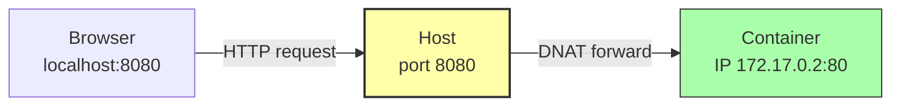

# 5.2 Port Mapping and Environment Variables

> [!info] Chapter Context
> Containers have their own private network and their own private environment. To communicate with a container from the host (or another container), you need **port mapping**. To configure the application inside a container, you use **environment variables**. This note covers both topics in depth.

Related: [[5. Container Lifecycle and Management]] | [[6. Docker Networking]] | [[3.2 Volumes and Bind Mounts]]

---

## 1. Port Mapping — The Big Picture

By default, a container gets its own network namespace with its own IP address (e.g., `172.17.0.2`) and its own set of listening ports. If a container runs Nginx listening on port 80, that port is reachable **only** from inside the container's network namespace — not from the host, not from the browser.

To make a container's port reachable from the host, you publish it with the `-p` flag. This sets up a DNAT (Destination NAT) rule on the host that forwards host traffic to the container's IP and port.



---

## 2. The `-p` Flag Syntax

```bash
docker run -p [host_ip:]host_port:container_port[/protocol] image
```

### 2.1 Variants

```bash
# Map host:8080 to container:80
docker run -p 8080:80 nginx

# Bind to localhost only (not 0.0.0.0)
docker run -p 127.0.0.1:8080:80 nginx

# Random host port -> container:80
docker run -p 80 nginx
# Docker picks a random high port (e.g., 32768). Find it with `docker port <container>`.

# Publish all EXPOSE'd ports to random host ports
docker run -P nginx

# UDP instead of TCP
docker run -p 53:53/udp dns-server

# Multiple ports
docker run -p 80:80 -p 443:443 nginx
```

### 2.2 Which Side Is Which?

The format is always `HOST:CONTAINER`. A common mnemonic: **"Left is laptop, right is riot"** — left is the host (your laptop), right is the container (the riot happening inside).

### 2.3 Port Conflicts

You cannot bind two containers to the same host port:

```bash
docker run -d -p 80:80 --name web1 nginx   # works
docker run -d -p 80:80 --name web2 nginx   # fails: "port is already allocated"
```

But multiple containers can all listen on the same **container** port internally:

```bash
docker run -d -p 8081:80 --name web1 nginx   # OK
docker run -d -p 8082:80 --name web2 nginx   # OK
docker run -d -p 8083:80 --name web3 nginx   # OK
```

Each container has its own network namespace, so port 80 inside each is independent.

### 2.4 Checking Port Mappings

```bash
docker port web
# 80/tcp -> 0.0.0.0:8080

docker ps --format "table {{.Names}}\t{{.Ports}}"
```

---

## 3. `EXPOSE` vs `-p`

| Instruction/Flag | What it does |
| :--- | :--- |
| `EXPOSE 80` in Dockerfile | **Documentation only**. Tells Docker and orchestration systems which ports the container intends to listen on. Does NOT publish anything. |
| `-p 8080:80` in `docker run` | **Actually publishes** the port. Host port 8080 forwards to container port 80. |
| `-P` (capital) | Publishes every `EXPOSE`'d port to a random host port. |

`EXPOSE` is a hint. `-p` is the actual mapping. You can `EXPOSE` a port without `-p` (the port is only reachable from inside the Docker network), and you can `-p` a port without `EXPOSE` (the mapping works fine; `EXPOSE` is not required).

---

## 4. Environment Variables

### 4.1 Why Environment Variables

Twelve-factor app methodology says configuration should live in the environment, not in the code. This lets the same image run in different environments (dev, staging, prod) with different settings.

Common things to set via env vars:

- `NODE_ENV`, `RAILS_ENV` — environment name.
- `DATABASE_URL` — database connection string.
- `API_KEY` — secrets (passed at runtime, never baked in).
- `LOG_LEVEL` — logging verbosity.
- `PORT` — the port the app should listen on.

### 4.2 Setting Env Vars at Runtime

#### Single Variable with `-e`

```bash
docker run -e NODE_ENV=production -e PORT=3000 myapp
```

#### From a File with `--env-file`

```bash
# .env file
NODE_ENV=production
DATABASE_URL=postgres://db:5432/myapp
API_KEY=sk-...

# Run
docker run --env-file .env myapp
```

The file is `KEY=VALUE` per line; comments start with `#`. Useful for keeping secrets out of shell history.

> [!warning] `.env` Files in Version Control
> Add `.env` to `.gitignore` (and `.dockerignore`). Never commit secrets. Use `.env.example` (with placeholder values) as a template.

### 4.3 Setting Env Vars in the Dockerfile with `ENV`

```dockerfile
ENV NODE_ENV=production
ENV PATH=/usr/local/myapp/bin:$PATH
```

These are baked into the image. They can be overridden at runtime with `-e`:

```bash
docker run -e NODE_ENV=staging myapp    # overrides the Dockerfile's ENV
```

### 4.4 Inspecting Env Vars

```bash
docker inspect web --format '{{range .Config.Env}}{{println .}}{{end}}'
docker exec web env
docker exec web printenv NODE_ENV
```

### 4.5 The Special `LANG` and `PATH` Variables

Some env vars are set by the base image and inherited:

- `PATH` — Where to look for executables.
- `LANG` — Locale (affects string sorting, date formats).
- `HOME` — User's home directory.

You usually do not need to override these, but they are visible in `docker inspect`.

---

## 5. The `docker run` Arguments (Command-Line Args)

In addition to env vars, you can pass command-line arguments to the container's main process. These are appended to the `ENTRYPOINT` (or replace the `CMD`).

```dockerfile
# Dockerfile
ENTRYPOINT ["node"]
CMD ["server.js"]
```

```bash
# Uses CMD: runs `node server.js`
docker run myapp

# Override CMD: runs `node --inspect`
docker run myapp --inspect

# Override ENTRYPOINT: runs `sh` instead of `node`
docker run --entrypoint sh myapp
```

---

## 6. Common Patterns

### 6.1 Database with Password and Port

```bash
docker run -d \
  --name db \
  -e POSTGRES_DB=myapp \
  -e POSTGRES_USER=admin \
  -e POSTGRES_PASSWORD=secret \
  -e POSTGRES_HOST_AUTH_METHOD=scram-sha-256 \
  -p 5432:5432 \
  -v pgdata:/var/lib/postgresql/data \
  postgres:15
```

### 6.2 Web App Connecting to the Database

```bash
docker run -d \
  --name app \
  -p 3000:3000 \
  -e DATABASE_URL=postgres://admin:secret@db:5432/myapp \
  -e NODE_ENV=production \
  myapp:1.0
```

(Note: this requires the `app` container and `db` container to be on the same Docker network. We cover this in [[6. Docker Networking]].)

### 6.3 Passing a `.env` File

```bash
docker run -d \
  --name app \
  -p 3000:3000 \
  --env-file .env.production \
  myapp:1.0
```

---

## 7. Common Student Mistakes

> [!warning] Mistake 1 — Confusing Host and Container Ports
> `-p 80:8080` maps host port 80 to container port 8080. If the container app listens on 8080 and you write `-p 80:8080`, accessing `localhost:80` works. If you accidentally write `-p 8080:80`, accessing `localhost:8080` would forward to container port 80 (which has nothing listening), and you get a connection refused.

> [!warning] Mistake 2 — Forgetting to Bind to Localhost
> `-p 8080:80` binds to `0.0.0.0:8080`, which means anyone on your network can access it. For dev work where you do not want that, use `-p 127.0.0.1:8080:80`.

> [!warning] Mistake 3 — Baking Secrets in the Image with `ENV`
> `ENV API_KEY=xxx` in a Dockerfile puts the secret in the image, extractable by anyone. Pass secrets at runtime with `-e` or `--env-file`.

> [!warning] Mistake 4 — Expecting `EXPOSE` to Publish a Port
> `EXPOSE 80` is documentation only. You still need `-p 8080:80` to actually publish.

> [!warning] Mistake 5 — Quoting Env Var Values
> `-e "NODE_ENV=production"` works, but `-e NODE_ENV=production` is cleaner. The quotes are unnecessary unless the value has spaces.

> [!warning] Mistake 6 — Using Lowercase Env Var Names
> By convention, env vars are uppercase (`NODE_ENV`, not `node_env`). Some libraries are case-sensitive.

---

## 8. Summary Checklist

- [ ] Port mapping format: `-p [host_ip:]host_port:container_port[/protocol]`.
- [ ] "Left is laptop, right is container."
- [ ] `EXPOSE` is documentation only; `-p` actually publishes.
- [ ] Multiple containers can share the same container port; they cannot share the same host port.
- [ ] `-P` (capital) publishes all EXPOSE'd ports to random host ports.
- [ ] Env vars are set with `-e KEY=VALUE` or `--env-file file.env`.
- [ ] `ENV` in the Dockerfile bakes env vars into the image (override at runtime with `-e`).
- [ ] Pass secrets at runtime; never bake them with `ENV`.
- [ ] `--env-file` reads `KEY=VALUE` lines from a file (often `.env`).

---

Previous: [[5.1 Interacting with Containers Exec]] | Next: [[5.3 Resource Limits and Health Checks]]
