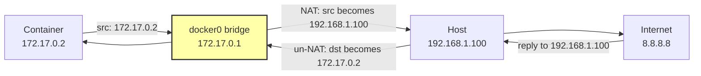
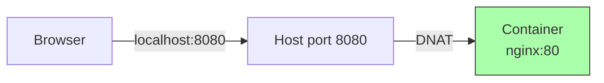
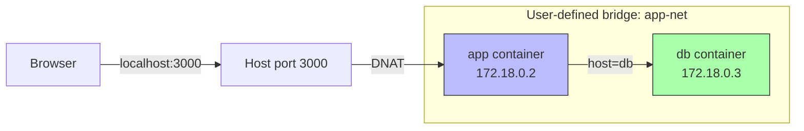
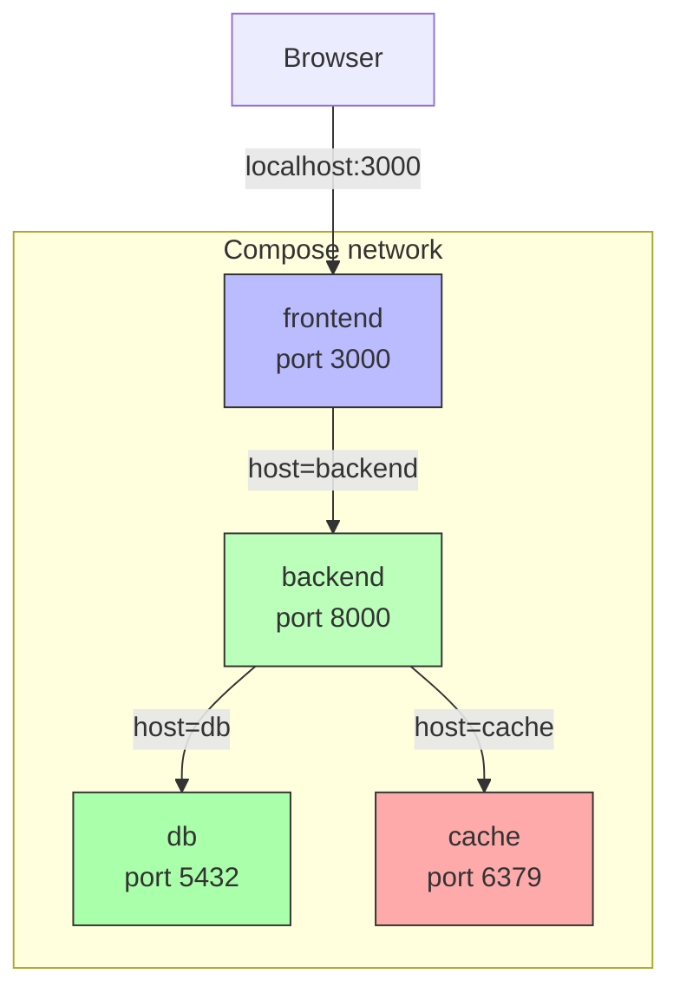

# 6. Docker Networking

> [!info] Chapter Context
> Containers need to talk to each other (a backend to a database) and to the outside world (a browser to a web server). Docker provides several **network drivers** for different scenarios. This note covers the four built-in drivers, how DNS-based service discovery works, and how to design networks for multi-container applications.

Related: [[5. Container Lifecycle and Management]] | [[5.2 Port Mapping and Environment Variables]] | [[7. Docker Compose]] | [[6.1 Custom Networks and DNS]]

---

## 1. The Built-in Network Drivers

Docker ships with four network drivers:

| Driver | Use case |
| :--- | :--- |
| **`bridge`** (default) | Container-to-container communication on a single host. Isolated from the host network. |
| **`host`** | Container shares the host's network stack. No isolation. Fast but insecure. |
| **`none`** | No networking at all. Container has only a loopback interface. |
| **`overlay`** | Multi-host networking (Docker Swarm or with external KV store). Used by Swarm services. |

There is also a **`macvlan`** driver that assigns a real MAC address to a container, making it appear as a separate physical device on your LAN. It is rarely used.

---

## 2. The Default Bridge Network

When you install Docker, it creates a default bridge network named `bridge`. Every container you start without specifying `--network` is attached to this default bridge.

### 2.1 Properties of the Default Bridge

- Each container gets an IP from the `172.17.0.0/16` subnet (first container is `172.17.0.2`, second is `172.17.0.3`, etc.).
- Containers can ping each other by IP.
- Containers **cannot** resolve each other by name (this is the key limitation).
- The host can reach containers via their bridge IPs.
- Containers can reach the outside world via NAT (the host's `docker0` interface acts as a gateway).

### 2.2 Why the Default Bridge Is Limited

The default bridge lacks **DNS-based service discovery**. If you start container `db` and container `app`, the `app` container cannot reach `db` by the name `db` — only by its IP, which changes every time you recreate the container.

For any non-trivial multi-container setup, use a **user-defined bridge** instead.

### 2.3 The NAT Trick

The default bridge uses Network Address Translation (NAT) to let containers reach the internet. When a container sends a packet to `8.8.8.8`, Docker rewrites the source address from `172.17.0.2` to the host's IP, sends the packet out, and rewrites the response back. This is the same technology home routers use.



---

## 3. User-Defined Bridge Networks

```bash
# Create a custom network
docker network create my-net

# Attach containers to it
docker run -d --name db --network my-net postgres
docker run -d --name app --network my-net myapp
```

### 3.1 Properties of User-Defined Bridges

- Containers can resolve each other by **name** (Docker has a built-in DNS server at `127.0.0.11` inside every container on a user-defined bridge).
- Better isolation: containers on different user-defined bridges cannot talk to each other.
- You can configure the subnet, gateway, and IP range.
- Each network has its own subnet, so container IPs do not collide across networks.

### 3.2 DNS Service Discovery — The Magic

This is the killer feature. When `app` connects to `db`, Docker's embedded DNS server resolves `db` to the IP address of the `db` container. You write:

```python
# Inside the app container
import os
import psycopg2

conn = psycopg2.connect(
    host="db",                       # <-- just the container name!
    database="myapp",
    user="postgres",
    password=os.environ["POSTGRES_PASSWORD"],
)
```

This is why in Docker Compose, you write `host: db` in your config — Compose creates a user-defined bridge for the project, and service names become DNS names.

### 3.3 The DNS Server

Inside every container (on a user-defined bridge), `127.0.0.11` is Docker's embedded DNS server. It resolves:

- Container names (e.g., `db`).
- Network aliases (e.g., `--network-alias=postgres`).
- Service names in Docker Compose.
- External hostnames (it forwards to the host's configured DNS).

You can inspect it:

```bash
docker exec app cat /etc/resolv.conf
# nameserver 127.0.0.11
# options ndots:0
```

### 3.4 Network Aliases

```bash
docker run -d --name db --network my-net --network-alias=postgres postgres
docker run -d --name db-replica --network my-net --network-alias=postgres postgres
```

Both containers are now reachable via the name `postgres` (DNS round-robin). Useful for simple load balancing or for migrating to a new database without changing app config.

---

## 4. The `host` Network

```bash
docker run -d --network host nginx
```

The container shares the host's network stack — no isolation, no NAT, no port mapping needed. If Nginx listens on port 80 inside the container, it is listening on port 80 of the host directly.

### 4.1 When to Use `host`

- Performance-critical applications where the NAT overhead matters (rare).
- Applications that need to discover other services on the host's LAN via multicast/broadcast (some legacy service discovery tools).
- When running Docker-in-Docker.

### 4.2 When NOT to Use `host`

- Almost everywhere else. You lose isolation and port collision protection.
- On macOS and Windows, `host` networking does not work as expected because the host is actually a Linux VM, not your Mac/Windows machine.

> [!warning] `host` Networking on Mac/Windows
> Because Docker runs inside a Linux VM on Mac/Windows, `--network host` gives the container access to the **VM's** network, not your Mac/Windows network. This is rarely what you want. Use `bridge` instead.

---

## 5. The `none` Network

```bash
docker run -d --network none alpine sleep 1000
```

The container gets only a loopback interface (`lo`). It cannot reach the network, and the network cannot reach it (except via `docker exec`).

### 5.1 When to Use `none`

- Processing untrusted files (e.g., a sandbox for analyzing malware).
- Apps that genuinely do not need network access.
- Maximum isolation testing.

---

## 6. The `overlay` Network (Multi-Host)

For Docker Swarm (or with an external key-value store), Docker can create an **overlay** network that spans multiple hosts. Containers on different physical machines can talk to each other as if they were on the same LAN.

```bash
# Create an overlay network (requires Swarm mode)
docker network create -d overlay my-overlay
docker service create --network my-overlay --name web nginx
```

This is how Swarm services scale across a cluster. Each container can resolve other services by name, regardless of which host they are on.

For non-Swarm setups, overlay networks require manually configuring a key-value store (Consul, etcd, ZooKeeper). This is rarely done in practice — most teams use Kubernetes for multi-host orchestration instead.

---

## 7. Network Management Commands

```bash
docker network ls                          # list all networks
docker network inspect my-net              # see containers, IPAM config, etc.
docker network create my-net               # create a user-defined bridge
docker network create -d overlay my-ov     # create an overlay network
docker network rm my-net                   # remove a network
docker network prune                       # remove unused networks
docker network connect my-net web          # attach a running container to a network
docker network disconnect my-net web       # detach a container
```

### 7.1 Connecting a Container to Multiple Networks

```bash
docker run -d --name web --network front nginx
docker network connect back web
```

The `web` container now has two network interfaces — one on `front` (for client traffic) and one on `back` (for talking to a database). This is useful for tiered architectures.

---

## 8. Port Mapping Recap

When you `docker run -p 8080:80 nginx`:

1. Docker allocates port 8080 on the host.
2. Docker adds a DNAT rule to iptables: traffic to `host:8080` is forwarded to `container_ip:80`.
3. The browser hits `localhost:8080`, gets forwarded to the container.

```bash
# See the actual iptables rules Docker created
sudo iptables -t nat -L -n -v
```

Without `-p`, the container is reachable only from inside its Docker network — not from the host.

---

## 9. Common Network Topologies

### 9.1 Single-Container Web App



### 9.2 App + Database (User-Defined Bridge)



### 9.3 Frontend + Backend + Database (Docker Compose)



---

## 10. Common Student Mistakes

> [!warning] Mistake 1 — Using `localhost` to Reach Another Container
> Inside a container, `localhost` refers to **that container**, not the host. To reach another container, use its name (e.g., `db`) on a user-defined bridge network.

> [!warning] Mistake 2 — Using the Default Bridge for Multi-Container Apps
> The default `bridge` network does not support DNS. Use a user-defined bridge (`docker network create`).

> [!warning] Mistake 3 — Expecting `host` Networking on Mac/Windows
> `--network host` on Mac/Windows gives access to the Linux VM's network, not your actual host. Use bridge networking instead.

> [!warning] Mistake 4 — Two Containers on the Same Port
> Two containers can listen on port 80 internally (different network namespaces). But you cannot bind both to host port 80 with `-p 80:80`. Use different host ports (`-p 8081:80`, `-p 8082:80`).

> [!warning] Mistake 5 — Forgetting to Attach a Container to the Network
> If you forget `--network my-net` when starting a container, it lands on the default bridge and cannot resolve other containers by name.

> [!warning] Mistake 6 — Expecting Containers on Different Networks to Talk
> Containers on `net-a` cannot reach containers on `net-b` unless one container is connected to both networks. Use this for isolation when needed.

---

## 11. Summary Checklist

- [ ] Docker has four built-in network drivers: `bridge` (default), `host`, `none`, `overlay`.
- [ ] The default `bridge` lacks DNS; use user-defined bridges for multi-container apps.
- [ ] User-defined bridges provide automatic DNS service discovery by container name.
- [ ] Docker's embedded DNS server is at `127.0.0.11` inside containers on user-defined networks.
- [ ] `host` networking shares the host's stack — fast but no isolation; does not work as expected on Mac/Windows.
- [ ] `none` networking gives the container only a loopback interface.
- [ ] `overlay` networking spans multiple hosts (requires Swarm or external KV store).
- [ ] `-p host_port:container_port` publishes a port via DNAT on the host.
- [ ] `docker network connect` attaches a running container to an additional network.

---

Previous: [[5.4 Logging and Log Drivers]] | Next: [[6.1 Custom Networks and DNS]]
