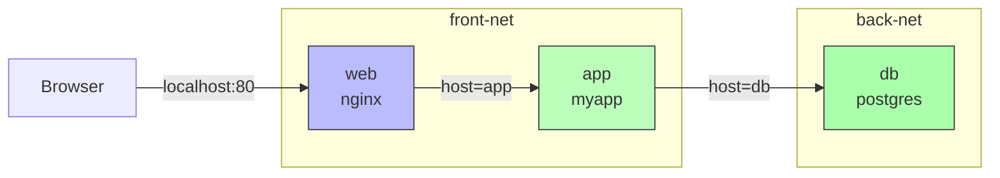

# 6.1 Custom Networks and DNS

> [!info] Chapter Context
> [[6. Docker Networking]] introduced user-defined bridge networks and mentioned that they provide DNS. This note goes deeper into how Docker's embedded DNS works, how to design networks for multi-tier applications, and how to debug DNS issues.

Related: [[6. Docker Networking]] | [[7. Docker Compose]]

---

## 1. Docker's Embedded DNS Server

Every container attached to a user-defined bridge (or overlay) network has Docker's embedded DNS server at `127.0.0.11`. This server is a critical piece of how Docker Compose and ECS service discovery work.

### 1.1 What the DNS Server Resolves

| Query type | Example | Resolves to |
| :--- | :--- | :--- |
| Container name | `db` | IP of the container named `db` on the same network. |
| Network alias | `postgres` | IP of the container with `--network-alias=postgres`. |
| Service name (Compose) | `redis` | IP of the container for the `redis` service. |
| External hostname | `google.com` | Forwarded to the host's configured DNS, then returned. |

### 1.2 How to Verify DNS Resolution

```bash
# Inside a container, see what's configured
docker exec app cat /etc/resolv.conf
# nameserver 127.0.0.11
# options ndots:0

# Resolve a name
docker exec app nslookup db
docker exec app getent hosts db
docker exec app ping -c1 db
```

### 1.3 The `ndots:0` Setting

The `ndots:0` option tells the resolver to skip the search domain logic and try the name as-is first. This avoids delays when querying container names. If you see DNS-related latency in containers, check whether `ndots` is set incorrectly.

---

## 2. Network Aliases and Round-Robin DNS

```bash
docker network create my-net

docker run -d --name web1 --network my-net --network-alias=web nginx
docker run -d --name web2 --network my-net --network-alias=web nginx
docker run -d --name web3 --network my-net --network-alias=web nginx
```

All three containers are now reachable via the name `web`. Docker's DNS server returns all three IPs (in random order for round-robin). A client that connects to `web` will hit one of them at random.

### 2.1 Limitations of Round-Robin

- No health checking — a dead container still gets DNS responses.
- No session affinity — the same client may hit different containers on subsequent requests.
- DNS caching in clients can defeat round-robin.

For real load balancing, use Docker Swarm's ingress routing (which uses IPVS) or put a real load balancer (HAProxy, Nginx, Traefik) in front.

---

## 3. Multi-Tier Network Design

Consider a typical three-tier app: frontend, backend, database. The frontend should be reachable from the outside; the backend should be reachable only from the frontend; the database should be reachable only from the backend.

### 3.1 The Naive Approach (One Network)

Put everything on one network. The frontend can talk to the database directly. This is bad for security — if the frontend is compromised, the database is exposed.

### 3.2 The Proper Approach (Two Networks)

```bash
docker network create front-net
docker network create back-net

docker run -d --name db --network back-net postgres
docker run -d --name app --network back-net --network front-net myapp
docker run -d --name web --network front-net -p 80:80 nginx
```

Now:

- `web` is on `front-net`. It can reach `app` (also on `front-net`) but not `db`.
- `app` is on both `front-net` and `back-net`. It can reach `db` (on `back-net`) and be reached by `web`.
- `db` is on `back-net` only. Only `app` can reach it.



---

## 4. Inspecting Networks

```bash
docker network inspect my-net
```

Returns JSON with:

- `Name` — Network name.
- `Driver` — `bridge`, `overlay`, etc.
- `IPAM.Config` — Subnet, gateway, IP range.
- `Containers` — Map of container IDs to their IPs and names on this network.
- `Options` — Driver-specific options.

Useful for debugging "why can't my app reach the database?":

```bash
# Is the db container actually on the same network as app?
docker network inspect my-net --format '{{range .Containers}}{{.Name}} {{end}}'
# -> app db
```

If `db` is not in the list, the containers are on different networks and cannot resolve each other.

---

## 5. DNS Debugging Checklist

If your container cannot resolve another container's name:

1. **Are both containers on the same user-defined network?**
   ```bash
   docker network inspect my-net --format '{{range .Containers}}{{.Name}} {{end}}'
   ```

2. **Is the DNS server configured inside the container?**
   ```bash
   docker exec app cat /etc/resolv.conf
   # Should say "nameserver 127.0.0.11"
   ```

3. **Can the container resolve the name?**
   ```bash
   docker exec app nslookup db
   # Or, if nslookup is not installed:
   docker exec app getent hosts db
   ```

4. **Can the container reach the IP?**
   ```bash
   docker exec app ping -c1 <ip>
   docker exec app curl -v telnet://db:5432
   ```

5. **Is the target container actually running and listening?**
   ```bash
   docker exec db ss -tlnp
   ```

---

## 6. The Default Bridge DNS Surprise

Containers on the default `bridge` network **cannot** resolve each other by name. Many beginners discover this the hard way:

```bash
docker run -d --name db postgres       # default bridge
docker run -d --name app myapp         # default bridge

docker exec app psql -h db -U postgres
# psql: error: could not translate host name "db" to address: Name or service not known
```

The fix is to use a user-defined bridge:

```bash
docker network create my-net
docker run -d --name db --network my-net postgres
docker run -d --name app --network my-net myapp
docker exec app psql -h db -U postgres    # works!
```

---

## 7. Custom Subnets and Gateways

By default, Docker picks a free subnet for each user-defined network. You can specify your own:

```bash
docker network create \
  --subnet=10.5.0.0/16 \
  --gateway=10.5.0.1 \
  --ip-range=10.5.0.0/24 \
  my-net
```

This is useful when:

- You have an existing network range that conflicts with Docker's defaults.
- You want to allocate specific IPs to specific containers: `docker run --ip 10.5.0.10 --network my-net nginx`.
- You are setting up a VPN or overlay that needs to match a corporate IP plan.

---

## 8. IPv6 Networks

By default, Docker networks are IPv4-only. To enable IPv6:

```json
// /etc/docker/daemon.json
{
  "ipv6": true,
  "fixed-cidr-v6": "2001:db8:1::/64"
}
```

```bash
docker network create --ipv6 --subnet=2001:db8:1::/64 my-net-v6
```

IPv6 in Docker is fully supported but somewhat niche. Most production deployments still use IPv4 internally.

---

## 9. Common Student Mistakes

> [!warning] Mistake 1 — Expecting DNS on the Default Bridge
> The default `bridge` does not resolve container names. Use a user-defined bridge.

> [!warning] Mistake 2 — DNS Caching in Apps
> Some apps (especially Java apps) cache DNS results forever. If you recreate a container (new IP), the app keeps trying the old IP. Configure your DNS cache TTL, or restart the app.

> [!warning] Mistake 3 — Forgetting to Connect a Container to the Right Network
> If `app` cannot resolve `db`, check `docker network inspect <network>` — both containers must be listed.

> [!warning] Mistake 4 — Putting Everything on One Network
> For multi-tier apps, use separate networks for front-tier and back-tier. The database should not be reachable from the frontend.

---

## 10. Summary Checklist

- [ ] Docker's embedded DNS is at `127.0.0.11` inside containers on user-defined networks.
- [ ] It resolves container names, network aliases, and Compose service names.
- [ ] The default `bridge` does NOT support DNS — use user-defined bridges.
- [ ] `--network-alias` provides round-robin DNS for multiple containers.
- [ ] For multi-tier apps, use separate front-tier and back-tier networks for security.
- [ ] Inspect with `docker network inspect`; debug with `nslookup` or `getent hosts`.
- [ ] Custom subnets/gateways can be specified at network creation time.

---

Previous: [[6. Docker Networking]] | Next: [[7. Docker Compose]]
