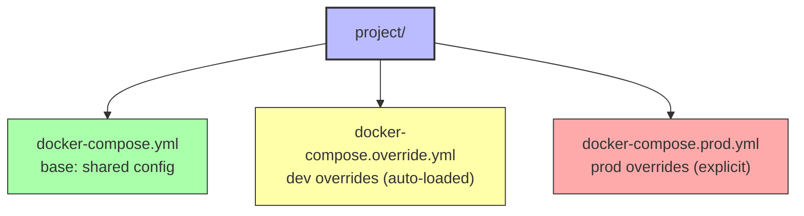

# 7.1 Compose Files in Depth

> [!info] Chapter Context
> [[7. Docker Compose]] covered the basics. This note goes deeper: multiple compose files (override pattern), env_file vs environment, secrets, watch mode (live rebuild), and patterns for different environments (dev/staging/prod).

Related: [[7. Docker Compose]] | [[7.2 Compose Commands and Profiles]] | [[4.3 Dockerfile Best Practices]]

---

## 1. Multiple Compose Files — The Override Pattern

Compose supports merging multiple YAML files. By default, it reads `docker-compose.yml` and `docker-compose.override.yml` (if present) and merges them. You can also specify files explicitly:

```bash
docker-compose -f docker-compose.yml -f docker-compose.prod.yml up -d
```

### 1.1 The Standard Dev/Prod Pattern

The standard multi-file Compose pattern uses three files in the project root:



#### `docker-compose.yml` (base)

```yaml
services:
  db:
    image: postgres:15
    volumes:
      - pgdata:/var/lib/postgresql/data
  backend:
    build: ./backend
    depends_on: [db]
    environment:
      DATABASE_URL: postgres://postgres@db:5432/myapp

volumes:
  pgdata:
```

#### `docker-compose.override.yml` (dev, auto-loaded)

```yaml
services:
  backend:
    volumes:
      - ./backend:/app          # live reload
    environment:
      NODE_ENV: development
      DEBUG: "true"
    ports:
      - "8000:8000"
      - "9229:9229"             # Node.js debugger
```

#### `docker-compose.prod.yml` (prod, explicit)

```yaml
services:
  backend:
    environment:
      NODE_ENV: production
    restart: always
    ports:
      - "8000:8000"
    deploy:
      replicas: 3
```

```bash
# Dev (base + override automatically)
docker-compose up

# Prod (base + prod explicitly)
docker-compose -f docker-compose.yml -f docker-compose.prod.yml up -d
```

### 1.2 Merge Rules

- **Scalars** (strings, numbers): the last file wins.
- **Maps** (e.g., `environment`): keys are merged; the last file wins for duplicate keys.
- **Lists** (e.g., `ports`, `volumes`): concatenated (no deduplication).

This means `docker-compose.prod.yml` can add a port without removing the dev port from the base file. Use `!reset` and `!override` tags (Compose v2.24+) to clear lists when needed.

---

## 2. `env_file` vs `environment`

Both set environment variables, but differently:

### 2.1 `environment` — Inline Values

```yaml
environment:
  NODE_ENV: production
  API_KEY: ${API_KEY}              # from shell or .env
```

Values are visible in the compose file. Good for non-secret config. Bad for secrets (they end up in version control).

### 2.2 `env_file` — From a File

```yaml
env_file:
  - .env.production                # contains KEY=VALUE per line
```

The file is read at startup; values are loaded as environment variables in the container. Good for secrets (the file is in `.gitignore`).

### 2.3 Combining

```yaml
services:
  backend:
    env_file:
      - .env.common
      - .env.production
    environment:
      NODE_ENV: production         # overrides anything in env_file
```

`environment` takes precedence over `env_file`.

---

## 3. Compose Secrets

Compose V2 supports Docker secrets (originally a Swarm feature). Secrets are mounted as files at `/run/secrets/<name>`:

```yaml
services:
  backend:
    image: myapp:1.0
    secrets:
      - db_password
      - api_key

secrets:
  db_password:
    file: ./secrets/db_password.txt
  api_key:
    environment: API_KEY           # from env var
```

Inside the container:

```bash
cat /run/secrets/db_password
# supersecret
```

The secret is mounted as a tmpfs file (in RAM), never written to disk. Your app reads the file at startup instead of using an environment variable. This is more secure than `environment` because:

- Env vars are visible in `docker inspect` and in `/proc/<pid>/environ`.
- Secret files are visible only to the container's process and root.

---

## 4. Watch Mode (Live Rebuild)

Compose V2.22+ supports **watch mode**, which automatically rebuilds or syncs files when your source changes:

```yaml
services:
  backend:
    build: ./backend
    develop:
      watch:
        - action: sync
          path: ./backend/src
          target: /app/src
        - action: rebuild
          path: ./backend/package.json
        - action: sync+restart
          path: ./backend/config
          target: /app/config
```

```bash
docker compose watch
```

- `sync` — copy the changed file into the running container. Fast; for source code with hot reload (Vite, nodemon).
- `rebuild` — rebuild the image and recreate the container. For dependency changes (package.json, requirements.txt).
- `sync+restart` — sync the file and restart the container. For config files.

Watch mode eliminates the bind-mount-everything hack and makes dev loops much faster.

---

## 5. Health-Based Dependencies (Revisited)

```yaml
services:
  db:
    image: postgres:15
    healthcheck:
      test: ["CMD-SHELL", "pg_isready -U postgres"]
      interval: 5s
      timeout: 3s
      retries: 10
      start_period: 10s

  backend:
    build: ./backend
    depends_on:
      db:
        condition: service_healthy
    restart: on-failure           # in case backend starts before db is fully ready
```

The `start_period` in `healthcheck` gives Postgres time to initialize before failures start counting. `restart: on-failure` ensures the backend retries if it crashes during the brief window between db-healthy and db-actually-accepting-connections.

---

## 6. Compose for Different Environments

### 6.1 Development

- Bind mount source code for live reload.
- Expose debugger ports.
- Set `NODE_ENV=development`.
- Use `--build` to rebuild images.
- Disable `restart` (you want failures to be visible).

### 6.2 CI/Testing

- Use a separate `docker-compose.ci.yml`.
- Do NOT bind mount (you want the image to be tested as-is).
- Use `--build` to ensure the latest code is in the image.
- Use `--exit-code-from backend` to make `docker-compose up` exit with the backend's exit code.

### 6.3 Production

- Use multi-stage built images (no `build:` section, just `image:`).
- Set `restart: always` or `unless-stopped`.
- Use Compose secrets for credentials.
- Define `deploy.replicas` for horizontal scaling (with Swarm) or `deploy.resources.limits` for resource caps.
- Use external volumes (`volumes: pgdata: external: true`) so the volume is created outside Compose (e.g., by ops).

---

## 7. External Networks and Volumes

```yaml
networks:
  shared:
    external: true
    name: shared-network

volumes:
  pgdata:
    external: true
    name: myapp-pgdata-prod
```

`external: true` tells Compose: "This network/volume already exists; do not create it." This is useful when:

- Multiple Compose projects share a network.
- Volumes are created and managed by ops (e.g., EBS-backed volumes in production).
- You want to avoid accidental volume deletion by `docker-compose down -v`.

---

## 8. Common Patterns

### 8.1 Database Initialization

```yaml
services:
  db:
    image: postgres:15
    environment:
      POSTGRES_DB: myapp
      POSTGRES_USER: admin
      POSTGRES_PASSWORD: ${DB_PASSWORD}
    volumes:
      - pgdata:/var/lib/postgresql/data
      - ./db-init:/docker-entrypoint-initdb.d:ro   # SQL files run on first start
```

Files in `/docker-entrypoint-initdb.d/` (`.sql`, `.sql.gz`, `.sh`) are executed alphabetically on first container start (when the data directory is empty). This is how you seed a database.

### 8.2 Wait-for-It Pattern (Legacy)

Before `condition: service_healthy`, people used a `wait-for-it.sh` script in the entrypoint:

```yaml
backend:
  command: ["./wait-for-it.sh", "db:5432", "--", "node", "server.js"]
```

This is no longer necessary. Use `condition: service_healthy` instead.

### 8.3 Init Container

```yaml
services:
  migrate:
    build: ./backend
    command: ["python", "manage.py", "migrate"]
    depends_on:
      db:
        condition: service_healthy
    restart: "no"
    environment:
      DATABASE_URL: postgres://admin@db:5432/myapp

  backend:
    build: ./backend
    depends_on:
      migrate:
        condition: service_completed_successfully
    # ...
```

`service_completed_successfully` waits for the `migrate` container to exit with code 0. Useful for running migrations before starting the app.

---

## 9. Common Mistakes

> [!warning] Mistake 1 — Putting Secrets in `environment`
> Env vars are visible in `docker inspect` and `/proc/<pid>/environ`. Use Compose secrets (mounted as files) for actual secrets.

> [!warning] Mistake 2 — Not Using Healthcheck with `depends_on`
> Without `condition: service_healthy`, the backend starts before the database is ready, fails to connect, and may crash before retry logic kicks in.

> [!warning] Mistake 3 — Forgetting `external: true` for Shared Resources
> If two Compose projects share a network, both must declare it with `external: true`. Otherwise, each creates its own network with the same name.

> [!warning] Mistake 4 — Bind Mounting in Production
> Bind mounts tie the container to a specific host path. In production, use named volumes or external storage instead.

---

## 10. Summary Checklist

- [ ] Use multiple compose files (base + override + prod) for environment-specific config.
- [ ] Merge rules: scalars replaced, maps merged, lists concatenated.
- [ ] `env_file` reads `KEY=VALUE` from a file; `environment` sets inline values.
- [ ] Compose secrets mount files at `/run/secrets/<name>` (more secure than env vars).
- [ ] Watch mode (`develop.watch`) syncs or rebuilds on file changes.
- [ ] Use `condition: service_healthy` and `condition: service_completed_successfully` for proper dependency management.
- [ ] External networks/volumes (`external: true`) are created outside Compose and shared.
- [ ] Database init scripts go in `/docker-entrypoint-initdb.d/` (Postgres image convention).

---

Previous: [[7. Docker Compose]] | Next: [[7.2 Compose Commands and Profiles]]
