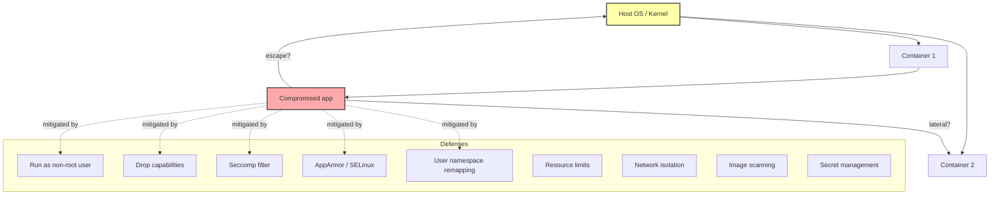

# 8. Docker Security

> [!info] Chapter Context
> Containers share the host kernel, which means a container is **not** as isolated as a VM. A kernel vulnerability or a misconfiguration can let an attacker escape the container and access the host. This note covers the security primitives Docker provides (capabilities, seccomp, AppArmor, user namespaces, rootless mode) and the practical steps to harden containers for production.

Related: [[1.1 Container Isolation Internals]] | [[4.3 Dockerfile Best Practices]] | [[5.3 Resource Limits and Health Checks]] | [[9. Registries and Distribution]]

---

## 1. The Threat Model

Before discussing defenses, we need to understand what we are defending against. The main threats in container security are:

1. **Container escape** — An attacker who has compromised an application inside a container breaks out and runs code on the host or in other containers.
2. **Privilege escalation** — An attacker with non-root access inside a container gains root.
3. **Secret leakage** — Secrets (API keys, passwords, certificates) are exposed via image layers, environment variables, or logs.
4. **Supply chain attacks** — A base image or dependency contains malicious code (e.g., a backdoored npm package).
5. **Resource exhaustion** — A container (possibly compromised) consumes all CPU/memory, causing denial of service.
6. **Network exposure** — A container that should be internal is accidentally exposed to the internet.

Each defense below addresses one or more of these threats.



---

## 2. Run as a Non-Root User

By default, containers run as root (UID 0). If an attacker escapes the container, they have root on the host (modulo user namespaces). The single most impactful hardening step is to run as a non-root user.

### 2.1 In the Dockerfile

```dockerfile
FROM node:18-alpine

# Create a non-root user
RUN addgroup -S app && adduser -S app -G app

# Set ownership of the app directory
WORKDIR /app
COPY --chown=app:app . .

# Switch to the non-root user
USER app

CMD ["node", "server.js"]
```

### 2.2 At Runtime

```bash
docker run --user 1000:1000 myapp
docker run --user $(id -u):$(id -g) myapp
```

### 2.3 Distroless Images

Many official images (e.g., `google/distroless`) ship without a shell and run as non-root by default. They are smaller and harder to attack because there is no shell for an attacker to use.

```dockerfile
FROM node:18 AS build
# ... build the app ...

FROM gcr.io/distroless/nodejs18-debian12
WORKDIR /app
COPY --from=build /app /app
USER nonroot
CMD ["server.js"]
```

> [!warning] Shells Are an Attacker's Friend
> A shell (`/bin/sh`, `/bin/bash`) lets an attacker run arbitrary commands. Distroless images have no shell, so even if an attacker finds a vulnerability, they cannot easily get a foothold. This is called "reducing the attack surface."

---

## 3. Drop Linux Capabilities

Linux root has ~40 distinct capabilities. Docker drops many dangerous ones by default, but you can drop more.

### 3.1 Default Dropped Capabilities

Docker drops the following by default (these are the ones you do NOT have unless you add them back):

- `CAP_AUDIT_WRITE`
- `CAP_SYS_ADMIN` (the "new root" — extremely powerful)
- `CAP_SYS_MODULE` (load kernel modules)
- `CAP_SYS_PTRACE` (inspect other processes)
- `CAP_NET_ADMIN` (configure network)
- `CAP_MAC_ADMIN` (configure MAC)
- ... and many more.

### 3.2 Dropping All and Adding Back What You Need

```bash
docker run --cap-drop=ALL --cap-add=NET_BIND_SERVICE myapp
```

This is the most secure approach. Drop everything, then add only the specific capabilities your app needs.

### 3.3 Common Capabilities You Might Need

| Capability | Why |
| :--- | :--- |
| `NET_BIND_SERVICE` | Bind to ports below 1024. |
| `CHOWN` | Change file ownership. |
| `SETUID` / `SETGID` | Switch user (e.g., `su`, `sudo`). |
| `DAC_OVERRIDE` | Bypass file permission checks. |
| `SYS_PTRACE` | Debug other processes (rare). |
| `NET_RAW` | Use raw sockets (for `ping`, some network tools). |

### 3.4 The `--privileged` Flag — Never Use It

```bash
docker run --privileged myapp     # NEVER do this in production
```

`--privileged` adds ALL capabilities, disables seccomp, gives access to all host devices, and turns off AppArmor protection. A privileged container can typically escape to the host in seconds.

---

## 4. Seccomp Filters

Seccomp (Secure Computing Mode) filters the syscalls a process can invoke. Docker's default seccomp profile blocks about 44 of the ~330 syscalls in the Linux kernel, including:

- `reboot` (obviously dangerous)
- `mount`, `umount` (filesystem manipulation)
- `kexec_load` (load a new kernel)
- `pivot_root`, `swapon`, `swapoff` (system-level operations)
- Many obsolete or rarely-used syscalls

### 4.1 Custom Seccomp Profiles

You can supply a custom profile in JSON:

```bash
docker run --security-opt seccomp=/path/to/profile.json myapp
```

A profile looks like:

```json
{
  "defaultAction": "SCMP_ACT_ALLOW",
  "syscalls": [
    {
      "names": ["reboot", "mount", "umount"],
      "action": "SCMP_ACT_ERRNO"
    }
  ]
}
```

### 4.2 Disabling Seccomp (Don't)

```bash
docker run --security-opt seccomp=unconfined myapp     # NOT RECOMMENDED
```

This disables all syscall filtering. Only do this for debugging, never in production.

---

## 5. AppArmor and SELinux

These are Mandatory Access Control (MAC) systems built into the Linux kernel. They apply additional restrictions on top of capabilities and seccomp.

### 5.1 AppArmor (Ubuntu, Debian)

Docker applies a default AppArmor profile (`docker-default`) to every container unless you specify otherwise. This profile blocks actions like mounting filesystems, accessing `/proc` internals, and certain network operations.

To use a custom profile:

```bash
docker run --security-opt apparmor=custom-profile myapp
```

### 5.2 SELinux (RHEL, CentOS, Fedora)

SELinux uses labels (type enforcement). Docker labels container processes and files; the SELinux policy defines what each label can access.

```bash
# Check if SELinux is enforcing
getenforce

# Set SELinux to permissive (logs violations but doesn't block)
sudo setenforce 0
```

For Docker, you typically do not need to configure SELinux manually — the default policy works. You may see "Permission denied" errors when bind-mounting host directories on SELinux systems. The fix is to add `:z` or `:Z` to the mount:

```bash
docker run -v /host/path:/container/path:Z myapp
# :Z relabels the host path for this container's exclusive use
# :z relabels the host path for shared use among containers
```

---

## 6. User Namespace Remapping

By default, UID 0 inside a container is UID 0 on the host. Even if you run as non-root inside, an escape still gives the attacker the host UID you used (e.g., UID 1000).

**User namespace remapping** maps container UIDs to high-numbered host UIDs. UID 0 inside → UID 100000 on the host. UID 1000 inside → UID 101000 on the host. An escape gives the attacker UID 100000 — no host privileges.

### 6.1 Enabling User Namespace Remapping

Edit `/etc/docker/daemon.json`:

```json
{
  "userns-remap": "default"
}
```

Restart Docker:

```bash
sudo systemctl restart docker
```

The `default` setting creates a `dockremap` user and uses its UID/GID range. You can also specify an existing user.

### 6.2 Caveats

- Files on disk owned by root inside the container appear owned by `100000:100000` outside. This breaks bind mounts to host directories owned by real users.
- Some images assume UID 0 for certain operations and break under remapping.
- It is disabled by default because of these compatibility issues.

---

## 7. Rootless Docker

Rootless Docker runs the Docker daemon and containers entirely as a non-root user. It uses user namespaces to map container UIDs to the daemon's user namespace. Even if a container escapes, the attacker only has the privileges of the unprivileged user running the daemon.

### 7.1 Installing Rootless Docker

```bash
# Install rootlesskit and other prerequisites
sudo apt install -y uidmap

# Install Docker rootless
curl -fsSL https://get.docker.com/rootless | sh

# Start the rootless daemon
systemctl --user start docker
systemctl --user enable docker

# Configure the CLI to use the rootless socket
export DOCKER_HOST=unix:///run/user/$(id -u)/docker.sock
```

### 7.2 Limitations

- No `--privileged` (it would defeat the purpose).
- Some networking features (e.g., ping) require `CAP_NET_RAW`, which rootless can grant via setuid binaries.
- Port binding below 1024 requires `CAP_NET_BIND_SERVICE` (rootless can use sysctl `net.ipv4.ip_unprivileged_port_start=80` to allow it).
- Most production deployments use regular Docker with user namespace remapping instead of full rootless mode.

---

## 8. Image Scanning

Even a perfectly configured container is vulnerable if the image contains known CVEs. Image scanners check the image against a vulnerability database.

### 8.1 Docker Scout (Built into Docker Desktop)

```bash
docker scout quickview myapp:1.0
docker scout cves myapp:1.0
```

### 8.2 Trivy (Open Source)

```bash
trivy image myapp:1.0
trivy image --severity HIGH,CRITICAL myapp:1.0
trivy image --exit-code 1 --severity CRITICAL myapp:1.0    # for CI
```

### 8.3 What Scanners Detect

- Known CVEs in OS packages (apt, apk, yum).
- Known CVEs in language dependencies (npm, pip, maven, gem, go modules).
- Misconfigurations in the Dockerfile (running as root, no healthcheck, etc.).
- Hardcoded secrets in image layers (some scanners).

### 8.4 What Scanners Miss

- Zero-day vulnerabilities (no CVE published yet).
- Vulnerabilities in your own application code (you need SAST/DAST for that).
- Logic bugs and misconfigurations that are not "vulnerabilities" per se.

Run scans in CI on every PR. Block merges if CRITICAL vulnerabilities are found.

---

## 9. Secret Management

### 9.1 Never Bake Secrets Into Images

```dockerfile
# TERRIBLE
ENV API_KEY=sk-1234567890
RUN echo "password=hunter2" > /etc/secrets
```

Secrets in image layers can be extracted by anyone with the image.

### 9.2 Pass Secrets at Runtime

#### Environment Variables (Acceptable, Not Great)

```bash
docker run -e API_KEY=$API_KEY myapp
```

Env vars are visible in `docker inspect` and in `/proc/<pid>/environ`. Better than nothing, but not ideal.

#### Secret Files (Better)

```bash
docker run -v /etc/secrets/api_key:/run/secrets/api_key:ro myapp
```

Mount the secret as a file. Your app reads it at startup. Not visible in env vars.

#### Docker Secrets (Best for Swarm)

```yaml
# In Swarm mode
secrets:
  api_key:
    external: true

services:
  app:
    image: myapp:1.0
    secrets:
      - api_key
```

Secrets are encrypted at rest, mounted as tmpfs files at `/run/secrets/api_key`, and never written to disk. Available to Swarm services; for plain Docker, use the file mount approach.

#### Cloud Secret Managers (Best for Production)

In AWS, use **Secrets Manager** or **Parameter Store**. Your app fetches the secret at startup via the AWS SDK. The secret never touches disk, never appears in env vars, and access is controlled via IAM.

---

## 10. Resource Limits

Covered in detail in [[5.3 Resource Limits and Health Checks]]. The key points from a security perspective:

- Always set `--memory` and `--cpus` to prevent a compromised container from consuming all host resources (DoS).
- Set `--pids-limit` to prevent fork bombs.
- Set `--ulimit nofile=1024` to prevent file descriptor exhaustion.

---

## 11. Network Isolation

- Use user-defined bridge networks to isolate containers from each other.
- For multi-tier apps, use separate front-tier and back-tier networks. The database should not be reachable from the frontend.
- Never expose a database container's port to the internet (`-p 5432:5432` without binding to localhost).
- Use `--network none` for containers that do not need network access.

See [[6. Docker Networking]] and [[6.1 Custom Networks and DNS]] for details.

---

## 12. Read-Only Filesystem

```bash
docker run --read-only --tmpfs /tmp myapp
```

`--read-only` makes the container's root filesystem read-only. The app cannot write anywhere — except where you explicitly mount writable storage (e.g., `--tmpfs /tmp` for scratch space, or a volume for legitimate writes).

This significantly reduces the attack surface. An attacker who compromises the app cannot install backdoors, modify binaries, or persist changes.

> [!warning] Apps That Write to Disk Will Break
> Many apps write log files, temp files, or cache to disk. You need to mount `--tmpfs` for those paths. Test thoroughly before deploying read-only containers.

---

## 13. The `--security-opt` Flag Summary

```bash
docker run \
  --user 1000:1000 \
  --cap-drop=ALL \
  --cap-add=NET_BIND_SERVICE \
  --security-opt no-new-privileges \
  --security-opt seccomp=/etc/docker/seccomp-profile.json \
  --security-opt apparmor=docker-default \
  --read-only \
  --tmpfs /tmp \
  --memory=512m \
  --cpus=1 \
  --pids-limit=100 \
  --network back-net \
  myapp:1.0
```

This is a production-grade `docker run` command. Most of these flags are also expressible in Compose:

```yaml
services:
  app:
    image: myapp:1.0
    user: "1000:1000"
    cap_drop: [ALL]
    cap_add: [NET_BIND_SERVICE]
    security_opt:
      - no-new-privileges:true
    read_only: true
    tmpfs:
      - /tmp
    mem_limit: 512m
    cpus: 1
    pids_limit: 100
    networks: [back-net]
```

---

## 14. The `no-new-privileges` Flag

```bash
docker run --security-opt no-new-privileges myapp
```

This prevents the container's processes from gaining new privileges via `setuid` binaries. For example, if the image has `/usr/bin/sudo` (which is setuid root), the container's process cannot use it to escalate to root. Recommended for all containers.

---

## 15. Common Student Mistakes

> [!warning] Mistake 1 — Running as Root
> The single most common security mistake. Always create a non-root user in your Dockerfile and switch to it before `CMD`.

> [!warning] Mistake 2 — Using `--privileged`
> `--privileged` disables almost all isolation. Use specific `--cap-add` flags instead.

> [!warning] Mistake 3 — Baking Secrets in the Image
> Secrets in `ENV` or in `RUN` commands are extractable. Use runtime secrets (env vars, files, or cloud secret managers).

> [!warning] Mistake 4 — Not Scanning Images
> Base images and dependencies have known CVEs. Run `trivy image` in CI.

> [!warning] Mistake 5 — Exposing Internal Ports
> Do not `-p 5432:5432` your database. Use `-p 127.0.0.1:5432:5432` if you must access it from the host, or no port mapping at all.

> [!warning] Mistake 6 — Not Setting Resource Limits
> A compromised or buggy container can starve the host. Always set `--memory` and `--cpus`.

> [!warning] Mistake 7 — Trusting Random Docker Hub Images
> Anyone can publish to Docker Hub. Some images contain malware or backdoors. Prefer official images, and pin by digest if you need to be sure the image has not been tampered with.

---

## 16. Summary Checklist

- [ ] Run containers as a non-root user (via `USER` in Dockerfile or `--user` at runtime).
- [ ] Drop all capabilities and add back only what you need.
- [ ] Never use `--privileged` in production.
- [ ] Docker's default seccomp profile blocks ~44 dangerous syscalls; keep it enabled.
- [ ] AppArmor (Ubuntu/Debian) and SELinux (RHEL) provide additional MAC isolation.
- [ ] User namespace remapping maps container UIDs to high host UIDs.
- [ ] Rootless Docker runs the daemon itself as non-root.
- [ ] Scan images for CVEs with Trivy or Docker Scout in CI.
- [ ] Never bake secrets into images; pass them at runtime.
- [ ] Set `--memory`, `--cpus`, and `--pids-limit` to prevent DoS.
- [ ] Use user-defined networks and multi-tier isolation for security.
- [ ] Consider `--read-only` for the root filesystem.
- [ ] Add `--security-opt no-new-privileges` to prevent setuid escalation.

---

Previous: [[7.2 Compose Commands and Profiles]] | Next: [[9. Registries and Distribution]]
