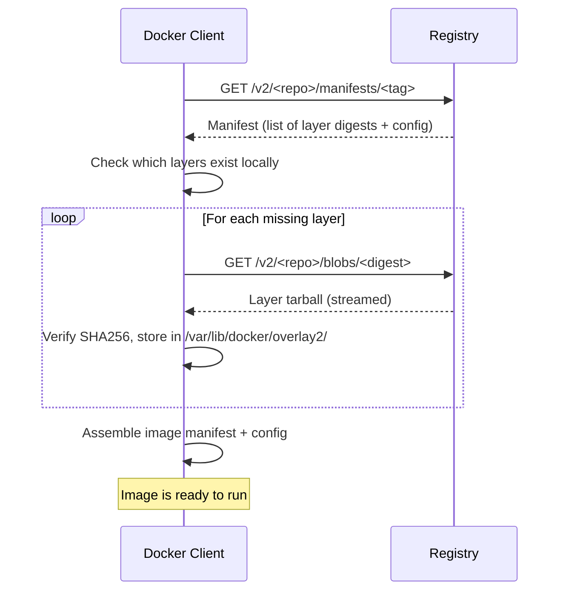
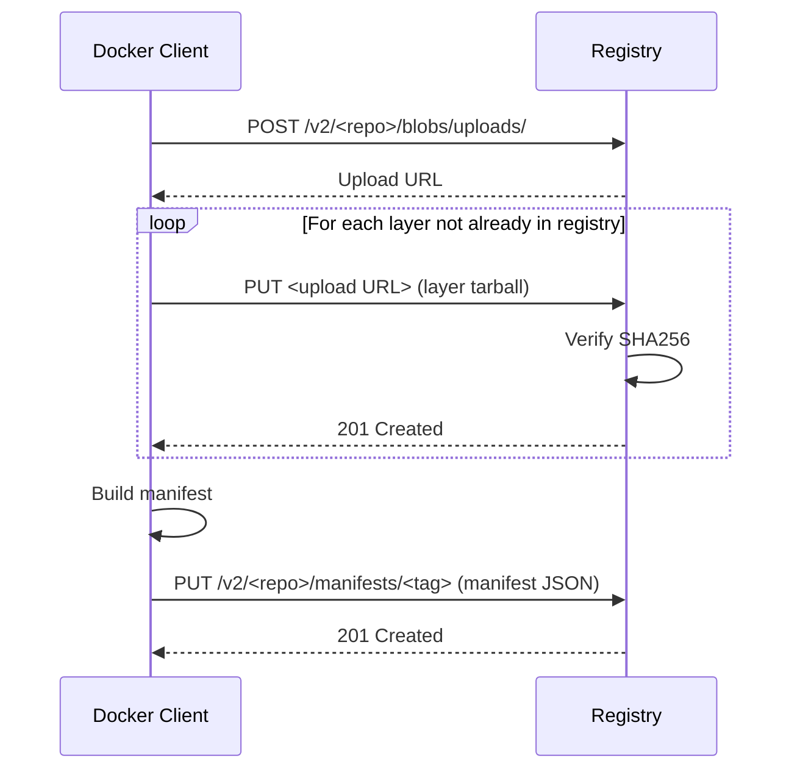

# 9. Registries and Distribution

> [!info] Chapter Context
> Images live in **registries**. You pull from them with `docker pull`, push to them with `docker push`, and they are the foundation of how Docker images are shared across machines, teams, and environments. This note covers Docker Hub, private registries, cloud registries (AWS ECR, GCR), OCI artifacts, and image signing.

Related: [[3. Images and Containers]] | [[3.1 Image Layers and Storage Drivers]] | [[8. Docker Security]]

---

## 1. What a Registry Is

A **registry** is a server that stores Docker images and serves them over HTTP. It is to Docker images what GitHub is to source code: a central place to publish, version, and share.

### 1.1 Anatomy of an Image Reference

```
registry.example.com/myorg/myapp:1.0
\_____________________/\_______/\__/
        registry        repository  tag

registry.example.com/myorg/myapp@sha256:abc123...
\_____________________/\_______/  \___________/
        registry        repository    digest
```

- **Registry** — The hostname (e.g., `registry.example.com`). If omitted, defaults to `docker.io` (Docker Hub).
- **Repository** — A path like `myorg/myapp`. Often just called "the image name."
- **Tag** — A human-readable version like `1.0`, `latest`, `alpine`. If omitted, defaults to `latest`.
- **Digest** — A SHA256 hash of the image manifest. Pinning by digest is the most reproducible way to refer to an image.

### 1.2 Common Image References

```bash
docker pull nginx                              # docker.io/library/nginx:latest
docker pull nginx:1.25                         # docker.io/library/nginx:1.25
docker pull myorg/myapp:1.0                    # docker.io/myorg/myapp:1.0
docker pull registry.example.com/myapp:1.0     # private registry
docker pull myapp@sha256:abc123...             # pinned by digest
```

The `library/` prefix is for official images on Docker Hub (e.g., `nginx`, `python`, `postgres`). It is implicit when you type `nginx`.

---

## 2. Docker Hub

[Docker Hub](https://hub.docker.com) is the default public registry. Anyone can pull official images for free. To push your own images, create an account.

### 2.1 Pulling from Docker Hub

```bash
docker pull nginx                              # official image
docker pull myusername/myapp:1.0               # user image
```

### 2.2 Pushing to Docker Hub

```bash
# Log in
docker login                                   # prompts for username + password
# Or with a Personal Access Token (recommended)
docker login -u myusername -p dckr_pat_xxxxx

# Tag your image with your username
docker tag myapp:1.0 myusername/myapp:1.0

# Push
docker push myusername/myapp:1.0
```

### 2.3 Public vs Private Repositories

- **Public** — Anyone can pull. Free.
- **Private** — Only you (and collaborators) can pull. Free tier allows 1 private repo.

### 2.4 Rate Limits

Docker Hub enforces rate limits for anonymous and free users:

- Anonymous: 100 pulls per 6 hours per IP.
- Authenticated free: 200 pulls per 6 hours.
- Pro/Team: higher limits.

For production, use a paid Docker Hub account or a private registry (AWS ECR, GCR, etc.).

> [!warning] Production Should Not Depend on Docker Hub
> Docker Hub outages and rate limits have caused production incidents. Always mirror critical base images to your own registry.

---

## 3. Private Registries

You can run your own registry with the official `registry` image:

```bash
docker run -d -p 5000:5000 --name registry -v registry-data:/var/lib/registry registry:2
```

Now you can push and pull from `localhost:5000`:

```bash
docker tag myapp:1.0 localhost:5000/myapp:1.0
docker push localhost:5000/myapp:1.0
docker pull localhost:5000/myapp:1.0
```

### 3.1 TLS for Non-Localhost Registries

Docker requires HTTPS for registries on remote hosts. For internal networks, you can either:

- Set up a real TLS certificate (e.g., via Let's Encrypt).
- Use a self-signed certificate and configure each Docker daemon to trust it.
- Configure Docker to allow insecure registries (NOT recommended for production).

```json
// /etc/docker/daemon.json
{
  "insecure-registries": ["registry.internal.example.com:5000"]
}
```

### 3.2 Authentication

The official `registry:2` image supports htpasswd-based authentication:

```bash
mkdir auth
docker run --entrypoint htpasswd httpd:2 -Bbn admin password > auth/htpasswd

docker run -d -p 5000:5000 --name registry \
  -v $(pwd)/auth:/auth \
  -e REGISTRY_AUTH=htpasswd \
  -e REGISTRY_AUTH_HTPASSWD_REALM=Registry \
  -e REGISTRY_AUTH_HTPASSWD_PATH=/auth/htpasswd \
  registry:2
```

Then `docker login registry.internal.example.com:5000` with `admin` / `password`.

---

## 4. Cloud Registries

### 4.1 AWS Elastic Container Registry (ECR)

ECR is AWS's managed registry. It integrates with IAM for access control.

```bash
# Authenticate (one-time per region)
aws ecr get-login-password --region us-east-1 | \
  docker login --username AWS --password-stdin 123456789012.dkr.ecr.us-east-1.amazonaws.com

# Create a repository
aws ecr create-repository --repository-name myapp

# Tag and push
docker tag myapp:1.0 123456789012.dkr.ecr.us-east-1.amazonaws.com/myapp:1.0
docker push 123456789012.dkr.ecr.us-east-1.amazonaws.com/myapp:1.0
```

### 4.2 Google Container Registry (GCR) / Artifact Registry

```bash
gcloud auth configure-docker
docker tag myapp:1.0 gcr.io/my-project/myapp:1.0
docker push gcr.io/my-project/myapp:1.0
```

### 4.3 GitHub Container Registry (GHCR)

```bash
echo $GITHUB_TOKEN | docker login ghcr.io -u myusername --password-stdin
docker tag myapp:1.0 ghcr.io/myusername/myapp:1.0
docker push ghcr.io/myusername/myapp:1.0
```

### 4.4 Comparison

| Registry | Pricing | IAM Integration | Vulnerability Scanning |
| :--- | :--- | :--- | :--- |
| Docker Hub | Free tier; paid for private | No | Yes (paid) |
| AWS ECR | Per-GB storage + transfer | AWS IAM | Yes (Inspector) |
| GCR / Artifact Registry | Per-GB storage + transfer | Google IAM | Yes |
| GHCR | Free for public; paid for private | GitHub tokens | Yes |
| Self-hosted `registry:2` | Free + infra cost | Manual (htpasswd) | No (use Trivy separately) |

For AWS deployments, ECR is the natural choice. For multi-cloud or open-source projects, GHCR is convenient.

---

## 5. Image Distribution — How Pulls Work



Each layer is downloaded independently. If you already have a layer (because another image shares it), it is skipped. This is why pulling a second image that shares a base layer is much faster than the first.

---

## 6. Pushing Images



The registry deduplicates layers. If a layer already exists (because another image shares it), the upload is skipped.

---

## 7. Pinning by Digest

Tags are mutable — `myapp:latest` can point to a different image tomorrow. Digests are immutable — `myapp@sha256:abc123...` always points to the same image.

### 7.1 Pulling by Digest

```bash
docker pull myapp@sha256:abc123...
```

### 7.2 Finding the Digest

```bash
docker inspect myapp:1.0 --format '{{index .RepoDigests 0}}'
# myapp@sha256:abc123...
```

### 7.3 Pinning in Production

For production deployments (ECS task definitions, Kubernetes manifests), always pin by digest:

```yaml
# ECS task definition (excerpt)
"image": "123456789012.dkr.ecr.us-east-1.amazonaws.com/myapp@sha256:abc123..."
```

```yaml
# Kubernetes
containers:
  - name: app
    image: myapp@sha256:abc123...
```

This guarantees that the same manifest always deploys the same image, even if someone re-tags `1.0` to point to a different image.

---

## 8. OCI Artifacts

The OCI (Open Container Initiative) Image Format is the standard that Docker, Podman, containerd, and others use. Modern registries can store any OCI artifact, not just Docker images:

- Helm charts
- Singularity containers (for HPC)
- WASM modules
- Machine learning models
- Generic blobs (e.g., backup tarballs)

This is enabled by the OCI Artifact Manifest spec. Tools like `oras` let you push and pull arbitrary artifacts to OCI-compliant registries.

---

## 9. Image Signing (Cosign, Notary)

How do you know the image you pulled is the one the publisher intended, and not a tampered version? **Image signing**.

### 9.1 Docker Content Trust (DCT) / Notary v1

```bash
export DOCKER_CONTENT_TRUST=1
docker pull myapp:1.0          # refuses to pull if unsigned
```

DCT uses Notary v1 to sign image tags. It is being phased out in favor of Cosign.

### 9.2 Cosign (Sigstore)

```bash
# Generate a key pair
cosign generate-key-pair

# Sign an image
cosign sign --key cosign.key myregistry.com/myapp:1.0

# Verify
cosign verify --key cosign.pub myregistry.com/myapp:1.0
```

Cosign stores signatures as OCI artifacts in the same registry as the image. It supports keyless signing via OIDC (e.g., signing in GitHub Actions with the workflow's identity).

In production, verify image signatures before deploying:

```bash
cosign verify --key cosign.pub myregistry.com/myapp:1.0 || exit 1
docker pull myregistry.com/myapp:1.0
```

---

## 10. Common Student Mistakes

> [!warning] Mistake 1 — Using `latest` in Production
> Tags are mutable. Pin to a specific version (`1.0.3`) or a digest.

> [!warning] Mistake 2 — Depending on Docker Hub in Production
> Docker Hub outages and rate limits can break your deployments. Mirror critical images to your own registry.

> [!warning] Mistake 3 — Forgetting to `docker login` Before Pushing
> `docker push myusername/myapp` will fail with "denied" if you are not logged in.

> [!warning] Mistake 4 — Confusing `tag` and `push`
> `docker tag` only creates a label locally. You must `docker push` to actually upload the image to a registry.

> [!warning] Mistake 5 — Not Cleaning Up Old Images
> Registries accumulate old images. Set up lifecycle policies (ECR) or scheduled cleanup to delete untagged images and old versions.

> [!warning] Mistake 6 — Pushing to the Wrong Repository
> `docker push myapp:1.0` (without a username prefix) tries to push to `docker.io/library/myapp`, which you do not have permission to do. Tag it first: `docker tag myapp:1.0 myusername/myapp:1.0`.

---

## 11. Summary Checklist

- [ ] A registry stores images; Docker Hub is the default (`docker.io`).
- [ ] Image references: `[registry/]repo[:tag|@digest]`.
- [ ] Official images live under `library/` on Docker Hub (implicit prefix).
- [ ] Pin production images by digest (`@sha256:...`) for immutability.
- [ ] Cloud registries: AWS ECR, GCR, GHCR — each integrates with its cloud's IAM.
- [ ] Self-host `registry:2` for internal networks (configure TLS or `insecure-registries`).
- [ ] Layer deduplication makes pulls and pushes efficient.
- [ ] Sign images with Cosign for supply chain security.
- [ ] Mirror critical base images to your own registry; do not depend on Docker Hub in production.

---

Previous: [[8. Docker Security]] | Next: [[10. Debugging and Troubleshooting]]
