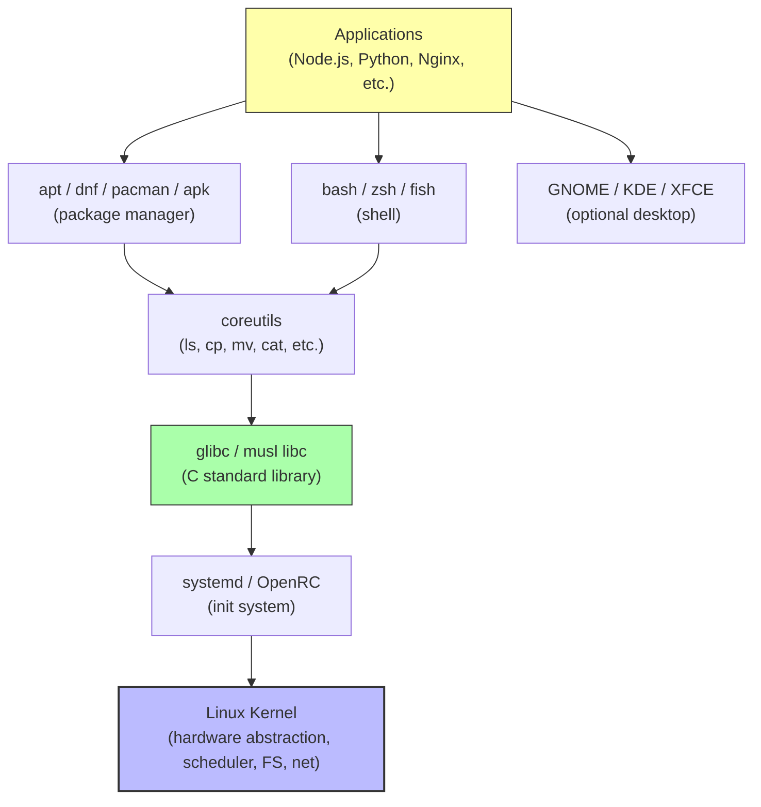

# 1. Linux Overview and Distributions

> [!info] Chapter Context
> Before diving into commands and tools, this note explains what Linux actually is, why there are so many "Linuxes" (distributions), and how to think about the ecosystem. If you have only used Windows or macOS, the landscape of Linux distributions can be confusing. This note gives you the mental model.

Related: [[01 - Installing Apps/2. The Linux Kernel and User Space]] | [[01 - Installing Apps/3. The Filesystem Hierarchy Standard]] | [[01 - Installing Apps/4. Ways to Install Apps in Linux]]

---

## 1. What Is Linux, Really?

"Linux" is ambiguous. It can mean three different things, and people switch between them casually:

1. **The Linux kernel** — A single software project started by Linus Torvalds in 1991. It is the program that talks to your hardware, manages processes, memory, files, and devices. By itself, the kernel is useless — you cannot run any applications on it without additional userspace tools.

2. **A Linux distribution (distro)** — A complete operating system built around the Linux kernel. The distribution adds a package manager, system utilities (`ls`, `cp`, `grep`, etc.), an init system (usually `systemd`), a shell (usually `bash`), libraries (`glibc`), and often a desktop environment. Examples: Ubuntu, Debian, Fedora, Arch, Alpine.

3. **Linux as a family** — A shorthand for "operating systems based on the Linux kernel." When a cloud engineer says "I deployed it on Linux," they mean some distribution — typically Ubuntu, Amazon Linux, or Alpine.

---

## 2. The Major Distribution Families

Most Linux distributions fall into one of three families, distinguished by their package format and package manager.

| Family | Package format | Package manager | Example distros |
| :--- | :--- | :--- | :--- |
| **Debian family** | `.deb` | `apt`, `dpkg` | Ubuntu, Linux Mint, Pop!_OS, Debian |
| **Red Hat family** | `.rpm` | `dnf`, `yum`, `rpm` | RHEL, CentOS, Fedora, Rocky, AlmaLinux, Amazon Linux |
| **Arch family** | `.pkg.tar.zst` | `pacman` | Arch, Manjaro, EndeavourOS |

There are also independent distros:

- **Alpine** — Uses `apk`. Tiny (5 MB base). Popular for containers.
- **SUSE / openSUSE** — Uses `.rpm` with `zypper`.
- **Gentoo** — Source-based; you compile everything from source with `emerge`.

For cloud engineering, the most relevant distros are:

- **Ubuntu** — The most common Linux on AWS EC2. Easy to use, large community.
- **Amazon Linux 2023** — AWS's own distro, optimized for EC2. Based on Fedora/CentOS.
- **Alpine** — Used as the base for many Docker images (e.g., `node:18-alpine`).
- **Debian** — The upstream of Ubuntu. More stable, slower release cycle.

---

## 3. Release Cycles and Stability

Distributions differ in how often they release new versions and how long they support each version.

### 3.1 LTS (Long-Term Support) Releases

Ubuntu releases a new LTS version every 2 years (in April of even-numbered years: 20.04, 22.04, 24.04). LTS versions are supported for 5 years (10 years with Ubuntu Pro). They are the recommended choice for servers.

Non-LTS Ubuntu releases (e.g., 23.10) are supported for 9 months. They have newer software but are not suitable for production.

### 3.2 Rolling Releases

Arch, Manjaro, and Gentoo are "rolling" — there are no version numbers. You continuously update with `pacman -Syu` and you always have the latest software. The trade-off: things can break when an update introduces a regression.

### 3.3 Stable vs. Testing Branches

Debian has three branches:

- **Stable** — The current release (e.g., Debian 12 "Bookworm"). Very stable, but software is older.
- **Testing** — The next release candidate. Newer software, occasional bugs.
- **Unstable (Sid)** — The bleeding edge. Always-up-to-date, can break.

For servers, always use Stable. For development workstations, Testing or Unstable can be acceptable.

---

## 4. Why the Diversity Matters for Cloud Engineers

You might use:

- **Ubuntu 22.04** on your EC2 instances.
- **Alpine** as the base for your Docker images.
- **Amazon Linux 2023** on AWS ECS-optimized AMIs.
- **Debian 12** on a VM in another cloud.

Each has a different package manager, different default libraries, and different conventions. The skills that transfer across all of them are:

- Bash and shell scripting.
- Standard POSIX utilities (`grep`, `sed`, `awk`, `find`, `xargs`).
- Systemd and `journalctl`.
- SSH and key management.
- File permissions and ownership.
- The Filesystem Hierarchy Standard (where files live).

The skills that are distro-specific:

- Package manager commands (`apt` vs `dnf` vs `apk`).
- Default config file locations (sometimes `/etc/nginx/nginx.conf` vs `/etc/nginx/conf.d/`).
- Default user and group conventions (Ubuntu uses `ubuntu`, Amazon Linux uses `ec2-user`).
- Service management quirks (some services are named differently).

This chapter focuses on the transferable skills, with package-manager examples covering the major families.

---

## 5. Common Student Mistakes

> [!warning] Mistake 1 — Confusing the Kernel with the Distribution
> The kernel is one component. The distribution is the whole OS. When someone says "I installed Linux," they mean they installed a distribution (which includes the kernel).

> [!warning] Mistake 2 — Mixing Package Managers
> Do not use `apt` on Fedora or `dnf` on Ubuntu. Each distro has one primary package manager; mixing them leads to broken dependencies.

> [!warning] Mistake 3 — Using Non-LTS Ubuntu in Production
> Non-LTS Ubuntu releases are supported for only 9 months. After that, you stop getting security updates. Always use LTS for production.

> [!warning] Mistake 4 — Assuming "Linux" Means "Ubuntu"
> Many tutorials assume Ubuntu. When you follow them on Fedora or Alpine, some commands differ. Always check the distro.

---

## 6. Summary Checklist

- [ ] "Linux" can mean the kernel, a distribution, or the family of OSes.
- [ ] The kernel alone is useless; the distribution adds the userspace tools, libraries, and package manager.
- [ ] Three major distribution families: Debian (apt/.deb), Red Hat (dnf/.rpm), Arch (pacman).
- [ ] Alpine is independent (apk) and is the base for many Docker images.
- [ ] LTS releases (Ubuntu) are supported for 5+ years; use them in production.
- [ ] Transferable skills: bash, POSIX utilities, systemd, SSH, FHS.
- [ ] Distro-specific: package manager commands, default users, config locations.

---

Previous: (this is the first note in the Linux chapter) | Next: [[01 - Installing Apps/2. The Linux Kernel and User Space]]
